# 在 Python & R 中合并数据框

> 原文：<https://towardsdatascience.com/merge-data-frames-in-python-r-725c0f874147?source=collection_archive---------35----------------------->

## 下面是一个简单的 Python 和 r 中数据帧合并的备忘单。

[蒂姆·约翰逊](https://unsplash.com/@mangofantasy?utm_source=medium&utm_medium=referral)在 [Unsplash](https://unsplash.com?utm_source=medium&utm_medium=referral) 上拍照

M 生成数据框是数据处理人员的必备技能。然而，当从一种编码语言转换到另一种时，很难正确地记住命令。

在这篇文章中，我将为 Python 和 R 中的合并函数总结一个简单干净的备忘单，这类似于我以前的文章中的[。此外，我将在合并多个数据框时对 Python 和 R 进行比较。](/extract-rows-columns-from-a-dataframe-in-python-r-678e5b6743d6)

注意，为了并排比较命令行，我将只使用 **Python** 中的 **Pandas** 和 **R** 中的基本函数。有些综合库，比如 **R** 中的 **dplyr** ，就没有考虑。

当你必须同时使用两种语言时，我希望这篇文章和备忘单对你有所帮助。

## 要使用的玩具数据集。

我们使用阿伦艾弗森和特雷西麦格雷迪的真实投篮命中率作为我们的玩具数据集。

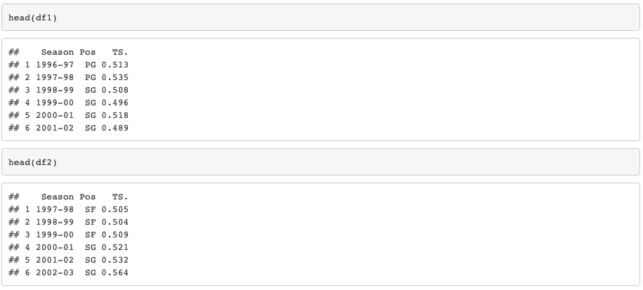

r 输出 1

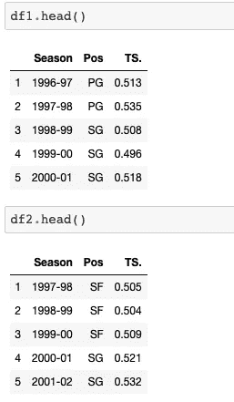

Python 输出 1

我们可以看到数据框中有三列，“季节”、“Pos”和“TS”，分别代表赛季指数，场上位置，真实投篮命中率。

## 四种类型的合并。

主要有四种类型的合并策略，包括基于用于合并的公共键(列)的内连接、外连接、左连接和右连接。

“内部连接”意味着只取两个数据框的键列中元素的交集。我们可以使用文氏图来表示“内部连接”,如下所示。

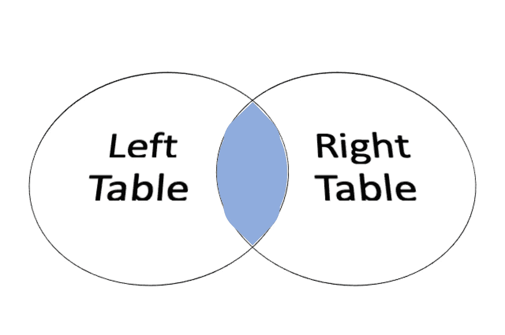

内部连接图

下面是 R 和 Python 的代码。

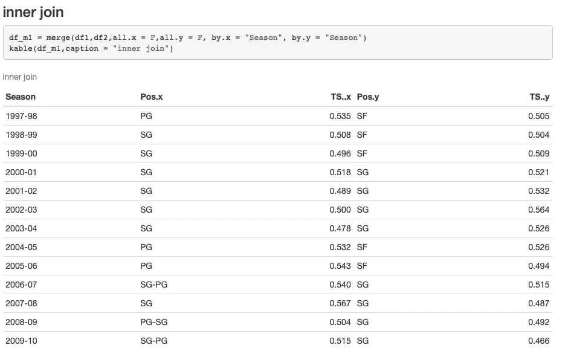

r 内部连接

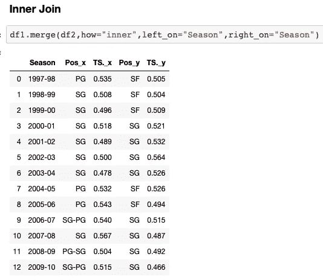

Python 内部连接

从上面的表格中我们可以看到，只显示了艾弗森和麦迪都打过的赛季。

接下来让我们看看“外部连接”策略。“外部连接”采用两个数据框的键列中的元素的联合。

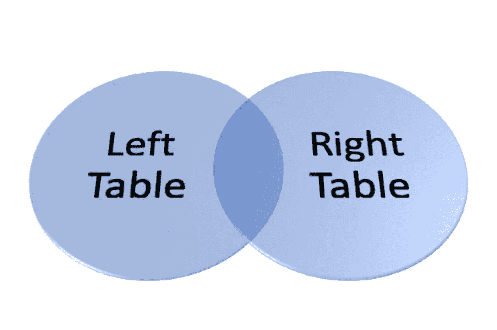

外部连接图

下面列出了在 R 和 Python 中执行“外部连接”的代码。

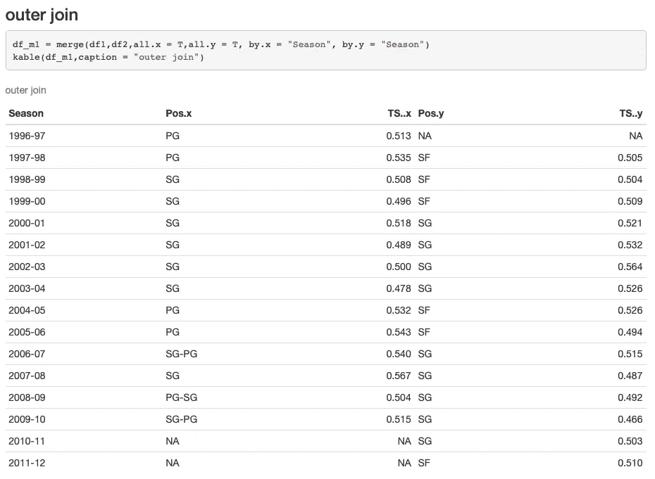

r 外部联接

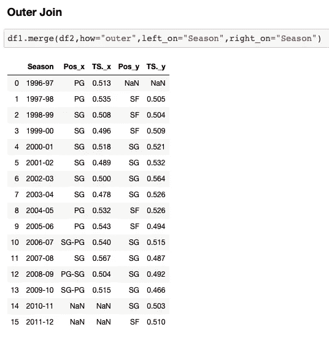

Python 外部连接

我们可以看到，两种语言都向原始数据帧中没有的关键元素填充了“NA”值。这张表显示了一个球员参加比赛而另一个球员没有参加的赛季。

“左连接”只接受第一个表的键列中的元素，而不考虑第二个表的键列中的元素。

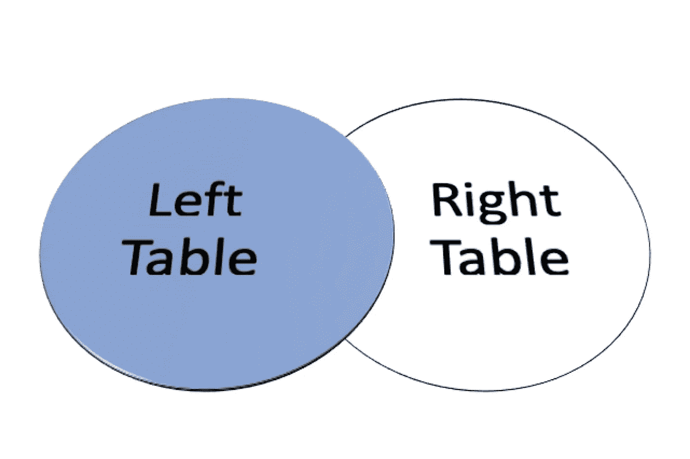

左连接图

这里列出了 R 和 Python 中“左连接”的代码。

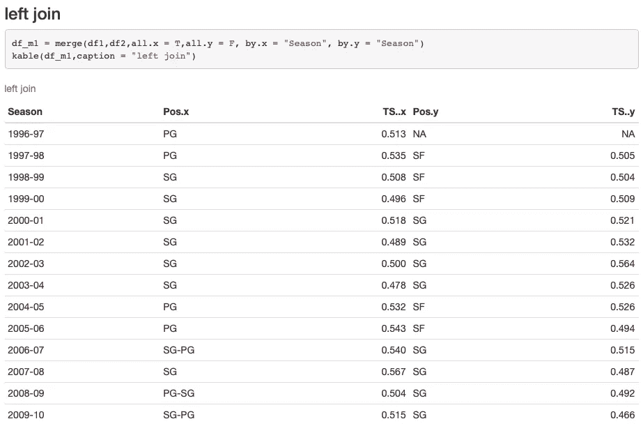

R 中的左连接

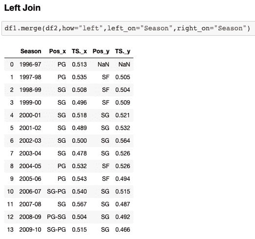

Python 中的左连接

“右连接”是“左连接”的反义词。

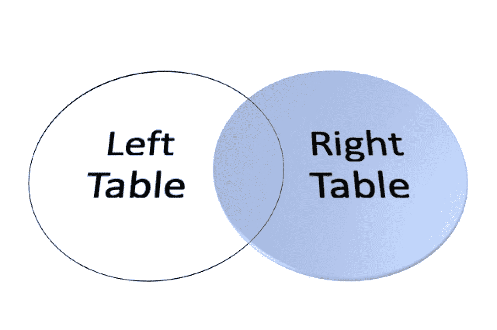

右连接图

下面列出了用 Python 和 R 进行“右连接”的代码。

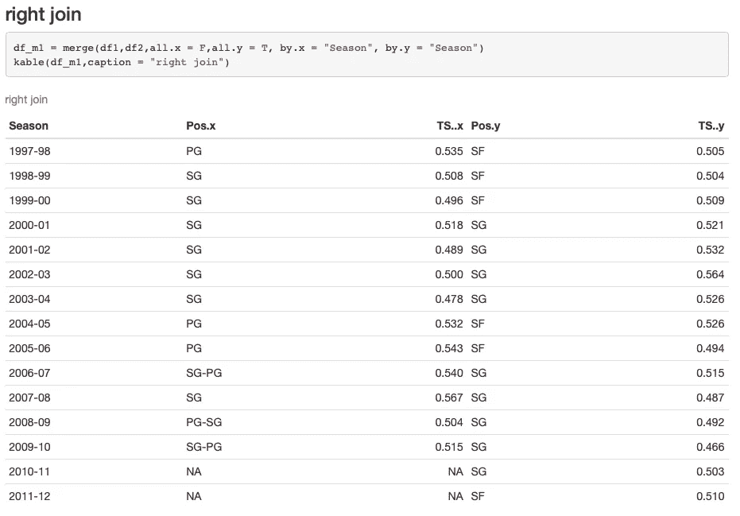

右连接

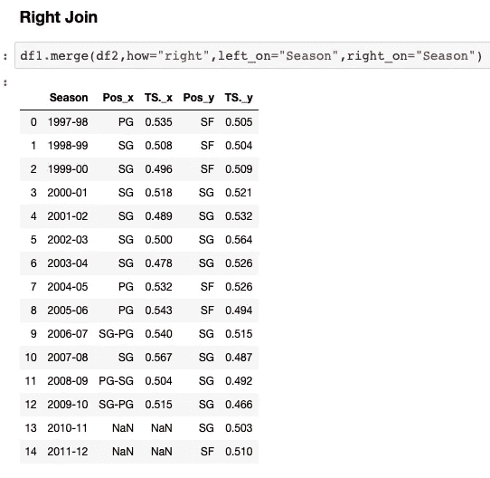

Python 右连接

这四种类型的合并构成了“合并”用法的主要部分。区分参数以选择 R 和 Python 中的合并策略很重要。R 中使用的参数是“by.x”和“by.y”，而 Python 中的参数是“how”。注意，如果“by.x”和“by.y”在 R 中需要相同的赋值，我们可以使用单个参数“by”来代替。

## 合并多列上的两个数据框。

有时，我们需要合并基于多个列的两个数据框。我们唯一需要做的事情是将列名列表传递给相应的参数。

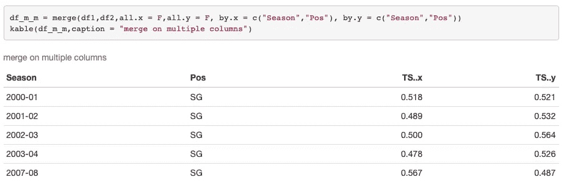

R 中的多列合并

在 Python 中合并多个列

在上面的例子中，我们感兴趣的是当两个球员在同一个赛季(“赛季”)中在相同的位置(“Pos”)比赛时，球员的统计数据比较。

## 合并多个数据框。

在另一种情况下，我们对合并两个以上的数据帧感兴趣。我们绝对可以写一个很长的命令来逐个合并它们，但是更好的方法可以是“*”函数。*

*假设我们有另一个关于科比真实投篮命中率的数据框架，我们想把它与艾弗森和麦迪的数据框架合并在一起。*

*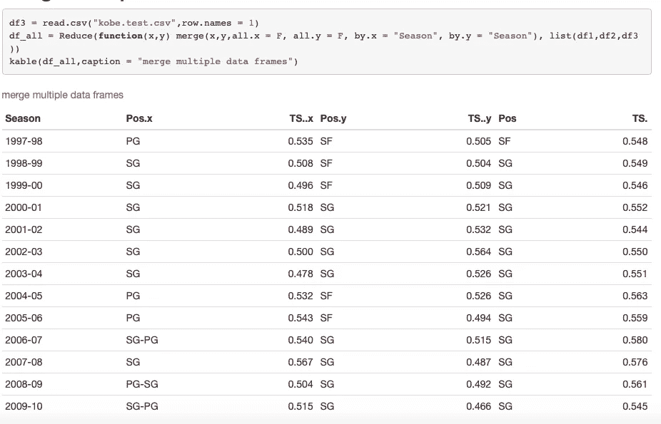*

*合并 R 中的多个数据帧*

*这里在 R 的“ ***Reduce*** 函数中，我们需要定义一个合并两个数据帧的函数并将其作为第一个参数，然后传递一列数据帧作为“*”函数的第二个参数。**

**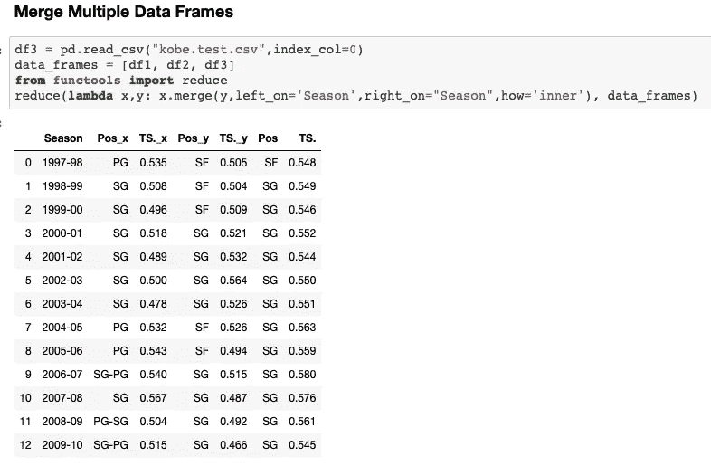**

**在 Python 中合并多个数据框**

**这里在 Python 的“ ***reduce*** 函数中，与 r 中的非常相似，我们需要定义一个通过 *lambda* 合并两个数据帧的函数。而且我们还需要将一列数据帧传递给“*”函数。***

## ***用 R 和 Python 合并数据框的备忘单。***

***下面是在 R 和 Python 中合并数据框的简单备忘单。***

***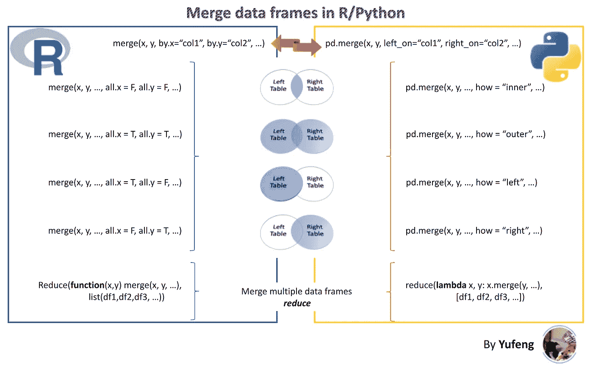***

***裕丰小抄***

***就是这样！希望这篇帖子能对你有所帮助。***

***感谢您的阅读！如果喜欢文章，请 [**关注我上媒**](https://medium.com/@jianan.jay.lin) 。以下是我之前在**数据科学**发表的一些文章:***

*** [## 是否在我的模型中考虑多重共线性？

### 简要讨论是否有必要修复特征空间中的多重共线性。我希望它会…

towardsdatascience.com](/consider-multicollinearity-in-my-model-or-not-7aca16e74773)  [## 使用三种机器学习模型基于勒布朗数据的端到端游戏预测方案

### 综合指导一个二元分类问题使用三个不同的分类器，包括逻辑…

towardsdatascience.com](/end-to-end-project-of-game-prediction-based-on-lebrons-stats-using-three-machine-learning-models-38c20f49af5f)  [## NBA 球员统计数据 R 包“ggplot2”中数据可视化的实践指导

### 应用于 NBA 数据的 R 数据可视化工具“ggplot2”的 6 分钟之旅。

towardsdatascience.com](/hands-on-guidance-of-data-visualization-in-r-package-ggplot2-of-nba-players-stats-d812ed272d66)***