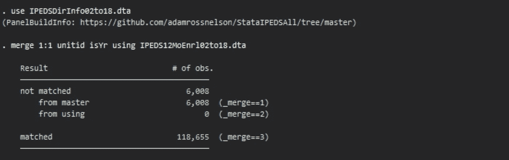
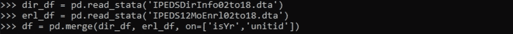
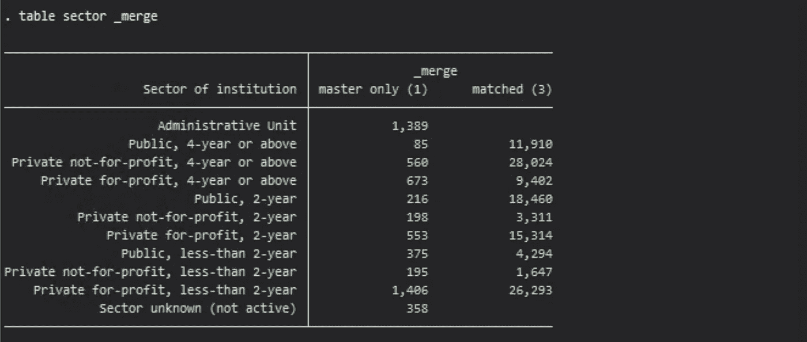
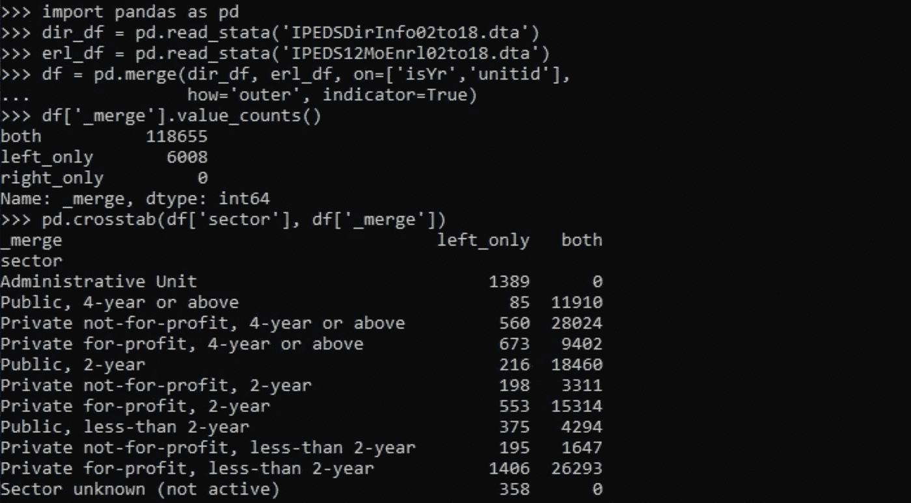

# 合并数据:熊猫丢失输出

> 原文：<https://towardsdatascience.com/merging-data-the-pandas-missing-output-dafca42c9fe?source=collection_archive---------26----------------------->

详细命令行界面输出的图像。有时需要详细的输出。有时候不会。图片来源:“Via Design Pickle”——[更多关于属性](https://adamrossnelson.medium.com/image-credit-attributions-a24efcc730ad)。

## 给新接触合并熊猫数据的人的快速提示

TLDR:有时你想要罗嗦。有时候不会。阅读下面的提示来生成额外的输出，这将有助于评估 Pandas 中合并操作的成功。

# 介绍

我的第一个统计编程语言是 Stata，它有点冗长。然后学了 Python，当然也包括熊猫，也没那么啰嗦。像这样的转变可能会很艰难。本文讨论了我学到的一种技术，这种技术对于任何对合并操作之后的数据探索感兴趣的人都很有用。

在第一部分中，我将展示 Pandas 中的合并操作是如何产生零自动化输出的。在接下来的部分，我将解释为什么这样的输出是有用的。最后，在最后我将解释如何复制输出。

## Stata 宠坏你:丢失的输出

Stata 往往比其他编程语言更加冗长。当执行如下图所示的合并时，Stata 会立即提供输出，并创建一个名为 _merge 的指示变量，该变量可以帮助评估合并操作是否成功。

Stata 中合并操作的图像及其默认输出。图片来源:“作者截屏”——[更多关于属性](https://adamrossnelson.medium.com/image-credit-attributions-a24efcc730ad)。

将上面 Stata 的输出与下面 Python 的输出进行比较。很棘手，对吧？Python 没有输出。此外，没有指示变量。不是默认的。在下一节中，我将解释为什么这个输出和指示器变量是有用的。

Pandas 中合并操作的图像，以及它缺少默认输出。图片来源:“作者截屏”——[更多关于归属](https://adamrossnelson.medium.com/image-credit-attributions-a24efcc730ad)。

## 为什么输出和指标是有用的

在上面给出的例子中，我合并了两个数据源。这两个数据源并不完全匹配。

第一个数据源是高等教育机构的列表(其中包括一些不是机构的“机构”类型，它们是其他的东西，包括一个称为“行政单位”的类别)。

第二个数据源是注册数据。当然，合并并不是完美的匹配，因为没有行政单位的注册数据。在 Stata 中，下面的代码和输出开始显示合并操作不完美的原因。

探究合并操作结果的交叉制表图。图片来源:“作者截屏”——更多关于属性的。

具体来说，没有一个行政单位有注册信息。然后，出于某种原因，一些其他类型的机构有时也不报告注册信息。这个列表可以帮助划分和计划与评估合并操作成功相关的工作。

下一节演示如何用 Python 复制这个输出。

## 如何复制产出和指标

下面的代码复制 Stata 的输出和相关的指示器。注意增加了指示器选项。

此外，还增加了一个 how 选项。各种合并类型超出了本文的范围，因此简而言之，添加 how 选项将包括来自两个数据集的列。

简单的值计数为探索合并结果提供了一个起点，如下所示。以下代码和输出进一步演示了如何将指示器变量与其他变量结合使用，以进一步评估合并结果。

探究合并结果的值计数和交叉制表的图像。图片鸣谢:“作者截屏”——[更多关于归属](https://adamrossnelson.medium.com/image-credit-attributions-a24efcc730ad)。

再次看到这里，没有一个行政单位有招生信息。与上面的列表一样，这个列表可以帮助划分和计划与评估合并操作成功相关的工作。

# 结论

在本文的第一部分中，我们展示了在 Python 中，合并操作之后，如何实现零自动化输出。在第二部分，本文解释了为什么这样的输出是有用的。最后，本文还解释了如何复制该输出。

 [## 加入我的介绍链接媒体-亚当罗斯纳尔逊

### 作为一个媒体会员，你的会员费的一部分会给你阅读的作家，你可以完全接触到每一个故事…

adamrossnelson.medium.com](https://adamrossnelson.medium.com/membership) 

# 感谢阅读

如果你喜欢我要说的，可以在 adamrossnelson.medium.com 的[找到更多。](https://twitter.com/adamrossnelson)

感谢阅读。把你的想法和主意发给我。你可以写信只是为了说声嗨。如果你真的需要告诉我是怎么错的，我期待着尽快和你聊天。推特:[@ adamrossnelson](https://twitter.com/adamrossnelson)| LinkedIn:[亚当·罗斯·纳尔逊](http://www.linkedin.com/in/arnelson) |脸书:[亚当·罗斯·纳尔逊](http://www.facebook.com/adamrossnelson)。