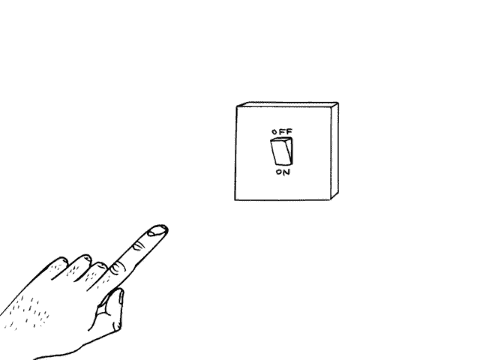

# 信息疲劳 vs FOMO。人工智能如何帮助解决有意义交流的困境

> 原文：<https://towardsdatascience.com/message-fatigue-vs-fomo-how-ai-can-help-to-solve-the-dilemma-of-meaningful-communication-cd9a187130a2?source=collection_archive---------34----------------------->

[你在做什么 GIF](https://giphy.com/gifs/gifnews-P2sqgk8fykRzi) By Gifnews

在当今的数字世界中，每个人都可以轻松访问互联网。由于访问方便，我们都想了解世界各地正在发生的活动并保持更新。这些活动涵盖新闻和体育更新、政治评论、商业和经济新闻头条，以及通过 Instagram、Twitter、Snapchat 和脸书等社交媒体渠道与朋友互动。通过跟踪所有这些事件，我们使自己受制于通常所说的信息过载。实际上，我们正淹没在网上铺天盖地而来的信息浪潮中。我们大部分时间都在网上度过，很难有足够的时间在家陪家人。换句话说，你的生活中没有任何个人空间。

另一方面，有些人试图大大减少他们参与任何在线活动的时间。事实上，有些人干脆一了百了，给自己下了一个禁止网上交流的禁令。人们做出这个决定是为了享受他们的个人空间，而不是成为信息过载的牺牲品。然而，远离互联网，推而广之，不使自己跟上当前世界的发展在 FOMO 达到顶峰，这就是对错过的恐惧。

信息过载和 FOMO 之间存在着明显的冲突，大多数人都在努力在这两种现象之间取得平衡。

# 什么是信息过载？

术语“信息过载”，也就是通常所说的“信息焦虑”和“信息肥胖”，是指当你拥有大量关于某个特定问题的信息时，你在了解该问题并有效地做出决策时所面临的问题。这就是我们所说的信息过载的教科书定义。通俗地说，当你每天接收大量信息时，就会产生信息过载。

当今世界信息过载的常见原因包括:

*   不断创造大量新信息
*   在互联网上复制和共享信息的便捷性
*   你接收信息的媒介大幅增加:电视、广播、印刷媒体、社交媒体、电子邮件、网站等等
*   没有简单明了的方法来快速处理和评估不同的信息源
*   网上有大量相互矛盾和冲突的信息

为了防止接触过多的信息，现代千禧一代试图以各种方式应对信息过载。其中一些方法包括取消在线杂志订阅，删除一些不必要的社交媒体账户，以及过滤进入你电子邮件收件箱的信息。然而，网上的大量信息只能进行一定程度的过滤。因此，这些策略通常被证明不足以应对信息过载的压力。

[文字感叹 GIF](https://giphy.com/gifs/annoyed-sigh-texts-d47IJ7WypWP2cQV2)

# 什么是 FOMO(害怕错过)？

FOMO(害怕错过)是一个真实的现象，如今已经变得非常普遍。FOMO 会对你产生负面影响，给你的生活带来很多压力。了解 FOMO 实际上是什么，如何在你的生活中识别它的症状，以及如何处理它是非常重要的。

对错过的恐惧是一种感知或感觉，你周围的人比你过着更好的生活，或者比你过得更开心。它包含一种怨恨和嫉妒的感觉，并对你的自尊产生负面影响。由于 Instagram、Twitter 和脸书等社交媒体的存在，错过机会的恐惧往往会加剧。例如，当你看到你的朋友在周末聚会并且玩得很开心的照片时，你会感到无助，因为你错过了很多乐趣。

如果你对以下问题的回答是“是”，那么你可能是害怕错过的受害者:

*   你害怕别人比你有更多有价值的经历吗？
*   当你的朋友在没有你的情况下玩得很开心，或者他们没有邀请你去他们的聚会时，你会感到焦虑吗？
*   当你不知道你的朋友在做什么时，你会感到不安吗？
*   你会全天候监视你的朋友吗？
*   当你错过了和朋友约会的机会时，你会感到困扰吗？

[第二幕 GIF](https://giphy.com/gifs/secondact-jennifer-lopez-second-act-movie-g0aNyHRfj61aiiRLBN)

# 人们如何处理信息过载与害怕错过的困境？

## 完全忽略了这个问题

有些人没有意识到，甚至忽视了，害怕错过和信息超载之间的两难困境确实存在。他们试图在个人生活和网络活动上投入同等的时间，同时兼顾这两项任务。然而，大多数人未能在两者之间取得平衡，这最终导致情绪和精神疲劳。为了增进你的人际关系，时不时地进行[数字排毒](https://www.cygnussystems.com/5-useful-apps-for-your-next-digital-detox/)是很重要的。

关闭大卫·施莱格里的插图

## 采用时间管理策略

这是人们常用的一种技术，这样他们就可以两全其美(个人空间和在线交流)。这是如何工作的，你为自己制定一个时间表，表明你每天将花多少时间与家人互动，一天中的哪一部分将用于上网冲浪和与外界联系。你要确保不要超过任何一项活动的时间限制。有几款[手机应用](https://www.digitaltrends.com/mobile/best-apps-for-limiting-your-screen-time/)可以用来限制你的屏幕时间，从而更有效地管理你的时间。

然而，以这种方式有效地管理你的时间需要自律。这是当代大多数成员所缺乏的积极品质。

# 使用双重账户

这是千禧一代使用的另一种流行策略。个人分别为工作目的和私人交流建立单独的社交媒体账户(Whatsapp 和脸书)。你可以使用 Whatsapp 上的个人群组与家人进行私人通信，而工作组/账户则被用作与同事进行官方互动的媒介。

您也可以在这些帐户之间切换。这使你能够同时满足个人和职业需求。

谷歌商店上有几个[应用](https://play.google.com/store/apps/details?id=com.ludashi.dualspace&hl=en)可以帮助你有效管理双重账户。

[社交媒体发 GIF 短信](https://giphy.com/gifs/seeso-social-media-texting-l0MYvOjkBiEB0zjTq)

# 基于人工智能(AI)的聊天机器人如何解决这一困境？

人工智能聊天机器人是解决信息过载和 FOMO 之间困境的理想灵丹妙药。这些聊天机器人利用了机器学习算法，足以承受你在线活动的冲击，以便你可以花足够的时间与家人在一起。例如，人工智能聊天机器人可以代表你与 Facebook Messenger 上的个人通信。如果您是一个组织，并且每天都要处理几个客户查询，这将非常方便。人工智能聊天机器人的设计是为了在不需要你干预的情况下满足所有这些问题。因此，你有更多的时间和你的亲戚联系，和你的家人共度美好时光。同样，基于人工智能的聊天机器人可以代表你与你联系人列表中的所有人联系。这为您省去单独回复每封邮件的麻烦。

这些聊天机器人还可以通知你全球当前发生的所有活动，以便你随时与外界保持联系，即使你在家与家人在一起。

帕勒洛特斯制作的会说话的 GIF 动画

# 基于人工智能的聊天机器人世界的最新发展

基于人工智能的聊天机器人领域的最新趋势包括

## 人工智能聊天机器人日益流行

自诞生以来，人工智能语音机器人最近获得了很大的吸引力。文本通信通常会很枯燥。因此，语音机器人是与您的客户互动和高效互动的完美解决方案。此外，支持语音的聊天机器人使您能够为您的消费者提供实时、可靠的数据洞察。语音机器人提供了更加个性化的体验，增强了客户体验。

## 通过人工智能聊天机器人实现自动支付

允许用户直接通过实时聊天或 Facebook Messenger 进行支付是人工智能聊天机器人技术领域的最新发展之一。然而，这项技术仍处于萌芽阶段，要全面实施还需要时间。其工作原理是，您可以通过 Messenger 直接购买您的产品。人工智能聊天机器人将在整个交易过程中为你提供便利。

不用说，AI 聊天机器人技术在未来将发挥举足轻重的作用。利用这项技术让你的生活变得更轻松、更便捷，这是符合你的最佳利益的。在当今这个互联互通的世界里，我们非常渴望有人或东西能够处理我们在 Messenger 中的聊天，这样我们就可以享受一次数字休息。像 [AIBRO](https://aibro.co/) 这样基于人工智能的聊天机器人系统可以代表你与 Facebook Messenger 上的联系人通信，特别是当我们很忙、在度假、睡觉或驾驶你的汽车时。

介绍 [AIBRO](https://www.youtube.com/watch?v=5k02fgVp2DM) ，个人聊天机器人创作系统

或者，您也可以使用[输入法信使](https://imem.app/)。这是一个应用程序，可以让你更有效地整理你的电报聊天，并提供神经机器人生成的短语，你可以用它作为回应。

除了 AIBRO 和 iMe Messenger，你还可以使用其他流行的 AI 聊天机器人和软件系统，如[沃森助手](https://www.ibm.com/cloud/watson-assistant/)和 [Bold360](https://www.bold360.com/) 来对抗信息过载和 FOMO。

沃森助手本质上是一种人工智能产品，允许你将对话式交互部署到任何设备或应用程序中。这个虚拟助手知道什么时候从知识库中精确地搜索答案，什么时候将用户引导到人类。

Bold360 是另一个流行的软件系统。作为智能客户互动解决方案，Bold360 利用 NLU(自然语言理解)从第一次互动开始就理解客户的需求。这种直观的平台提供电子邮件、消息和实时聊天，可以带来非常个性化的实时体验。