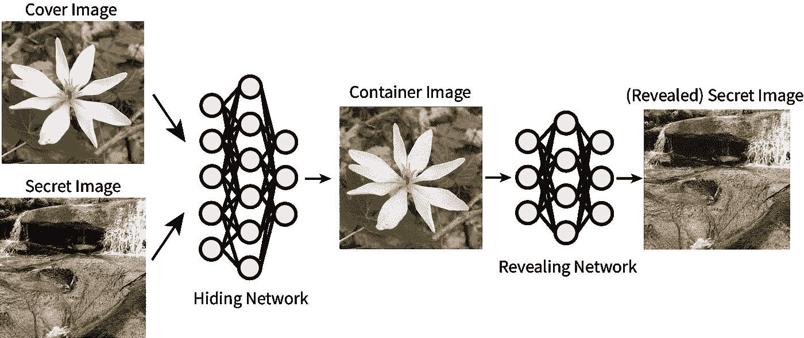
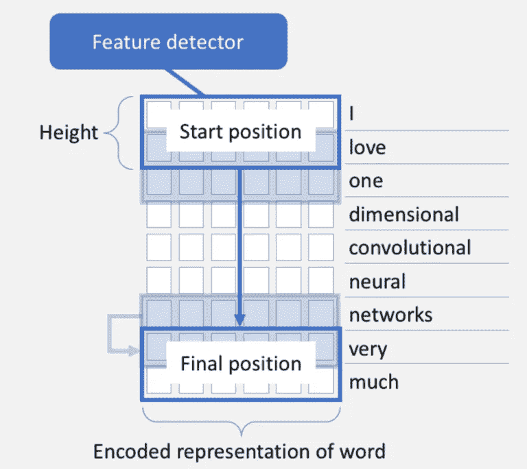
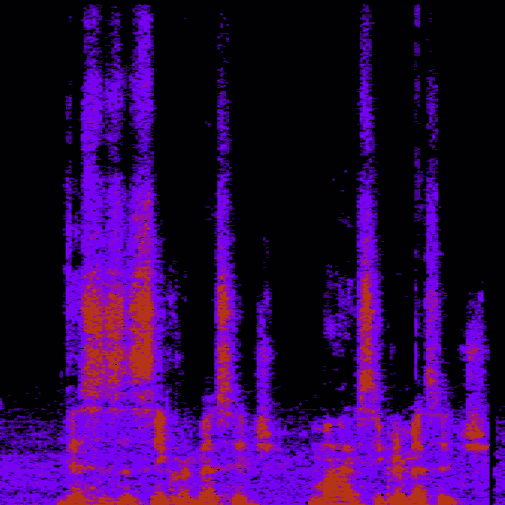
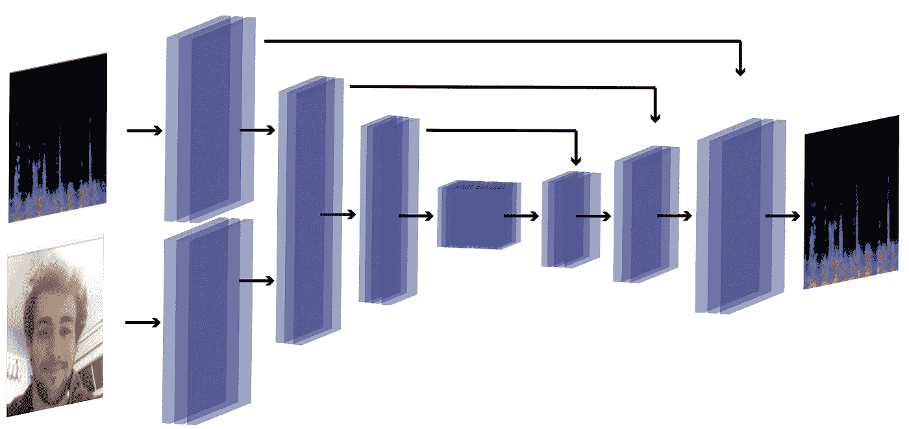
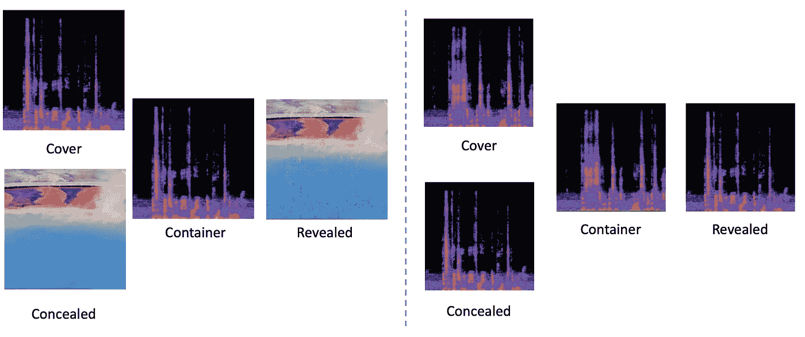

# 消息中的消息

> 原文：<https://towardsdatascience.com/message-in-a-message-44b89090b3b8?source=collection_archive---------48----------------------->

## 探索语言的深层隐写术

Ste ga no graph y / stegəˈnägrəfi /(名词):将消息或信息隐藏在其他非机密文本或数据中的做法。

**剧情简介:**使用深度学习可以有效地隐藏语言中的敏感信息，而不会引起窃听者的怀疑。这对于安全通信具有重要意义。

***编辑 09/06/20:*** *查看文末为机器生成的总结！很快会有更多的人朝这个方向前进。:)*

隐写术多年来一直用于以隐藏的方式交流信息。一个自然的问题:这和密码学有什么不同？难道密码学不是一个研究得很好的领域吗？在这个领域中，两个人的目标是在不被窃听者发现的情况下相互共享信息。事实上，这两个领域非常相似，但隐写术有一个有趣的特性，它将信息共享提升到了一个完全不同的水平:信息被共享，而窃听者甚至不知道任何秘密正在被共享。比如说 Shor 算法(用量子计算机在多项式时间内破解 RSA 加密)如果连解密什么都不知道有什么用？

隐写术长期以来一直与绘画和视觉艺术联系在一起。画家经常在作品中隐藏签名、自画像和其他秘密信息，作为“内部笑话”。这方面的一个例子是杰森·布拉克的“壁画”，其中波洛克将他的整个名字隐藏在作品的弯曲部分。

上图:杰森·布拉克的壁画(1943 年)。在知识共享协议 [CC BY-ND 2.0](https://creativecommons.org/licenses/by-nd/2.0/) 下许可的图像。下图:艺术史学家[亨利·亚当斯](https://www.artsjournal.com/realcleararts/2009/09/pollock_mural.html)的签名分析。

然而，直到最近，图像的计算隐写方法(如在. jpg 文件的末尾附加比特或应用数学函数来选择 RGB 像素值)都很容易检测和发现，而手工制作的方法很难并且不可扩展。

2017 年，Shumeet Baluja 在他的论文“[在平视下隐藏图像:深度隐写术](https://papers.nips.cc/paper/6802-hiding-images-in-plain-sight-deep-steganography.pdf)”[1]中提出了将深度学习用于图像隐写的想法。在本文中，第一神经网络(*隐藏*网络)接收两个图像，一个*封面*和一个*消息*。隐藏网络的目的是创建第三图像，即*容器*图像，其在视觉上类似于封面图像，并且能够被第二神经网络(*显示*网络)使用，以经由*显示的*图像重建消息图像(不知道原始消息或原始封面)。损失由封面和容器图像的相似程度以及消息和显示图像的相似程度来定义。几个月后，Zhu 等人扩展了这个概念，允许将任意数据编码到图像中[2]。结果令人震惊:网络能够创建看起来非常像封面的容器图像，但允许揭示网络非常接近地重建信息。

简化[中提出的架构隐藏图像:深度隐写术](https://papers.nips.cc/paper/6802-hiding-images-in-plain-sight-deep-steganography.pdf)。*作者图片*。

虽然这个结果非常有趣，但我们认为专门针对图像的隐写术的效用是有限的。

> 问题来了:这种方法在其他信息领域有什么限制？

更具体地说，目标是以文本**和音频**和**T21 的形式将这种方法应用于人类语言领域，这可以作为实现这种通用信息程序的垫脚石。**

## 用于书面语言和其他文本信息的深度隐写术

文本更难执行隐写术:图像密集而文本稀疏；图像不会受到像素值微小变化的太大影响，而文本会受到标记值微小变化的极大影响。虽然存在用于进行基于文本的隐写分析的各种方法，但是它们面临着巨大的挑战:(1)经典的基于启发式的方法通常容易解码，因为它们利用固定的、容易可逆的规则，以及(2)当前的方法没有利用文本的任何结构属性，导致隐藏的消息在语义上对人类来说不正确或不连贯。

最近的深度学习方法[3，4，5，6]依赖于使用生成模型来隐藏无意义单词分组中的“秘密”文本。这里，我们想建议使用基于转换器的方法来同时解决这两个问题。我们探索使用转换器将所需的秘密文本与一些人类可读的、连贯的封面文本相结合，以生成新的容器文本，该容器文本既正确地编码了其中的隐藏消息，又与封面文本几乎相同，保留了封面文本的原始语义结构和易读性。除了用于编码的转换器之外，我们还利用第二个转换器模型来解码容器文本并恢复隐藏的消息。

*来自尼尔斯·阿克曼(Nils Ackermann)的《1D 对 2D 有线电视新闻网》,该节目在知识共享协议* [*CC BY-ND 4.0*](https://creativecommons.org/licenses/by-nd/4.0/) 下获得许可

由于变压器体积庞大，我们首先用一种更简单的基于 1D 卷积字符的方法 CharCNN [7]来测试我们的运气。

在这种基于字符的方法中，其思想是模型将学习一串文本中字符选择的统计特征，并以发送信号的方式修改字符，通过字符的添加、替换或删除来捕获隐藏的信息。

考虑一个简单的例子，其中消息是两位的。为了传递秘密消息，我们的函数是容器消息的长度模 4。更具体地说，让 *l* 表示容器消息中的字符数。 *l* ≡ 0 (mod 4)得 00， *l* ≡ 1 (mod 4)得 01， *l* ≡ 2 (mod 4)得 10， *l* ≡ 3 (mod 4)得 11。该模型将相应地从封面移除或添加字符来传达秘密消息。在实践中，我们希望我们的模型更健壮，通过容器文本产生更复杂的秘密消息。这种方法在隐写和重构度量上都给出了一些可识别的结果。

我简直不敢相信自己的眼睛，我在森林里看到的一切远远超出了我的想象。

**秘密**:明天日落时分在河边见面。

集装箱:我现在把我的行李放在一个房间里，从房间的远处到我想象的地方。

被揭露的秘密:tt 的第一次旅行。

令人惊讶的是，这些信息仍然可以被解码(尽管很明显消息已经被修改)。

在这一领域出现了一个有趣的(可能尚未解决的)信息论问题:给定一个信息领域(如图像、文本等)。)，一般情况下一个模型在给定的封面信息中能隐藏多少秘密信息？我们开始看到，随着更大的秘密消息输入大小和静态隐藏消息大小，模型隐藏信息和重构隐藏消息的时间越来越困难。每项任务有多好取决于我们如何在损失函数中对这两项任务进行加权。

接下来，我们决定研究一个更大的模型来执行文本隐写术。我们提出的解决基于文本的隐写术挑战的主要方法包括利用两个 NMT(神经机器翻译)模型:一个变换器模型对隐藏消息进行编码，另一个模型对其进行解码。我们假设，这种基于转换器的方法可能成功地在封面文本中编码秘密文本，以产生与封面文本的语义结构紧密匹配的容器文本。这样做的另一个好处是不需要定制数据集:任何句子或短语的集合以及随机生成的秘密消息都可以。

在这种情况下，盖子和容器之间的“相似性”是什么意思？我们不再有像编辑距离或像素值之间的 L2 范数这样的简单度量。在我们的新方案中，句子“不要吃，我的朋友！”还有“不要吃我的朋友！”意思完全不同，而“不要吃，我的朋友！”和“请戒食，我真正关心的人！”有类似的意思。为了确定相似性的度量，我们利用 BERT(**B**I directional**E**n coder**R**presentations from**T**transformers【8】)，这是一个预训练的语言模型，可以将句子表示为实值向量(使用[SEP] token 的向量)，其中两个向量之间的余弦相似性是句子在意义上有多相似的良好指示。

在[神经语言隐写术](http://dx.doi.org/10.18653/v1/d19-1115)【6】中呈现的结果，与我们自己的工作最密切相关，表明最先进的基于转换器的语言模型，如 GPT-3，可以用来生成令人信服的封面文本来隐藏秘密信息。在我们的实现中，我们的第一个 NMT 变换器模型读入连接的秘密消息(基数为 10 的四位数)和封面文本，并继续将它们翻译成容器文本。我们的第二个转换器读入容器文本，并将其翻译成原始秘密消息的重构。同样，我们使用的损失函数包括封面文本和容器文本之间的相似性函数的线性组合(使用 BERT 来产生 Loss_Stego)，以及重构的秘密消息和原始秘密消息之间的编辑距离。损失函数被(有点幽默地)表述为

其中 *c* 是封面实例， *c* 是容器实例， *s* 是秘密消息， *s* 是重构的消息。损失函数中的 *α* 和 *β* 是我们可以设置或改变的参数，作为时期或损失率变化的函数。我们将隐写文本(或容器文本)和封面文本之间关于意义的相似性定义为由预训练的 BERT 基模型生成的两个序列的嵌入的余弦相似性。

我们发现我们使用的模型，一个关注隐藏网络和显示网络的 LSTM seq2seq 模型，**不足以生成好的容器，并且在重构秘密消息**时有缺陷。亏损迅速收敛，亏损相当高。我们还假设，低损失可能是 BERT 的生成对抗模型的结果:找到对人类无意义的句子，但根据 BERT 的评估，这些句子在嵌入封面文本时具有小的余弦相似性。下面是一个输出示例:

**封面**:庆祝你有机会吃这个。

**秘密** : 8 4 4 4。

**容器**:祝福脚踏安瓿 mbi mbi 贾坎德安瓿去核实质性实质性宁静踏实默多克小聪明 germane obeng。

泄露的秘密:8 4 1 4。

尽管这个例子很弱，但我们也认为，有了足够强大 NMT 模型和足够的计算能力，我们将开始在文本和一般信息上观察到有用的自然语言隐写术。这种技术可能会彻底改变存在敌对窃听者的通信，特别是在普通密码协议快速解密的量子时代。这个实现是留给那些拥有大量计算能力人的未来工作。(seq2seq 型号的代码可在[本专栏](https://colab.research.google.com/drive/1hBOGsBkR-TJplf07C4hl5OKA8HgB70uh)中查看。)

## 用于语音和其他音频信息的深度隐写术

虽然对文本进行深度隐写可能还有很长的路要走，但对声音信息(声音文件)的类似方法肯定是触手可及的。为什么文本比图像更难以执行隐写术的核心区别在于文本是**稀疏的:**在一行文本中，每个单词都可以用一个自然数来表示，并且在给定的句子中通常不超过 100 个单词。然而，图像是**密集的**:也就是说，一幅图像由大量的像素表示，每个像素有 16777216 个可能的值(对于 RGB 图像)。

声波的密度类似，取决于它们的表现方式。我们来看看声波信息的两种表现方式:**频谱图**和**波形图**。

1.  **声谱图**是音频的视觉表示。具体而言，信号随时间变化的频谱在频谱图中由时间序列热图的颜色和强度表示。下面是我自己说“这是一个秘密信息:我的秘密信息”的声谱图。为了本文的视觉效果，我们将重点放在光谱图上。
2.  **波形**是作为时间函数的声音信号的图形形状。波形可以用示波器可视化，以分析诸如[振幅](https://en.wikipedia.org/wiki/Amplitude)、[频率](https://en.wikipedia.org/wiki/Frequency)、[上升时间](https://en.wikipedia.org/wiki/Rise_time)、时间间隔、[失真](https://en.wikipedia.org/wiki/Distortion)等属性。

我发声的声谱图“这是一个秘密信息:我的秘密信息”。*图片作者。*

正如 [*所提出的在众目睽睽之下隐藏图像:深度隐写术*](https://papers.nips.cc/paper/6802-hiding-images-in-plain-sight-deep-steganography.pdf)*【1】*，*声谱图可以作为一幅图像使用其 2D 特征图声谱图进行操作，声谱图可以进行线性或对数缩放。秘密消息可以是图像、文本或其他音频数据。从声音中提取频谱图有三种主要方式:1)短时傅立叶变换(STFT)，滤波器在线性频率轴上均匀分布；2)对数 STFT，与 1)相同，但是具有在对数频率轴上等间隔的滤波器，以及 3)随机矩阵变换(RMT)；与 1)和 2)相关，但是用随机矩阵 R 代替离散傅立叶变换矩阵。*

*这里，我们可以使用 2D U-Net 架构[9]来学习频谱图的隐写术。*

**

*用于将秘密图像编码到封面音频中的 U-Net 架构。*图片作者。**

*我们还可以使用卷积模型来学习原始音频波形(STFT)的隐写术，正如 Kreuk 等人在 2020 年 7 月的[Hide and Speak:Towards Deep Neural Networks for Speech Steganography](https://arxiv.org/abs/1902.03083)【10】中提出的那样，结果令人印象深刻。在这两种情况下，深度学习模型训练过程大体上是相同的:隐藏器网络和揭示器网络必须以这样的方式并行训练，即隐藏器网络能够生成在听觉上类似于给出的*封面*音频的*容器*音频数据(实际上，这种被扰乱的容器音频具有一点点“模糊”的声音)，然后可以被揭示器网络用来揭示也给出的*秘密*音频。*

*端到端地，使用该系统创建的产品可以在训练隐藏器和展示器网络之后被使用，如图所示:*

**

*声谱图法深度音频隐写的系统流程。*图片作者。**

*如图所示，Bob 试图将我的图像隐藏在声谱图中。隐藏器模型接收频谱图和秘密消息，产生具有小扰动的结果修改频谱图。这个声谱图通过互联网发送给 Alice，Alice 使用 revealer 模型将容器声谱图转换成重建的(稍微修改的)秘密图像。音频 STFT 波形上的卷积架构实现了类似的过程。*

**

*将图像隐藏在声谱图内(左)和将声谱图隐藏在声谱图内(右)的示例。*图片作者。**

## *总结一下…*

*深度隐写术对于安全通信以及信息机器学习云提供商的水印和服务责任具有重要意义。这些只是初步的、未发表的结果，尚未整合到任何类型的产品中，但它们为深度隐写术在未来保护我们信息安全的潜力提供了一个充满希望的视角。*

*感谢 Mario Srouji、Dian Ang Yap、Michele Catasta、Brad Efron、Ashish Kundu、Mustafa Canim 和 Christopher Manning 的参与和贡献！*

*我在 [LinkedIn](https://www.linkedin.com/in/joshfpayne/) 、 [Medium](https://medium.com/@josh_payne) 和 [Twitter](https://twitter.com/OGJoshP) 上。*

# *机器生成的摘要*

*正如承诺的那样，这是机器生成的摘要，经过最小程度的编辑(替换这里和那里的[UNK]标记，大写单词，删除多余的空格…除了段落选择之外没有经过精心挑选！).这是我正在做的另一个项目…更多即将推出。原文 2400+字。*

## *总结(473 字):*

*人们多年来一直使用隐写术以隐藏的方式交流信息。它很早就与绘画和视觉艺术联系在一起，Baluja 在他的论文中提出了将深度学习用于图像隐写的想法。第一个神经网络接收两个图像来创建第三个图像，第二个神经网络可以使用第三个图像来通过显示的图像显示消息。几个月后，et 扩展了这个概念，允许将任意数据编码到图像中。*

*对于书面语言，其思想是模型将学习一串文本中字符选择的统计轮廓，并以通过字符或字符向隐藏信息发送信号的方式修改它们。当前的方法依赖于使用生成模型来隐藏隐藏的消息。新方法使用第二个模型将所需文本与一些连贯的封面文本组合起来，以创建容器文本。l 表示容器中的字符数。该模型将从封面上移除或添加字符来传达秘密。该方法已经给出了一些可识别的结果，但是信息仍然是隐藏的。*

*对秘密消息进行深入分析的主要方法包括两个模型:一个读入隐藏的消息，另一个将它翻译成容器文本。损失函数由封面文本和容器文本之间的相似性函数的线性组合组成，以创建秘密消息。关注隐藏网络的模型不够强大，不足以生成好的容器，并且在秘密方面有缺陷。低损失可能是用于寻找相似性小的句子的生成对抗模型的结果。一个足够强大有力的模型，足够多的人，就会开始观察有用的自然语言。实现是留给那些有很多钱的人的未来工作。*

*文本对文本执行深度隐写比对图像更难。图像由大量的文字来表示。波也有类似的表示。深度学习模型的训练过程基本相同:一个隐藏器网络和一个展示器网络。它能够生成类似于它被给予的封面音频的容器音频数据。然后，网络可以使用它来揭示秘密音频。使用该系统创建的产品可以在训练遮瑕膏之后和训练秘密时如图所示使用。一个模特正试图把我的照片藏在一个声谱图遮瑕模型里。该模型通过互联网发送给某人，该人使用该模型将容器转换成重构的谱图显示秘密。*

*深度隐写术可以在云中保护人们的信息安全。*

*[1] Baluja，S. (2017 年)。[在众目睽睽之下隐藏图像:深度隐写术](https://papers.nips.cc/paper/6802-hiding-images-in-plain-sight-deep-steganography)。在*神经信息处理系统的进展*(第 2069–2079 页)。*

*[2]朱，j .，卡普兰，r .，约翰逊，j .，，L. (2018)。[隐藏:用深层网络隐藏数据](https://openaccess.thecvf.com/content_ECCV_2018/papers/Jiren_Zhu_HiDDeN_Hiding_Data_ECCV_2018_paper.pdf)。在*欧洲计算机视觉会议(ECCV)* (第 657-672 页)。*

*[3]杨志林，郭，徐清泉，陈志明，黄耀峰，张耀军(2018)。[RNN-隐写术:基于递归神经网络的语言隐写术](https://ieeexplore.ieee.org/document/8470163) *IEEE 信息取证与安全汇刊，14* (5)，1280–1295。*

*[4]t .方、j aggi m .和 Argyraki k .(2017 年)。[用 LSTMs](https://arxiv.org/abs/1705.10742) *arXiv 预印本 arXiv:1705.10742* 生成隐写文本。*

*[5]张春燕和克拉克(2010 年)。[使用自动生成的释义进行语言隐写](https://www.aclweb.org/anthology/N10-1084.pdf)。在*人类语言技术:2010 年计算语言学协会北美分会年会*(第 591-599 页)。*

*[6]齐格勒，z .，邓，y .，&拉什，A. (2019)。[神经语言隐写术](https://www.aclweb.org/anthology/D19-1115/) *arXiv 预印本 arXiv:1909.01496* 。*

*[7]张，x，赵，j .，，乐存，Y. (2015).[用于文本分类的字符级卷积网络](http://papers.nips.cc/paper/5782-character-level-convolutional-networks-for-text-classifica)。在*神经信息处理系统的进展*(第 649–657 页)。*

*[8] Devlin，j .，Chang，M. W .，Lee，k .，& Toutanova，K. (2018 年)。 [Bert:用于语言理解的深度双向转换器的预训练](https://arxiv.org/abs/1810.04805)。 *arXiv 预印本 arXiv:1810.04805* 。*

*[9] Ronneberger，o .，Fischer，p .，& Brox，T. (2015 年 10 月)。 [U-net:生物医学图像分割的卷积网络](https://arxiv.org/abs/1505.04597)。在*国际医学图像计算和计算机辅助介入会议*(第 234-241 页)。斯普林格，查姆。*

*[10] Felix Kreuk、Yossi Adi、Bhiksha Raj、Rita Singh 和 Joseph Keshet。(2020).[隐藏和说话:走向语音隐写术的深度神经网络](https://arxiv.org/pdf/1902.03083.pdf)。*