# 元分析:背景和 Python 管道

> 原文：<https://towardsdatascience.com/meta-analysis-background-and-python-pipeline-bccaf4fde362?source=collection_archive---------51----------------------->

# 背景

在研究中，我们通常以文章的形式发布我们的结果，其中发现与统计分析一起报告，这提供了一种评估观察到的效果的强度和合理性的方法。

虽然统计分析对任何研究论文都是至关重要的，但仅从一项研究得出结论可能不是最好的方法。

例如，一个人可能有一个太小的样本，而仍然得出结论的结果。小样本限制了你对所观察到的效应得出有意义结论的能力(用统计学术语来说，你缺乏能力)。通常(不幸的是，不是典型的)，人们使用预先收集的数据(或使用其他公布的数据集)运行先验功效分析。也就是:"*根据我们对想要研究的过程的了解，我们期望的影响大小是多少？*”。使用历史数据有助于您对预期结果做出有根据的猜测，进而允许您计算所需的样本量。这背后的数学并不太复杂，但我不会在这里详细介绍。一些开源软件如 T2 钟佐泓 T3 允许你进行这种计算。

或者，您可能正在查看一组非常特殊的数据，大部分是由异常值创建的(通常，这将由足够大的统计能力来决定)，因此您观察到的真实情况将不是您认为您的样本所来自的总体真实情况。

或者，你也可能对你的统计数据做了一些错误的事情。我自己记得运行 ANOVAs，非参数测试和相关性，需要满足一些假设，没有事先检查这些假设。糟糕的酒，糟糕！

## 元分析方法

现在，当研究类似过程的多篇论文发表时，一个有用的做法是一起回顾它们，看看每篇论文中独立收集的数据是否出现了趋势。这些所谓的“系统综述”对于概述某一特定过程中未探索的领域非常有用，这反过来将指导研究人员收集必要的数据来填充分布中缺失的部分。

另一种方法，也许更进一步，是进行**荟萃分析**。这与系统回顾的不同之处在于，元分析不仅仅是回顾给定过程的当前知识，还量化统计效应的强度，并提供总体评估。

# 方法

数据通常采用分布的形式，它有一些参数，如平均值和标准差。你可以对这些分布做所有的事情，比如将它们与某个值进行比较(单样本测试，t-测试或 Wilcoxon，如果参数假设得到满足；) )或者将它们与一些其他分布(成对测试、t-测试或 Mann-Whitney)等进行比较。

这非常有用，因为您可以判断这些分布是否彼此*显著*不同(尽管这种频繁主义方法也有一些缺点，但那是关于贝叶斯统计的另一篇文章)。

统计显著性是观察到的两个分布之间的差异是由于偶然因素引起的概率。如果 *p* 值大于任意选择的阈值(即α水平，通常等于 0.05)，则假设观察到的差异可以用数据中的随机噪声来解释。

问题是，对于足够大的样本，统计测试通常会发现显著的差异，有时甚至是更低的α水平。这些看似重要的微小差异对研究结果来说往往是无用的，从中无法得出有意义的结论。事实上， *p-* 值不仅取决于*效应*的大小，还取决于*样本*的大小，这使得报告其他度量变得至关重要。这就是为什么从事统计比较的作者不仅应该报告 p 值，还应该报告分布之间的大小差异。

用雅各布·科恩的话说:

> 统计显著性是结果中最没意思的地方。你应该用数量来描述结果——不仅仅是一种治疗对人们有没有影响，而是它对人们的影响有多大。

一个经常被引用的说明这个问题的例子是一项医生健康研究，该研究调查了阿司匹林是否有助于预防心肌梗死(MI)。研究人员测试了大约 22000 名受试者，发现阿司匹林与心肌梗死的减少有关，显著性水平为 p 值…

Gene V. Glass 的话概括了一个很好的结论:

> 研究调查的主要产品是一个或多个效应大小的测量，而不是 P 值。

## 效应大小的提取

效果大小(`ES`)是一种总结观察到的效果强度的方法。通常，您的数据将采用分布的形式，具有平均值和标准差等参数(我假设读者知道这些概念)。因为我在这篇文章中使用的数据是基于这些参数的，所以我在下面描述了数据准备的分析管道。

假设您的第一项研究使用了两个不同的独立组，每个组都有一个平均值(`M`)和一个标准差(`SD`)。很容易将该数据转换成所谓的标准化效应大小，由下面的简单等式给出:

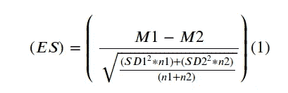

其中`M`、`SD`和`n`分别为每个分布 1 & 2 的均值、标准差和样本量。

请注意，通常情况下，平均值的标准误差(`SEM`)以数据的图形表示形式提供。然后，您可以使用以下公式转换到`SD`:

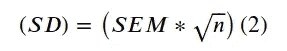

假设您筛选的第二项研究在两个不同的时间点(如治疗前和治疗后)使用了同一组。在这里，你是在处理一个主题内的设计，而不是主题间的设计。在这种情况下，您可以使用以下等式计算`ES`:

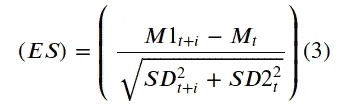

其中，`Mt`是平均初始测量值(通常是基线)，`M(t+i)`是第二个时间点的测量值，`SDt`是初始测量期间分布的标准偏差，`SD(t+i)`是第二个测量点分布的标准偏差，`N`代表该组的样本量

## 效应大小的标准化

为了使所有测量具有相同的度量并便于解释，效应大小可以转换为相关系数，称为`r`，遵循以下等式:

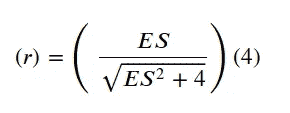

在某些情况下，论文中实际提供了相关的统计数据，在这种情况下，可以使用以下等式:

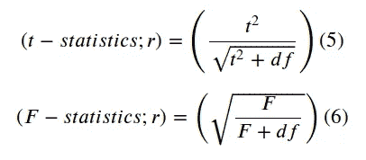

在某些情况下(通常在旧出版物中)，既没有可用的统计信息，也没有数据的图形表示，只报告了*p*值。在这种情况下，如果您报告了 p 值，则可以使用 z 得分，使用以下公式:

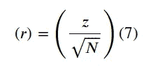

其中`z`是 z 分数值，`N`是样本量。你可以从 z-score 表中提取出`z-scores`，比如这个。但是请记住，*p*-值取决于组大小，应该谨慎评估。

## 组合效应大小和比较

在某种程度上，我们遇到了麻烦，因为随着距离 0 越来越远，`r`的值变得越来越倾斜。为了补偿这种影响，我们可以使用此处描述的[费歇尔变换对影响大小进行标准化，遵循以下等式:](https://books.google.de/books?hl=en&lr=&id=7GviBQAAQBAJ&oi=fnd&pg=PP1&dq=Statistical+Methods+for+Meta-Analysis.+Statistical+Methods+for+Meta-Analysis,&ots=Dw__nKb48y&sig=iTxsYslhkobz_pCAt8u4ep-LsZg#v=onepage&q=Statistical%20Methods%20for%20Meta-Analysis.%20Statistical%20Methods%20for%20Meta-Analysis%2C&f=false)

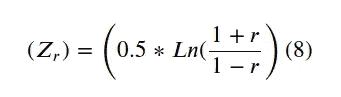

其中`r`是通过上述方法计算的效应大小。按照惯例， *𝑍𝑟* 可以[转换回 r](http://rogeriofvieira.com/wp-content/uploads/2016/05/Wilson.pdf) 以便于解释。

如果你处理的是低样本量，这可能会在你的分析中产生一些偏差(< 20 or 10 in each group, see [Nakagawa & Cuthill，2007](https://onlinelibrary.wiley.com/doi/abs/10.1111/j.1469-185X.2007.00027.x) )，我们使用 [Hedges & Olkin，1985](https://www.sciencedirect.com/book/9780080570655/statistical-methods-for-meta-analysis) 提出的公式计算了无偏 *𝑍𝑟* (zru)值:

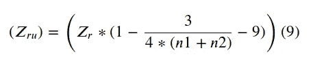

## 随机和固定效应模型

当进行元分析方法时，有必要使用固定效应或随机效应统计模型。固定效应模型假设所有效应大小测量相同的效应，而随机效应模型考虑了研究间效应的潜在差异。由于选择的模型会影响汇总估计的解释，因此可以通过进行异质性测试来测试使用哪个模型，从而生成等式中描述的`Q-statistic`。14.`Q`值是效果大小的离差的度量。该测量遵循具有`k-1`自由度的卡方分布，其中 k 是效应大小的总数。这个模型假设每个效应的方差大小( *𝑣𝑖*

，情商。10)由固有采样误差引起的方差组成( *𝑣* 0，等式。11 & 12)，加上随机分布可变性的其他来源( *𝑣𝑟* ，等式 12)。为了估计这些值，您可以使用公式 10 至 15，这些公式由( [Lipsey & Wilson，2001](https://idostatistics.com/lipsey-wilson-2001-practical-meta-analysis-2001/)；[中川&卡特希尔，2007](https://onlinelibrary.wiley.com/doi/abs/10.1111/j.1469-185X.2007.00027.x) ):

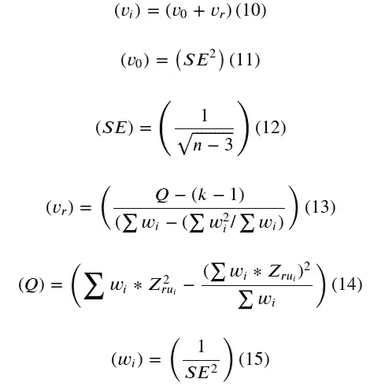

作为对`Q statistic`的补充，我们可以使用等式提供 I^2 统计。16，它衡量了研究之间的差异百分比，这是由于真正的异质性，而不是机会。

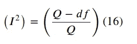

其中 Q 通过等式计算。14，df 是效应大小数减 1，百分比值越高表明异质性越高。通常，I 将以百分比表示，并且可以有一个与之相关的*p*-值，如果该值显著，将表明大量的异质性，并为随机模型效应提供进一步的支持。

## 计算效应大小的置信区间

对于每个变量及其不同水平，可以使用方程计算平均效应大小、95%置信区间(CI)和 zscore 值。16，17，18，19。见 [Nakagawa & Cuthill，2007](https://onlinelibrary.wiley.com/doi/abs/10.1111/j.1469-185X.2007.00027.x) 关于这个主题的更多信息，并注意还有其他建议的方法来比较这些值。

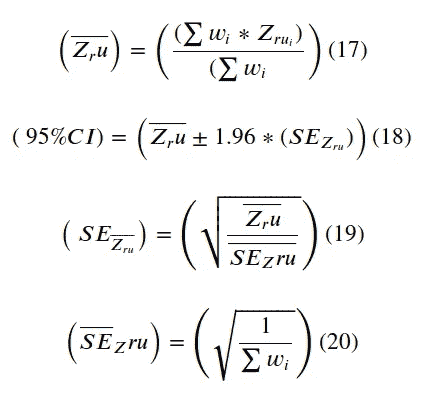

## 荟萃分析的额外辅助计算

在进行元分析时，可能还需要进行其他分析。特别是，文件抽屉分析(允许估计一个人可能需要多少更多的效应大小来消除任何发现的总体元分析效应)和漏斗图(允许评估发表偏倚)可能是令人感兴趣的。我不会谈论这些，但是如果你想在你的数据上运行这些，你可以看看 JASP。

# 最终注释

就是这样！所有这些方法都是我们从本文引用的参考资料中丢弃的。你应该持批评态度，在盲目应用它之前，想想它意味着什么。我自己在理解背后的一些逻辑时仍然有些困难(例如，等式(9)对我来说仍然有点模糊)。我也真的推荐你尝试阅读贝叶斯元分析，这可能是解决这个问题的一个非常强大的方法；)

这种方法背后的大部分数学都用 Python 编码在这个[库](https://github.com/juls-dotcom/meta_analysis)中。这是正在进行的东西，所以如果你发现任何错误，请随时评论或联系！

如果你感兴趣的话，我还有一篇[的博客文章](https://juls-dotcom.github.io/meta_analysis_python.html)，我会在那里浏览代码。

感谢阅读！