# 元标签和堆叠

> 原文：<https://towardsdatascience.com/meta-labeling-and-stacking-f17a7f9804ec?source=collection_archive---------4----------------------->

## [📈Python for finance 系列](/feature-engineering-feature-selection-8c1d57af18d2)

## 如何提高你的机器学习分数


由[戴夫·甘迪](http://skuawk.com/)根据[公共领域专用许可](https://creativecommons.org/licenses/publicdomain/)拍摄的照片

***来自《走向数据科学》编辑的提示:*** *虽然我们允许独立作者根据我们的* [*规则和指南*](/questions-96667b06af5) *发表文章，但我们并不认可每个作者的贡献。你不应该在没有寻求专业建议的情况下依赖一个作者的作品。详见我们的* [*读者术语*](/readers-terms-b5d780a700a4) *。*

警告:这里没有神奇的公式或圣杯，尽管一个新的世界可能会为你打开大门。

**注 1:** *如何安装*[*mlfinlab*](https://github.com/hudson-and-thames/mlfinlab)*包没有错误信息可以在这里找到*[](https://medium.com/@kegui/how-to-install-mlfinlab-without-error-messages-896e2fb43c2f)**。**

***注 2:** *如果你正在读马科斯·普拉多的* [*【金融机器学习进展】*](https://www.amazon.com/Advances-Financial-Machine-Learning-Marcos/dp/1119482089) *。* ***7。***[](https://medium.com/swlh/fractionally-differentiated-features-9c1947ed2b55)***是第五章关于* [*的细分特征*](https://medium.com/swlh/fractionally-differentiated-features-9c1947ed2b55) *。* ***8。*** [***数据标注***](/the-triple-barrier-method-251268419dcd) *是第三章关于三重关卡的方法。和* ***9。*** [***元标注***](/meta-labeling-and-stacking-f17a7f9804ec)**是第 50 页第 3.6 章。*****

****注 3** : *由于算法或评估程序的随机性或数值精度的差异，您的结果可能会有所不同。但是我确实发现很多人取得了更高的分数，因为他们以* ***错误的*** *方式标准化了他们的训练和测试数据。在这篇文章的最后，我将揭示高分的大秘密。***

## **📈Python For Finance 系列**

1.  **[识别异常值](https://medium.com/python-in-plain-english/identifying-outliers-part-one-c0a31d9faefa)**
2.  **[识别异常值—第二部分](https://medium.com/better-programming/identifying-outliers-part-two-4c00b2523362)**
3.  **[识别异常值—第三部分](https://medium.com/swlh/identifying-outliers-part-three-257b09f5940b)**
4.  **[程式化的事实](/data-whispering-eebb77a422da)**
5.  **[特征工程&特征选择](https://medium.com/@kegui/feature-engineering-feature-selection-8c1d57af18d2)**
6.  **[数据转换](/data-transformation-e7b3b4268151)**
7.  **[微小差异特征](https://medium.com/swlh/fractionally-differentiated-features-9c1947ed2b55)**
8.  **[数据标签](/the-triple-barrier-method-251268419dcd)**
9.  **[元标签和堆叠](/meta-labeling-and-stacking-f17a7f9804ec)**

# **介绍**

**元标签已经在我的写作清单上坐了很长时间了。它是一个有用而强大的机器学习工具，可以收集在任何数据科学家的工具箱中，不管你使用的是什么模型。不幸的是，我几乎没有找到任何关于这个话题的像样的教程。而堆叠是一种流行的 ***集成方法*** 用于匹配学习。堆叠包括训练一个学习算法来组合其他几个学习算法的预测。正如我们所知，集成学习的基本思想是促进比单独从任何组成学习算法获得的更好的预测性能。这是一种“群体智慧”方法，从几个模型中提取信息，形成一组高度准确的结果。根据这个定义，元标记也应该属于集成方法。**

**虽然堆叠和元标记有一些相似之处，但它们是根本不同的。堆叠基本上包括两个步骤。首先，使用可用数据训练所有其他算法，然后使用其他算法的所有预测作为附加输入，训练组合器算法以进行最终预测。堆叠的过程是:**

1.  ***建立第一个基础模型，得到预测***
2.  ***用阈值过滤预测***
3.  ***将预测与输入合并为新的输入***
4.  ***建立第二个模型，并用新的输入对其进行训练***
5.  ***用第二个模型预测***

**很简单，我们可以把它看作是给我们的训练数据增加额外的特征。**

**而元标记利用了两层模型，但目的不同。根据 Marcos Lopez de Prado 在他的书《金融机器学习进展》第三章第 50 页(除了这本书，网上没有太多有用的信息)。**

> **当你想获得更高的 F1 分数时，元标签尤其有用。首先，我们建立一个实现高召回率的模型，即使精度不是特别高。第二，我们通过将元标记应用于由主要模型预测的阳性来校正低精度。**

**中心思想是创建一个学习如何使用主模型的辅助 ML 模型。这导致了改进的性能指标，包括:准确度、精确度、召回率和 F1 分数*等。*。**

**在马科斯的书中，元标签之所以如此有效的原因是:**

> **二进制分类问题提出了 I 型错误(假阳性)和 II 型错误(假阴性)之间的折衷。一般来说，增加二元分类器的真阳性率将倾向于增加其假阳性率。二元分类器的接收器操作特征(ROC)曲线根据接受更高的假阳性率来测量增加真阳性率的成本。**

**一般来说，元标记的过程是这样的:**

1.  ***建立第一个基本模型，获得预测***
2.  ***用阈值*过滤预测**
3.  ***将预测与 x_train 合并作为新的输入***
4.  ***将预测与 y_train 合并为一个新标签***
5.  ***建立第二个模型，并用新的输入和标签对其进行训练***
6.  ***用第二个模型预测***
7.  ***基本模型预测和元模型预测交集的最终预测结果。***

**元标签是我花了大量时间试图找出应用这种方法的最佳方式的主题。但是仍然有太多的未知，例如:**

1.  ****元标签指标是否依赖于？****

***当我们评估一种方法时，这实际上取决于我们选择哪些指标，以及您对模型架构、超参数等的优化程度..***

**2.**能否适用于不同的车型？****

**由于这种方法将使用两种不同的模型，模型差异是我们需要考虑的另一个问题。**

**3.元标签只适用于某些数据吗？**

***关于这个话题的参考文献大多来自时序数据，那么非序列数据呢？***

**诸如此类，但是这些问题都是关于元标签的局限性，这也是我在本文中想要探讨的。但是由于这篇文章的长度限制，我可能无法涵盖所有的内容。**

**元标记与集成方法的区别，尤其是堆叠，在于元标记将来自主要模型的预测添加到特征和标记中，而堆叠仅将其用作新特征。我可以理解那些额外的特征(预测)是由用来做预测的模型来表示的。但是为什么要在标签中使用呢？尽管这可能就是元标签这个名字的由来。最重要的是，在标签中加入预测是否有信息泄露？嗯，我想肯定会有从初级模型到次级模型的泄漏，这是为了得到更好的分数。**

**由于可以在网上找到许多关于集成学习的讨论，特别是堆叠，元标记很少得到足够的研究。因此，本文将集中讨论元标记及其与堆叠的比较。**

# **图书馆**

**下面是本文中使用的库。**

```
**'''Main'''
import numpy as np
import pandas as pd'''Data Viz'''
import matplotlib.pyplot as plt
import seaborn as sns#plt.style.use('seaborn')
plt.rcParams['figure.figsize'] = [16, 9]
plt.rcParams['figure.dpi'] = 300
plt.rcParams['font.size'] = 20
plt.rcParams['axes.labelsize'] = 16
plt.rcParams['axes.titlesize'] = 18
plt.rcParams['xtick.labelsize'] = 12
plt.rcParams['ytick.labelsize'] = 12
plt.rcParams['font.family'] = 'serif'
%matplotlib inline'''Data Prep'''
from sklearn import preprocessing as pp
from scipy.stats import pearsonr
from sklearn.model_selection import train_test_split
from sklearn.model_selection import StratifiedKFold'''Metrics'''
from sklearn.metrics import log_loss, accuracy_score, f1_score
from sklearn.metrics import precision_recall_curve, average_precision_score
from sklearn.metrics import roc_curve, auc, roc_auc_score
from sklearn.metrics import confusion_matrix, classification_report'''Algos'''
from sklearn.linear_model import LogisticRegression
import lightgbm as lgbimport tensorflow as tf
from tensorflow import keras
from tensorflow.keras.models import Sequential
from tensorflow.keras.layers import Dense
from tensorflow.keras.callbacks import ReduceLROnPlateau,EarlyStopping**
```

# **数据**

**为了研究元标记和堆叠，我们可以通过`sklearn.datasets.make_classification().`生成一个虚拟的二进制分类数据集，但是使用真实的数据集更有趣。我们这里使用的数据集是 ULB 机器学习小组的 ***信用卡欺诈检测*** 。我们先快速看一下数据。**

```
**#pd.read_csv can read the url and unzip the zipped file at
#same time, but will take a few seconds, just be patient.url = "[https://clouda-datasets.s3.amazonaws.com/creditcard.csv.zip](https://clouda-datasets.s3.amazonaws.com/creditcard.csv.zip)"
data_original = pd.read_csv(url) 
data_original.head()**
```

**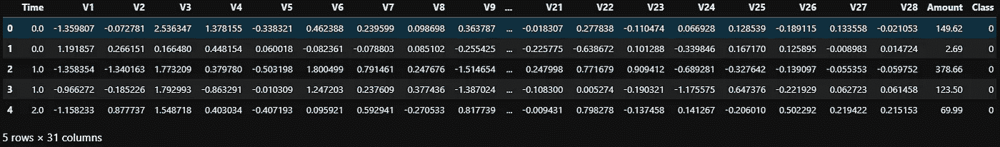**

# **✍Tip！**

**`pd.read_csv()` *可以同时读取网址和解压压缩文件。我们不再需要任何其他函数或库来完成这项工作。***

**数据集包含 28 个匿名要素、1 个“数量”要素、1 个“时间”要素和 1 个目标变量类。该数据集显示了两天内发生的交易，其中 284，807 笔交易中有 492 笔欺诈。这些特征被匿名化以保护客户的隐私，这是 PCA 变换的结果，因为数据集在公共域中。唯一没有被 PCA 转换的特征是“时间”和“数量”。特征“时间”包含数据集中每个事务和第一个事务之间经过的秒数。特征“金额”是交易金额，该特征可用于依赖于示例的成本感知学习。特征“类”是响应变量，“0”作为目标变量对应于非欺诈情况，而目标变量中的“1”对应欺诈情况。**

```
**data_original.info()**
```

**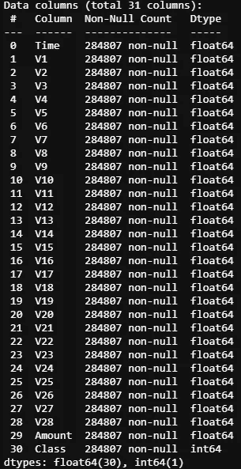**

**变量之间也有最小的相关性——这可能是 PCA 变换变量的结果。**

```
**#see the cluster and corralation of features and classes
def plot_corr(data = data_original):

    ax1 = data.corrwith(data.Class).plot.bar(figsize = (20, 10),
         title = "Correlation with class",
         fontsize = 18, color='r',
         rot = 45, grid = True)
    ax1.title.set_size(28)

    sns.set(style="white")
    cmap = sns.diverging_palette(220, 20, as_cmap=True)

    corr =data.corr()
    sns.clustermap(corr,cmap=cmap,
                  linewidths=1,linecolor='w')

plot_corr();**
```

**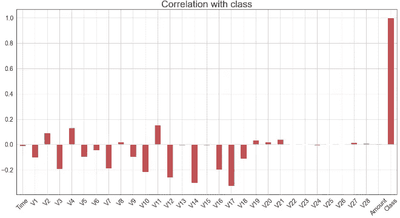****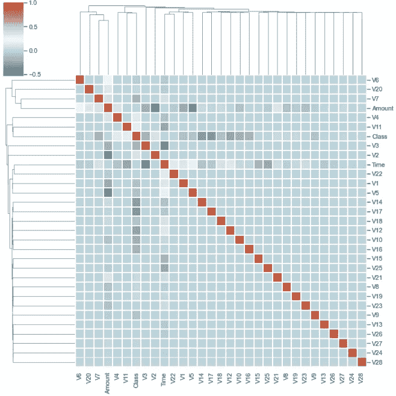**

**我之所以选择这个数据集，是因为从这个数据集无论是精度还是召回率都很难达到高分。该数据集非常不平衡，因为在 284，807 笔交易中有 492 笔(0.17%)欺诈。该数据集中 99.83%的交易不是欺诈性的，而只有 0.17%是欺诈性的。**

```
**val_counts = data_original[['Class']].value_counts()
ax = sns.barplot(x=val_counts.index,
                 y=val_counts/len(data_original))
ax.set(title=f'Frequency Percentage by {val_counts}',
       xlabel='Class',
       ylabel='Frequency Percentage');**
```

**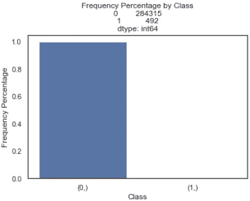**

**面对如此少量的欺诈性数据，我们必须小心我们的数据处理和模型选择。算法可以很容易地通过预测所有的测试数据是欺诈性的来欺骗我们。随着 99.9%的数据集是负面的(非欺诈)，网络将巧妙地预测所有是负面的，导致超过 99%的准确性。结果看起来很好，但没有用。**

**这就是为什么除了准确性之外，我们还需要更好的指标。**

# **衡量标准**

**结果质量没有单一的最佳衡量标准，问题域和数据决定了合适的方法。**

**大多数机器学习使用准确度作为默认度量，如果我们使用准确度作为度量，正如我们所知，准确度是真阴性和真阳性的总和除以总数据集大小。考虑到真实的负值压倒真实的正值，准确性可能非常高，但不会表明您的模型对欺诈性数据进行分类的能力。也就是说，由于概念简单、易于实现和用途广泛，有一些度量方法被普遍采用。因为我们不知道哪一个最适合这个数据集，所以我将在本文中列出它们。**

*   **准确(性)**
*   **平均精度**
*   **地下区域**
*   **精确**
*   **召回**
*   **f1-分数**
*   **困惑 _ 矩阵**
*   **精确回忆曲线**
*   **曲线下面积**

**下面将对每个指标做一些介绍。当然，在网上可以找到大量关于度量的资料。如果你已经知道他们中的大部分，我们仍然可以在跳到下一部分之前刷新我们的记忆。**

## **1.召回率、精确度和 AUC ( **曲线下面积** ) ROC**

**我把这三个指标放在一起，因为它们有很好的相关性。**

**根据 Wikipedia，precision 是正确结果的数量除以所有返回结果的数量，而 recall 是正确结果的数量除以应该返回的结果的数量。**

**而下面这张图比 1000 字更好的解释了这两个概念。**

**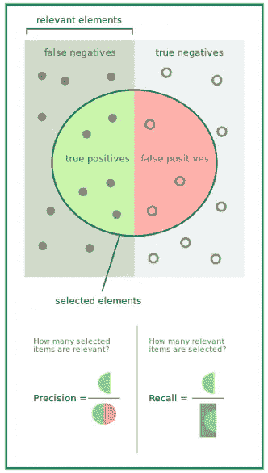**

**[精确和召回来自维基百科](https://en.wikipedia.org/wiki/Precision_and_recall)**

**接收算子特征(ROC)是曲线下的面积，其中 x 是假阳性率(FPR ), y 是真阳性率(TPR ),通常用于呈现机器学习中二元决策问题的结果。AUC 是 ROC 曲线下的面积，代表召回(TPR)和特异性(FPR)之间的权衡。与其他指标一样，AUC 介于 0 和 1 之间，0.5 是随机预测的预期值。**

**AUC-ROC 曲线是在各种阈值设置下对分类问题的性能测量。ROC 是概率曲线，AUC 代表可分性的程度或度量。它告诉我们模型在多大程度上能够区分不同的类。**

> ****与精确召回曲线不同，ROC(接收者操作者特征)曲线最适用于平衡数据集。****

****

**[来源](https://glassboxmedicine.com/2019/02/23/measuring-performance-auc-auroc/)**

**AUC 接近 1，这意味着它具有良好的可分性。差模型的 AUC 接近 0，这意味着它具有最差的可分性度量。事实上，这意味着它在往复结果。**

**一篇关于这个话题的文章可以在[这里](/understanding-auc-roc-curve-68b2303cc9c5)找到。此外，一个很好的 ROC 和 AUC 视频可以从 Josh Starmer 的 [StatQuest 中找到。](https://www.youtube.com/channel/UCtYLUTtgS3k1Fg4y5tAhLbw)**

## **2.平均精度**

**平均精度是一个用来概括精度-召回曲线(PR AUC)的单一数字，它使得比较不同的模型成为可能。PR AUC 是曲线下的面积，其中 x 是召回率，y 是精确度。平均精度(AP)的一般定义是找到上述精度-召回曲线下的面积。**

****

**精确度和召回率总是在 0 和 1 之间。因此，AP 也在 0 和 1 之间。**

**[这里](https://sanchom.wordpress.com/tag/average-precision/)是一篇关于这个话题的好文章。**

> ****然而，当处理高度倾斜的数据集时，精确召回(PR)曲线给出了一个算法性能的** [**更丰富的**](http://pages.cs.wisc.edu/~jdavis/davisgoadrichcamera2.pdf) **画面。** [当 AUC 和 AP 都被重新调整到位于[0，1]时，AP 大约是 AUC 乘以系统的初始精度。](https://dl.acm.org/doi/10.1145/2808194.2809481)**

## ****3。F1 分数****

**传统的 F 值或平衡 F 值( **F1 值**)是精度和召回率的 [**调和平均值**](https://en.wikipedia.org/wiki/Harmonic_mean#Harmonic_mean_of_two_numbers) 。我们计算 F1 分数作为精度的调和平均值，并回想一下如何实现这一点。虽然我们可以取两个分数的简单平均值，但调和平均值更能抵抗异常值。因此，F1 分数是一个平衡的度量，它恰当地量化了跨许多领域的模型的正确性。**

**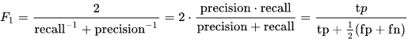**

****F1 得分****

**F1 分数适用于 ROC 曲线的任何特定点。该点可以代表例如二元分类器中的特定阈值，因此对应于特定的精度和召回值。**

> **请记住，F1 分数是一种既代表召回率又代表准确率的聪明方法。对于要高的 F1 分数，精确度和召回率都应该高。**

**因此，ROC 曲线针对各种不同水平的阈值，并且对于其曲线上的各个点具有许多 F1 分数值。**

## ****4。混乱矩阵****

**对于如此高度不平衡的数据集，混淆矩阵没有多大意义。我将它添加到度量集合中，仅供参考。它可以通过下表自我解释:**

**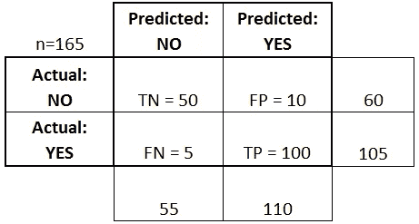**

*   ****真阳性(TP):** 这些是我们预测是的病例(他们有疾病)，他们确实有疾病。**
*   ****真阴性(TN):** 我们预测没有，他们没有这种病。**
*   **假阳性(FP): 我们预测是的，但他们实际上并没有患病。(也称为“第一类错误”)**
*   ****假阴性(FN):** 我们预测没有，但他们确实有疾病。(也称为“第二类错误”)**

**我在一个函数中总结了所有的指标，以便稍后调用。**

```
**def metrics_summary(true_label, prediction_prob, Threshold=0.5):

    #basically, slearn provides all the functions for metrics. average_precision = average_precision_score(true_label
    ,prediction_prob)
    fpr, tpr, thresholds = roc_curve(true_label, prediction_prob)
    areaUnderROC = auc(fpr, tpr)

    prediction_int = prediction_prob > Threshold

    accuracy = accuracy_score(true_label, prediction_int)

    print(f'accuracy: {accuracy}')
    print(f"average_precision: {average_precision}")
    print(f'areaUnderROC: {areaUnderROC } \n')
    print('*'*60)
    print(' '*20, 'classification_report')
    print('*'*60, "\n")
    print(classification_report(true_label, prediction_int))

    print('*'*60)
    print(' '*20, 'confusion_matrix \n')
    print('*'*60, "\n")
    display(confusion_matrix(true_label, prediction_int))
    print("\n")

    # precision_recall_curve and areaUnderROC 
    precision, recall, thresholds = precision_recall_curve( \
                                true_label, prediction_int)

    fig, (ax1, ax2) = plt.subplots(1, 2, figsize=(16,9))

    ax1.step(recall, precision, color='k', alpha=0.7, where='post')
    ax1.fill_between(recall, precision, step='post', 
    alpha=0.3,color='k') ax1.set_xlabel('Recall', fontname="Arial", fontsize=24)
    ax1.set_ylabel('Precision', fontname="Arial", fontsize=24) 
    ax1.tick_params(labelsize=20)

    ax1.set_title('Precision-Recall curve: Average Precision \
    = {0:0.2f}'.format(average_precision), fontsize=24,
    fontname="Arial")        

    ax2.plot(fpr, tpr, color='r', lw=2, label='ROC curve')
    ax2.plot([0, 1], [0, 1], color='k', lw=2, linestyle='--')
    ax2.tick_params(labelsize=20)
    ax2.set_xlabel('False Positive Rate', fontname="Arial",
    fontsize=24)
    ax2.set_ylabel('True Positive Rate', fontname="Arial",
    fontsize=24)
    ax2.set_title('areaUnderROC = {0:0.2f}'\
            .format(areaUnderROC), fontsize=24, fontname="Arial",)    
    ax2.legend(loc="lower right", fontsize=24, fancybox=True) 
    # Adjust the subplot layout, because the logit one may take 
      more space
    # than usual, due to y-tick labels like "1 - 10^{-3}"
    # plt.subplots_adjust(top=0.92, bottom=0.08, left=0.10,
    # right=0.95, hspace=0.25,wspace=0.35)**
```

**这些评估指标非常重要。这有点像数据科学家和商业人士之间的接口。对于大多数只听说过 AI 但从未在任何模型上训练过的人来说，他们不会太关注像 log loss、交叉熵和其他成本函数这样的东西。这就是为什么我们需要指标来直观地向业务人员解释结果。尽可能简单地向非数据科学家传达复杂结果的能力是应用数据科学家需要掌握的基本技能之一。**

# **模型**

**以下是我将要探讨的三种模式:**

1.  **逻辑回归**
2.  **lightBGM**
3.  **DNN**

**我选择这三个模型的原因是它们高度不相关。独立解决方案需要相对不相关。如果它们非常相关，一旦将它们放入一个集合模型，其中一个的优势将反映其余的优势，劣势也是如此。我们看不到通过合奏实现多样化的好处。**

**在我们进入模型之前，仍然有一些事情需要做，即，基于特征的标准化、输入和标签分离以及分割训练和测试数据。**

```
**#Normalize training and testing data
def scale_data(x_train, x_test=None):   
    features_to_scale = x_train.copy().columns
    scaler = pp.StandardScaler()
    print(scaler.fit(x_train[features_to_scale]))

    x_train.loc[:, features_to_scale] = \
    scaler.transform(x_train[features_to_scale])

    #normalize test dataset with the mean and std of train data set 
    x_test.loc[:, features_to_scale] = \
    scaler.transform(x_test[features_to_scale])

    return x_train, x_test#seperate input and labels    
def get_x_y(data=data_original):
    data_x = data.copy().drop(['Class', 'Time'], axis=1)
    data_y = data['Class'].copy()

    return data_x, data_y#split the train and test data
def data_split(data_x, data_y):
    x_train, x_test, y_train, y_test = \
          train_test_split(data_x,data_y,test_size=0.25,
          stratify=data_y,random_state=2020)      

     return  x_train, x_test, y_train, y_test#put all together
def data_process(data=data_original):
    data_x, data_y = get_x_y(data)

    x_train, x_test, y_train, y_test \
    = data_split(data_x, data_y)

    #do not touch the test data by any means!!!!
    x_train, x_test = scale_data(x_train, x_test)

    return  x_train, x_test, y_train, y_test**
```

# **✍Tip！**

**由于数据集高度不平衡，scikit-learn 的`train_test_split()`函数中的参数`stratify =data_y`来得非常方便。数据在一瞬间以分层的方式被分割。**

**你可能注意到我用 data_original，x_test_orignal，y_test_orignal 作为变量名。我想把这三个子数据集放在一边，因为这些原始数据会有很多调整，我们不想以任何方式弄乱测试数据。**

```
**x_train, x_test_original, y_train, y_test_original \
= data_process(data_original)x_train.shape, x_test_original.shape, \
y_train.shape, y_test_original.shape**
```

**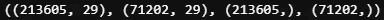**

**训练数据集有 213605 条事务记录和 29 个特征，而测试数据集有 71202 条事务记录和 29 个特征。**

```
**print(f'No. of fraud in test dataset:\
      {x_test_original[y_test_original==1].shape[0]}')**
```

**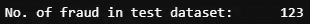**

**在测试数据集中的 71202 条交易记录中，只有 123 条记录是欺诈性的。**

# **✍Tip！**

***注意，测试数据是通过训练数据的均值和标准差来标准化的。你不应该在你的工作流程中使用任何根据测试数据计算的数量，即使是简单的数据标准化。* ***换句话说，永远不要碰你的测试数据！*****

**数据准备好了，指标确定了，模型来了:**

1.  ****模型 1** *(逻辑回归)***

```
**def build_model_1(x_train, y_train):

    logitreg_parameters = {'C': np.power(10.0, np.arange(-9, 1)),
                           'solver' : ('lbfgs', 'liblinear') }

    model_1 = LogisticRegression(#solver='liblinear',
                                 class_weight='balanced', 
    #uses the values of y to automatically adjust weights

                                 warm_start=True,
    #reuse the solution of the previous call to fit
     as initialization
                                 max_iter = 300,
    #Maximum number of iterations taken for the solvers to converge.
                                 random_state=2020, 
    #so results can be reproduced
                                 ) logitreg_grid = GridSearchCV(model_1, param_grid = \
           logitreg_parameters,scoring = 'f1', n_jobs = 1, cv=5)          

    logitreg_grid.fit(x_train, y_train)

    return logitreg_gridmodel_1 = build_model_1(x_train, y_train)**
```

**开始时，由于本文不是关于获得最佳分数，我使用了来自 ***sklearn*** 的逻辑回归的默认设置。精度分很低，0.07 左右。使用相同的默认设置，一些在线教程在使用逻辑回归的相同数据集上显示了非常高的精确度。然而，他们处理测试数据的方式是有问题的。为了得到更好的结果，使用了`GridSearchCV`来搜索最佳参数。**

**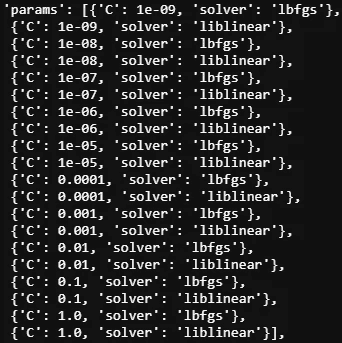****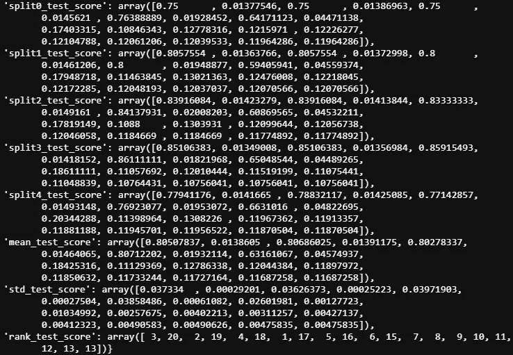**

**我得到的最好成绩是**

```
**model_1.best_score_**
```

**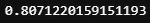**

**使用以下设置:**

```
**model_1.best_estimator_**
```

**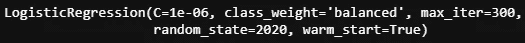**

**让我们检查测试数据集的结果和指标得分:**

```
**# 0 and 1 two clasese
y_pred_prob_test_1 = model_1.predict_proba(x_test_original)[:,1]
# number of fraud is 123 in test dataset
y_pred_int_test_1 = y_pred_prob_test_1 > Threshold
pd.Series(y_pred_int_test_1).value_counts()**
```

**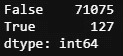**

**相当不错，记住欺诈交易的数量是 123。**

```
**metrics_summary(y_test_original, y_pred_int_test_1)**
```

**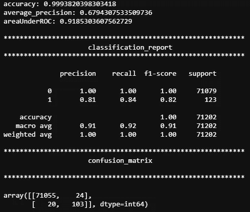****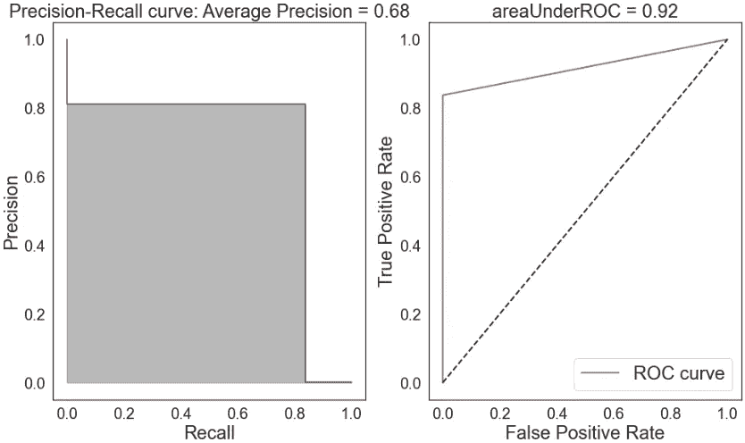**

****2。型号 2** *(LightBGM)***

**对于 lightBGM，我进一步指定 1/4 的训练数据作为验证数据集。**

```
**#prepare data 
x_train_, x_cv, y_train_, y_cv = \
train_test_split(x_train, y_train,
                test_size=0.25,
                stratify=y_train,
                random_state=2020)def build_model_2(x_train, y_train, x_cv, y_cv ):
    #most of the parsmeters are default
    params_lightGB = {
    'task': 'train',
    'application':'binary',
    'num_class':1,
    'boosting': 'gbdt',
    'objective': 'binary',
    'metric': 'binary_logloss',
    'metric_freq':50,
    'is_training_metric':False,
    'max_depth':4,
    'num_leaves': 31,
    'learning_rate': 0.01,
    'feature_fraction': 1.0,
    'bagging_fraction': 1.0,
    'bagging_freq': 0,
    'bagging_seed': 2018,
    'verbose': 0,
    'num_threads':16
    } lgb_train = lgb.Dataset(x_train, y_train)
    lgb_eval = lgb.Dataset(x_cv, y_cv, reference=lgb_train) model_2 = lgb.train(params_lightGB, lgb_train,
                    num_boost_round=2000,
                    valid_sets=lgb_eval,
                    early_stopping_rounds=200,
                    verbose_eval=False)
    return model_2x_train_.shape, y_train_.shape, x_cv.shape, y_cv.shape**
```

**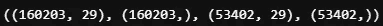**

**结果还不错，没有进行进一步的超参数调整。**

```
**model_2 = build_model_2(x_train_, y_train_, x_cv, y_cv)y_pred_prob_test_2 = model_2.predict(x_test_original)
y_pred_int_test_2 = y_pred_prob_test_2 > Threshold
pd.DataFrame(y_pred_int_test_2).value_counts()**
```

**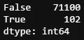**

```
**metrics_summary(y_test_original, y_pred_int_test_2)**
```

**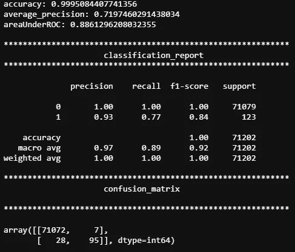****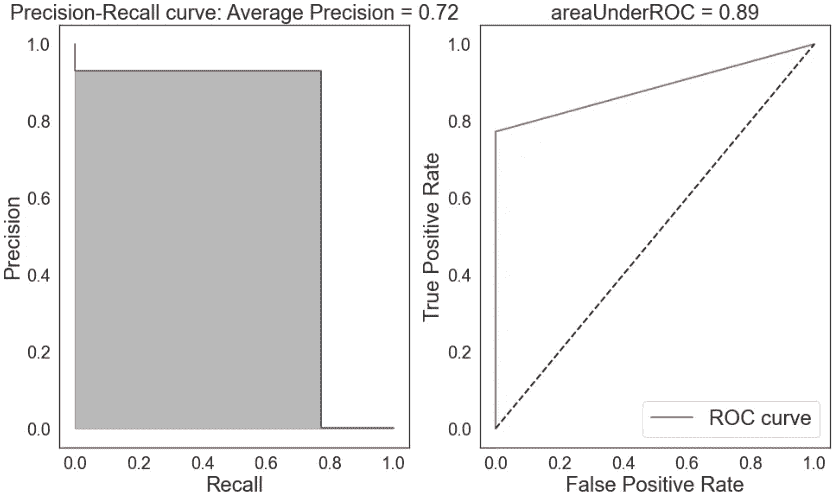**

**与模型 1 相同，准确率非常高(99.9%)，精确度很好(93%)，而召回率适中(77%)。**

****3。模型 3** *(深度神经元网络)***

**对于深度神经元网络(DNN)，我使用了两个回调，EarlyStopping()和 ReduceLROnPlateau()来获得更好的结果。同样，由于结果还不错，所以没有实现超参数调优。( [Keras-tuner](https://medium.com/@kegui/a-few-pitfalls-for-kerastuner-beginner-users-13116759435b) 确实不错，可以查一下[我以前的文章](https://medium.com/@kegui/how-to-do-cross-validation-in-keras-tuner-db4b2dbe079a)更好的了解。)**

```
**callbacks = [EarlyStopping(monitor='loss', patience=3), \
                 ReduceLROnPlateau(monitor='val_loss', factor=0.2, \
                                   patience=3, min_lr=0.001)]def build_model_3(x_train, y_train, x_cv, y_cv, input_dim=29): 
    model_3 = Sequential([
                Dense(input_dim = input_dim, units = 32, 
                      activation  = 'relu'),
                Dense(units = 16, activation =  'relu'),
                #Dropout(0.5),
                Dense(units = 8, activation =  'relu'),
                Dense(units =1, activation = 'sigmoid'),]) model_3.compile(optimizer = 'adam', 
                 loss = 'binary_crossentropy', 
                 metrics = ['accuracy'])

    model_3.fit(x_train, y_train, 
              validation_data = (x_cv, y_cv),
              batch_size = 64, 
              epochs = 50,
              callbacks=callbacks)

    return model_3**
```

**这是一个简单的 3 层 DNN，具有较小的单元数(32，16，8)以避免过度拟合。**

# **⚠️Warning**

**DNN 对输入特征非常敏感。如果将时间特征添加到训练数据中，结果会有些奇怪。但是一旦你去掉时间特性，它就恢复正常了。**

**现在我们可以在模型 3 上训练我们的数据。**

```
**model_3 = build_model_3(x_train_, y_train_, \
x_cv, y_cv, input_dim=29)
y_pred_prob_test_3 = model_3.predict(x_test_original)y_pred_int_test_3 = y_pred_prob_test_3 > Threshold
y_pred_int_test_3.shape
pd.DataFrame(y_pred_int_test_3).value_counts()** 
```

**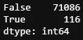**

```
**metrics_summary(y_test_original, y_pred_int_test_3)**
```

**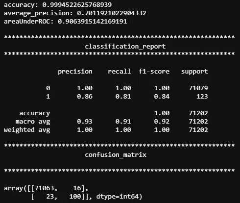****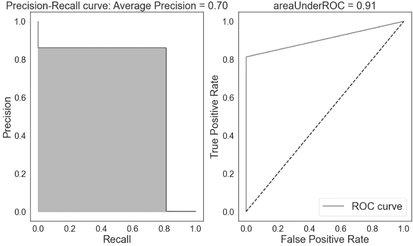**

**在没有任何超参数调整的情况下，结果类似于优化的模型 1 逻辑回归。一般来说，如果我们包括来自不同机器学习家族的类似强解(例如一个来自随机森林，一个来自神经网络)，这些解的集合将导致比任何独立解更好的结果。这是因为每个独立解决方案都有不同的优点和缺点。通过将独立的解决方案整合在一起，一些模型的优势(T2)弥补了其他模型的劣势，反之亦然。到目前为止，来自 3 个非常不同的模型的结果似乎满足了我们对堆叠和元标记的要求。**

**让我们现在集合那些模型。**

# **堆垛**

**因为叠加有点像向输入数据添加新特征，而新特征来自于主模型的预测。我们首先做一个特征工程来堆叠所有的数据。**

```
**def data_stack( x, y, m_1=model_1, m_2=model_2, m_3=model_3):
    #All required parameters must be placed before any 
     default arguments.
    '''
    x: features
    y: labels
    m_1, m_2, m_3: 3 models

    '''
    # build a container to hold all the prediction from 3 models
    pred_all = pd.DataFrame(data=[], index=y.index) pred_1 = m_1.predict_proba(x)[:,1]
    pred_1_df = pd.DataFrame(pred_1, index=y.index) pred_2 = m_2.predict(x,num_iteration=m_2.best_iteration)

    pred_2_df = pd.DataFrame(pred_2, index=y.index) pred_3 = m_3.predict(x).reshape(x.shape[0]) #to 1D shape
    pred_3_df = pd.DataFrame(pred_3, index=y.index) # join all the predictions together
    pred_all = pred_all.join(pred_1_df.astype(float),
                             how='left',rsuffix="0")\
                       .join(pred_2_df.astype(float),
                             how='left',rsuffix="1")\
                       .join(pred_3_df.astype(float),
                             how='left',rsuffix="2")
    pred_all.columns = ['pred_1', 'pred_2','pred_3']
    # final training data will be the merge of training data 
      and all the predictions
    x_pred = x.merge(pred_all, \
                    left_index=True, right_index=True)

    return x_pred**
```

**现在，将新特征(来自 3 个模型的预测)添加到训练数据集中。**

```
**x_train_stack = data_stack(x_train, y_train)
x_train_stack.shape**
```

**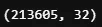**

**然后，相同的过程应用于测试数据集。**

```
**x_test_stack = data_stack(x_test_original, y_test_original)
x_test_stack.shape**
```

**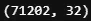**

**由于我们在之前的数据集中添加了新的要素，因此查看这些新要素之间的相关性会很有意思。**

**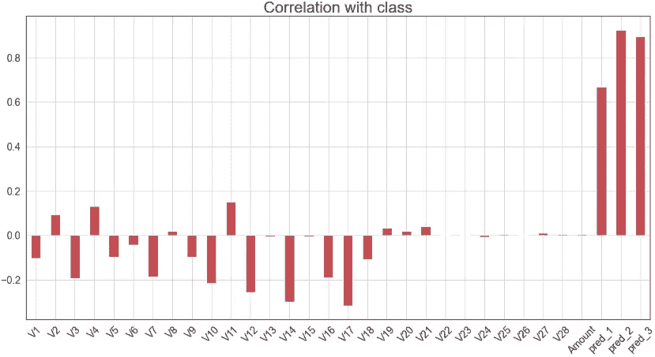****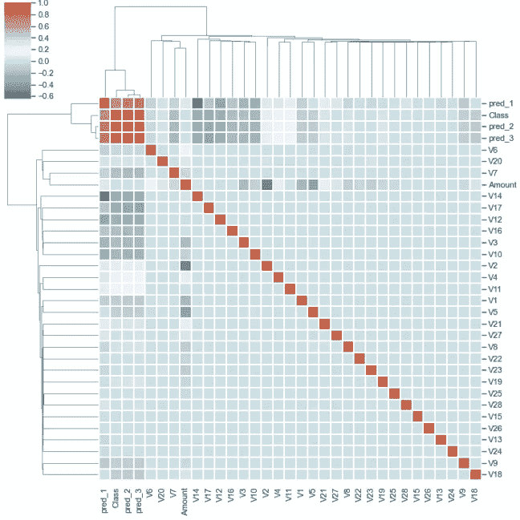**

**我们确实看到初级模型的预测高度相关，这并不奇怪。**来自第一模型的信息泄漏到第二模型中，因为它们共享相同的训练数据。只要测试数据是完整的，我们将更喜欢更多的信息流入第二个模型，以获得更好的结果。****

**现在我们需要经历所有那些乏味但必要的数据过程。**

```
**#normalize training and testing data
x_train_stack, x_test_stack = scale_data(x_train_stack,  x_test_stack)#split the traning data to train and validation
x_train_stack_, x_cv_stack, y_train_, y_cv_ = \
train_test_split(x_train_stack, y_train,
                test_size=0.25,
                stratify=y_train,
                random_state=2020)
#stratify mean samplling with the ratio of each class percentage in #all data.x_train_stack_.shape, x_cv_stack.shape, y_train_.shape,  y_cv.shape**
```

**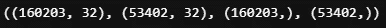**

**不过，说到堆叠，有一些重要的注意事项。如果独立的解决方案同样强大，集合将比任何独立的解决方案具有更好的性能。但是，如果其中一个解决方案比其他解决方案好得多，集合的性能将等于最佳独立解决方案的性能；不合格的解决方案对整体性能没有任何贡献。**

1.  ****型号 2 (lightBGM)作为二级型号****

**由于模型 2 (lightBGM)的精度迄今为止最高，我们将使用模型 2 作为第二模型。**

```
**model_2_stack = build_model_2(x_train_stack_, y_train_, x_cv_stack, y_cv_)
y_pred_prob_test_2_stack = model_2_stack.predict(x_test_stack)
y_pred_int_test_2_stack = y_pred_prob_test_2_stack > Threshold
pd.DataFrame(y_pred_int_test_2_stack).value_counts()**
```

**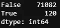**

**这里，在没有堆叠的情况下，在相同模型上的 102 个病例的比较中确定了 120 个阳性结果。**

```
**metrics_summary(y_test_original, y_pred_int_test_2_stack)**
```

**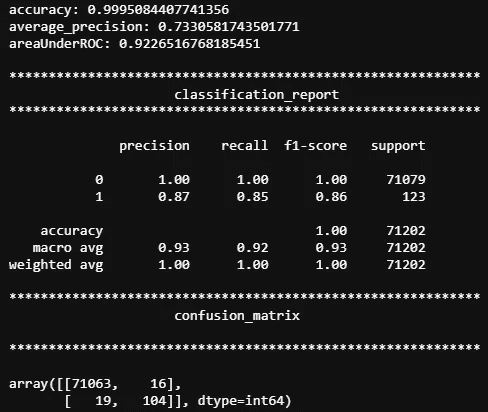****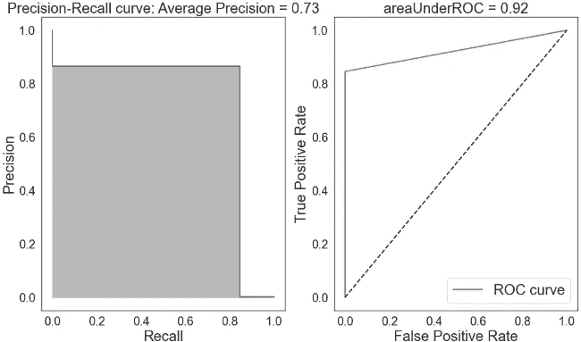**

**召回率从 0.77 提高到 0.85，f1 分数和平均准确率也有适度的提高。**

****2。第三款 DNN 作为第二款****

**如果我们把 DNN 作为第二个模型会发生什么？**

```
**model_3_stack = build_model_3(x_train_stack_, y_train_, \
                        x_cv_stack, y_cv_, input_dim=32)y_pred_prob_test_3_stack = model_3_stack.predict(x_test_stack)
y_pred_int_test_3_stack = y_pred_prob_test_3_stack > Threshold
y_pred_int_test_3_stack.shape
pd.DataFrame(y_pred_int_test_3_stack).value_counts()**
```

**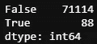**

**同样的模型，88 比 116，结果不太乐观，这表明精确度更高，召回率更低。**

```
**metrics_summary(y_test_original, y_pred_int_test_3_stack)**
```

**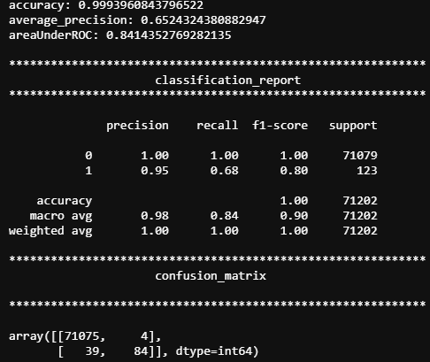****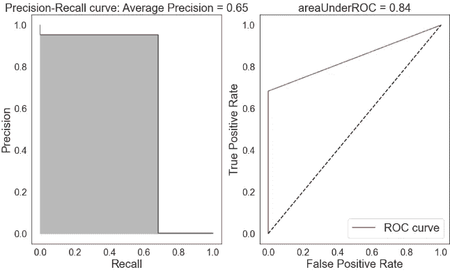**

**不出所料，精度更高(0.95)，但召回率很低(0.68)。**

****3。模型 1 作为二级模型的逻辑回归****

**没想到会有更好的结果，纯粹好奇。**

```
**model_1_stack = build_model_1(x_train_stack, y_train)model_1_stack.best_score_**
```

**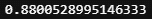**

**结果看起来很有希望。**

```
**y_pred_prob_test_1_stack = model_1_stack.predict_proba(x_test_stack)[:,1]# 0 and 1 two clases
y_pred_int_test_1_stack = y_pred_prob_test_1_stack > Threshold
pd.Series(y_pred_int_test_1_stack).value_counts()**
```

**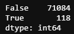**

```
**metrics_summary(y_test_original, y_pred_int_test_1_stack)**
```

**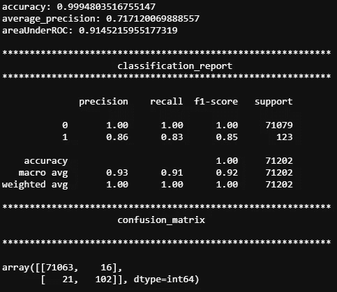****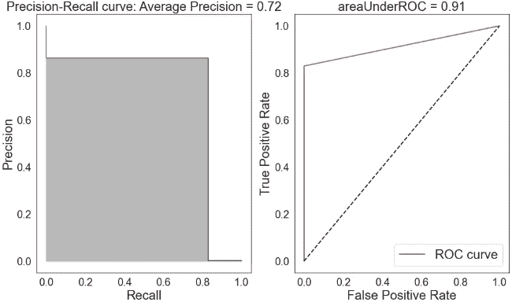**

**几乎所有的指标都有或多或少的改进，实际上，与 lightBGM 或 DNN 作为第二个模型相比，结果并不太差。**

**现在，让我们去元标签。**

# **元标记**

**因为元标记将需要向输入和标记添加新的特征。我写了另一个函数来处理这个问题。**

```
**def data_meta(id, x, y, model):
    #get prediction from model 1
    pred_prob_meta = model.predict_proba(x)[:,1]
    pred_prob_meta = pd.Series(pred_prob_meta, \
                               index=x.index,
                               name=f'pred_{id}_meta')
    pred_int_meta = pred_prob_meta > Threshold
    y_meta = pd.Series(y & pred_int_meta, name=f'y_train_meta_{id}')
    x_meta = x.join(pred_int_meta)

    return x_meta, y_meta pred_prob_meta = model.predict_proba(x)[:,1]
    pred_prob_meta = pd.Series(pred_prob_meta, \
                               index=x.index,
                               name=f'pred_{id}_meta')
    pred_int_meta = pred_prob_meta > Threshold
    y_meta = pd.Series(y & pred_int_meta, name=f'y_train_meta_{id}')
    x_meta = x.join(pred_int_meta)

    return x_meta, y_meta**
```

1.  ****第一个型号:logreg，第二个型号:lightBGM****

**准备好数据后，对于第一个实验，我将使用逻辑回归作为主要模型，lightBGM 作为次要模型。**

```
**x_train_meta_1, y_train_meta_1 = \
data_meta(1, x_train, y_train, model_1)
x_train_meta_1.shape, y_train_meta_1.shape**
```

**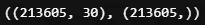**

**再次，让我们检查元数据的相关性。**

```
**plot_corr_xy(x_train_meta_1, y_train_meta_1);**
```

**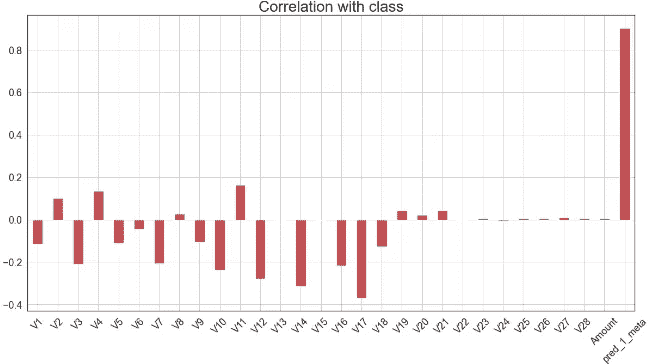******

**标签和添加的功能之间的相关性非常强(从模型 1 预测)。高皮尔逊相关系数表明更多的信息从第一模型泄漏到第二模型中。**

**现在，再一次，我们需要经历所有那些乏味但必要的数据处理。**

```
**# test data
x_test_meta_1, y_test_meta_1 = \
data_meta(1, x_test_original, y_test_original, model_1)
x_test_meta_1.shape, y_test_meta_1.shape**
```

**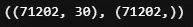**

**然后标准化测试和训练数据集。**

```
**x_train_meta_1, x_test_meta_1 = scale_data( \
                                x_train_meta_1, x_test_meta_1)**
```

**并拆分训练数据集以再次获得验证数据。**

```
**x_train_meta_1_, x_cv_meta_1, y_train_meta_1_, y_cv_meta_1 = \
train_test_split(x_train_meta_1, y_train_meta_1,
                test_size=0.25,
                stratify=y_train_meta_1,
                random_state=2020)
#stratify mean samplling with the ratio of each class percentage in #all data.x_train_meta_1_.shape, x_cv_meta_1.shape, y_train_meta_1_.shape,  y_cv_meta_1.shape**
```

**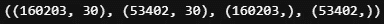**

**做完这些，我们终于可以去看模特了。**

```
**model_2_meta_1 = build_model_2( \
    x_train_meta_1_, y_train_meta_1_, x_cv_meta_1, y_cv_meta_1)y_pred_prob_test_2_meta_1 = model_2_meta_1.predict(x_test_meta_1)
y_pred_int_test_2_meta_1 = y_pred_prob_test_2_meta_1 > Threshold
pd.DataFrame(y_pred_int_test_2_meta_1).value_counts()**
```

**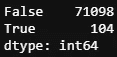**

**在我们有了元模型的预测之后，我们将结果与主模型的预测结合起来。**

```
**final_pred_2_meta_1 = y_pred_int_test_2_meta_1 &  y_pred_int_test_1
pd.DataFrame(final_pred_2_meta_1).value_counts()**
```

**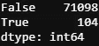**

**看起来没什么区别。让我们看看所有的指标。**

```
**metrics_summary(y_test_original, final_pred_2_meta_1)**
```

**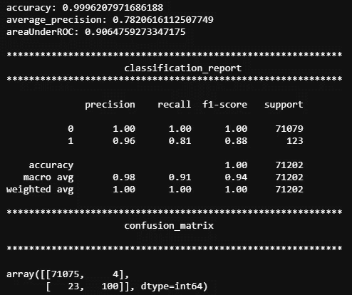****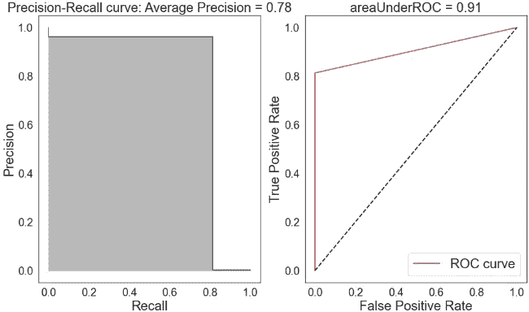**

**现在的结果在精确度和召回率之间更加平衡了。精确度、召回率和 f1 分数以及其他指标分别从 0.93、0.77、0.84 提高到 0.96、0.81、0.88。**

****2。第一款车型:logreg，第二款车型:DNN****

**由于第一个模型仍然是逻辑回归，所以不需要更新数据。我们直接去看模型吧。**

```
**#if you receive an error message, try to run the data process again.
model_3_meta_1 = build_model_3( \
    x_train_meta_1_, y_train_meta_1_, \
    x_cv_meta_1, y_cv_meta_1, input_dim=30)y_pred_prob_test_3_meta_1 = model_3_meta_1.predict(x_test_meta_1)
y_pred_int_test_3_meta_1 = y_pred_prob_test_3_meta_1 > Thresholdpd.DataFrame(y_pred_int_test_3_meta_1).value_counts()**
```

**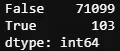**

**同样，最终结果将是主要预测和次要模型预测的交集。**

```
**# combine the  meta prediction with primary prediction
final_pred_3_meta_1 = y_pred_int_test_3_meta_1.flatten() & y_pred_int_test_1final_pred_3_meta_1.shape**
```

**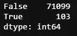**

**嗯，我真的开始怀疑最后一步的必要性了。**

******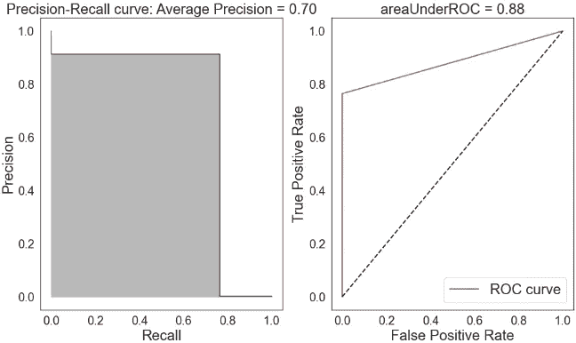**

**好吧，精确度确实提高了，但代价是召回率降低了。就像 DNN 作为第二个模型的堆叠方法一样，但是稍微好一点。**

****

**以 DNN 为第二模型的元标签**

****

**将 DNN 作为第二个模型进行堆叠**

****3。第一款:logreg + lightBGM，第二款:DNN****

**堆叠方法的工作方式让我想知道，如果我将模型 1 和模型 2 都作为主要模型，而将模型 3 作为最终模型，会发生什么？这会改善最终结果吗？让我们这样试一试。**

**因为这一次我们将有额外的功能需要添加到输入中，所以我重新编写了数据处理函数。**

```
**def data_meta_2(id, x, y, m_1, m_2):
    '''
    id: the id of new columns
    x: input features
    y: labels
    m_1: model 1, here logreg
    m_2: model 2
    '''
    pred_prob_meta_1 = m_1.predict_proba(x)[:,1]
    pred_prob_meta_1 = pd.Series(pred_prob_meta_1, \
                                 index=x.index,
                                 name=f'pred_{id}_meta')
    pred_int_meta_1 = pred_prob_meta_1 > Threshold

    pred_prob_meta_2 = m_2.predict(x)
    #as DNN give 2D prediction that needs to be flatten to 1D for
    #combination
    pred_prob_meta_2 = pd.Series(pred_prob_meta_2.flatten(), \
                                 index=x.index,
                                 name=f'pred_{id+1}_meta')
    pred_int_meta_2 = pred_prob_meta_2 > Threshold

    y_meta = pd.Series(y & pred_int_meta_1 & pred_int_meta_2, \
                       name=f'y_train_meta_{id}')
    x_meta = x.join(pred_int_meta_1).join(pred_int_meta_2)

    return x_meta, y_meta**
```

**然后，我们将该函数应用于训练数据和测试数据。**

```
**#meta_1_2: meta data from 1 model and 2 model
x_train_meta_1_2, y_train_meta_1_2 = \
data_meta_2(1, x_train, y_train, model_1, model_2)x_test_meta_1_2, y_test_meta_1_2 = \
data_meta_2(1, x_test_original, y_test_original, model_1, model_2)**
```

**并再次进行归一化。**

```
**x_train_meta_1_2, x_test_meta_1_2 = \
scale_data(x_train_meta_1_2, x_test_meta_1_2)**
```

**并分割训练数据以给出验证数据集。**

```
**x_train_meta_1_2_, x_cv_meta_1_2, y_train_meta_1_2_, y_cv_meta_1_2 = \
train_test_split(x_train_meta_1_2, y_train_meta_1_2,
                test_size=0.25,
                stratify=y_train_meta_1_2,
                random_state=2020)
#stratify mean samplling with the ratio of each class percentage in #all data.x_train_meta_1_2_.shape, x_cv_meta_1_2.shape, \
y_train_meta_1_2_.shape,  y_cv_meta_1_2.shape**
```

****

**好，让我们在模型 3 上训练我们的数据。**

```
**model_3_meta_1_2 = build_model_3( \
    x_train_meta_1_2_, y_train_meta_1_2_, \
    x_cv_meta_1_2, y_cv_meta_1_2, input_dim=31)y_pred_prob_test_3_meta_1_2 = model_3_meta_1_2.predict(x_test_meta_1_2)
y_pred_int_test_3_meta_1_2 = y_pred_prob_test_3_meta_1_2 > Thresholdpd.DataFrame(y_pred_int_test_3_meta_1_2).value_counts()**
```

****

```
**# combine the  meta prediction with primary prediction
final_pred_3_meta_1_2 = \
y_pred_int_test_3_meta_1_2.flatten() & \
y_pred_int_test_1 & y_pred_int_test_2
pd.Series(final_pred_3_meta_1_2).value_counts()**
```

****

**很有可能，最后一步不会改变这个高度不平衡的数据集。让我们看看最后的分数。**

```
**metrics_summary(y_test_original, y_pred_int_test_3_meta_1_2)**
```

********

**将 DNN 作为第二个模型或独立的 DNN 与叠加法相比，所有指标都更好。但不如第二代的 lightBGM。**

****4。第一款:logreg + DNN，第二款:lightBGM****

**由于 lightBGM 作为第二个模型似乎比其他模型更好，这是我最不想尝试的组合。我们需要再次重新处理数据集。**

```
**#meta_1_3: meta data from 1 model and 2 model 
#process the train dataset
x_train_meta_1_3, y_train_meta_1_3 = \
data_meta_2(1, x_train, y_train, model_1, model_3)#meta_1_3: meta data from 1st model and 3rd model 
#process the test dataset
x_test_meta_1_3, y_test_meta_1_3 = \
data_meta_2(1, x_test_original, y_test_original, model_1, model_3)#normalize the dataset
x_train_meta_1_3, x_test_meta_1_3 = \
scale_data(x_train_meta_1_3, x_test_meta_1_3)#do a train, validation split
x_train_meta_1_3_, x_cv_meta_1_3, y_train_meta_1_3_, y_cv_meta_1_3 = \
train_test_split(x_train_meta_1_3, y_train_meta_1_3,
                test_size=0.25,
                stratify=y_train_meta_1_3,
                random_state=2020)**
```

**现在，我们可以开始训练我们的模型。**

```
**model_2_meta_1_3 = build_model_2( \
    x_train_meta_1_3_, y_train_meta_1_3_, \
    x_cv_meta_1_3, y_cv_meta_1_3)**
```

**并预测测试数据。**

```
**y_pred_prob_test_2_meta_1_3 = model_2_meta_1_3.predict(x_test_meta_1_3)
y_pred_int_test_2_meta_1_3 = y_pred_prob_test_2_meta_1_3 > Threshold
# combine the  meta prediction with primary prediction
final_pred_2_meta_1_3 = \
y_pred_int_test_2_meta_1_3 & \
y_pred_int_test_1 & y_pred_int_test_3.flatten()
pd.Series(final_pred_2_meta_1_3).value_counts(**
```

****

```
**metrics_summary(y_test_original, final_pred_2_meta_1_3)**
```

********

**结果比上一个好。**

****

**使用 LightBGM 作为第二个模型 logreg + DNN 第一个模型的元标签**

****

**将 DNN 作为第二模型 logreg + BGM 第一模型的元标签**

# **特征重要性**

**正如我们现在所知，堆叠和元标记有点像向训练数据添加额外特征的特征工程方法。但是这些增加的新功能与原来的功能相比有多重要。感谢 scikit-learn 中的`feature_importance()`函数，我们现在可以实现这个函数来了解这些特性的重要性。**

```
**def plot_feature_importance(model, X , importance_type = 'split'):
    feature_imp = pd.DataFrame({'Value':model.
                               feature_importance(importance_type),
                               'Feature':X.columns})
    f, ax = plt.subplots(figsize=(40, 30))
    ax.set_title(f'LightGBM Features Importance by \
                 {importance_type}', fontsize=75, fontname="Arial")     
    ax.set_xlabel('Features', fontname="Arial", fontsize=70)
    ax.set_ylabel('Importance', fontname="Arial", fontsize=70)  
    ax.tick_params(labelsize=50)

    sns.barplot(x="Value", y="Feature",
                data=feature_imp.sort_values(by="Value", 
                ascending=False), ax=ax)**
```

**根据定义，有两种重要类型，“分割”和“获得”。如果为“分割”，结果将包含该特征在模型中使用的次数。如果为“增益”，则结果包含使用该功能的拆分的总增益。让我们看看他们两个。**

```
**plot_feature_importance(model_2_meta_1_3, x_train_meta_1_3_)**
```

****

```
**plot_feature_importance(model_2_meta_1_3, x_train_meta_1_3_, 'gain')**
```

****

**两种重要性类型都表明元数据远比原始特征重要。我们可以看到，同样的结果也适用于我们的最佳模型。**

```
**plot_feature_importance(model_2_meta_1, x_train_meta_1_)**
```

****

```
**plot_feature_importance(model_2_meta_1, x_train_meta_1_, 'gain')**
```

****

# **高分的假象**

**根据特征重要性值，我们知道，从特征在模型中使用的次数(“分割”)和使用该特征的分割的总增益(“增益”)的角度来看，主模型的预测对第二个模型的结果影响最大。我们还知道，从相关图来看，主要模型的预测与标签(“类别”)具有非常高的相关性(~0.9)。**

**此外，我们知道将会有信息从主模型泄漏到第二模型，尽管这是优选的。**

**因此，如果从测试数据到训练数据有轻微的泄漏，泄漏的信息将通过上述方式被放大。像 DNN 这样的模特真的很擅长走捷径，挑选信息，给高分。**

**让我用代码展示给你看。**

```
**#normalize all the data in one go.
scaler = pp.StandardScaler()
data_x.loc[:, features_to_scale] = scaler.fit_transform(data_x[features_to_scale])#split training and testing dataset afterwards.
x_train_cv, x_test, y_train_cv, y_test = train_test_split(data_x, data_y, test_size=0.25,stratify=data_y,random_state=2020)**
```

**如果在将数据拆分为训练数据集和测试数据集之前一次性对所有数据进行归一化，则使用的平均值和标准差来自训练数据和测试数据。来自测试数据集的一些信息将与训练数据集共享，然后通过元标记放大。**

**使用逻辑回归和 DNN 作为主要模型，使用 lightBGM 作为第二模型，以下是测试数据的得分。**

********

**请注意，这些分数是由没有优化和默认设置的基本模型获得的。在数字上看起来不错，但对未知数据没用。**

# **摘要**

**总之，最好的结果是使用元标记，lightBGM 作为第二模型，logistic 回归作为主要模型。**

****

**将 BGM 作为第二模型、logreg 作为第一模型的元标签**

**稍加努力，我们可以取得更好的成绩。额外的提高可能看起来并不引人注目，但在一些比赛中，当第一名和第二名的分数如此接近时，这就是输赢的交易。**

**我想用我最喜欢的关于**指标**的两条定律来结束这篇文章:**

**"当一个度量成为目标时，它就不再是一个好的度量."**

**——[**古德哈特定律**](https://en.wikipedia.org/wiki/Goodhart%27s_law)**

**“社会决策中使用的量化社会指标越多，就越容易受到腐败的压力”**

**——[**坎贝尔定律**](https://en.wikipedia.org/wiki/Campbell%27s_law)**

# **参考**

1.  **[洛佩兹·德·普拉多的《金融机器学习的进展》简介](https://www.quantopian.com/posts/introduction-to-advances-in-financial-machine-learning-by-lopez-de-prado)**

**2.[衡量业绩:AUC (AUROC)](https://glassboxmedicine.com/2019/02/23/measuring-performance-auc-auroc/)**

**3.[盗版者的准确度、精确度、召回率和其他分数指南](https://blog.floydhub.com/a-pirates-guide-to-accuracy-precision-recall-and-other-scores/)**

**4.[平均精度](https://sanchom.wordpress.com/tag/average-precision/)**

**5.[如何用 Python 计算特征重要性](https://machinelearningmastery.com/calculate-feature-importance-with-python/#:~:text=Feature%20importance%20refers%20to%20techniques,at%20predicting%20a%20target%20variable.&text=The%20role%20of%20feature%20importance%20in%20a%20predictive%20modeling%20problem.)**