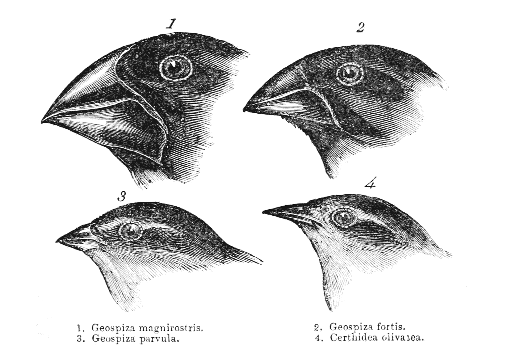
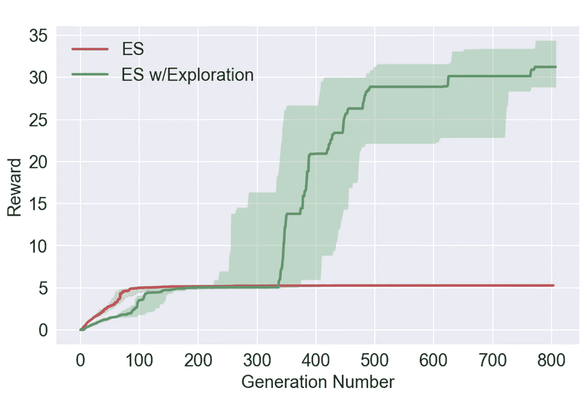
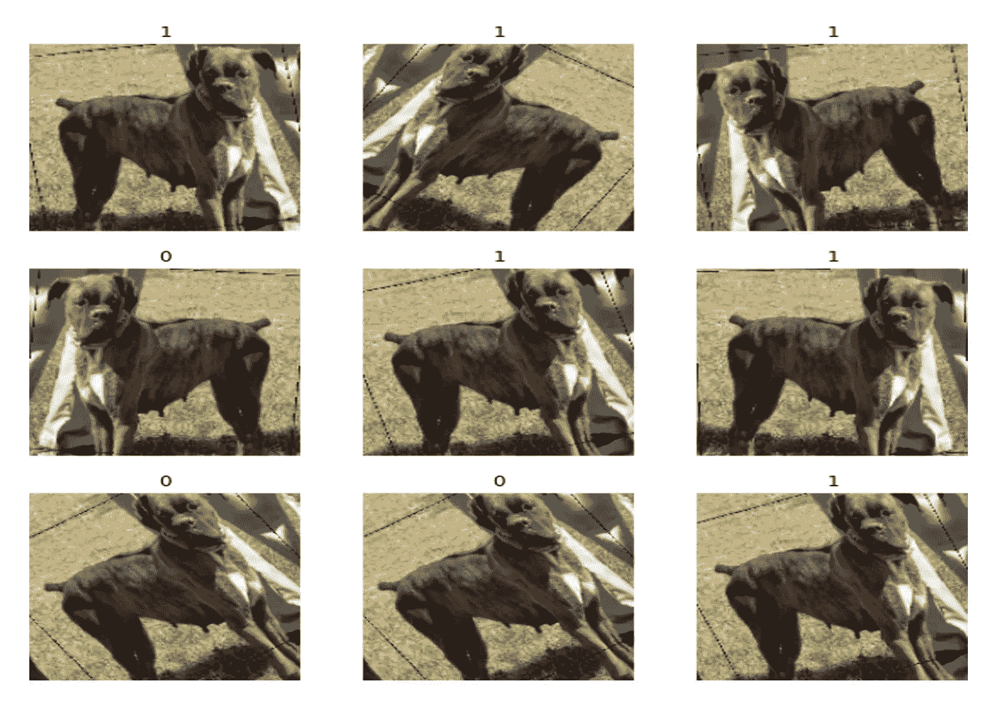
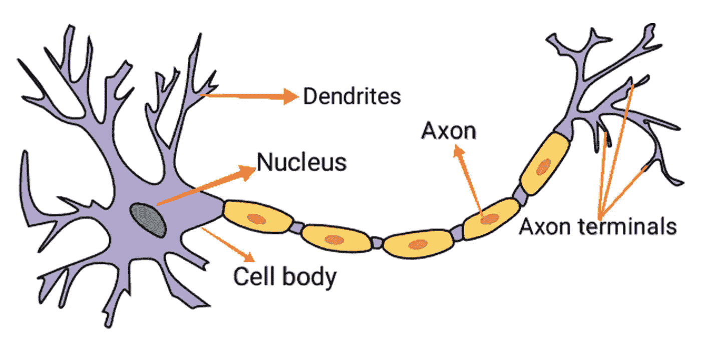
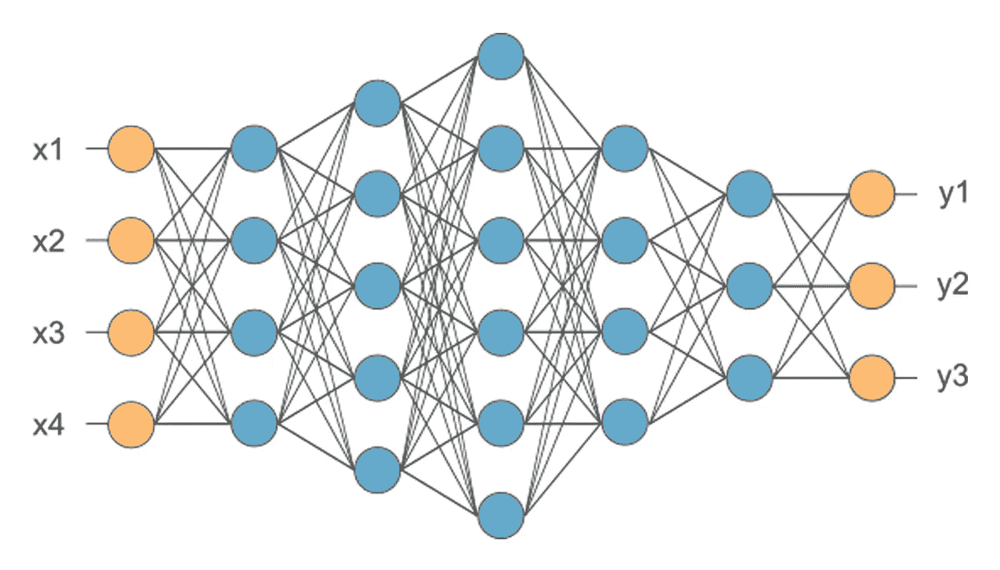

# 元学习:学会学习

> 原文：<https://towardsdatascience.com/meta-learning-learning-to-learn-a0365a6a44f0?source=collection_archive---------20----------------------->

## 元学习算法将来可能会改变

## 机器学习的广泛创新


米卡·鲍梅斯特在 [Unsplash](https://unsplash.com?utm_source=medium&utm_medium=referral) 上的照片

为了成功地理解和研究新概念或新观点，人们通常在日常生活中使用一个例子。

> 与机器相比，它们学习新技能的速度更快，效率更高；行动、想象和解释。

例如，看过几次蝴蝶和蚂蚁的孩子能很快认出它们。同样，掌握如何驾驶自行车的青少年很可能会通过有限的演示发现如何骑摩托车。然而，机器学习算法需要数百个模型来标记和训练，以提供类似的准确性。

## 介绍

在计算机科学中，元学习是机器学习的一员，可以定义为学会学习。它是一种自动算法，应用于元数据，以识别学习如何在解释困难时变得灵活，从而增强现有算法的性能或学习算法本身( **Thrun & Pratt，1998**； **Andrychowicz 等人，2016 年**

本研究从元学习过程的角度研究进化算法和神经网络的使用。首先解释进化算法的过程，以避免过度拟合，其次是神经网络的概念。最后，总结了进化算法和神经网络由于元学习技术的关系。

元学习算法通常使人工智能(AI)系统有效地学习，以更鲁棒的方式适应条件的变化，并推广到更多的任务。它们可以用来优化模型的架构、参数以及它们的组合。这项研究专注于一种称为**神经进化**的特定元学习技术，也称为学习神经架构的**进化算法**。

## 进化学说

进化生物学家查尔斯·达尔文几十年前参观了加拉帕戈斯群岛，并注意到一些鸟类似乎是从单一基因群体进化而来的。如图 1 所示，它们有着共同的标准特征，即它们独特的喙形，这源于它们独特的 DNA ( **Steinheimer，2004** )。

Steinheimer (2004)断言 DNA 是控制细胞复制的蓝图。假设是每个物种都退出到一个流行的自然选择理论中。这个过程是算法性的，可以通过创建进化算法来模拟。



图一。达尔文雀喙的多样性。图片来自[维基百科](https://en.wikipedia.org/wiki/Darwin%27s_finches)

此外，进化算法随机变异一些成员，试图找到更多合格的申请人。这个过程根据需要重复无数次迭代。实际上，在这种情况下，他们可以表示为几代人。这些步骤都受到达尔文自然选择理论的刺激。它们都是被称为进化计算的**算法的一部分。**

## 进化策略

目前，神经网络可以执行对人类来说可能具有挑战性的任务，如果它们提供大量训练数据的话。这些网络的最佳架构并不简单，需要进行大量的反复试验。事实上，研究人员一直在努力改进架构，这些年来，这些架构被逐步交付到更新的级别。

研究人员发现，一家著名的科技公司*优步*正在使用神经进化方法，他们开始采用**进化策略**通过与雅达利游戏相结合来帮助提高他们服务的性能。

> “甚至一个非常基本的几十年前的进化策略也提供了可比较的结果；因此，更现代的进化策略应该被认为是现代深度强化学习(RL)算法的潜在竞争方法”(**这样等人，2017⁴**；Chrabaszcz，Loshchilov &胡特，2018⁵ 。



*图二。标准策略和探索之间的性能结果比较。图片由* [*优步艾研究室 2017*](https://eng.uber.com/deep-neuroevolution/)

在图 2 中，*优步人工智能实验室*用几款雅达利游戏进行了测试。这个线形图描述了标准进化策略之间的比较以及对算法的进一步探索。似乎超参数中的各种调整给出了显著的奖励值。奖励金额的数量显著增加，从 0 到 30 以上。

在前 200 代数字中，两种策略中的奖励值都快速上升到 5，并稳定地保持在 300 代数字以上。然后，它从 320 代数量急剧增长到最大 800 代数量。

## 数据扩充

在当代工作中，深度学习模式的出现主要与收集的数据的数量和多样性有关。实际上，除了发现最新的数据存在之外，数据增强识别出用于训练模型的可用数据的显著增强的唯一性。数据扩充有几个例程，分别是*裁剪、填充、水平翻转*(图 3)。

这些技术经常被用于训练深度神经网络( **Shorten & Khoshgoftaar，2019⁶** )。事实上，大多数神经网络的训练时间策略都使用基本类型的数据扩充。



图 3。使用裁剪、填充和水平翻转的数据扩充示例。图片由 [Keras](https://keras.io/guides/transfer_learning/)

> “使用 CIFAR-10 数据集，我们的模型获得的最佳分类精度不在前 10 种方法之列。这使得所提出的架构成为嵌入式系统的理想选择，而不是性能最佳的方法”(**恰利克&德米尔西，2018⁷** )

尽管如此，*加拿大高级研究所(CIFAR-10)* 用*卷积神经网络(CNN)* 成功应用了图像分类问题。此外， **Cubuk、Zoph、Mane、Vasudevan 和 Le (2019)⁸** 解释了数据集上的最新精度，如具有自动增强功能的 CIFAR-10 是一种创新的自动数据增强方法。

**李，周，陈，李(**)研究表明，元学习的研究通常集中在数据和模型设计上，元学习优化器、*随机梯度下降(SGD)* 等例外情况似乎仍然属于模型优化的范畴。在图像数据的环境中，数据扩充是最容易识别的。这些图像放大通常涉及水平翻转和小幅度的旋转或平移。

## 讨论

在两个相互交织的过程中，即生命间学习和生命内学习，存在着一种综合的相互作用。把生命间的学习看作是通过自然选择的进化过程。相比之下，生命内学习与动物在其整个存在过程中如何学习有关，例如**识别物体、学习交流和行走**。

此外，进化算法可以反映为生命间的学习，而神经网络可以被认为是生命内的学习。进化算法和神经网络很可能是在**深度强化学习**技术中实现优化算法的主要因素。

## 进化算法

Bingham，Macke 和 Miikkulainen (2020) ⁰ 强调进化算法有四个主要特征，即网络层数、每层神经元数、激活函数和优化算法。

这些开始于用随机权重初始化多个神经网络，以生成群体。接下来是使用图像数据集训练每个网络的权重，然后测试它在分类测试数据方面的表现有多强。此外，另一个特征是在测试集上应用分类精度并实现适应度函数来决定得分最高的网络作为下一代的成员。

另一方面，进化算法过滤掉表现最差的网络并将其淘汰。最后，它们的特点是选择一些得分较低的网络，这在优化网络时在局部最大值中可能是有价值的。这些技术是**防止过度适应**的一种进化方式。

## 神经网络

神经网络试图模拟生物神经系统的信息处理能力，如图 4 所示。人体由数万亿个细胞体组成，被称为细胞核的神经系统细胞被训练通过电化学手段传递消息或信息。



图 4。生物神经人脑系统。图片由[艾商](https://aibusiness.com/)

简单来说，神经网络是连接的输入和输出单元的集合，其中每个连接都有一个关联的权重(图 5)。神经网络通过混合来自其母网络的随机参数集合来生成新网络。一个实例可以有相同数量的层作为一个原点，而它的其余参数来自不同的父对象。这个过程反映了生物学在现实生活中的工作方式，并帮助算法收敛到一个优化的网络上。

随着网络参数复杂性的增加，进化算法产生指数级加速。 **Krizhevsky、Sutskever 和 Hinton (2017)** 提到这个过程需要大量的数据和计算能力，并使用数百个 GPU 和 TPU 数天。它被初始化为 1000 个相同的没有隐藏层的卷积神经网络。然后通过进化过程，准确率较高的网络被选为父代，复制和变异产生子代，其余的被淘汰。



图 5。神经网络图。图片由 [MC 提供。艾](https://mc.ai)

在后来的实践中，神经网络利用了一组固定的重复模块，称为细胞。细胞的数量保持不变，但每个细胞的结构随着时间的推移发生了变化。他们还决定使用一种特定的正则化形式来提高网络的准确性。

他们没有淘汰得分最低的网络，而是排除了最老的网络，不管它们得分多高，最终提高了准确性，并从头开始训练。这种技术选择神经网络，当它们与进化算法一起被重新训练时，保持准确。

## 结论

> 元学习是学会学习的过程。此外，人工智能(AI)优化了一个或多个其他 AI。

这项研究的结论是，进化算法使用来自进化手段的概念，并模仿查尔斯·达尔文假说，例如，突变和自然选择，来解释复杂的难题。

相反，一种称为神经进化的元学习技术可能利用进化算法来单独优化神经网络。尽管元学习目前非常流行，但在现实生活问题中利用这些算法仍然极具挑战性。

然而，随着不断进步的计算能力、专用的机器学习硬件和元学习算法的进步，这些可能会变得更加**可靠和值得信赖**。

```
**References**#1 [Learning to Learn](https://www.springer.com/gp/book/9780792380474)#2 [Learning to learn by gradient descent by gradient descent](http://papers.nips.cc/paper/6460-learning-to-learn-by-gradient-descent-by-gradient-descent)#3 [Charles Darwin’s bird collection and ornithological knowledge during the voyage of H.M.S. “Beagle”, 1831–1836](https://link.springer.com/article/10.1007/s10336-004-0043-8)#4 [Deep Neuroevolution: Genetic Algorithms Are a Competitive Alternative for Training Deep Neural Networks for Reinforcement Learning](https://arxiv.org/abs/1712.06567)#5 [Back to Basics: Benchmarking Canonical Evolution Strategies for Playing Atari](https://arxiv.org/abs/1802.08842)#6 [A survey on Image Data Augmentation for Deep Learning](https://link.springer.com/article/10.1186/s40537-019-0197-0)#7 [Cifar-10 Image Classification with Convolutional Neural Networks for Embedded Systems](https://ieeexplore.ieee.org/document/8612873)#8 [AutoAugment: Learning Augmentation Strategies From Data](http://openaccess.thecvf.com/content_CVPR_2019/html/Cubuk_AutoAugment_Learning_Augmentation_Strategies_From_Data_CVPR_2019_paper.html)#9 [Meta-SGD: Learning to Learn Quickly for Few-Shot Learning](https://arxiv.org/abs/1707.09835)#10 [Evolutionary Optimization of Deep Learning Activation Functions](https://arxiv.org/abs/2002.07224)#11 [ImageNet classification with deep convolutional neural networks](https://dl.acm.org/doi/10.1145/3065386)
```