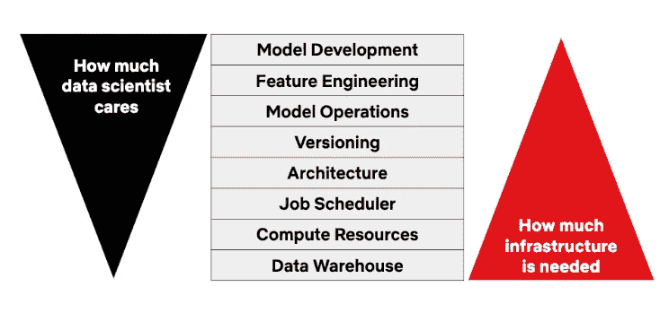
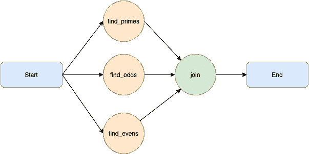
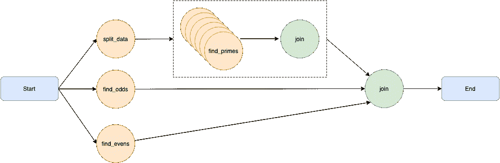

# 元流:构建和管理现实生活中的数据科学项目

> 原文：<https://towardsdatascience.com/metaflow-build-and-manage-real-life-data-science-projects-1bd5f9a07acd?source=collection_archive---------18----------------------->

## 不需要数据操作；独立构建、改进、运营和部署端到端数据工作流。

> [Learning Rate](https://mailchi.mp/d2d2d4a109b5/learning-rate-newsletter) 是为那些对 AI 和 MLOps 的世界感到好奇的人准备的时事通讯。你会在每周五收到我关于最新人工智能新闻和文章的更新和想法。订阅[这里](https://mailchi.mp/d2d2d4a109b5/learning-rate-newsletter)！

如今，数据科学家可以利用他们掌握的工具做任何事情。主要云提供商提供对象存储架构和流行的 SQL 数据库管理系统作为服务，基础架构管理只需一个配置文件，调度程序可以随时随地执行任何作业。

然而，这些都不容易设置，不容易利用其优势并在其上构建。在数据科学的世界里，你很少遇到对 DevOps 工具感到舒适的人，甚至很少遇到愿意自学的人。

数据科学项目的层次

这是*元流*试图缓解的问题之一。它提供了一个以人为中心的框架，帮助科学家和工程师构建和管理现实生活中的数据科学项目。该框架最初在网飞开发，并在 AWS re:Invent 2019 上开源。

AWS re:Invent 2019 上的 Metaflow 演示

在这个故事中，我们将介绍元流的基本概念，并提供展示其潜力的简单代码示例。

# 基本原则

元流遵循数据流编程范式，其中程序被设计为一个有向图，数据从一个操作移动到下一个操作。这种设计很自然地出现在数据科学项目中，其中管道的概念是一种合理且常见的抽象。Metaflow 还自动负责版本控制，并提供了一种简单的、声明性的方式来管理依赖性和计算资源。

在接下来的部分中，我们将考虑一个简单的实验，我们创建一个随机数据集作为一个数字数组，并对其执行若干操作。我们将讨论如何使用简单的线性流程，以及如何并行化工作，以利用可用资源并提高性能。

## 线性流动

线性流动是最直接的过渡类型。数据以连续的方式从一个操作流向下一个操作。

线性流动

首先，每个流必须有一个*开始*和一个*结束*节点。因此，元流运行将寻找一个开始节点来启动执行，并寻找一个结束节点来标记终止。每个节点都被认为是一个*步骤*，并在代码中如此标注。

在下面的例子中，我们在开始节点初始化一个随机数据集，在中间节点计算它的平均值，在结束节点打印结果。

在这个简单的线性示例中，您将看到如何定义步骤，使用`self.next()`方法和之前计算的参考变量从一个步骤前进到下一个步骤。

要运行这个作业，您可以在终端中执行`python metaflow_1.py run`,预计计算时间不到一秒。当然，这是为了展示 Metaflow 的一些基本功能，并不是什么有价值的东西。让我们来看一个更复杂的例子。

## 创建分支

为了创建一个更复杂的示例，让我们定义一个数字数组并执行三个操作:

*   找出数组中的质数
*   找出数组中的奇数
*   找出数组中的偶数

我们希望并行执行这些操作；因此，我们需要在图中创建分支。最终的数字应该如下图所示。

元流分支

元流可以在分布式环境中的多个 CPU 内核或多个实例上执行并行操作。最后，每一步都必须结合起来，以产生一个统一的结果，我们可以把这个流程传递下去。现在，让我们用 python 来实现它。首先，我们定义一些方便的函数，以便能够找到素数、奇数和偶数。

接下来，我们可以在图表中调用这些函数。

通过在`self.next()`方法中传递三个参数，我们让 Metaflow 知道我们想要并行调用这些操作，创建一个分支。最后，我们必须加入每个分支操作的结果。因此，我们需要从分支内部的每一步指向`self.join`方法。

`join`方法接受一个额外的参数`inputs`。这个变量是一个`object`，它存储来自每个分支操作的结果。使用这个对象，您可以以一种简单的、面向对象的方式检索每个操作的变量。

也就是说，我们有两个问题。首先，查找质数的函数并没有得到最佳实现。但这是故意的，这样我们就可以有一个执行时间更长的方法。

第二个问题是搜索奇数和偶数的两个函数会立即返回结果。因此，并行化这些操作不会给我们带来任何好处。相反，我们的代码的性能比简单的顺序方法更差，因为我们必须考虑元流图带来的开销。事实上，一个简单的 python 脚本需要大约 2 分钟来返回结果，而在我的设置中，Metaflow 脚本要多花 20 秒。那么，我们能做得更好吗？当然啦！我们可以任意嵌套树枝！

## 为每一个

如果我们能进一步并行化素数搜索会怎么样？我们可以。在 Metaflow 中我们可以任意嵌套分支，也就是说，你可以在一个分支内部分支。考虑到这一点，让我们再次设计我们的图表。

嵌套分支

缺少的是能够并行化负责动态查找素数的操作，并行化到本地可用的任意数量的 CPU 核心，或者分布式环境中的任意数量的机器。这就是`foreach`关键字的用武之地。下面我们可以看到实现这个图的 python 代码。

这个脚本中有两个新概念。首先，`Parameter`对象允许我们将选项传递给元流脚本。我们现在可以通过执行`python <file_name>.py run --cores 4`来运行这个脚本。这个选项将使用 NumPy 的便利函数`array_split()`把我们的数据集分成四个块。

`foreach`关键字为 iterable 中的每个元素创建一个并行执行。在这种情况下，为分割数据集中的每个数组创建一个并行操作。如果我们使用默认的数字`cores`，我们将数据集分成四个更小的集合，并并行执行`prime`方法四次。我们刚刚把执行时间缩短到 35 秒！

# 结论

Metaflow 是一个以人为中心的数据科学框架，最初由网飞开发。它旨在通过抽象基础设施细节并为开发人员提供一种直观的方式来构建他们的程序，从而促进构建和部署现实生活中的数据科学项目的过程。在这个故事中，我们展示了当地的故事，它的能力。准备好在 AWS 上投入并扩展您的数据科学项目了吗？从官方网站上的[教程](https://docs.metaflow.org/getting-started/tutorials)部分开始。

> **我叫 Dimitris Poulopoulos，是希腊比雷埃夫斯大学***[**BigDataStack**](https://bigdatastack.eu/)***的机器学习研究员和博士(c)。我曾为欧洲委员会、欧盟统计局、国际货币基金组织、欧洲中央银行、经合组织和宜家等主要客户设计和实施人工智能和软件解决方案。如果你有兴趣阅读更多关于机器学习、深度学习和数据科学的帖子，请在 twitter 上关注我的*** *[**中**](https://medium.com/@dpoulopoulos) **、**[**LinkedIn**](https://www.linkedin.com/in/dpoulopoulos/)**或**[**@ james2pl**](https://twitter.com/james2pl)**。****