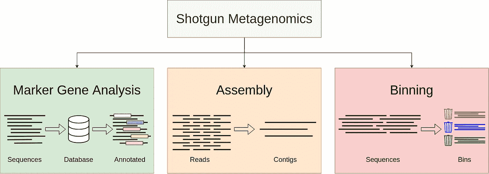

# 宏基因组学——谁在那里，他们在做什么？

> 原文：<https://towardsdatascience.com/metagenomics-who-is-there-and-what-are-they-doing-9f204342eed9?source=collection_archive---------13----------------------->

## 深入了解微生物群落的数据

你知道你的身体里藏着大约 100 万亿个细菌吗？据估计，一个人的肠道(胃)里大约有一两磅细菌[1](现在不要去喝所有你知道的抗生素来杀死这些细菌。事实上，这些细菌在我们的新陈代谢和免疫系统中起着重要的作用)。你家后院也是一样。土壤中可能生活着许多种类的细菌，它们有助于丰富土壤(例如:*硝化细菌*产生植物所必需的硝酸盐)。这些微观群落有非常多样的生态系统，研究它们的组成和行为可以为我们提供有价值的见解。在这篇文章中，我将提供一个关于**宏基因组学**的基本介绍，宏基因组学是对从微生物群落中获得的遗传物质的研究。

图片来自[阿雷克索查](https://pixabay.com/users/qimono-1962238/?utm_source=link-attribution&utm_medium=referral&utm_campaign=image&utm_content=3658992)来自[皮克斯拜](https://pixabay.com/?utm_source=link-attribution&utm_medium=referral&utm_campaign=image&utm_content=3658992)

# 什么是宏基因组学？

> 宏基因组学是将现代基因组技术直接应用于研究自然环境中的微生物群落，而不需要对单个物种进行分离和实验室培养[2]。

不同的微生物群落可以在土壤、海洋、泥浆、森林、太空甚至人体中找到。可以在这些环境中发现的微生物可以包括细菌、病毒/噬菌体、微生物真核生物(例如:酵母)和蠕虫(例如:蠕虫和线虫)。

# 为什么是宏基因组学？

现在你一定想知道我们怎么能研究这些我们甚至看不见的微小生物。研究它们的传统方法是获取样本，将它们放在培养皿中，观察是否有任何东西生长，分离培养物，然后进行[测序](/dna-sequence-data-analysis-starting-off-in-bioinformatics-3dba4cea04f)。然而，大多数细菌物种不能用这种传统方式培养。所以在宏基因组学中，我们所做的是直接从微生物群落中获取样本，并对它们进行测序。

宏基因组学有助于发现在医学、农业、能源、食品和营养等许多领域具有新功能的新型天然产物、抗生素和酶。

# 宏基因组学中的两个主要问题

每个宏基因组学研究都会遇到两个主要问题[4]；

1.  ***谁在那里？***
2.  ***他们在做什么*** ？

当我们考虑问题“*谁在那里*”时，我们想要识别样本中存在的微生物种类。问题“*他们在做什么*”意味着我们必须确定他们的功能和行为。

# 猎枪与靶向宏基因组学

一旦你从环境中获得了样品，你就必须准备好样品库以便于分析。创建用于分析的库的两种当前方法是

1.  **靶向宏基因组学**:靶向多个生物体和样本共有的基因组的特定区域(例如:16S rRNA 和 18S rRNA)。它提供了更精确、更深入的数据，但可能会导致某些目标区域的不均衡扩增。
2.  **鸟枪法宏基因组学**:能够[测序](/dna-sequence-data-analysis-starting-off-in-bioinformatics-3dba4cea04f)你样本中的一切。它对所有生物来说都是完美的。它为基因内容(尤其是 [DNA](/starting-off-in-bioinformatics-dna-nucleotides-and-strands-8c32515271a8) )提供了更高的分辨率，但会产生非常复杂的数据集。

# 鸟枪法宏基因组分析

如图 1 所示，处理宏基因组数据集[4]有三种主要方法。

1.  **标记基因分析**:将序列与称为**标记基因**的分类学或系统发育学信息序列数据库进行比较，比较其相似性，并对序列进行分类学注释。最常用的标记基因是核糖体 [RNA](/starting-off-in-bioinformatics-rna-transcription-and-translation-aaa7a91db031) (核糖核酸)基因，它们只有一个拷贝，在微生物基因组中很常见。
2.  **宁滨**:将序列聚类到与分类组相对应的相似组中，例如种、属或更高级别。
3.  组装:将你的样本中所有的小序列放在一起，形成代表基因组的更长的序列。查看我的前一篇文章，获得关于排序和组装的基本概念。一篇更详细的文章将在未来发表。

图一。用于鸟枪法宏基因组学分析的方法

# 靶向宏基因组学

为了进行靶向宏基因组学，从样品中提取遗传物质，并基于感兴趣的区域对感兴趣的基因进行 PCR 扩增[5]。为此目的最常用的基因是 **16S 核糖体 RNA** 基因。这个基因被称为“**通用系统发育标记**”。它存在于所有活的微生物中，包含一个单一的拷贝。

图二。16S rRNA 分析的基本流程

让我们考虑人类皮肤的 16S rRNA 基因分析(图 2)的基本工作流程[6]。首先，采集样本，提取 DNA。接下来，对细菌 16S rRNA 基因进行 PCR 扩增，并对扩增的样品进行测序。最后，使用各种工具处理和分析得到的数据。我们可以确定微生物群落的操作分类单位(OTUs)、群落结构和功能角色。

两个著名的 16S rRNA 分析流水线包括[**qime**](https://qiime2.org)和 [**Mothur**](https://www.mothur.org) 。

# 最后的想法

目前，我正在做与宏基因组学相关的研究。我读过的文章和我目前所做的事情启发了我写这篇文章。宏基因组学是一个相当新的领域，目前被认为是一个热门话题。我发现宏基因组学非常迷人，充满了研究问题和新发现。对于那些对追求生物信息学和计算基因组学领域的更高研究感兴趣的人，我希望你发现我的文章是一个有用的起点。

如果你错过了我的“**从生物信息学**开始”系列，你可以阅读下面列出的链接中的文章，以了解生物信息学的基础知识。

 [## 生物信息学入门

### 生物信息学这个词在当今的科学界正在发生巨大的转变。这个词似乎是由两个…

towardsdatascience.com](/a-dummies-intro-to-bioinformatics-e8212ed7c09b)  [## 从生物信息学开始——DNA 核苷酸和链

### 在我介绍生物信息学的第一篇文章中，我提到我们将会学到很多关于 DNA，RNA…

towardsdatascience.com](/starting-off-in-bioinformatics-dna-nucleotides-and-strands-8c32515271a8)  [## 从生物信息学开始——RNA 转录和翻译

### 在我之前的文章中，我已经介绍了 DNA 以及如何将 DNA 变成蛋白质。不要忘记检查它们，因为…

towardsdatascience.com](/starting-off-in-bioinformatics-rna-transcription-and-translation-aaa7a91db031)  [## DNA 序列数据分析——从生物信息学开始

### 在我之前的文章中，我已经介绍了 DNA、核苷酸及其排列的基础知识。你可能想知道…

towardsdatascience.com](/dna-sequence-data-analysis-starting-off-in-bioinformatics-3dba4cea04f) 

感谢您的阅读。我想听听你对这个新兴领域的看法。

干杯！

# 参考

[1]关于生活在你肠道中的微生物的 6 个令人惊讶的事实([https://www . health line . com/health-news/strange-six-things-you-not-know-you-Gut-Microbes-090713 # 1](https://www.healthline.com/health-news/strange-six-things-you-didnt-know-about-your-gut-microbes-090713#1))

[2]凯文·陈和利奥·帕切特。 *PLOS 计算生物学*微生物群落全基因组鸟枪法测序的生物信息学。第 1 卷 2005 年

[3] D.R .加尔萨和 B.E .杜蒂赫。从培养到未培养的基因组序列:宏基因组学和微生物生态系统建模*细胞和分子生命科学* (2015) 72: 4287

[4]托马斯·夏普顿。鸟枪法宏基因组数据分析导论。*植物科学前沿【2014 年 6 月 16 日*

[5]宏基因组学——概述|科学直接主题([https://www . science direct . com/Topics/biochemistry-genetics-and-molecular-biology/宏基因组学](https://www.sciencedirect.com/topics/biochemistry-genetics-and-molecular-biology/metagenomics))

[6]乔、肯尼迪和孔庆东。研究技术变得简单:皮肤研究中的细菌 16S 核糖体 RNA 基因测序。*皮肤病学调查杂志*第 136 卷，第 3 期，2016 年 3 月，第 e23-e27 页