# 基于机器学习的系统的变形测试

> 原文：<https://towardsdatascience.com/metamorphic-testing-of-machine-learning-based-systems-e1fe13baf048?source=collection_archive---------23----------------------->

## [理解大数据](https://towardsdatascience.com/tagged/making-sense-of-big-data)

## 测试自动驾驶汽车和其他基于 ML 的系统的技术

与传统软件相比，测试基于机器学习(ML)的系统需要不同的方法。对于传统软件，规范及其与实现的关系通常非常明确:“当用户键入有效的用户名和匹配的密码时，他们就成功登录了”。非常容易理解，具有确定性，并且易于编写测试用例。

基于 ML 的系统完全不同。基于 ML 的系统不是基于显式编程语句的明确定义的输入和逻辑流，而是基于潜在的巨大输入空间，这些空间具有来自大部分黑盒组件(模型)的概率结果。在本文中，我看一下*变形测试*，这是一种越来越流行的技术，用来解决一些基于 ML 的系统测试挑战。我将介绍一些最新的研究，并展示不同应用领域的例子。

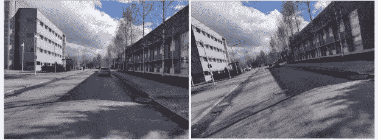

这两幅图像可用于表示 ML 系统的一些变形测试。请继续阅读，了解如何做到这一点..:)图片作者。

# 变质测试

变形测试(MMT)最初是在很久以前提出的，至少可以追溯到 [(Chen1998](https://arxiv.org/pdf/2002.12543.pdf) )。在软件测试研究领域工作了很长一段时间后，我一直将 MMT 视为一种好奇心，很少有真正的用例。然而，在基于 ML 的系统中，它似乎很好地找到了自己的位置。

MMT 的一般思想是根据输入之间的一般关系、这些输入及其输出的一般变换来描述系统功能，而不是作为特定输入到特定输出的映射。

过去用于变形测试的一个典型例子来自测试搜索引擎([例如，周 2016](http://www.logicsystems.org.in/Base%20Papers/2016%20Java/LSJ1681%20-%20Metamorphic%20Testing%20for%20Software%20Quality.pdf) )。由于搜索引擎现在实际上是基于自然语言处理(NLP)/ML 的系统，它们也很适合本文的主题。为了说明这个概念，我在谷歌上运行了两个查询(2020 年 10 月):

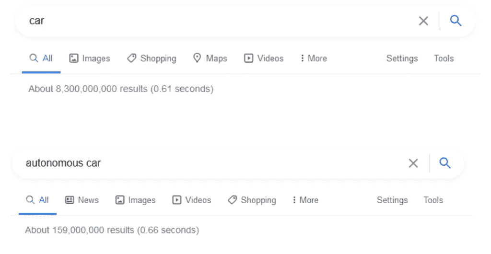

一个谷歌查询“汽车”及其细化版本“自动驾驶汽车”。图片作者。

第一个查询只是一个词“汽车”。第二个查询向第一个查询添加了另一个单词“autonomous”。所以现在查询变成了“自动驾驶汽车”。限制性搜索关键字的添加是输入*转换*(或“变形”，在精神或元*变形*测试中)的一个例子:

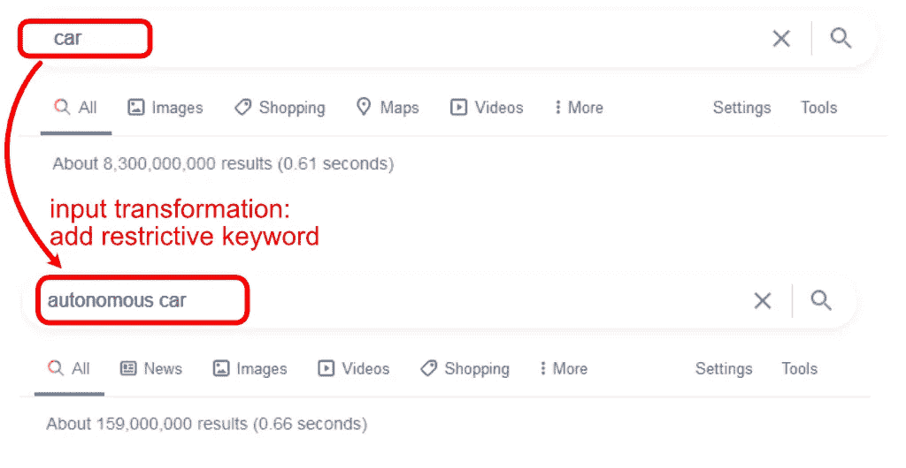

示例输入转换:将原始输入(查询)更改为更受限制。图片作者。

为了对测试结果进行检查(测试预言)，我们定义了一个匹配关系，当应用输入转换时，它应该保持:

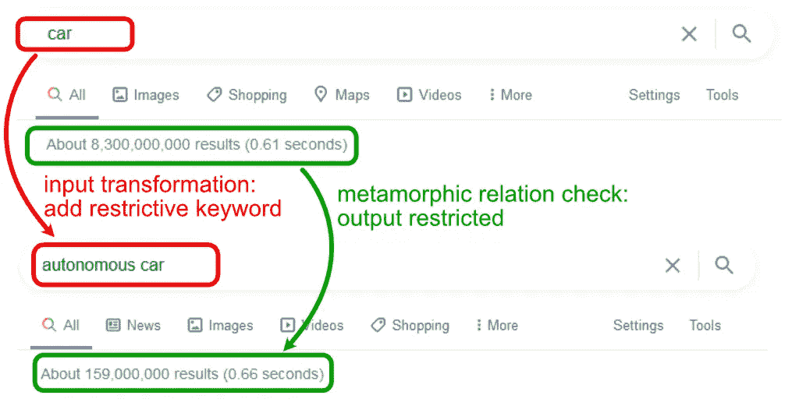

示例输出(变形)关系:限制越多的查询返回的结果越少。图片作者。

在这种情况下，将限制性搜索词(“autonomous”)添加到前面的查询(“car”)会改变结果集，将其限制在一个较小的集合中。从 83 亿个结果到 1.59 亿个。变形测试不会指定这些确切的值，而是指定关系“限制查询导致更少的搜索结果”。并且可以生成几个(种子)输入(搜索查询)、用于转换的相关限制性关键字，并运行查询和检查变形关系(限制查询产生较少的结果)。关于 MMT 与搜索引擎的更多详情，见( [Zhou2016](http://www.logicsystems.org.in/Base%20Papers/2016%20Java/LSJ1681%20-%20Metamorphic%20Testing%20for%20Software%20Quality.pdf) )。

以上是变形测试所指的一个例子。您以某种方式*转换* ( *变形*)您的输入，同时定义一个*关系*，该关系应该从先前的输入(及其输出)保持到新变形的输入(及其输出)。关键概念/术语是:

*   **变形/变换**:以你定义的变形关系应该保持的方式修改种子输入
*   **变胞关系**:输入的定义变换应该对输出有已知的/可测量的影响。检查转换后这种关系是否成立是变形测试的*测试预言*。( [*测试预言*](https://en.wikipedia.org/wiki/Test_oracle) 是对测试结果做出裁决的机制的总称)
*   **种子输入**:用作测试初始输入的输入，需要转换。如果您知道种子输入的输出，您可以使用它来定义一个更严格的关系(输出应该是正确的)。但是，即使没有种子输出，您仍然可以定义一个关系检查，但是可能会稍微宽松一些(输出应该是相似的，但是您不知道它是否正确)。

更一般地，变形测试是指定义这样的转换，并观察它们对结果的影响(变形关系)。有效性和适用性则取决于这些定义的完善和广泛程度。我将在接下来的章节中给出更多具体的例子。

# 问题空间

为什么要使用变形测试？我将用自动驾驶汽车的例子来说明这一点。自动驾驶汽车最近经历了大量的开发，获得了大量的资金，具有安全关键要求，并且高度依赖于机器学习。这可能也是为什么他们在 MMT 研究中受到如此多的关注。树立了很好的榜样。

例如，[特斯拉自动驾驶仪](https://www.tesla.com/autopilot)收集数据(或者在我写这篇文章的时候收集了数据..)从几个前置、后置和侧面摄像头，一个雷达和 12 个超声波传感器。在每个时刻，它必须能够处理所有这些数据，以及以前的测量结果，并提出符合最高安全标准的推理。这种真实世界的输入空间非常大。想想我在之前的办公室附近拍摄的两张相隔几天的照片:

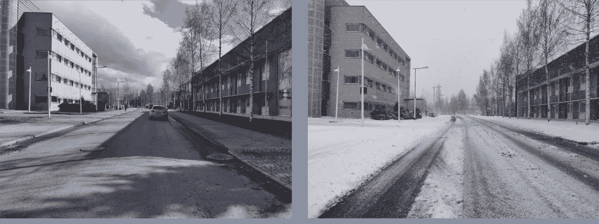

同一个地方，相隔几天。图片作者。

就在这两张图片中，可以看到许多变化。雪/无雪、阴影/无阴影、道路标记/无标记、连接道路可见、停车场可见、其他汽车等等。然而，在所有这些条件下，人们期望能够安全地航行。为了更好地说明这个问题，我很快想到了该领域的一些变体示例:

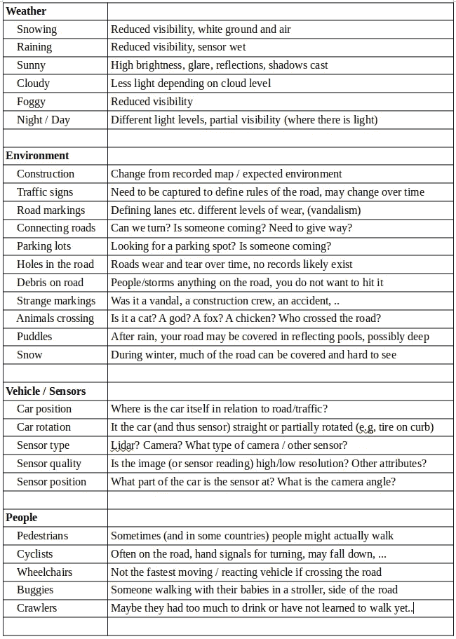

自主车辆中的 ML 算法需要考虑的几个项目示例。图片作者。

除此之外，人们可以很容易地将其扩展到不同的位置、道路形状、对象类型、桥梁、火车，...其他传感器有其他考虑，每个位置都不一样，等等。

在基于 ML 的系统应用的不同领域中，人们需要能够识别相似的问题场景，以及它们的相关组合，以便能够测试它们。手工构建测试集来覆盖所有这些(对我来说)是不现实的努力。

# 自动驾驶汽车的变形测试

变形测试可以帮助更好地覆盖领域，如上述自动驾驶汽车问题空间。由于人们对此很感兴趣，因此也提出了许多方法，我将在这里描述其中的一些。

## 覆盖图像变化

( [Tian2018](https://arxiv.org/pdf/1708.08559.pdf) )中的 DeepTest 工作使用从驾驶汽车中捕获的真实图像的变换来产生新的图像。在这种情况下，变形属性是:

*   **种子输入**:来自车载摄像头的真实图像。
*   **变形变换**:移动、倾斜、模糊、缩放、缩放、加雾、加雨等。论原始意象
*   **变形关系**:自动驾驶决策应在变换后的相同输入图像上显示最小的差异。

下面用一些简单的例子说明了这一点，这些例子使用的是我以前办公室外的道路图像。在下面，我通过简单地在这个位置旋转相机一点来“转换”图像。然后我添加了箭头来说明系统应该如何“预测”应该选择的路径。此处的箭头是手动添加的，仅用于说明:

换个角度看，现实世界的路径应该还是一样的(或者接近)。图片作者。

和同样的，但与雪域地面(两个转换在下面相比，上面；添加雪+旋转):

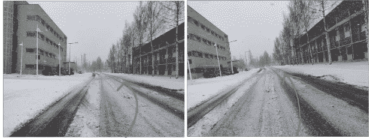

有雪和没有雪，路径应该是相同的(或接近的)。图片作者。

当然，没有人会期望手工创建大量这样的图像(或转换)。相反，可以使用自动化转换工具。例如，有几个用于图像增强的库，最初是为了帮助增加机器学习中的训练数据集大小而创建的。下图显示了在上面的原始非雪图像上运行的几个这样的增强:

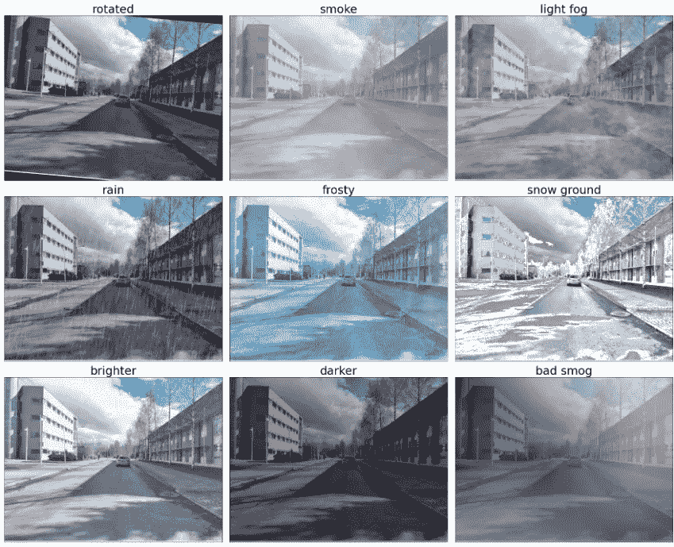

自动生成的早期道路图像的放大/变换。图片作者。

所有这些增强/变换的图像都是使用 Python [*imgaug*](https://imgaug.readthedocs.io/en/latest/) 图像增强库从之前显示的同一原始源图像生成的。有些也许可以用更先进的增强方法来改进，但大多数已经相当有用了。

一旦生成了这些变换，就可以检查生成的图像上的变形关系。例如，系统应该提出非常相似的驾驶路径，在加速、转向等所有变换上具有最小的差异。或者更复杂的检查，如果可以定义的话，例如定义已知的参考路径(如果存在的话)。

同样，这个*转换*和检查*变形关系*的过程就是 MMT 的目的。它通过自动化复杂系统的一些测试过程来帮助实现更高的覆盖率和可信度，否则很难扩展到大的输入空间。

## 基于氮化镓的 MMT 变换

生成输入转换的更高级的方法是应用不同的基于 ML 的技术来构建转换本身。在图像增强中，一种这样的方法是**(GANs)。GANs 在自动驾驶汽车上的应用见( [Zhang2018](https://arxiv.org/pdf/1802.02295.pdf) )。在他们的工作中，GANs 被训练在不同的天气条件下转换图像。例如，拍摄道路的晴天图像，并将其转换为雨天或雾天的图像。**

**理由是 GAN 生成的天气效果和操作比更传统的合成变换更真实。( [Zhang2018](https://arxiv.org/pdf/1802.02295.pdf) )使用[NVidia UNIT](https://github.com/mingyuliutw/UNIT)([Liu 2017](https://arxiv.org/abs/1703.00848))工具包训练和应用 GAN 模型，使用 YouTube 视频等输入进行训练。**

**说明 GAN 结果的图像可在[单位网站](https://github.com/mingyuliutw/UNIT)上获得，以及在他们的[谷歌相册](https://photos.google.com/share/AF1QipNCYGAA1lDqXIzEHlE7_s7jfN7LnR3-qMoUXF9coH-0FaDwEAEZjwGPbTedzA5V3w?key=emoyWmw3eWNrdjFZd1lYc2F5QWNtNDUwNDk1dWZR)中的更高分辨率。我推荐去看一看，挺有意思的。单位网站上的小图看起来很有说服力，但仔细观察相册中的大图会发现一些局限性。但是，成绩还是相当可观的，而且这还是几年前的事了。我希望随着时间的推移，这些技术会进一步改进。总的来说，使用机器学习来产生转换似乎是 MMT 中一个非常有前途的领域。**

# **激光雷达变换**

**除了摄像头，系统还可以使用许多可能的传感器。在自动驾驶汽车中，一个这样的系统是[激光雷达](https://en.wikipedia.org/wiki/Lidar)，使用基于激光的传感器测量到物体的距离。在([周 2019](https://cacm.acm.org/magazines/2019/3/234930-metamorphic-testing-of-driverless-cars/abstract) )中介绍了在[百度 Apollo](http://apollo.auto) 自动驾驶汽车系统中对激光雷达数据应用变形测试的研究。**

**该系统首先识别感兴趣区域(ROI)，即“可驾驶”区域。然后，它识别并跟踪该区域中的对象。该系统由多个组件组成:**

*   ***对象分割和边界识别*:发现并识别 ROI 中的障碍物**
*   ***物体跟踪*:跟踪障碍物(运动)**
*   ***顺序类型融合*:随着时间的推移平滑障碍类型(通过使用时间相关数据，随着时间的推移进行更一致的分类)**

**( [Zhou2019](https://cacm.acm.org/magazines/2019/3/234930-metamorphic-testing-of-driverless-cars/abstract) )研究侧重于对象识别组件的变形测试，特别是在激光雷达点云的微小变化中分类与误分类的鲁棒性。在这种情况下，激光雷达点云只是激光雷达系统报告看到的测量点的集合。这些云可以非常详细，测量的点的数量非常大( [Zhou2019](https://cacm.acm.org/magazines/2019/3/234930-metamorphic-testing-of-driverless-cars/abstract) )。**

**下图说明了这种情况(参见( [Zhou2019](https://cacm.acm.org/magazines/2019/3/234930-metamorphic-testing-of-driverless-cars/abstract) )对于来自实际汽车的逼真激光雷达图像，我在这里只是使用我自己的图纸来说明大致的想法。我用较深的颜色标记了感兴趣区域，并以圆形的方式添加了一些点来说明激光雷达扫描。绿色方框表示较大的障碍物(如汽车)，较小的红色方框表示较小的障碍物(如行人):**

**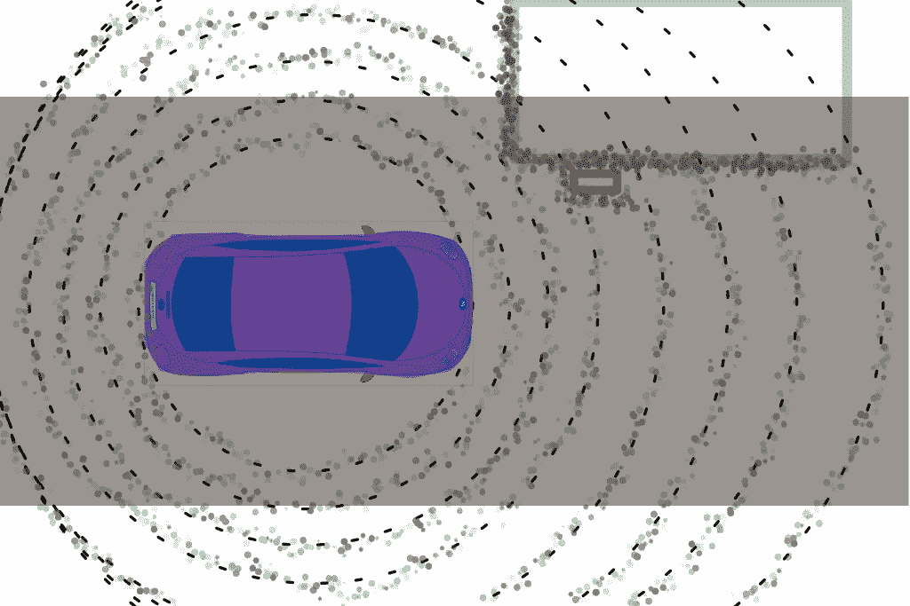**

**我的激光雷达图像的涂鸦:)。图片由作者提供，使用来自 [Pixabay](https://pixabay.com/vectors/car-vehicle-red-racing-game-145008/) 的[openclipbart](https://pixabay.com/users/openclipart-vectors-30363/)的汽车图片。**

**这种情况下的变形关系和转换是:**

*   ****变形关系**:在向激光雷达点云添加少量*噪声*之前和之后，应识别相同的障碍物(物体)。**
*   ****变换**:添加噪声(指向激光雷达点云)**
*   ****种子输入**:来自汽车的实际激光雷达测量**

**下图说明了这种类型的变形变换，添加的点用红色标记。我只是将它们添加到一个随机位置，在这种情况下，在 ROI 之外，因为这也是( [Zhou2019](https://cacm.acm.org/magazines/2019/3/234930-metamorphic-testing-of-driverless-cars/abstract) )中的示例:**

**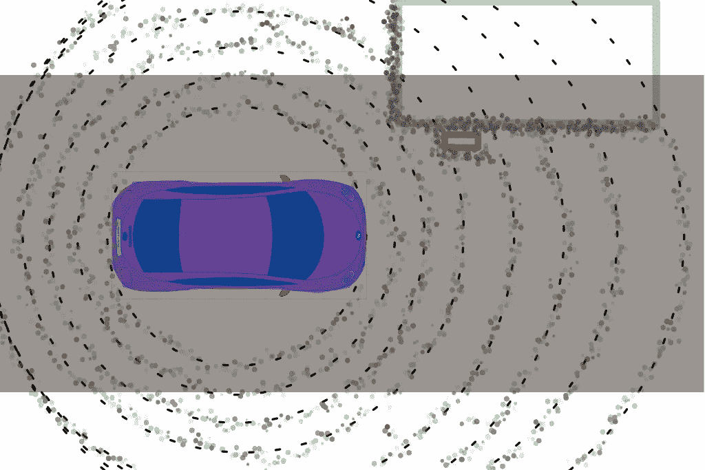**

**我用红色添加了点的转换激光雷达图像的涂鸦。图片由作者提供，使用了来自 [Pixabay](https://pixabay.com/vectors/car-vehicle-red-racing-game-145008/) 的[openclippart](https://pixabay.com/users/openclipart-vectors-30363/)的汽车图片。**

**上面是一个非常简单的转换和变形关系来检查，但我发现通常简单的工作最好。**

**总之，这里的 MMT 方法采用现有的激光雷达数据，并以添加的激光雷达数据点的形式向其添加一些*噪声*。与现实世界相比，这种噪声在( [Zhou2019](https://cacm.acm.org/magazines/2019/3/234930-metamorphic-testing-of-driverless-cars/abstract) )中被描述为潜在的昆虫、灰尘或传感器噪声。添加的噪波数量也被描述为占总点数的非常小的百分比，以使其更加真实。**

**( [Zhou2019](https://cacm.acm.org/magazines/2019/3/234930-metamorphic-testing-of-driverless-cars/abstract) )中的变形实验表明，在点云中的 ROI 区域之外添加少量点足以导致分类器(变形关系检查)失败。**

**因此，( [Zhou2019](https://cacm.acm.org/magazines/2019/3/234930-metamorphic-testing-of-driverless-cars/abstract) )报告与百度 Apollo 团队讨论了他们的发现，获得了对这些问题的承认，以及百度团队如何将一些测试数据纳入他们的训练数据集。这可能是一种有用的方法，因为变形测试可以被视为生成可用于训练的新数据的一种方式。然而，我认为在任何一种情况下都不应该简单地放弃测试，即使重新使用一些数据进行进一步的 ML 模型训练。稍后将详细介绍。**

# **机器翻译的变形测试**

**不是每个人都从事自动驾驶汽车，因此其他领域的例子对于更广泛的洞察力很重要。在自动驾驶汽车之外，用基于 ML 的 NLP 技术测试自动语言翻译近年来受到了一些关注(例如， [He2020](http://arxiv.org/abs/1907.08710) ， [Sun2020](http://arxiv.org/abs/1910.02688) )。我发现(He2020)的论文特别清晰明了，所以我在这里使用他们的方法作为翻译测试变形属性的示例:**

*   ****种子输入**:要翻译的句子**
*   ****转换**:将输入句子中具有特定词性(POS)标签的单词替换为具有相同词性标签的另一个单词。例如，一个动词与另一个动词。最后，使用另一个 NLP 模型(本例中为 [Google 的 *BERT*](https://en.wikipedia.org/wiki/BERT_(language_model)) )来“预测”一个合适的替换候选单词。**
*   ****变胞关系**:转换输出的结构应该与原始输入的原始翻译输出句子结构相匹配。大的偏差表明潜在的错误。测试 oracle 度量是原始输入与转换输入的自动翻译的输出句子结构的差异。**

**这里有一个使用[谷歌翻译](https://translate.google.com/)的说明性例子，以及我(当时)从这篇文章中挑选的一个句子。将这句话从英语翻译成芬兰语:**

**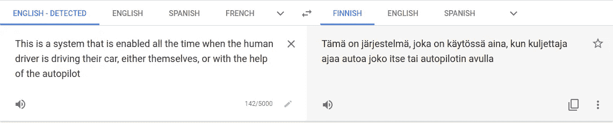**

**将一句英语翻译成芬兰语。图片作者。**

**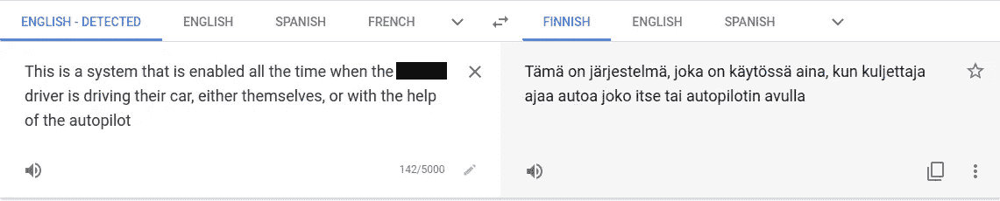**

**屏蔽一个单词(名词)进行变形转换。图片作者。**

**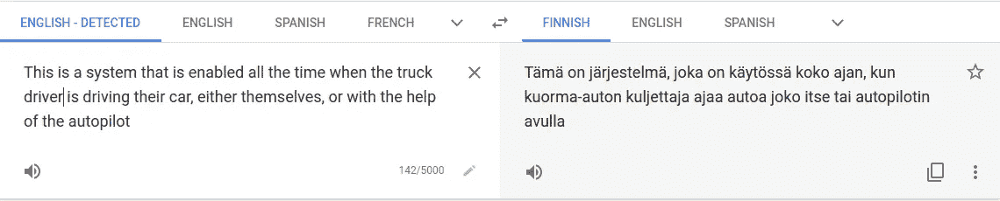**

**使用 BERT 预测一个单词来替换被屏蔽的单词(一个“适合”屏蔽的单词)。检查变胞关系是否成立。这里很好。你只需要相信我，我是芬兰人:)。图片作者。**

**上面显示了变形转换以及如何检查已定义的变形关系。在这种情况下，句子结构保持良好(在我看来，作为一个母语为芬兰语的人)，结果是好的。我手动执行了这些实验来说明这个概念，但是无论自动化与否，测试过程都是一样的。总的来说，尝试一些不同的句子，谷歌翻译实际上工作得很好。对他们来说很好。**

**老实说，我在上面的例子中并没有真正使用 BERT，因为这只是我需要用来说明这个概念的一个例子。我只是选了一个(对我来说)有意义的词。然而，如果需要的话， [HuggingFace](https://huggingface.co/transformers/model_doc/bert.html) 拥有 BERT 和许多其他类似模型的非常好且易于使用的实现。我自己也用它们完成过许多其他任务。与汽车示例中的图像增强库非常相似，NLP 库已经走过了漫长的道路，如今许多基本的应用程序都非常简单和容易。**

**关于机器翻译的 MMT 的更多细节，我推荐查阅论文，尤其是( [He2020](http://arxiv.org/abs/1907.08710) )是非常可读的。这里特别有趣的一点是，使用另一种基于 ML 的方法来帮助构建转换，类似于基于 GAN 的自动驾驶汽车方法。**

# **医学图像的变形测试**

**作为第三个应用领域的示例，在 [(Ding2017](http://bmlaser.physics.ecu.edu/literature/2017-4_A%20Machine%20Learning%20Based%20Framework.pdf) )中介绍了如何将变形测试应用于医疗领域中基于 ML 的系统。这使用 MMT 来测试现有高分辨率生物细胞图像的变体。**

**在 [(Ding2017](http://bmlaser.physics.ecu.edu/literature/2017-4_A%20Machine%20Learning%20Based%20Framework.pdf) )中，定义了许多与生物细胞(线粒体等)的各个方面相关的变形关系。)以及对图像进行的操作。我缺乏医学领域的专业知识来更详细地分析转换或变形关系，并且这篇论文没有非常清楚地为我描述这些。但我相信我的不了解在这里其实是很有用的一点。**

**这种情况下的变形测试相关元素(据我所知):**

****种子输入**:现有的医学图像(实际上，该论文在这一点上以及许多其他方面都非常不清楚，但它作为一个领域示例)**

****变换**:添加、删除、变换等。线粒体的数量。**

****变形关系**:变换后图像的算法输出中的元素(线粒体)之间的关系应与定义的关系相匹配(例如，在添加新的元素后连接一些元素)。**

**对我来说，这个例子强调了在许多情况下，细微差别、变形关系和转换需要深入的领域理解。这需要不同团体之间的广泛合作，这在应用基于 ML 的方法时很常见(以我的经验)。汽车、驾驶和语言翻译是我们都很熟悉的日常工作。许多专家领域，比如本例中的，就不那么好了。这就是为什么我认为这是一个有用的例子来突出我缺乏领域专业知识。**

**有趣的是， [(Ding2017](http://bmlaser.physics.ecu.edu/literature/2017-4_A%20Machine%20Learning%20Based%20Framework.pdf) )还提到使用传统的测试技术，如[组合测试](https://www.nist.gov/publications/combinatorial-testing)、随机化和[类别划分](https://en.wikipedia.org/wiki/Equivalence_partitioning)，来增强初始输入种子集。下面关于无人机的例子也是这种情况。**

# **无人驾驶飞机的变质试验**

**作为最后一个示例领域，在( [Lindvall2017](https://dl.acm.org/citation.cfm?id=3103632) )中介绍了一种结合基于模型的测试、仿真和变形测试的方法，用于测试自主无人机的基于 ML 的飞行制导系统。**

**无人机被定义为具有一组传感器，包括气压计、GPS、相机、激光雷达和超声波。许多传感器，非常类似于自动驾驶汽车的例子。为无人机控制定义的变形关系:**

*   **在相似的运行中，行为应该是相似的**
*   **世界坐标的旋转应该没有影响**
*   **坐标转换:不同坐标下的相同场景应该没有影响**
*   **障碍位置:不同位置的相同障碍应该有相同的路线**
*   **障碍形成:类似于位置，但多个障碍在一起**
*   **障碍物接近度:总是在规定的范围内**
*   **无人机速度:速度应该保持在规定的范围内**
*   **无人机高度:高度应该保持在规定的范围内**

**以下是这种系统变形测试环境的属性:**

*   ****种子输入:**基于模拟的环境模型，使用基于模型的方法生成**
*   ****转换:**见上图；无人机相对于环境和障碍物或障碍物群的旋转和坐标变化等**
*   ****检查:**参见上文**

**测试环境生成器用于定义无人机的(模拟)测试环境，有效地生成变形测试的种子。变形转换可以被视为对该环境的修改，并且最终检查测试上述定义的变形关系是否成立。定义了各种场景来将这些结合在一起，包括起飞、返回家园、着陆等。**

**也许这里最有趣的部分是使用基于模型的测试方法来构建种子输入本身，包括测试环境。这似乎是一个非常有用的方法，可以在可能的领域获得进一步的覆盖。**

**另一个相关的观察是使用场景将元素组合在一起形成一个更大的测试场景，也跨越时间。这很重要，因为无人机或汽车或许多其他系统不能孤立地考虑单个输入，而是必须考虑一系列事件，并将其用作上下文。在变形测试中也需要考虑这个时间方面。**

# **不同时间的对立输入和关系**

## **对抗性输入**

**机器学习中经常单独讨论的一种特定类型的转换是*对抗输入*，这在( [Goodfellow2018](https://cacm.acm.org/magazines/2018/7/229030-making-machine-learning-robust-against-adversarial-inputs/fulltext) )中有广泛描述。一般来说，对抗性输入旨在欺骗机器学习算法做出错误的分类。来自( [Goodfellow2018](https://cacm.acm.org/magazines/2018/7/229030-making-machine-learning-robust-against-adversarial-inputs/fulltext) )的一个例子是欺骗一辆自动驾驶汽车(surprise)将停车标志分类错误，并可能导致事故或其他问题。**

**产生这种对立的输入可以被看作变形转换的一个例子，具有相关的关系，即输出不应该由于对立的输入而改变，或者改变应该最小。**

**通常，这种对抗性测试需要特别定制的数据来触发这种错误分类。在真实的驾驶场景中，汽车传感器没有被篡改，可能更难产生这种纯粹的敌对效果。然而，也有一些研究和方法，如( [Zhou2020](https://arxiv.org/pdf/1812.10812) )将此考虑到现实世界的案例中。稍后会有更多的介绍。**

**除了自动驾驶汽车，数字化改变或定制的敌对输入可能是一个更大的问题。例如，在网络安全日志分析或自然语言处理等领域，提供定制的输入数据可能更容易。我还没有在现实世界中看到这方面的实际例子，但我希望一旦技术成熟，变得更容易获得，更多的实际观察将浮出水面。**

**许多关于对抗性元素的工作，如( [Goodfellow2018](https://cacm.acm.org/magazines/2018/7/229030-making-machine-learning-robust-against-adversarial-inputs/fulltext) )都有对抗性修改的单个输入(图像)的例子。真实的系统往往没有这么简单。例如，当汽车行驶时，图像(以及其他传感器数据)和需要基于该数据做出的决策会不断变化。这就是( [Zhou2020](https://arxiv.org/pdf/1812.10812) )这篇论文讨论的自动驾驶汽车。**

## **跨时间的关系**

**在许多情况下，除了单一输入之外，随时间推移的输入序列与基于 ML 的系统更相关。开车经过一个标志(或数字广告牌..)，随着时间的推移，系统必须处理与环境相关的所有不同位置处的所有传感器数据。在这种情况下，相机视角。对于其他传感器(激光雷达等)，输入和输出数据会随着时间以类似的方式变化。**

**下面是两个帧间隔很短时间的例子。在真实的视频流中，每秒会有大量的变化和图像(以及其他输入):**

**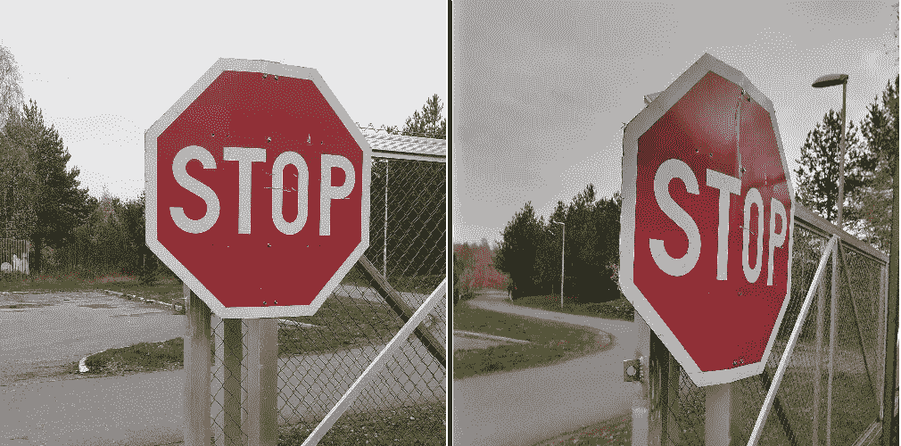**

**(相同)输入概念随时间的变化。图片作者。**

**不仅角度会改变，而且在这种类型的测试(和实现)中，时间作为一个上下文应该被更普遍地考虑。我们要经过标志了吗？朝着它？通过它？我们已经停下来了吗？场景里还有什么？诸如此类。**

**([周 2020](https://arxiv.org/pdf/1812.10812) )从对抗性输入生成的角度对这一话题进行了研究。在现实世界中，您不太可能直接操纵图像数据，但可能会受到修改后的交通标志、数字广告牌或类似设施上的敌对输入的影响。这是他们( [Zhou2020](https://arxiv.org/pdf/1812.10812) )关注的重点。**

**下面的例子说明了任何这样的修改也需要如何随着图像随时间而改变(与计算单个特定改变的输入相对于随时间移动的真实世界物理数据相比):**

**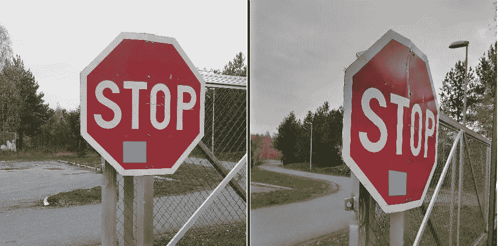**

**如果使用生成的对立元素进行测试，它们应该随着时间的推移相对于图像的其余部分发生变化。这里是蓝盒子的角度和大小。图片作者。**

**这种时间方面的重要性不仅仅体现在对抗性输入上。例如，我之前讨论的所有图像增强(天气效果等)都将受益于在真实驾驶场景(图像序列)中的应用，而不仅仅是一张图像。这毕竟是汽车在现实世界中必须面对的问题。**

**([周 2020](https://arxiv.org/pdf/1812.10812) )中的测试预言也从两个不同的角度考虑了对抗性输入的效果:*强度*和*概率*。也就是说，在对抗性变化的情况下，你可以在汽车的转向中引起多大的偏差，以及在对抗性输入的情况下，你可以引起这些偏差的可能性有多大。**

**除了汽车和视频流，时间序列在其他领域也很常见。讨论的无人机场景就是一个例子。其他示例包括处理链接的文本段落、股票市场中较长周期的信号，或者温度和风速等基本传感器信号。**

# **最小化测试集**

**虽然自动化变形测试可能非常简单(一旦你确定了你的领域关系并构建了工作转换…)，但是潜在的输入空间，转换的数量以及它们的组合可能会迅速增长。因此，MMT 中的测试选择很重要，就像其他类型的测试一样。**

**( [Tian2018](https://arxiv.org/pdf/1708.08559.pdf) )中介绍了一种解决这一问题的方法，该方法采用了贪婪搜索策略。从图像和转换的种子集开始，将转换及其组合应用于输入(图像)，并测量所实现的神经元激活覆盖。如果它们增加了覆盖率，只要它们提供了增加覆盖率的一些阈值，那么“好的”组合将与其他输入和转换一起被添加回种子集，以用于后续的回合。如此反复，直到定义了结束阈值(或实验次数)。非常类似于更传统的测试方法。**

**( [Tian2018](https://arxiv.org/pdf/1708.08559.pdf) )中的覆盖率是根据 ML 模型中不同神经元的激活来测量的。他们为不同的神经网络架构建立覆盖标准，例如卷积神经网络、递归神经网络和密集神经网络。还提出了可以使用的各种其他覆盖标准，例如在( [Gerasimou2020](http://arxiv.org/abs/2002.03433) )中关于评估不同神经元在分类中的重要性的标准。**

**当越来越多易于应用的工具可用于这种类型的 ML 模型覆盖度量时，这将是一种非常有用的方法。然而，我没有看到人们普遍编写他们自己的神经网络覆盖测量工具。**

# **与传统软件测试的关系**

**除了测试套件优化，更广泛地考虑 MMT 与整个软件和系统测试的关系也很重要。MMT 擅长于测试和验证基于 ML 的系统的许多方面，这些系统在本质上更具有概率性和黑箱性。至少获得对它们更高的信心/保证。**

**然而，即使在基于 ML 的系统中，ML-part 通常也不是单独工作的孤立组件。相反，它消耗输入，产生输出，并使用 ML 模型处理复杂的数据集。我前面提到的组合的、等价划分的和基于模型的方法是一些例子，说明了基于 MMT 的方法如何与整体的、更传统的系统测试一起应用。**

**正如我提到的百度阿波罗案例及其激光雷达测试数据生成，其中一个反馈是使用变形测试数据进行进一步的 ML 训练。总的来说，这似乎是一个有用的想法，获得更多的训练数据总是好的。根据我构建基于 ML 的系统和训练相关 ML 模型的经验，每个人总是想要更多的训练数据。**

**然而，我认为不应该简单地将所有 MMT 测试数据转储到训练数据集中。经过训练的模型将从给定的数据中学习，并且可以在分割测试集上测试一般准确性。这是孤立测试特定 ML 模型的典型方法。然而，在实践中，分类不会是 100%准确的，并且一些项目最终会被错误分类，或者具有低置信度分数。这些进一步馈入整个系统，结合其他输入或过程，可能会产生意想不到的反应。使用特定的输入运行特定的(基于或不基于 MMT 的)测试有助于准确地突出哪些数据导致了问题，这种行为如何随时间变化，等等。如果您只是将 MMT 测试放入训练集并忘记它，您将失去这种可见性的好处。**

**除了 MMT 之外，还有其他有趣的方法来为基于 ML 的系统测试定制传统的测试技术。一个具体的方法是 A/B 测试(评估不同选项的好处)。在基于 ML 的系统中，这也可以是从人类用户或操作系统回到测试和训练的反馈回路。[特斯拉阴影模式](https://www.forbes.com/sites/bradtempleton/2019/04/29/teslas-shadow-testing-offers-a-useful-advantage-on-the-biggest-problem-in-robocars/)是一个有趣的例子，其中基于 ML 的自动驾驶系统做出连续的驾驶决策，但这些决策从未被实际执行。相反，它们与在这些情况下的实际人类驾驶员选择进行比较，这用于改进模型。类似的方法很常见，系统可以从人类的纠正中学习，例如基于人类与系统的交互来调整搜索引擎结果和机器翻译。你也在改变/变形这个系统，但是以不同的方式。这也将成为 MMT 的一个有趣的种子输入源，以及变形关系的 oracle 数据(例如，人类用户采用的驱动路径)。**

# **结论**

**测试基于机器学习的系统是与更传统的系统不同的挑战。算法和模型没有明确的输入和输出规范，无法简单地测试和验证。两者的潜在空间往往相当巨大且嘈杂。变形测试是一种非常有用的技术，可以通过合理的努力获得对其操作的信心。与传统测试技术相比，它不是一种替代方法，而是一种补充方法。**

**在本文中，我给出了几个将 MMT 应用于不同领域的例子。虽然不同领域的应用需要不同的考虑，但我相信可以得出一些普遍有用的指导原则，以帮助在基于 ML 的系统上执行 MMT:**

*   ****变形转换**:这些不需要非常复杂，但是简单的就能带来很好的好处，比如给激光雷达云添加一些随机的点。考虑相同的输入在其预期的使用环境中会如何变化，以及这样的变化如何以最少(或合理)的努力作为转换来实现。**
*   ****变形关系:**为了建立这些关系，我们需要问我们如何改变 ML 输入，它应该对输出有什么影响？有时这需要深厚的领域专业知识来识别最相关的变化，例如在医学领域的例子中。**
*   ****测试预言:**它们检查所执行的转换是否产生了可接受的(有效的)输出。需要考虑诸如如何表示变化(例如，转向角变化、句子结构变化)、可能定义某些错误的概率、错误的严重性以及转换后潜在输出之间的距离度量(例如，转向角计算)。也就是说，这些值可能不是固定的，而是在一个*连续范围*内。**
*   ****时间关系:**在许多系统中，输入和输出并不是单一的，但是整个系统在一段时间内的性能很重要。这可能还需要问时间如何影响系统，以及在变形关系序列中应该如何考虑时间的问题。总体***测试场景*** 作为更广泛的上下文、时间相关和其他方面的提供者，在这里考虑是有用的。**
*   ****测试数据**:你能使用用户与系统的交互作为转换和变形关系的自动测试输入源吗？想想特斯拉阴影模式，谷歌搜索结果，以及来自环境和用户的输入，并使用对这些输入的反应。**

**正如一些例子所讨论的，我看到的一个有趣的趋势是使用基于 ML 的算法来为基于 ML 的系统产生或增强(基于 MMT 的)测试。在 NLP 领域中，这通过使用 BERT 作为工具来构建用于测试自然语言翻译的变形转换来显示。在自动驾驶汽车领域，通过使用基于 GAN 的网络来创建图像属性之间的转换，例如不同的天气元素和一天中的时间。**

**总的来说，ML 领域似乎仍在快速发展，MMT 已经有了一些有用的方法，并且有望在未来几年内有更成熟的工具。如果没有良好的工具支持来进行测试(数据生成、模型覆盖度量等)，找到具有所有这些专业知识(测试、机器学习、领域细节等)的人，并为每个系统重新实现它，似乎是一个相当大的挑战，如果没有良好的工具和方法支持，有时会是不必要的高强度工作。**

**今天就到这里，这太长了，所以如果有人设法读到这里，我会印象深刻:)。如果你有测试基于 ML 的系统的经验并愿意分享，我有兴趣在评论中听到和学习:)**