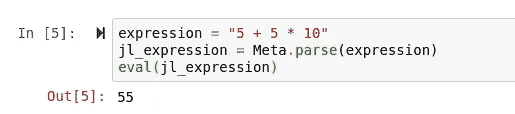
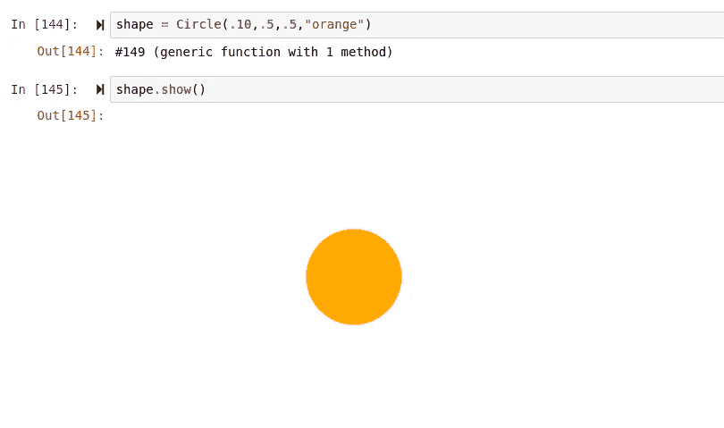
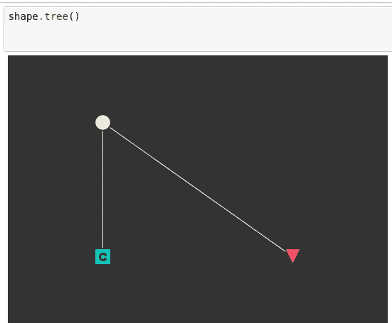
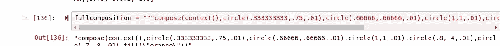
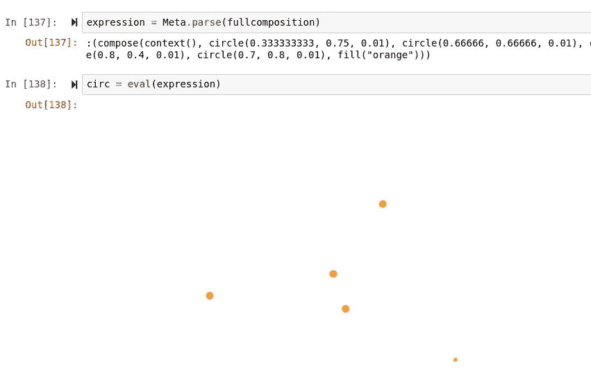
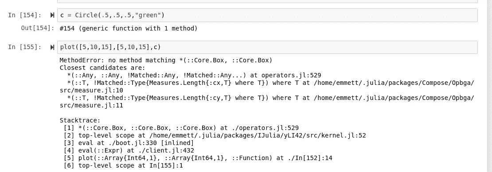
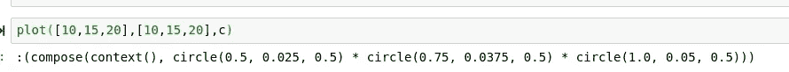
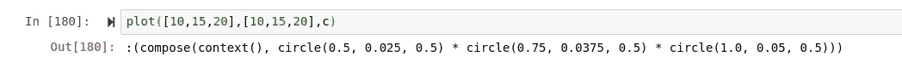

# 用 Julia 中的 Compose 对坐标解析器进行元编程

> 原文：<https://towardsdatascience.com/metaprogramming-a-coordinate-parser-with-compose-in-julia-a0d163c6fb21?source=collection_archive---------46----------------------->

## 在函数式编程语言中结合 Oop 和 Meta


(茱莉亚计算标识由[https://juliacomputing.com/](https://juliacomputing.com/)提供)

# 介绍

在 Julia 机器学习包王朝内部，特别缺乏好的绘图库。幸运的是，我很快就要为 Julia 发布我的第一个图形库版本 Hone.jl 了。Hone 非常酷，因为它使用了一种独特的面向对象编程的函数式方法，还使用了一些非常酷的元编程。

# 这个想法

> [(笔记本)](https://github.com/emmettgb/Emmetts-DS-NoteBooks/blob/master/Julia/Metaprogramming%20Compose%20Graphics.ipynb)

我对这个项目成果的愿景是用函数式语言进行面向对象的图形化。我想这样做的原因是在每个对象的基础上将函数与可变数据结合起来。这个想法的伟大之处在于，你可以将对象组合在一起，以获得完全自定义的绘图体验。如果我们要分别创建所有的对象，用 compose 将它们组合成一个矢量图形是不可能的。相反，我想使用元编程将元数据从一个对象传递到下一个对象，这样就可以通过命令以字符串的形式传输。

## 面向对象

为了将面向对象的范例引入到 Julia 中，我使用了一种我在车床. jl 上工作时熟悉的方法，您可以阅读更多相关内容

> 这里:

[](/how-im-using-functional-oop-for-machine-learning-533c1d764628) [## 我如何使用面向对象的函数来进行机器学习

### 我如何以及为什么将面向对象的范例应用于 Julia 机器学习。

towardsdatascience.com](/how-im-using-functional-oop-for-machine-learning-533c1d764628) 

为了完成这项工作，我们需要创建一个函数，用数据和函数构造一个未命名的类型。在 Julia 中，我们可以通过将这个短语添加到我们的函数中来实现，以便返回一个包含我们的方法的对象，作为存储在对象内部的数据。

```
 ()->(sttring;tree)
end
```

在定义了要放入类型的数据后，我们可以简单地将这个短语添加到函数中。

```
function printerobject(sttring)
    tree() = println(sttring)
    ()->(sttring;tree)
```

使用这种方法需要注意的一点是，Julia 求值中的类型赋值将创建一个包含数据的盒子，而不是创建一个包含数据的对象。这既是一件好事也是一件坏事，因为除了它所携带的数据之外，我们无法以任何其他方式来辨别这个物体的类型。为了减轻这个确切的问题，我决定去元。

## 元

如果有一件事在 Julia 中处理得绝对令人难以置信，那就是元编程。元编程是使用数据作为语法代码的编程。为了在 Julia 中这样做，您实际上不再需要像以前那样导入任何东西。现在不是做，

> 使用 Meta

你可以简单地使用包元。我喜欢这个，因为它保留了朱莉娅的分段。在 Julia 中进行元编程时，你真的只需要两个相对直接的方法。首先，您需要通过元解析器运行您的代码，以便将它转换成表达式。表达式是 Julia 中的一种类型，可以通过 eval 方法轻松计算。Julia 通过在符号类型中创建表达式并使用其中的代码作为数据来实现这一点。



# 零件


(src =[https://www.pikrepo.com/fprqp/brown-piece-of-puzzle](https://www.pikrepo.com/fprqp/brown-piece-of-puzzle)

规划项目的一个很好的方法是首先概述所有将一起工作以产生最终结果的组件。首先也是最重要的是物体，第一次我将使用一个标准的圆。最重要的是，对象需要能够存储元数据，不幸的是，元数据可能需要修改，所以必须是可变的。另一个核心组件将是圆组合成的对象，即情节本身。这是拼图的另一个关键部分，坐标解析器。坐标解析器需要从提供的数组中获取数据，并将其与我们的对象中包含的元数据相结合。

## 该对象

如前所述，我想为我的第一个物体画一个简单的圆。下面是我们可以使用 compose 制作一个圆的代码:

```
using Compose
compose(context(),circle(.5,.5,.1)))
```

在合成中，上下文只是一个合成的集中节点，该合成中的所有对象都附着于该节点。我们可以将这个组合写入对象的初始化函数中:

```
function Circle(diameter,x,y)
    composition = compose(context(), circle(x,y,diameter))
    ()->(composition)
end
```

这将输出一个只存储数据组合的新对象，但是通过一个简单的插件，我们可以添加显示我们的组合的能力:

```
function Circle(diameter,x,y,fillin)
    composition = compose(context(), circle(x,y,diameter))
    show() = composition
    ()->(show;composition)
end
```

现在我们可以使用 Circle.show()来显示我们的圆。



我想添加的另一个很酷的东西是能够查看这个组合中所有连接图形的树。为此，我们将像以前一样使用 introspect()方法:

```
function Circle(diameter,x,y,fillin)
    composition = compose(context(), circle(x,y,diameter))
    show() = composition tree() = introspect(composition)
    ()->(show;composition)
end
```



这里我们看到我们的组合，它连接到我们的上下文节点，然后是我们的形状。在这个树视图中，组合用桃点标记。现在我们已经完成了基础工作，我们应该将这个项目的元端添加到我们的新对象中。

## 元

为了理解我们需要在事物的元端完成什么，在通过百分比计算器运行数据后，我写了一个字符串，其中包含我们想要的内容，百分比计算器将在解析器中发挥作用。

```
using Base.Threads
# If we use .5 for x and y, notice how we get our return perfectly centered.
#    We use a percentage of the total length.
# Let's do one manually with those xs and ys.
"""This function will allow for automatic 
calculation of percentages for a coordinate plane"""
function percentagecalc(x,y)
    xmax = maximum(x)
    ymax = maximum(y)
    newx = []
    newy = []
    [@threads](http://twitter.com/threads) for i in x
        dim = i / xmax
        append!(newx, dim)
    end
    [@threads](http://twitter.com/threads) for i in y
        dim = i / ymax
        append!(newy, dim)
    end
    return(newx,newy)
end
```



通过元解析器运行它，然后对它进行评估。



> 我们的目标是自动创建该字符串。

我决定创建一个名为 update()的函数作为我们类型的子函数。

```
function Circle(x,y,diameter,fillin)
    composition = compose(context(), circle(x,y,diameter), fill(fillin))
   #     "compose(context(),circle(.5,.5,.1))
    tag = string("circle(",string(x),",",string(y),",",string(diameter),")")
    tree() = introspect(composition)
    show() = composition
    x = x
    y = y# ========================================================
    update(x,y) =  tag = string("circle(",string(x),",",string(y),",",diameter,")")# ==============================================
    (var)->(show;composition;tree;tag;x;y;update;diameter)
end
```

为了用来自散点图解析器的数据更新 x 和 y 的值，update 函数获取 x 和 y 并更新元标记。这似乎是正确的做法，但是这段代码会给我们带来一个小问题。

## 坐标分析器

我们的散点对象中最简单但最重要的部分是坐标解析器。首先，坐标解析器必须根据坐标平面内的最高值计算每个数字的百分比。许多图形 API 实际上都是这样做的，其中屏幕被划分为百分点，缩放是通过将一个位置除以分辨率来实现的，以获得屏幕上的准确位置。我们可以通过获取两个坐标平面中的最大值来做到这一点:

```
topx = maximum(x)
topy = maximum(y)
```

然后我们可以做一个快速的迭代循环，将这些值换算成百分比。

```
x = [z = z / topx for z in x]
y = [z = z / topx for z in x]
```

将来，将它与解析器结合起来可能更有意义，因为这是一个额外的迭代循环(我们不能放在线程上)。对于迭代解析，zip 显然是最简单的选择。

```
for (i, w) in zip(x, y)
        shape.update(i,w)
        exp = shape.tag
        expression = string(expression,string(exp))
    end
```

# 把所有的放在一起

既然我们已经对所有相关元素进行了普查，我们可以将它们放在一起。我们将使用坐标解析器设置我们的散布方法，

```
function plot(x,y,shape)
   topx = maximum(x)
    topy = maximum(y)
    x = [z = z / topx for z in x]
    y = [z = z / topx for z in x]
    expression = string("compose(context(),")
    for (i, w) in zip(x, y)
        shape.update(i,w)
        exp = shape.tag
        expression = string(expression,string(exp))
    end
    expression = Meta.parse(string(expression, ")"))
    eval(expression)
end
```

我们的形状物体，

```
function Circle(x,y,diameter,fillin)
    composition = compose(context(), circle(x,y,diameter), fill(fillin))
   #     "compose(context(),circle(.5,.5,.1))
    tag = string("circle(",string(x),",",string(y),",",string(diameter),")")
    tree() = introspect(composition)
    show() = composition
    x = x
    y = y
    update(x,y) =  tag = string("circle(",string(x),",",string(y),",",diameter,")")
    (var)->(show;composition;tree;tag;x;y;update;diameter)
end
```

以及伴随它们的元标签。在创建我们的对象并通过 scatter 函数运行它之后，我们得到了这样的回报:



> "没有匹配的方法*(core.box，core.box)"

因此，显然我们有一个问题，它很好地描述了以未命名类型保存不可变数据的问题。如果我们返回到解析器函数并注释掉 eval()方法，我们可以看到解析后的元标记抛出了这个错误。


存储在我们的“类”中的数据被放入一个 Julia 中。考虑到我们想要“未装箱的数据”，这是一个相当大的负面影响然而，隧道的尽头有光明。当我们在坐标解析器内部调用 shape.update()方法时，对象内部的数据(只能私下变异)被更改，然后在下一行读取。我们可以使用这个函数获取数据而不从对象访问它的一种方法是使用一个返回。

为了测试这一点，我首先像以前一样创建了我们的标准问题形状:

```
circ = Circle(.5,.5,.5,"orange")
```

然后返回并修改对象以返回元标记。我必须先生成变量，否则，我们会在常规函数上得到一个字符串的返回。

```
function Circle(x,y,diameter,fillin)
    composition = compose(context(), circle(x,y,diameter), fill(fillin))
   #     "compose(context(),circle(.5,.5,.1))
    tag = string("circle(",string(x),",",string(y),",",string(diameter),")")
    tree() = introspect(composition)
    show() = composition
    x = x
    y = y
    update(x,y) =  tag = string("circle(",string(x),", ",string(y),", ",diameter,")");return(tag)
    (var)->(show;composition;tree;tag;x;y;update;diameter)
end
```



做这个测试表明，使用 return 确实解决了这个问题，但是现在有了 return 的问题，为了解决这个问题，我认为最好使用一个简单的条件。下面是我对更新函数的改进:

```
update(x,y) =  bravo = true;tag = string("circle(",string(x),", ",string(y),", ",diameter,")"); if bravo == true return(tag); bravo = false end
```

“bravo”是一个 bool 类型，它跟踪我们是否正在更新标签，以便我们可以确定是否要返回标签。一个很好的思考方式是将“bravo”想象成该功能的“on”灯。如果 bravo 为真，那么 update()函数正在运行——这是我们唯一需要这个返回的时候。



> 而且现在我们的表情看起来还不错！

# 结论

嗯，算是吧……我们当中目光敏锐的人可能已经注意到，这些圈子正在增加，而不是添加到上下文中，幸运的是，这个问题应该不会花太长时间来解决。然而，不幸的是，它将不得不等待第二部分！在下一部分中，我计划将每个四分位数作为一个对象添加指导原则，以及文本对象。真正令人印象深刻的是，在 Julia 中使用元编程可以表现出多大的表现力。