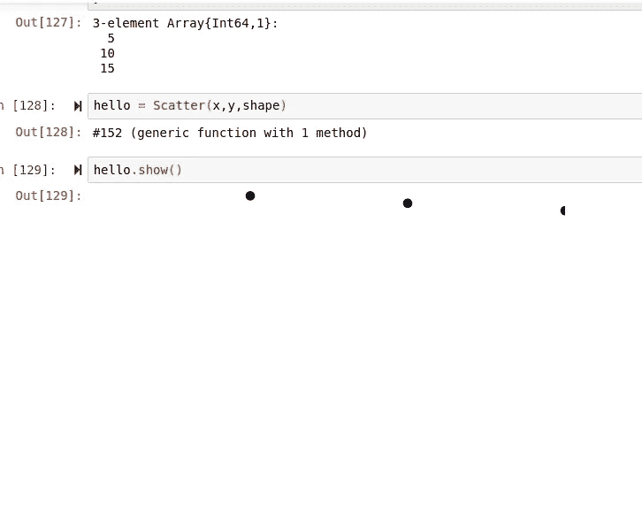
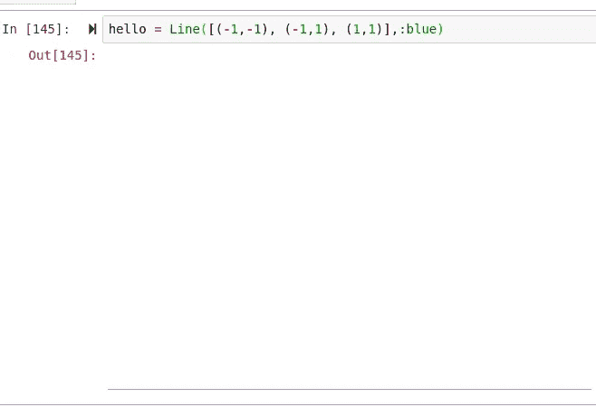
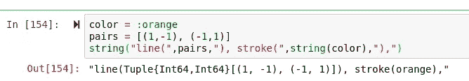
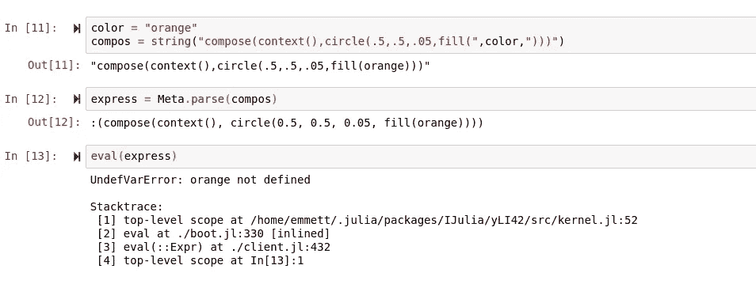
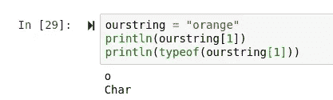
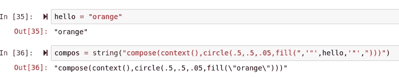
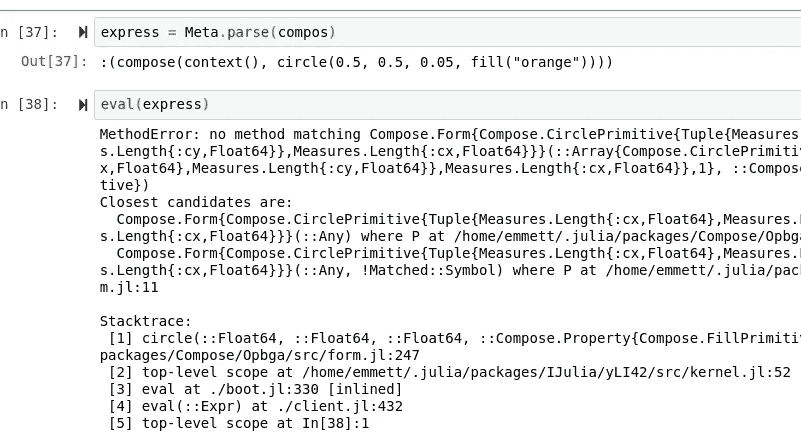
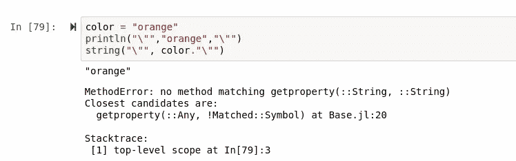
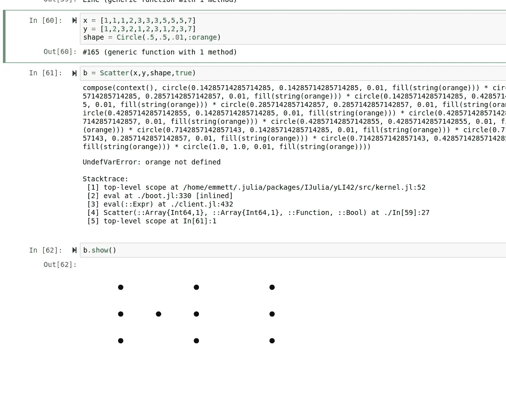

# Julia 中图形类的元编程(下)

> 原文：<https://towardsdatascience.com/metaprogramming-a-graph-class-in-julia-90a90e8ab45b?source=collection_archive---------60----------------------->

## 回来看我再次陷入朱丽亚精神错乱。


在 Julia 中使用面向对象编程确实很有趣，但是我认为函数式语言中的面向对象编程和 Julia 类似 Lisp 的元能力的结合为这样的东西建立了一个真正强大而充分的联系。

> [第一部](/metaprogramming-a-coordinate-parser-with-compose-in-julia-a0d163c6fb21?source=post_stats_page---------------------------)
> 
> 笔记本

# 有什么新鲜事？重构。

如果您还记得，我们离开时遇到了一个小问题:我们不小心将对象的元标签放在了一起。下面是我们的代码:

```
function Circle(x,y,diameter,fillin)
    bravo = false
    composition = compose(context(), circle(x,y,diameter), fill(fillin))
   #     "compose(context(),circle(.5,.5,.1))
    tag = string("circle(",string(x),", ",string(y),", ",string(diameter),")")
    tree() = introspect(composition)
    show() = composition
    x = x
    y = y
    update(x,y) =  bravo = true;tag = string("circle(",string(x),", ",string(y),", ",diameter,")"); if bravo == true return(tag); bravo = false end
    (var)->(show;composition;tree;tag;x;y;update;diameter)
end
function plot(x,y,shape)
   topx = maximum(x)
    topy = maximum(y)
    x = [z = z / topx for z in x]
    y = [z = z / topx for z in x]
    expression = string("compose(context(),")
    for (i, w) in zip(x, y)
        exp = shape.update(i,w)
        expression = string(expression,string(exp))
    end
    expression = Meta.parse(string(expression, ")"))
    eval(expression)
end
```

所以很接近了，但显然有一些关键问题需要解决，所以当我重新投入工作时，我做的第一件事就是重构这两个函数。首先，我们的乘法问题。元编程的一个缺点是，您的错误与您的问题有很大的不同，并且会误导您的问题。我认为这个问题是由元代码中某处缺少逗号引起的。如果你在上面的更新函数中查看我们的代码，在那个括号后面需要有一个逗号。添加后，嘣，坐标解析通过罚款。



此外，我选择通过简单地将函数设置为一个字符串来缩短函数，而不是使用条件。每当我编程时，随着时间的推移，一切都会变得更好，我没有意识到我可以这样做，这让我感觉很不好。区别如下:

```
update(x,y) =  string("circle(",string(x),',',string(y),',',diameter,"), ")update(x,y) =  bravo = true;tag = string("circle(",string(x),", ",string(y),", ",diameter,")"); if bravo == true return(tag); bravo = false end
    (var)->(show;composition;tree;tag;x;y;update;diameter)
```

> 第二个是原件

# 新功能

T 今天，我计划创建我们的第一组轴，并允许在函数中使用颜色，就像符号一样。轴应该不会花很长时间，但做元可能会很费时间。至于颜色串，我有一个很好的主意。所以我要做的第一件事就是把这两件事合二为一，用我的想法在一个新的函数上画出线条。当我处理这样一个新函数时，我会想到 I.O。我们需要从这个函数得到的唯一输出是元数据，即组合成表达式然后被解析的字符串。我想说的是，编写代码字符串并填充参数是一种非常酷的做事方式。也许我刚刚脱离了函数式编程的深渊…

## 轴

增加一个 X 和 Y 轴，我认为会相对简单。首先，我们当然需要画一条线的能力。这个组合需要的输入是一个坐标对数组，然后是线条的颜色。

当访问字典键时，有一个小技巧可以将它们作为字符串访问，只需使用 Symbol()将字符串转换为符号。我的计划与此正好相反，使用 string()转换一个符号。我们需要这样做的原因是，我们不能用元编程来解析 Julia 内部的字符串，但是简单地将数据包含在一个符号中，然后在执行时将其转换为字符串就解决了这个问题。我还添加了我们的标准基本函数库。

```
function Line(pairs, color)
    tree() = introspect(composition)
    show() = composition
    composition = compose(context(), line(pairs), stroke(string(color)))
    (var)->(show;composition;tree)
end
```

现在来测试一下:



有点难以看清，但我们确实在那里划了一条线！接下来，我们将使用 update()函数添加元数据，它可能被更改为 tag()或类似的内容。一般来说，这就是我们想要用元数据创建的内容:



## 颜色…？

在元编程中，一个令人惊讶的困难挑战是字符串参数。不幸的是，似乎我们也不能使用反斜杠和正则表达式来摆脱这种情况…我的解决方法是将符号用作字符串，类似于我之前展示的 DataFrames.jl 技巧:

```
array_from_dict = dictionary[Symbol("Has Spaces")]
```

但是为了做到这一点，我们将需要做完全相反的事情，而不是断言符号的字符串类型，这样就有可能连接一个变量字符串，而不用将其解析为变量。这是必需的，因为当解析为变量而不是原始数据时，变量当然是未定义的。例如，如果我们要在正常作文之外制作一个表达式:



如您所见，当我们的颜色组合成一个字符串时，它返回未定义。我们的目标是让字符串保留该数据周围字符串的引用。在无数次尝试经典符号到字符串断言之后，我无法实现我最初的想法。虽然它在某些尝试中确实工作得很好，但我无法让它在我的实际类型中工作，所以继续我的下一个想法，

> 字符。

char 是一种需要保存一个字节数据的数据类型。一个字符串实际上是由单独的字符组合在一起组成的。在 Julia 中，我们可以像访问数组中的 dim 一样访问字符串中的字符:



这是区分字符串和整数在结构层次上的内在差异的一个很好的方法。信不信由你，一个整数也可以包含在一个字节的数据中，但这个字节将保存整个数字，而不是数字中的一个字符。

```
number = 156
println(156[1])156
```

当然，你可以像访问字符串中的字符一样访问数组中的 dim，这就是为什么我总是重申字符串比乍看上去更像数组。就我的想法而言，最简单的方法是将字符串分隔符作为字符添加到表达式中，但这很有可能不会按计划进行。第二种选择是编写一个字符串解析器，它可以迭代地将我们的数据转换成一个连续的字符串。



对于我的第一个测试，我尝试了最简单的方法，你可以在上面看到它是如何完成的。在解析和评估之后，这是我获得的输出:



> 这看起来不太好。

您可能想知道为什么我不简单地使用带有元字符的正则表达式。嗯…

> 我们不能将表达性的字符串连接成单一的字符串类型。

我现在决定做的是让颜色稍微休息一下，然后继续前进，但是我们肯定会在我的下一篇文章中回来讨论它们！



在回顾我的函数并修改后，我很快意识到开始的循环肯定是设置 y 等于 x，这里表示为:

```
function plot(x,y,shape)
   topx = maximum(x)
    topy = maximum(y)
    x = [z = z / topx for z in x]==========================================================
    y = [z = z / topx for z in x] # <- What????==========================================================    expression = string("compose(context(),")
    for (i, w) in zip(x, y)
        exp = shape.update(i,w)
        expression = string(expression,string(exp))
    end
    expression = Meta.parse(string(expression, ")"))
    eval(expression)
end
```

在纠正了这个问题之后，我终于能够策划我的秘密信息了:



# 结论

我当然希望我们今天有功能性的颜色和轴，但是看起来这些故事变得很长很快！不管怎样，我对计划的进展很满意，尽管我遇到了很多障碍。我从这个项目中得到了很多乐趣，也确实学到了很多。注意安全，呆在家里，保持健康！