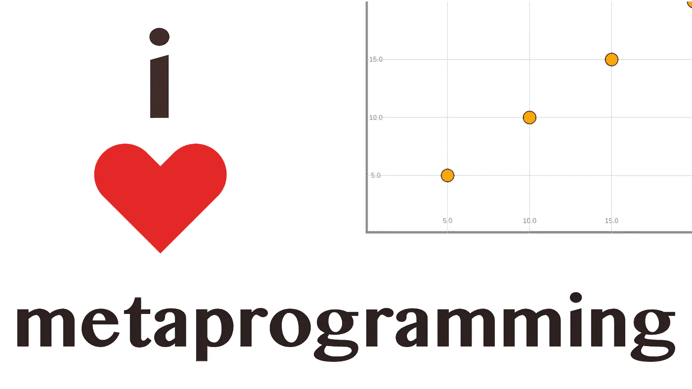
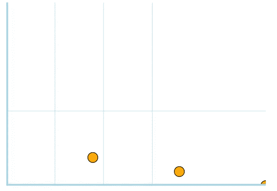
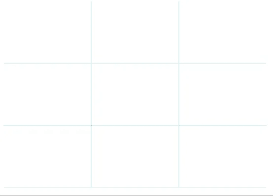
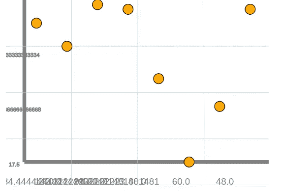
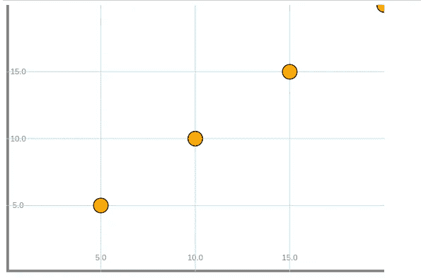

# Hone.jl 的元编程网格和标签

> 原文：<https://towardsdatascience.com/metaprogramming-grids-and-labels-for-hone-jl-f434c8dc24ad?source=collection_archive---------67----------------------->

## Hone.jl

## 为 Julia 修复我的网格并将轴标签添加到我的图形库中



上次我们停止了 Hone.jl 的工作，这是一个模块化的、面向对象的图形库，它使用元编程来提供一个可扩展的平台，我们遇到了相当多的问题。首先，网格绘制得非常不准确，这使得它们实际上毫无用处。这也产生了额外的障碍，因为标签不能被添加到这样的网格中。我们得到的图看起来像这样:



此外，尽管这些点与我们标绘的坐标正确对齐，但它们肯定没有与我们的轴和网格对齐。这是因为合成插图的原点并不是数据科学家通常认为的图形的原点。相反，Y 轴的原点实际上在左上角。因此，例如在(5，5)处绘制的点将位于左上角而不是左下角。

另一件事，我想戏剧性地改变 Hone 是整个方式的阴谋组装。以前，元表达式会被扔在一起，在一个又长又乱的**元编程混乱**中解析。我想改变这一切。Hone 的整个思想围绕着模块化。必要时，您应该能够轻松地从其他地方添加不同的网格，或者甚至为一些不同的结果运行不同的坐标解析器。然而，以现在的散射函数的方式，这是完全不可能的。

> [笔记本](https://github.com/emmettgb/Emmetts-DS-NoteBooks/blob/master/Julia/HonePt9.ipynb)
> 
> [上一篇文章](/adding-control-to-my-modular-graphing-library-2c5424a8d3b7)

[https://github.com/emmettgb/Hone.jl](https://github.com/emmettgb/Hone.jl)

# 修复我们的电网

也许我在 Hone 中遇到的最突出和最可怕的问题是网格。网格是根据框架的尺寸划分绘制的，这可能非常简单。数学是这样的:

```
function Grid(divisions,frame=Frame(1280,720,0mm,0mm,0mm,0mm),colorx=:lightblue,colory=:lightblue,thickness=.2)
    xlen = frame.width
    ylen = frame.height
    division_amountx = xlen / divisions
    division_amounty = ylen / divisions
    total = 0
    Xexpression = "(context(), "
    while total < xlen
        total = total + division_amountx
        linedraw = Line([(0,total),(xlen,total)],:lightblue,thickness)
        exp = linedraw.update(:This_symbol_means_nothing)
        Xexpression = string(Xexpression,string(exp))
    end
```

这当然是初看起来可以工作的代码。首先，我们得到框架的宽度和高度，并除以我们的分割数。之后，我们迭代地为每一行添加每个表达式，直到我们达到框架的宽度或高度。我们在 while 循环中这样做，当然，当总长度小于相应帧的宽度或高度时，它保存控制流。

> 那么问题是什么呢？

我认为真正的问题在于，一个非常小的矛盾或问题会在未来造成一个非常大的问题。X 轴的分割量通过将宽度除以网格中的分割数来计算。这里的问题是，X 网格线与 Y 轴上代表值的线相对应，而 Y 轴上的值正好相反。我们如何解决这个问题？虽然有时可能会令人困惑，但这可以通过简单地颠倒我们的 X 和 Y 来解决

```
function Grid(divisions,frame=Frame(1280,720,0mm,0mm,0mm,0mm),colorx=:lightblue,colory=:lightblue,thickness=.2)
    xlen = frame.width
    ylen = frame.height
    division_amountx = ylen / divisions
    division_amounty = xlen / divisions
    total = 0
    Xexpression = "(context(), "
    while total < xlen
        total = total + division_amountx
        linedraw = Line([(0,total),(xlen,total)],:lightblue,thickness)
        exp = linedraw.update(:This_symbol_means_nothing)
        Xexpression = string(Xexpression,string(exp))
```

同样，当我们面临为网格创建标签的挑战时，我们也需要遵循这个想法。本例中所做的更改只是将 ylen 划分为 division_amount X，将 xlen 划分为 division_amount Y。结果，我们得到了一个漂亮的网格，如下所示:



# 网格标签

现在我们有了工作网格和标签类型，我想创建的下一个类型当然是 X 轴和 Y 轴的标签。我们将从参数开始。我们有两个选择来获得网格位置，我们可以

*   将它们保存在网格类型中
*   或者重新计算它们。

虽然将它们保存到网格类型可能会使我们在参数方面更容易使用，但我相信这将使将来实现更多的自定义功能变得更加困难。这样做的部分问题是 GridLabels 并不意味着是一个将许多元素组合到一个框架中的总结功能，而是一个可以从框架中添加或删除的功能。在这方面，它更类似于 HDraw.jl 文件中的许多方法，而不是 HPlot.jl 文件中的方法。我们的网格标签也需要我们的 x 和 y 值来生成标签本身。

```
function GridLabels(x,y,grid,buffer=20)
    frame = grid.frame
    xvals = grid.xvals
    yvals = grid.yvals
    topy = maximum(y)
    topx = maximum(x)
    tag = "(context(), "
```

我们可以获得框架，我们将需要从网格类型的一些计算。在这个函数的最初版本中，我决定尝试将网格位置的值存储在以下类型中:

```
for value in xvals
        lbl = value / frame.height * topy
        grlbl = Label(string(lbl),buffer - 5, value)
        tag = string(tag,grlbl.tag)
    end
    for value in yvals
        lbl = value / frame.width * topx
        grlbl = Label(string(lbl),value, buffer - 5)
        tag = string(tag,grlbl.tag)
    end
    tag = string(tag,")),")
    composition = Meta.parse(tag)
    show() = eval(composition)
    ()->(tag;xtags;show)
```

这是通过获取相对于框架高度的值的百分比来完成的，网格的数学是基于这个百分比的。重要的是要记住，任何对象在 Hone 中的位置与它上面的帧成正比，就像在大多数图形工作中一样。然后，我们将这个百分比乘以 topx 中的最高值。在有四条网格线的例子中，我们将有 0.25 条递增到 1 条，每条乘以标签数据中的最大值，以及位置分辨率中的最高值。然而，我发现在网格类型中存储这样的数据会产生更多的问题，而不是解决方案。



然而，在我的第二次修改中，我修改了这个想法，创造了一些更好的东西:

```
function GridLabels(x,y,grid,label = "X",buffer=20)
   frame = grid.frame
    divamountx = grid.division_amountx
    total = divamountx
    topx = maximum(x)
    topy = maximum(y)
    xlabels = []
    while total < (divamountx * grid.divisions)
        percentage = frame.height / total
        curr_label = topx * percentage
        push!(xlabels,(curr_label, total))
        total += divamountx
        print(total)
    end
    xtags = ""
    for (key,data) in xlabels
        textlabel = Label(string(round(key)), 40 , data, "", 3)
        xtags = string(xtags, textlabel.tag)
    end
    tag = xtags
    ()->(tag;xtags)
end
```

在我解释了我对 h one 库的另一个问题的失望之后，最终产品将会揭晓…

# 非模块化绘图

如果你曾经瞥了一眼 Hone 中的 scatter 函数，并了解到其中的一些代码与 Hone 背后的方法论直接矛盾，那么你肯定不是唯一一个这样做的人。我认为，与其让函数来做诸如解析坐标或向图中添加线条之类的事情，不如一次一个地将代码片段硬编码到函数中来做这些事情，这将是一个绝妙的主意。参观展品 A:

> _arrayscatter 函数。

```
function _arrayscatter(x,y,shape=Circle(.5,.5,25),
        features = [Grid(3), Axis(:X), Axis(:Y)],
        frame=Frame(1280,720,0mm,0mm,0mm,0mm), 
        buffer = 90)
    fheight = frame.height - buffer
    fwidth = frame.width - buffer
    topx = maximum(x)
    topy = maximum(y)
    expression = string("")
    # Coordinate parsing -------
    for (i, w) in zip(x, y)
        inputx = (i / topx) * fwidth
        inputy = (w / topy) * fheight
        exp = shape.update(inputx,inputy)
        expression = string(expression,string(exp));
    end
    points = transfertype(expression);
    frame.add(points);
    for feature in features
        frame.add(feature);
    end
    composition = eval(expression);
    show() = frame.show()
    tree() = introspect(composition)
    save(name) = draw(SVG(name), composition);
    get_frame() = frame
    add(obj) = frame.add(obj)
    (var)->(show;composition;tree;save;get_frame;add;x;y;points)
end
```

这个函数不仅有点难看，它还需要自己独特的类型，以便将自己的标签传输到帧中。它不是一个由输入自动生成的对象集合，它本身是一些对象，旁边还有一个对象集合。在 Hone.jl 的背景下，Hone.jl 的理念是什么；这完全说不通。我对此采取的第一个行动是创建一个完全独立的函数来创建轴类型:

```
function Axis(orientation=:X, axiscolor = :gray, frame=Frame(1280,720,0mm,0mm,0mm,0mm), buffer = 90)
    if orientation == :X
        pairs = [(buffer,frame.height - buffer), (frame.width,frame.height - buffer)]
    else orientation == :Y
        pairs = [(buffer,0),(buffer, frame.height - buffer)]
    end
    axis = Line(pairs,axiscolor)
    tag = axis.update([pairs])
    (var)->(tag)
end
```

这是相对简单的！接下来，我决定对坐标做同样的事情，以便进一步精简函数。

```
function Points(x, y, frame=Frame(1280,720,0mm,0mm,0mm,0mm), buffer = 90, shape=Circle(.5, .5, 25))
    fheight = frame.height - buffer
    fwidth = frame.width - buffer
    topx = maximum(x)
    topy = maximum(y)
   tag = string("")
    # Coordinate parsing -------
    for (i, w) in zip(x, y)
        inputx = (i / topx) * fwidth
        inputy = (w / topy) * fheight
        exp = shape.update(inputx,inputy)
        tag = string(tag,string(exp))
    end
    tag = string(tag)
    show() = eval(Meta.parse(string("compose(context(), ", tag,")")))
    (var) -> (tag)
end
```

在所有的复制、粘贴和轻微的重构之后，我们有了一个可爱的小函数，如下所示:

```
function _arrayscatter(x, y,
        shape=Circle(.5,.5,25),
        features = [Grid(3), Axis(:X), Axis(:Y)],
        buffer = 90,
        frame=Frame(1280,720,0mm,0mm,0mm,0mm), 
        )
    points = Points(x, y, frame, buffer, shape)
    frame.add(points)
    for feature in features
        frame.add(feature);
    end
    show() = frame.show()
    tree() = introspect(composition)
    save(name) = draw(SVG(name), composition);
    get_frame() = frame
    add(obj) = frame.add(obj)
    (var)->(show;composition;tree;save;get_frame;add;x;y;points)
end
```

我喜欢这一点，因为它更侧重于作为对象的对象和作为对象的持有者的框架，而不是整个数组散点图是我们将对象分解成元表达式以及其他类型的组合。有了这些解决方案，我还注意到了另一个问题。如果您还记得，Compose 的起始点肯定不是您所期望的位置。它不在左下方，而是在左上方。结果，我们的许多 y 坐标被颠倒，因此与我们的新网格标签不匹配。

为了解决这个问题，我简单地用高度减去我们的新值，并把它作为我们的输入 y。

```
function Points(x, y, frame=Frame(1280,720,0mm,0mm,0mm,0mm), buffer = 90, shape=Circle(.5, .5, 25))
    fheight = frame.height - buffer
    fwidth = frame.width - buffer
    topx = maximum(x)
    topy = maximum(y)
   express = string("")
    # Coordinate parsing -------
    for (i, w) in zip(x, y)
        inputx = (i / topx) * fwidth
        inputy = (w / topy) * fheight
        **inputy = fheight - inputy**
        println(inputx)
        println(inputy)
        exp = shape.update(inputx,inputy)
        express = string(express,string(exp))
    end
    tag = express
    show() = eval(Meta.parse(string("compose(context(), ", tag,")")))
    (var)->(tag;show)
end
```

# 结论

在对 Hone 库做了所有这些伟大的工作之后，我很兴奋地向你展示从 0.0.5 版本开始的新的默认绘图！



在我个人看来，这里的改善是超乎戏剧性的。首先，我们有准确表示的数据，没有颠倒，没有在错误的地方。这个可视化的 X 和 Y 都是[5，10，15，20]，这正是该图所显示的。最重要的是，我们可以使用新的直线网格和网格标签来查看我们在实际数据周围的位置！

我对 Hone.jl 现在所处的位置以及它很快将会出现的位置感到非常兴奋！还有很多工作要做，但我希望图形架构的基础已经非常接近完成，我所有的错误修复都不需要再存在了！(在完美的世界里。)尽管偶尔会遇到困难，但我从这个项目中学到了很多，我非常兴奋地看到它在我的项目中的有效性以及其他人对它的使用！