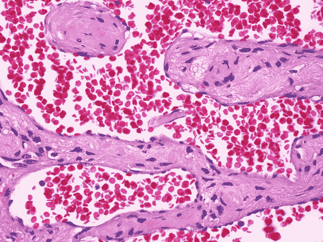
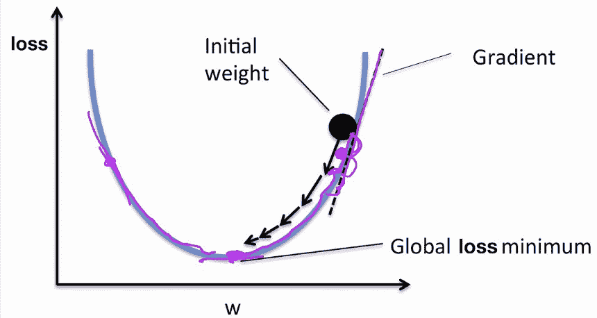
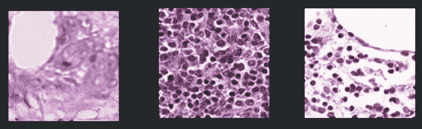
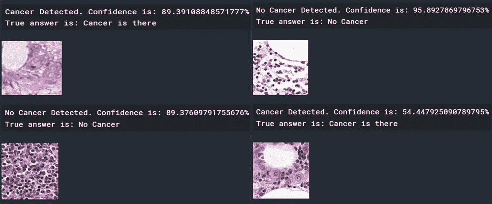

# 组织病理学图像扫描中转移癌检测

> 原文：<https://towardsdatascience.com/metastatic-cancer-detection-in-histopathological-image-scans-de4eeb570a8?source=collection_archive---------27----------------------->

## 使用机器学习来预测癌症是否在显微图像中。

# **癌症的可怕故事**

癌症仍然是世界上最致命的疾病之一，每年导致超过 1000 万人死亡**。癌症如此致命的原因之一是，如果不管它，即使是很短的一段时间，它可能已经接管了一个生物系统。早期诊断是战胜癌症的关键，而机器学习正在彻底改变早期诊断。**

机器学习能够推断出人类无法推断的模式。这包括在图像中寻找非常抽象的模式。使用机器学习的能力，可以创建一个模型来从图像扫描中的非癌细胞中推断出癌细胞。**卷积神经网络**也可以帮助解决这个问题，因为它们非常适合在图像扫描等空间敏感数据中寻找关系。

# **转移癌**

癌症通常始于身体的原发部位，然后恶性扩散。源自身体原发部位的癌症是转移性癌症。从本质上说，继发性癌症是原发性癌症的直接结果。那么为什么我们要寻找继发性癌症而不是根本原因呢？因为当扫描全身时，更容易推断出继发性癌症，并且当某人患有癌症时，转移性癌症通常少量遍布全身。发现转移性癌症就像一个指标，可以确定某人是否在身体的其他地方患有严重的癌症。

具体来说，转移癌可以在身体的不同器官中发现。我们可以检查**组织病理学图像扫描**，这是人体内器官和细胞的显微图像。组织病理学图像扫描具有人体正在观察的部位的不同细胞的大量细节，并且可以检查不同的疾病。然而，在这些扫描中很难判断是否存在癌症，因为我们并不都是癌症研究领域的专家。**机器学习可以用来解决这个问题，告诉组织病理学图像扫描中是否存在转移癌。**

组织病理学图像扫描

# **机器学习+卷积神经网络**

机器学习就是让机器学习如何执行特定的任务。代替给出明确的指令，**机器学习创建自己的指令**。实际上，所有这些指令都是数学值。机器学习模型只是一个**可微分函数**，它接受预定义数量的输入，使用变量(权重)对输入执行操作，并产生输出。这就好比 *y = mx + b* 。 *x* 是模型的输入， *m* 和 *b* 是变量(权重)，而 *y* 是输出。机器算法必须优化 *m* 和 *b* 权重，以便在给定任何输入时，它将始终产生所需的输出。我们如何优化我们的变量？基本上有两个步骤，产生损失和反向传播。

## *损失函数*

损失函数是表示模型表现有多差的函数。损失越大，模型表现越差。我们可以通过使用**标记的数据**来生成损失。我们可以给 x 的模型输入，让它根据自己的权重产生自己的输出。因为我们已经标记了数据，所以我们知道模型的输出应该是什么。我们可以比较模型的输出和真实的输出，看看有什么不同。例如，模型的输出可能是 3，而实际输出可能是 5。本例中的损耗可能是 2，这是两个输出之间的距离。我们希望模型总是产生 0 的损失，这意味着我们需要**最小化损失函数**。

## *反向传播*

反向传播是回到模型的权重并改变它们以最小化损失函数的过程。它通过获取损失函数并计算其梯度来做到这一点。梯度是所产生损耗的瞬时变化率，查看梯度，我们可以找到梯度的最低点，此时重量产生的损耗较低。这被称为**梯度下降**，是许多机器学习算法的关键。我们可以重复这个过程，直到我们的损失越来越小，而我们的模型越来越好。通常，一个模型会有数千个权重，因此在生成输出时，模型会变得非常精确。

[梯度下降可视化](https://mc.ai/gradient-descent-and-its-types/)

## *卷积神经网络*

卷积神经网络采用了上述机器学习的所有原则，还结合了一种可以分析空间数据(如图像和音频)的方法。它使用**过滤器**，这是一种使用权重扫描输入数据的机器学习算法。过滤器是扫描输入数据的权重网格，每次扫描时，将权重乘以输入。由于图像也只是数值网格，卷积过滤器可以很容易地越过它们。在一个**卷积**之后或者当它完成扫描图像时，扫描的结果(乘积)被汇集在一起。池化基本上是用一种更小更简洁的方式表示输入数据，并包含所有重要的特性。从本质上来说，卷积神经网络所做的是，它们推导出图像的特殊特征，并将它们放在一起。

[要获得更容易理解的解释，请查看我写的这篇更详细解释卷积神经网络的文章。](https://medium.com/@vanshsethi17/a-beginners-guide-convolutional-neural-networks-f40d64453904)

# **转移癌检测模型**

## *数据*

用于创建模型的数据是 Kaggle 上的 [*组织病理学癌症检测*](https://www.kaggle.com/c/histopathologic-cancer-detection/data) 标记数据。它带有超过 150，0 00 张组织病理学扫描图像，每张图像都标有 1 或 0。0 表示图像中没有常见的转移癌，1 表示图像中有转移癌。每个图像是 96 像素乘 96 像素乘 3 个颜色通道(红、蓝、绿)。我们可以用 96×96×3 的网格值来表示每幅图像。

数据示例

## *型号*

该模型的概念是基于机器学习的原则，并针对手头的任务进行定制。

卷积层用于图像的**特征提取**，以概括癌症图像的样子和非癌症图像的样子。这些层是 2D 卷积神经网络，这意味着卷积层采用值的 3D 矩阵(图像的表示)。

最大池层采用卷积层创建的特征地图，并**对其进行概化**。这是通过对图像中的每个 3x3 方块取最大值来实现的。这样，当特征图被提供给神经网络的其他部分时，它可以更容易地计算出图像是否包含癌症。

分散在整个网络中的辍学层是为了确保模型学会执行任务，而**不仅仅是记住数据**。它通过在损失计算过程中关闭某些权重来实现这一点，这导致精度稍低，但可以推广到大量图像。

最后，密集层理解特征图，实际上**计算出是否有癌症**。最后一层包含一个节点或输出，可以是 0 或 1。0 表示没有癌症，1 表示有癌症。损失函数将使用它来计算损失，反向传播将优化这些层中的权重。

该模型包含超过**5100 万+** 个参数，这意味着它可以达到非常好的精确度。

## *损失函数+优化*

用于该模型的损失函数是**分类交叉熵损失**。该损耗采用模型输出并执行对数函数，然后乘以实际损耗。它使用对数函数，因为当你开始得到真正的答案时，损失会成倍增加。

用于这个模型的优化器是 Adam 优化器。这个优化器执行常规的反向传播，但是当它越来越接近损失函数的全局最小值时，它减慢它优化的速度以防止超过最小值。这是一个非常标准的优化函数。

## *培训*

该模型训练了超过 **10 个时期**或在整个数据集上执行了**批 100 个图像**中的 10 次反向传播。20%的图像用于验证或确保模型正在训练。经过几个小时的训练，模型完成了。

# **结果在……**

该模型获得了 80%的癌症检测准确率。也就是说，80%的预测是正确的。这里有几个例子:

该模型的示例

总的来说，该模型工作得非常好，在检测癌症时是一个可行的选择。

## 参考资料:

[https://mc.ai/gradient-descent-and-its-types/](https://mc.ai/gradient-descent-and-its-types/)(渐变下降图像)