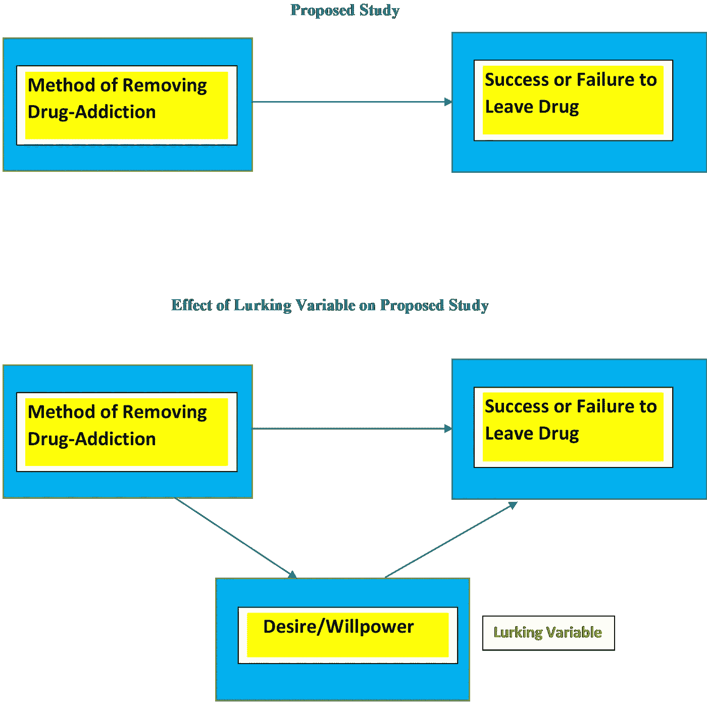

# 研究设计方法——观察研究和调查

> 原文：<https://towardsdatascience.com/methods-of-study-designs-observational-studies-surveys-22f0a04c7446?source=collection_archive---------16----------------------->

## 了解如何利用真实世界的例子设计研究，以进行有效的数据分析

> 如今，数据对于研究一个特定的主题是非常重要的。因此，我们应该注意以正确的方式记录数据，以避免得到错误的结果/推断。此外，我们应该对这些数据进行正确的研究/实验，从中得出正确的结论。我们将在这里简要讨论这些方法。

研究尤其可以用 **3** 的方式进行，这里我们只讨论其中的两种:

1.  **观察性研究:**我们感兴趣的变量被记录为自然发生的*，没有任何*实验者/研究者的干涉*。假设我们想推断学生在学习期间是否更喜欢听音乐以获得更好的记忆。我们召集了一些学生，让他们记录下在过去/前一周他们是否在学习时听了音乐，以提高记忆力。另一种方法是，我们要求他们记下在未来一周的学习中是否在听音乐。*

*在这两种情况下，我们记录的是学生在学习时的自然行为/倾向，我们不会以任何方式干涉他们的行为，比如强迫他们听音乐等。所以我们可以称这项研究为*观察研究*。*

*再次注意，在第一个场景中，我们记录过去的事件。所以我们称之为 ***回顾性观察研究*** 。在第二个场景中，我们正在记录未来的事件，所以我们称之为 ***前瞻性观察研究*** 。*

*在观察性研究中，可能有一个或多个我们没有考虑的外部变量的影响，但会严重影响我们的结果。这样的一个变量也被称为*。举个例子，假设我们要观察哪种方法对公民戒毒比较理想——**a .)**咨询医生后服用一些药物/抗药或者 **b.)** 干脆什么都不做或者不遵医嘱。**

**令人惊讶的是，我们的结果显示，*什么都不做*会给出更好的结果。这可能是因为那些什么都不做也不去看医生的人有更强烈的愿望/意志力去戒掉毒品。于是欲望在这里变成了*潜伏变量*。**

****

**潜在变量对学习的影响**

**2.**抽样调查**:在这里，个人通过某种方式向研究者报告他们自己对于被测变量*的值*。这些手段包括*人员挨家挨户走访并记录观察结果*，通过电子邮件发送*问卷*、*电话访谈*、*网络调查、*等。**

*****偏差*** 在调查中是一个大问题。收集数据/记录的方法中的不公平被称为*偏差*。这是调查中的一个严重问题，会导致从收集的数据中得出错误的推论。**

**让我们首先讨论一下我们在调查中遇到的一些常见类型的偏见:**

****便利偏差或便利样本:**完全根据进行调查的人的便利来选择。假设您想从购买了某个特定产品的顾客那里获取反馈。但是为了方便起见，您只要求前 50 名买家提供反馈。现在它是错误的，因为它可能是最后几个买家得到了有缺陷的产品。所以我们忽略了他们。最好的办法是随机选人。**

****志愿者/自选偏见:**这里个人自己选择成为调查的一部分。假设，一项调查正在进行，以计算一个特定地方的平均收入。参与者必须到调查中心来记录他们的收入。显然，成功和高收入的人会自发去记录他们的收入，但低收入的人可能会羞于透露他们的收入。在这里，只有高收入人群自愿参与调查，因此我们无法获得特定地区平均收入的真实估计值。**

****无响应偏差**:个人未完成或返回其调查响应表或拒绝回答。在上面的例子中，低收入人群拒绝成为调查的一部分，导致了无回答偏差。**

****回答偏差:**个人参加了调查，但没有正确回答问题。假设在一次选举后，进行了一项调查，打电话给人民，问他们是否投了票。现在调查后发现，说*是*的人比公开记录多很多。很明显，这里许多参与者撒谎了，也就是说，尽管没有投票，他们还是说*是*，因为他们想被认为是这个国家的*负责任的公民*，因为所有负责任的公民都投票。**

****覆盖面不足偏差:**调查不包括目标人群中特定群体的适当代表性。假设学校当局正在进行一项调查，评估每个年级的教师质量。但是他们忘了包括 7 年级和 8 年级。所以并不是一所学校的所有年级都包括在调查中。这就是*欠报道偏差*。**

## **调查中的问题类型:**

1.  ****开放性问题:**它可以有无限的答案。你最喜欢的学习主题是什么？它可以有很多答案，从非常笼统的像*计算机科学*到非常具体的像*深度学习*。**
2.  ****封闭式问题:**意在有具体答案。你最喜欢的话题是什么？是机器学习、深度学习还是强化学习？**

**在为调查提出问题时，应该记住:**

**a.开放式问题限制较少，但答案/回答可能难以概括。**

**b.封闭式问题有很高的机会出现偏差。**

**c.问题应该是中立的，它不应该影响任何即将到来的问题的答案，容易理解，应该能够从参与者那里获得诚实的回答。**

****注:**有时候在为问题提供的选项中我们经常会看到类似“**不知道**”或者“**选择不回答**”的选项。前者用在参与者不知道这个话题或者已经忘记这个话题的时候。**

***选择不回答*当被问到敏感/冒犯/尴尬的问题时使用。对于任何与医疗或艾滋病相关的调查，他们都会问你在性交时会采取什么保护措施？许多人可能会觉得回答这个问题很尴尬。**

**你经常去 Amazom.com 吗？你经常沉迷于网上购物吗？”**

**它将两个问题合二为一，因此参与者选择答案可能会感到困惑，因为许多参与者会使用*Amazon.com*但很少网上购物，而其他人则经常网上购物，但来自其他网站，如 *Snapdeal* 等。**

## **参考:**

1.  **[假人统计](https://www.amazon.in/Statistics-Practice-Problems-Dummies-Online-ebook/dp/B00LV5MROU)**
2.  **[斯坦福·利古尼塔的统计推理课程](https://lagunita.stanford.edu/courses/OLI/StatReasoning/Open/about)。**
3.  **Udacity Bertelsman 奖学金挑战赛讲座-数据跟踪**