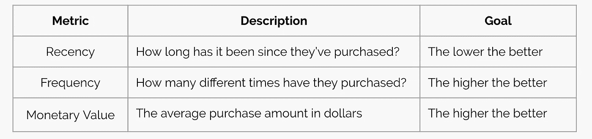
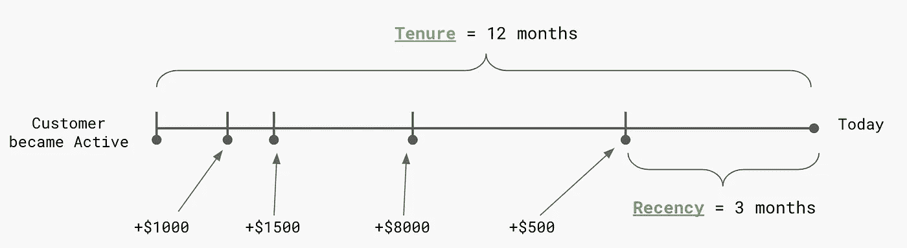
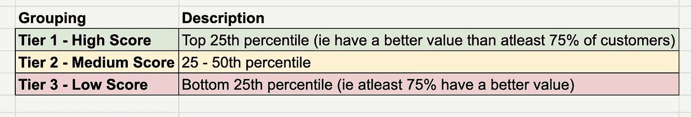
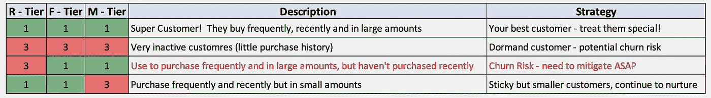
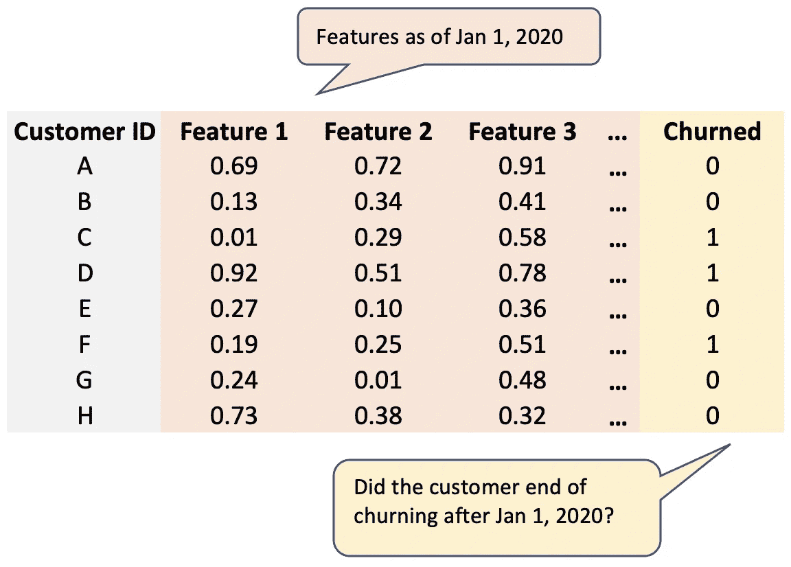
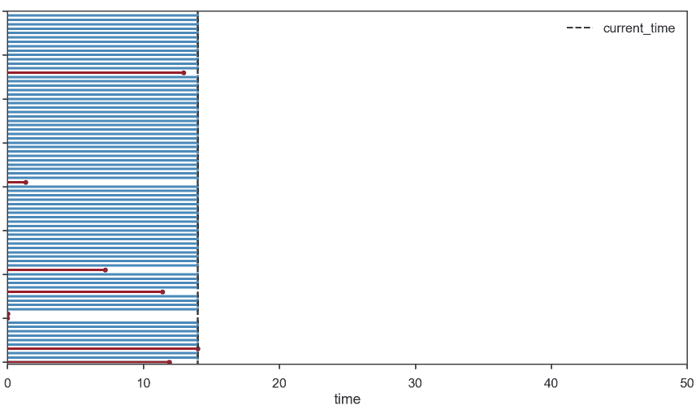
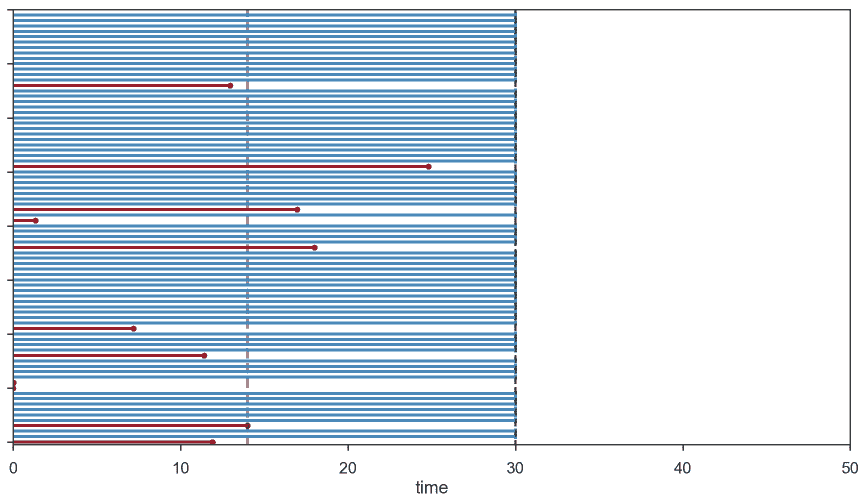

# 估计客户流失风险的方法

> 原文：<https://towardsdatascience.com/methods-to-estimate-customer-churn-risk-ce877c12407f?source=collection_archive---------21----------------------->

图片来源:Shutterstock

# 介绍

企业总是对研究客户的流失行为感兴趣。了解客户流失可以识别与客户离开潜在相关的因素，但也可以作为一种预测力量来识别*处于风险中的*客户，并主动吸引他们 ***防止*** 客户流失。根据您的领域和用例，有各种方法来模拟客户流失。这篇文章将探索 3 种独特的方法来建立客户流失模型:

1.  RFM 分割
2.  基于分类器的预测
3.  基于生存的模型

# RFM 分割

*最简单的*方法是将客户分成不同的部分或“角色”。该方法很简单，因为它只使用了 3 个特征: **R** 频率、 **F** 频率和 **M** 一元值。营销中最常用的这些术语大致定义如下:

最后一个维度旨在确定这些回访的意义或价值如何？如果度量单位是购买，那么货币价值可以简单地是客户的平均购买价格。

你可以使用购买或参与作为行动单位，这取决于你的商业模式是基于顾客再次购买(如电子商务、SaaS B2B)还是顾客再次参与(如 Instagram、twitter)。衡量参与度的货币价值可能需要事先对参与度的类型进行一些权衡(即，上传一张图片可能比简单地登录和滚动浏览提要更有意义)。

下面是尺寸的直观表示，这些尺寸是为您的所有现有客户计算的。

## 建立排名

下一阶段是奇迹发生的地方。目标是为每个维度存储值。请记住，存储桶越多，组合就越多，因此细分的粒度就越高。

下图反映了一个简单的 1-2-3 级评分。R-F-M 维度中的任何一项得分为“1”为最高等级，得分为“3”为最低等级。

*注意:1–2–3 分组的目的是简化分段。您可以修改层的* ***编号*** *和不同百分位的层的* ***大小*** *。*

## 解读细分市场

数字编码的 R-F-M 值是一个巧妙的技巧，有助于根据层次开发人物角色:

细分策略—红色文本表示“有风险”的客户细分

请注意，红色文本行通常是您的高风险部分。得分为“3–1–1”的客户是指有一段时间没有购买产品(因此得分为“3”)但经常购买且购买量相当大的客户。该客户可能正处于客户流失的风口浪尖…

## 限制

*   低粒度—分数不是单个客户独有的，而是细分市场独有的
*   需要指定层数(即 1–2–3 或 1–2–3–4 等)
*   难以添加其他特征(如营销、人口统计等)来为细分市场提供额外的维度。

下一种方法将演示传统的机器学习模型如何在提供粒度级别的同时包括附加功能。

# 基于分类器的预测

第二种也是更常见的方法是通过训练监督算法(如随机森林、逻辑回归等)来预测客户流失。).这种方法提供了比 RFM 方法更大的粒度，因为每个客户都有一个基于其数据的唯一预测值。

## **准备数据至关重要**

为了训练更好的模型，在拟合之前对数据进行适当的准备是至关重要的。当然，目标变量是二进制的(即，搅动或仍然活动)，并且需要在某个时间点对特征进行快照。

例如，您可以获取截至 2020 年 1 月 1 日在该时间点活跃的客户的详细信息。这些细节可以包括人口统计/公司地理，客户任期，与你的产品的参与程度，以及营销属性。您的目标变量是二进制的，标记客户是否在 1 月 1 日到当前日期之间的任何时间结束了交易。

示例数据结构

一旦如上所示准备好数据，模型训练就变得相当简单了。您可以像使用任何分类器一样训练/测试模型。

## 限制

尽管这种方法为每个客户提供了一个*流失风险评分*，但与任何方法一样，它也有局限性:

*   很容易破坏数据集准备用于训练的方式
*   外部利益相关者可能更难理解
*   流失事件是**而不是**随着时间建模/研究的(没有 [*审查*](https://en.wikipedia.org/wiki/Survival_analysis#Censoring) )

上面的最后一个限制是微妙但重要的。最后一种方法提供了一种解决方案来解释这种审查的概念。

# 基于生存的模型

基于生存的模型最初是为了研究寿命而开发的，例如人口和国家的寿命。它的用例首先扩展到医疗领域。生存模型允许我们研究尚未观察到事件的人群中的事件发生时间。就像医学专家不会等到所有病人都去世后才研究药物对寿命的影响一样，企业也不应该等到所有客户流失后才能对流失行为进行评估和建模。这种处理未被观察到的数据的概念被称为 [*审查*](https://en.wikipedia.org/wiki/Survival_analysis#Censoring) *。*

## 建立一些直觉

为了围绕审查的重要性建立一些直觉，让我们假设你想要估计你所有客户的平均流失时间。

红线是搅动的顾客；蓝线是活跃客户

使用上面可视化的数据，

> 平均流失时间是多少？

**方法 1(错误):**

忽略所有仍然活跃的客户(蓝线)，只忽略那些被搅动的客户的平均任期(红线)。

这种方法夸大了你的平均流失时间，因为你忽略了大多数还没有流失的客户，他们的任期超过 10 天。

**方法二(也是错的):**

尝试纠正方法 1，取所有客户(蓝色和红色)的持续时间，但对于活跃客户，由于他们尚未流失*和*，您假设他们的流失时间为当前的持续时间。这种方法虽然比方法 1 好，但仍然夸大了平均流失时间。例如，下图假设时间已经过去，你现在站在时间=30。请注意，自从您上次观察以来，又有 3 个用户进行了搅动(虚线)，但是您的许多客户仍然没有搅动。

生存模型精确地处理了这种不可观察事件的概念。

## 生存回归模型

最简单的回归模型是卡普兰-迈耶生存函数。这个模型只需要两个参数；*持续时间*和*事件*。持续时间只是确定客户活动的总时间(天数、月数等)。该事件是二进制的，并且指示客户是否已经转变或者仍然活跃。持续时间表示客户的当前年龄(如果他们仍然活跃)或他们搅动的年龄。

然而，在大多数情况下，除了持续时间之外，我们还想使用客户的其他特性。生存回归模型可用于回归其他特征(如人口统计、产品使用等)。)，就像我们使用基于模型的分类器一样。有各种类型，但一个简单的回归模型是[考克斯比例风险模型](https://en.wikipedia.org/wiki/Proportional_hazards_model#The_Cox_model)。

## 局限性:

*   对许多数据科学家和分析师来说可能是一个新概念
*   非技术风险承担者可能难以理解

# 结论

烤蛋糕的方法不止一种。根据您的需求和资源，不同的客户流失建模方法最适合您的业务。在许多情况下，旨在为领导层提供信息的静态、一次性的流失研究可以通过更简单的自上而下的方法实现，如 RFM 模型。生存模型可以实现更动态、更实时的客户评分，这可以解释审查制度。

对于刚刚开始评估客户流失并需要“MVP”解决方案的组织来说，从简单的 RFM 模型开始，并根据使用您的模型的个人继续构建额外的复杂性和可扩展性。

## **资源**

*   [RFM 分割](https://www.optimove.com/resources/learning-center/rfm-segmentation)
*   [用 python 实现生存分析](https://lifelines.readthedocs.io/en/latest/index.html)