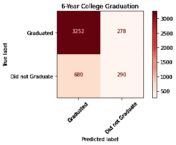
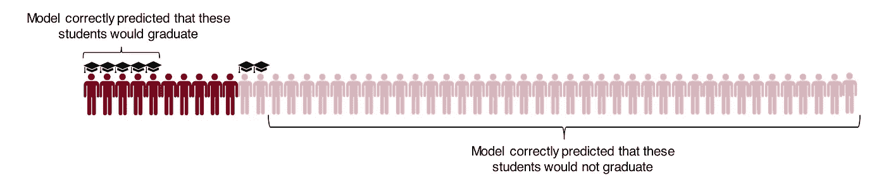
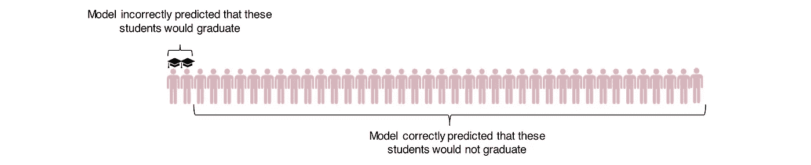
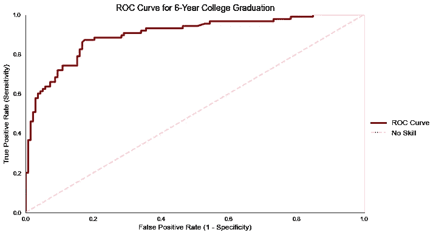

# 度量很重要

> 原文：<https://towardsdatascience.com/metrics-matter-b282c20d5eab?source=collection_archive---------45----------------------->

## 分类模型的评估标准

图片作者。

在创建分类模型时，评估模型预测或识别实际结果的能力非常重要。对于监督分类模型，有几个标准的模型评估方法来为模型改进提供信息，它们是:

*   准确(性)
*   精确
*   回忆
*   特征
*   F1 分数
*   罗马纪元

下面，我描述了每个评估指标，并提供了一个二进制分类示例，以便于理解。

# 混淆矩阵

注:此矩阵中包含的数字是针对此示例制作的。它们不是基于实际的大学毕业成绩。图片作者。

创建混淆矩阵始终是模型评估的第一步。混淆矩阵中包含许多指标，有助于理解模型的表现。

**真阳性**:左上角显示模型做出的正确阳性预测的数量。在本例中，该模型准确预测了 3，253 名学生将在入学后的六年内从大学毕业。

*真阳性率:* TP/(TP + FN)

**假阴性**(也称为第二类错误):矩阵的右上角显示了模型做出的错误负面预测的数量。在这个例子中，模型预测这些学生不会在入学后的六年内毕业，但他们确实毕业了。

*假阴性率:* FN/(FN + TP)

**假阳性**(也称为 I 型错误):左下角说明了模型做出的假阳性预测的数量。在这种情况下，该模型错误地预测了 674 名学生将在入学后的六年内完成大学学业，而实际上他们并没有在六年内毕业。

*假阳性率:* FP/(FP+TN)

**真阴性**:右下角显示模型做出的正确阴性预测。同样，使用这个例子，该模型准确地预测了 296 名学生将不会在入学后的六年内完成大学学业。

*真阴性率:* TN/(TN + FP)

对于以下每个评估指标，我将继续使用大学毕业作为例子来理解如何评估模型性能。应该注意的是，下面显示的数字和图形是假设的，只是为了便于理解。在下面呈现的每张图片中，我描绘了六年后的大学毕业、大学未完成学业以及模型预测:

*   **实际毕业**:下图中的暗红色图标描绘的是六年内实际从大学毕业的人。
*   **未完成学业**:下图中的浅粉色图标描绘了在大学入学六年内未完成大学学业的人数。
*   **预测毕业**:下图中的毕业帽表示模型预测某个学生将在六年内大学毕业。

# 准确(性)

> 在所有正面和负面的预测中，有多少是正确的？
> 
> (TP + TN) / (TP + FP + TN + FN)

图片作者。

模型准确性是一个简单的度量标准，它告诉我们对于每个单独的观察，模型做出了多少正确的正面和负面预测。当类别平衡时(即，当每个实现的结果在数据中被同等地表示时)，准确性可能是一个有用的度量。然而，当它们不平衡时，预测模型可以通过简单地预测主导类来容易地获得高准确度分数。在上面的例子中，通过预测所有学生不会在六年内从大学毕业，该模型可以达到 80%的准确性。

# 精确

> 在所有积极的预测中，有多少是正确的？
> 
> TP/(TP + FP)

图片作者。

精度可以作为一种有用的度量，用于了解模型预测正类的能力。然而，精度不能告诉我们有多少积极的结果被错过了。如果模型预测有 700 名学生将在六年内从大学毕业，并且这些预测的学生中有 500 名确实毕业了，则模型将显示大约 70%的精度分数。然而，我们不能从中看出的是，1000 名学生实际上在六年内从大学毕业，而这个模型将这些学生排除在评估之外。为了更好地理解模型识别真实结果的能力，我们来看看下一个指标。

# 回忆

> 在所有实际的积极结果中，模型预测有多少是积极的？
> 
> TP / (TP + FP)

图片作者。

召回通常也被称为*敏感度*或*真阳性率*。回忆有助于我们更好地理解模型如何有效地识别积极的结果。precision 告诉我们有多少预测的六年制毕业生实际毕业，recall 告诉我们有多少模型准确预测的毕业生将毕业。例如，如果 1000 名学生毕业，并且模型正确预测其中 450 人将毕业，那么它的回忆分数将为 45%——比精确分数差得多！因此，在评估模型性能时，精确度和召回率似乎都很重要。

# 特征

> 在所有实际的负面事件中，模型预测有多少是负面的？
> 
> TN / (TN + FP)

图片作者。

特异性，也被称为*真阴性率*，与回忆相反。回忆告诉我们模型预测积极结果的程度，而特异性告诉我们模型预测消极结果的程度。假设大约有 500 名学生没有真正毕业，而模型预测他们中的 250 人不会毕业。这将返回 50%的特异性分数。在这种情况下，特别是，我们实际上可能会优先考虑特异性优化，因为我们可能更关心正确预测那些不会在六年内从大学毕业的学生，以便我们可以更好地瞄准额外的支持，以确保他们毕业。

# f1-分数

> 精确度和召回率的调和平均值。
> 
> *2 * [(召回*精度)/(召回+精度)]*

一般来说，F1 分数是一个很好的高级指标，因为它包含了精确度和召回率。理想情况下，如果需要精确和召回之间的平衡，可以优化 F1 分数。例如，在预测大学毕业时，我们希望创建一个模型，该模型能够准确地预测积极的结果，并捕捉如上所述的实际积极结果的总体。当班级严重失衡时，F1 分数也是一个很好的衡量标准。在优化 F1 分数的过程中，人们可以期望提高模型捕捉积极结果的能力。与精确度和召回率一样，F1 的分数在接近 1 时是最优的。

# ROC(受试者操作特征)/ AUC(曲线下面积)

ROC 曲线显示了真阳性率(回忆/灵敏度)与假阳性率(特异性)的比较。最佳 ROC 曲线是 ROC 曲线下面积(AUC)接近 1 的曲线。*这个分数可以解释为* *模型对正面预测的排序高于随机负面预测的概率*。

图片作者。

像 F1 分数一样，AUC 作为性能的单一数字分类器是有用的，并且即使当存在高等级不平衡时也是有用的。AUC 也是**比例不变的**，这意味着人们不需要缩放他们的数据来评估模型的性能。人们可以将所有特征保持在它们的原始度量中。虽然，如果为了性能而优化，扩展数据是最佳实践。

AUC 也是**分类阈值不变的**，这意味着 AUC 可以用作性能的有效测量，而不管选择哪个[决策阈值](https://machinelearningmastery.com/threshold-moving-for-imbalanced-classification/)。然而，如果理解这个阈值如何影响精确度和召回率对于改进模型是必要的，F1 分数可以作为模型评估的更好的度量。

# 选择最佳评估指标

当决定如何评估一个模型时，必须考虑他们试图回答的问题，以及他们是否愿意优先考虑他们的模型如何捕捉积极结果或他们的模型如何捕捉消极结果。在上面的例子中，我可能会基于特异性分数优化模型，因为我有兴趣预测谁*不太可能*在六年内从大学毕业。或者，如果有人试图预测谁可能处于信用卡违约的风险中，他们可能会根据回忆分数或 F1 分数来优化他们的模型，以降低错过正面案例的可能性。在这种情况下，如何评估他们的模型取决于模型的用例。