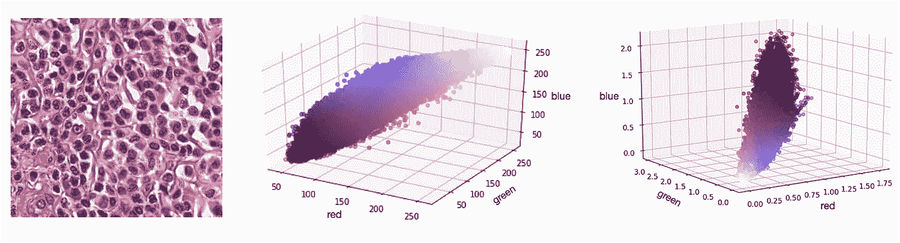

# 显微镜染色差异及其评估方法

> 原文：<https://towardsdatascience.com/microscopy-stain-variations-and-how-to-estimate-them-baca29f57ee9?source=collection_archive---------65----------------------->

## [对整个载玻片图像进行显微图像处理](http://towardsdatascience.com/tagged/MicroscopyStainEstimation)

## 马森科的方法是如何工作的

如果你看过一些组织的显微图像(组织病理学图像)，你一定注意到它们有各种不同的颜色。即使使用相同的染色化学物质(染色剂)，视觉外观也会受到许多因素的影响，如果你用算法处理这些图像，这很容易成为一个大问题。

组织病理学中的默认染色是两种化学物质的组合:苏木精和曙红。第一个负责所有酸成分(例如，存在于细胞核中的 DNA)的暗紫色(或蓝色)，而第二个负责给予周围组织结构的粉红色。它看起来像这样:

乳房组织的组织病理学图像。感谢柏林福的 C. Bertram 和 R. Klopfleisch 提供整张幻灯片图片。图片作者。

我已经提到过，不同图像的颜色差异很大。让我们简单地讨论一下这是为什么:

这个游戏中的一个主要角色是由染色化学物质本身扮演的。取决于浓度、染色持续时间甚至温度。为了稳定这些条件，使用了自动染色机。为了展示组织在染色剂中停留时间的影响，请看下图:

犬皮肤肥大细胞肿瘤的组织学图像，用 H&E 染色。左图代表在苏木精中放置 2 分钟的组织，而右图代表在苏木精中放置 12 分钟的组织(感谢 C. Bertram 提供显微镜载玻片，图像来自作者)

两幅图像都代表了完全相同的肿瘤切片，如概览缩略图所示。然而，右边的图像具有更强的蓝色成分(由苏木精溶液中更长的染色时间引起)。

如果我们想要处理这些图像，这些变化通常会造成问题。特别是当我们只有少量案例时，有时很难让我们的识别算法稳健，特别是如果它们具有高模式识别能力，例如通过使用深度网络。

为了减轻这种情况，原则上有两种方法:

1.  我们可以在将图像送入处理流水线之前对其进行归一化(污点归一化)
2.  我们可以通过人工增加其输入端的染色可变性(染色增强)来使模式识别系统更加健壮。

对于这两者，能够估计数字显微镜载玻片中两种标准颜色的染色强度并将其修改为代表标准化染色(在标准化的情况下)或代表许多不同的染色是有帮助的。

让我们回顾一下[马森科](http://wwwx.cs.unc.edu/~mn/sites/default/files/macenko2009.pdf) *等人*【1】对此的方法。虽然一开始可能有点难以理解，但这是一个非常聪明的方法，真的值得我们关注。

虽然图像通常以红色、绿色和蓝色通道给出，其中较亮的图像代表较高的数字，但污渍本质上是完全相反的:横过 CCD 传感器的光线中的污渍越多，颜色越深。正如你从放射学中可能知道的，光也将遵循[比尔-朗伯定律](https://en.wikipedia.org/wiki/Beer%E2%80%93Lambert_law)，并随着组织的密度呈指数衰减。马森科*等人*因此将图像中的每个像素转换为负对数表示(光密度，OD)。

在这一步之后，我们就有了两种染色成分的线性叠加——这对于分离它们来说真是太酷了！此外，更高的数字现在代表更多的污点(因此颜色更深)。

原始图像，红色、绿色和蓝色空间中的像素(中间)和光学密度颜色空间中的像素(右侧)。(图片由作者提供)

在去除太低的值(仅仅是没有组织存在的明亮背景)之后，我们现在可以尝试估计染色成分。

为此，他们首先估计由两个染色向量跨越的 3D 空间中的 2D 平面。他们为此使用的奇异值分解生成了一个新的坐标系，其中第一个分量跨越了主方差(然而，它还不是我们要寻找的染色颜色之一)。每个像素的每个 OD 值都被投影到新的坐标系中。

这一点的美妙之处在于，如果我们通过去除第三个分量来固有地去除噪声(因为我们只使用了前两个特征向量)。为什么允许我们这样做？因为我们知道图像主要只是由苏木精和曙红(H&E)染色的颜色。相当酷。

让我们看一下同样的图像，但为了简单起见，只是在 2D:

所有图像像素的 OD RGB 表示，带有特征向量(奇异值分解的结果)。在右边你会发现同样的数据，但是被投影到特征向量所跨越的平面上。在这里，我们可以确定实际的染色向量。(图片由作者提供)

你可能会注意到，我已经在这张图片中添加了两个染色向量。它们代表我们的特征向量所跨越的坐标系中的最大角度和最小角度。为什么？因为它们本身跨越了自己的坐标系——实际的 H&E 坐标系。

在这张图片中，你可以很好地看到颜色值实际上是这两个分量的线性叠加。我已经告诉过你，我们现在可以通过计算一个稳健的最小和最大角度来非常容易地估计这些(在上图中用红色箭头表示)。你可能会说，如果我们有一些噪声，最小值和最大值很少是鲁棒的。这是一个非常好的观点，也是为什么马森科等人使用分位数(通常是 1%和 99%)的原因。

但是为什么恰恰是最小和最大的角度呢？因为在一个无噪声的世界中，元件的污染不会低于零，这正是这些最大角度之外的区域所代表的。

在下一篇文章中，我们将讨论如何使用 Python 实现这一点——以及如何在大图像上实现这一点，比如我们现在在显微镜中使用的整张幻灯片图像。

[1]:马森科，马克，等(2009)*IEEE 生物医学成像国际研讨会:从纳米到宏观。*