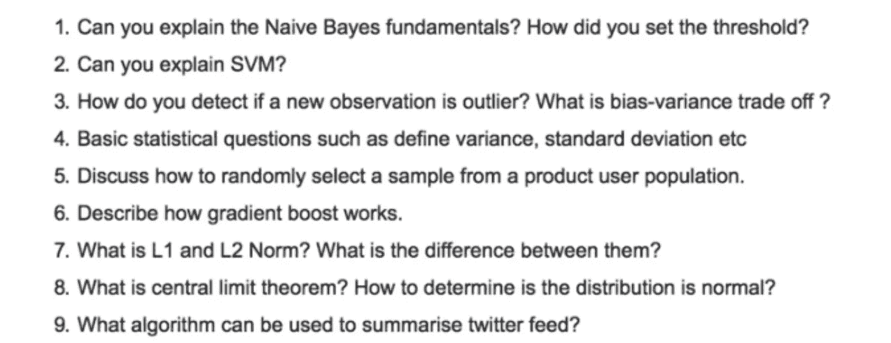
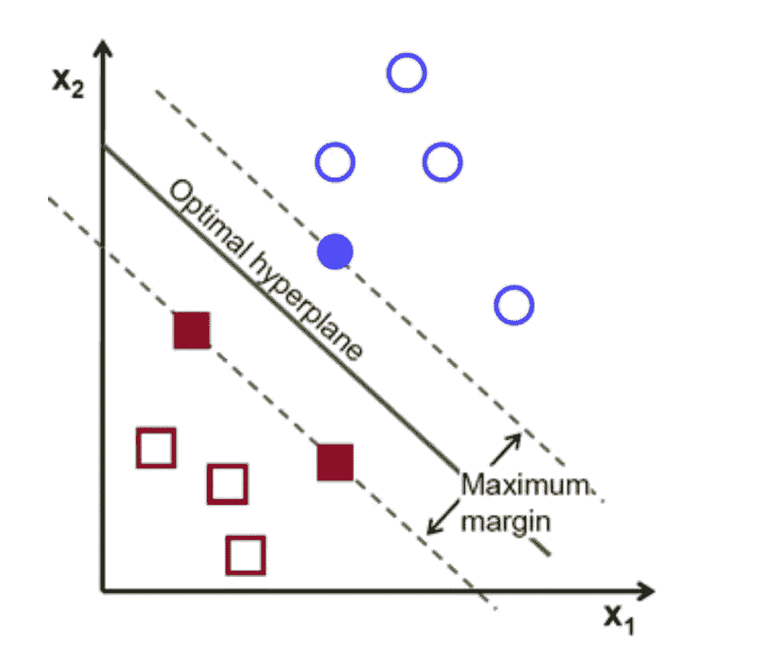
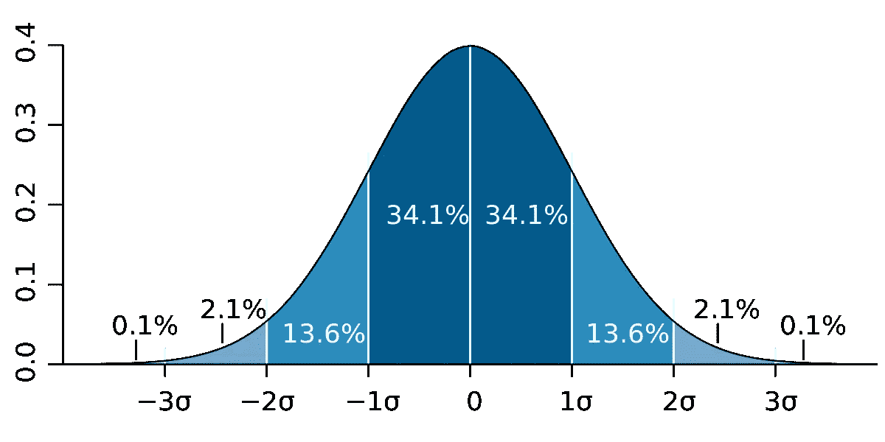
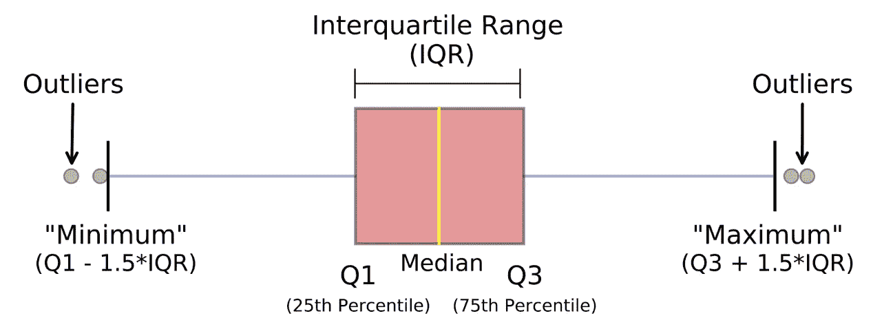
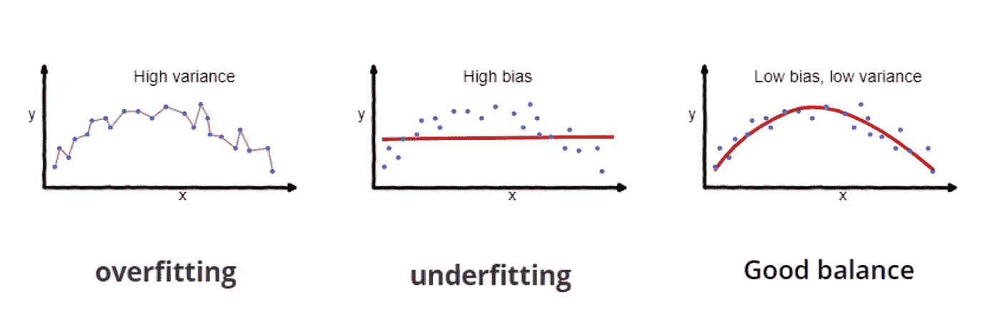
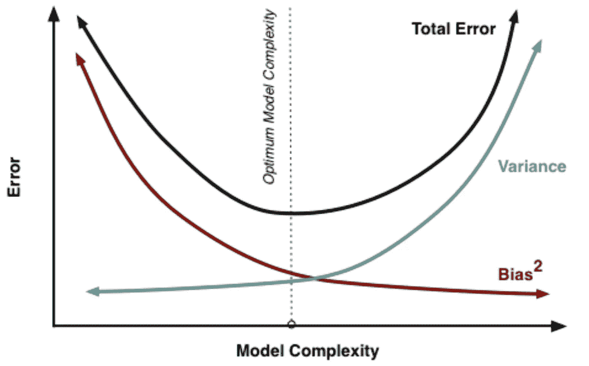
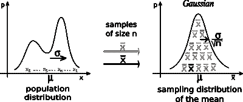

# 微软数据科学面试问答！

> 原文：<https://towardsdatascience.com/microsoft-data-science-interview-questions-and-answers-69ccac16bd9b?source=collection_archive---------6----------------------->

## 微软面试中一些数据科学问题的演练

***如果这是你喜欢的那种东西，成为第一批订阅*** [***我的新 YouTube 频道在这里***](https://www.youtube.com/channel/UCmy1ox7bo7zsLlDo8pOEEhA?view_as=subscriber) ***！虽然还没有任何视频，但我会以视频的形式分享很多像这样的精彩内容。感谢大家的支持:)***

# 背景

我现在对数据科学感兴趣大概有三年了。在我大学的第二年，我的朋友非常支持我进入数据科学的愿望，尽管我有商业背景。

他非常支持我，他给我转发了一份面试问题清单，这是他的朋友被微软要求获得数据科学合作职位时提出的问题。我记得当我最初浏览这些问题时，我觉得我在阅读另一种语言——看起来完全是胡言乱语。

几年后，我觉得自己对数据科学的基础有了更好的理解，所以我决定尝试回答这些问题！总共有 18 个问题，但我将只回答本文中的前 9 个问题——请关注剩下的面试问题！

# 面试问题

微软数据科学面试的面试问题

*注意:我不能 100%保证这些是微软问的。* ***然而*** *，我想即使在他们不在的情况下，这仍然会是一个很好的锻炼！此外，我完全有权利相信我的朋友向我提供了有效的问题。*

## 问:你能解释一下朴素贝叶斯的基本原理吗？你是怎么设定门槛的？

答:朴素贝叶斯是基于贝叶斯定理的分类模型。它最大的假设(也是为什么它被称为“天真”)是，它假设给定类，特性**是有条件独立的，但事实通常不是这样。*(感谢*[*Alex Murphy*](https://medium.com/u/29f745a2d6d?source=post_page-----69ccac16bd9b--------------------------------)*的澄清！)***

要设置阈值，您可以使用交叉验证来基于多个阈值确定模型的准确性。然而，根据不同的场景，您可能需要考虑假阴性和假阳性。例如，如果您试图对癌症肿瘤进行分类，理想情况下，您会希望确保没有假阴性结果(当有癌症肿瘤时，模型会说没有癌症肿瘤)。

## 问:你能解释一下 SVM 吗？

答:SVM 代表支持向量机，是一种监督机器学习模型，通常用作非概率二进制分类器[1]，但也可以用于回归。专注于最简单的用例，在两个类别之间进行分类，支持向量机找到两个数据类别之间的超平面或边界，使两个类别之间的差距最大化(见下文)。这个超平面然后被用来决定新的数据点是属于一个类别还是另一个类别。

分离两类数据的超平面示例

然而，超平面通常不像上面的图像那样明显和线性。有时，超平面可能难以确定，并且相当非线性。这时，更复杂的主题如核函数、正则化、gamma 和边距开始发挥作用。

你可以在这里了解更多关于支持向量机[和内核](https://medium.com/machine-learning-101/chapter-2-svm-support-vector-machine-theory-f0812effc72)[的信息。](/kernel-function-6f1d2be6091)

## 问:如何检测一个观察值是否是异常值？

答:有两种常用方法来确定观察值是否为异常值:

**Z 值/标准偏差:**如果我们知道一个数据集中 99.7%的数据位于三个标准偏差之内，那么我们可以计算一个标准偏差的大小，将其乘以 3，并确定超出该范围的数据点。同样，我们可以计算给定点的 z 分数，如果它等于+/- 3，那么它就是异常值。
注意:使用该方法时，需要考虑一些意外情况；数据必须呈正态分布，这[不适用于小数据集](https://statisticsbyjim.com/basics/outliers/)，并且过多异常值的存在会影响 z 值。

**四分位距(IQR):** IQR，用于构建箱线图的概念，也可用于识别异常值。IQR 等于第三个四分位数和第一个四分位数之差。然后，如果一个点小于 Q1-1.5 * IRQ 或大于 Q3 + 1.5*IQR，则可以确定该点是否为异常值。这达到大约 2.698 个标准偏差。

照片来自迈克尔·加拉尼克

其他方法包括 DBScan 聚类、隔离森林和稳健随机采伐森林。

## 问:什么是偏差-方差权衡？

答:**偏差**代表一个模型的精度。具有高偏差的模型往往过于简单，导致拟合不足。方差表示模型对数据和噪声的敏感度。具有高**方差**的模型导致过度拟合。

照片来自 Seema Singh

因此，**偏差-方差权衡**是机器学习模型的一个属性，其中较低的方差导致较高的偏差，反之亦然。一般来说，可以找到两者的最佳平衡，使误差最小化。

## 问:基本的统计问题，如方差、标准差等…

答:**方差**和**标准差**都衡量一个数据集相对于其均值的分散程度。区别在于标准差是方差的平方根。

*如果你想了解更多关于基础统计学的知识，请点击* *查看我的统计小抄* [*。*](https://medium.com/@terenceshin/week-2-52-stats-cheat-sheet-ae38a2e5cdc6)

## 问:讨论如何从产品用户群中随机选择一个样本。

答:可以使用一种叫做**简单随机抽样**的技术。简单随机抽样是一种无偏的技术，它从一个较大的数据集中随机抽取个体的子集，每个个体被选中的概率相等。这通常是在没有替换的情况下完成的。

有了熊猫，可以用**。sample()** 进行简单的随机抽样。

## 问:描述一下渐变增强的工作原理。

答:梯度提升是一种**集成**方法，类似于 AdaBoost，本质上是通过在损失函数中使用梯度来迭代构建和改进先前构建的树。最终模型的预测是所有先前模型预测的加权和。它如何一个接一个地改进自己的模型有点复杂，所以我在下面提供了一些链接。

[*了解渐变升压机*](/understanding-gradient-boosting-machines-9be756fe76ab)[*渐变升压解释*](https://www.displayr.com/gradient-boosting-the-coolest-kid-on-the-machine-learning-block/)

## 问:什么是 L1 和 L2 规范？两者有什么区别？

答:L1 和 L2 范数是两种不同的**正则化**技术。正则化是添加附加信息以防止过度拟合的过程。

实现 L1 范数的回归模型称为**套索回归**，实现 L2 范数的模型称为**岭回归**。两者的区别在于岭回归采用权重的平方作为损失函数的惩罚项，而 Lasso 回归采用权重的绝对值。

*更多关于差异的细节可以在这里阅读***。
阅读更多关于 L1 和 L2 的规范* [*这里*](/intuitions-on-l1-and-l2-regularisation-235f2db4c261#f810) *。**

## *问:什么是中心极限定理(CLT)？如何确定分布是否正态？*

*答:统计如何提供 CLT 的最佳定义，它是:*

> *“中心极限定理表明，无论总体分布的形状如何，随着样本量的增加，样本均值的抽样分布都接近正态分布。”[2]*

**

*中心极限定理的直观解释*

*有三种一般的方法来确定一个分布是否正态。第一种方法是用直方图直观地检查。更准确的检查方法是计算分布的**偏斜度**。第三种方法是进行正式测试来检查正态性——一些常见的测试包括 Kolmogorov-Smirnov 测试(K-S)和 Shapiro-维尔克(S-W)测试。本质上，这些测试将一组数据与样本的均值和标准差相同的正态分布进行比较。*

## *问:可以用什么算法来总结 twitter feed？*

*答:对于这个问题，我不确定答案，所以我联系了我的朋友 Richie，他是加拿大贝尔公司的数据科学家！*

> *总结课文有几种方法，但首先，理解问题很重要。“摘要”可以指情感或内容，并且摘要的级别和复杂程度可以不同。我会亲自和面试官澄清他们到底在寻找什么，但这并不意味着你不能做出假设(这是他们无论如何都想看到的)。*
> 
> *假设面试官正在寻找一些最有趣的代表性推文，例如，你可以使用 TF-IDF(**term-frequency-inverse document frequency**)。*
> 
> *例如，每个人都在谈论伊朗和美国之间的现状，所以你可以想象像“战争”、“导弹”、“特朗普”等词。频繁出现。TF-IDF 旨在给予那些更频繁出现的词更多的权重(即重要性)，并减少推文中诸如“the”、“a”、“is”等词的影响。*

# *感谢阅读！*

*如果你喜欢我的工作，想支持我…*

1.  *支持我的最好方式就是在**媒体**T21【这里上关注我。*
2.  *成为第一批在**Twitter**T2 上关注我的人之一。*我会在这里发布很多更新和有趣的东西！**
3.  *此外，成为第一批订阅我的新 **YouTube 频道** [这里](https://www.youtube.com/channel/UCmy1ox7bo7zsLlDo8pOEEhA?view_as=subscriber)！*
4.  *在 **LinkedIn** 上关注我[这里](https://www.linkedin.com/in/terenceshin/)。*
5.  *在我的**邮箱列表** [这里](https://forms.gle/UGdTom9G6aFGHzPD9)报名。*
6.  *看看我的网站，[**terenceshin.com**](https://terenceshin.com/)。*

# *更多相关文章*

* [## 更多微软数据科学面试问题和答案

### 微软面试中一些数据科学问题的另一个演练

towardsdatascience.com](/more-microsoft-data-science-interview-questions-and-answers-f9ee8337072c)  [## 谷歌的数据科学面试脑筋急转弯

### 作为谷歌数据科学面试的一部分，他们喜欢问一些他们称为“解决问题”的问题…

towardsdatascience.com](/googles-data-science-interview-brain-teasers-7f3c1dc4ea7f)  [## 数据科学家的 5 个常见 SQL 面试问题

### 帮助您发展 SQL 技能，在任何面试中胜出

towardsdatascience.com](/5-common-sql-interview-problems-for-data-scientists-1bfa02d8bae6)  [## 数据科学家的 40 个统计面试问题和答案

### 为你的面试复习统计知识的资源！

towardsdatascience.com](/40-statistics-interview-problems-and-answers-for-data-scientists-6971a02b7eee)  [## 亚马逊的数据科学家面试实践问题

### 一些亚马逊面试问题的演练！

towardsdatascience.com](/amazon-data-scientist-interview-practice-problems-15b9b86e86c6) 

# 参考

[1] [支持向量机](https://en.wikipedia.org/wiki/Support-vector_machine)，*维基百科*

[2] [中心极限定理，定义及例题步骤简单](https://www.statisticshowto.datasciencecentral.com/probability-and-statistics/normal-distributions/central-limit-theorem-definition-examples/)，*统计如何**