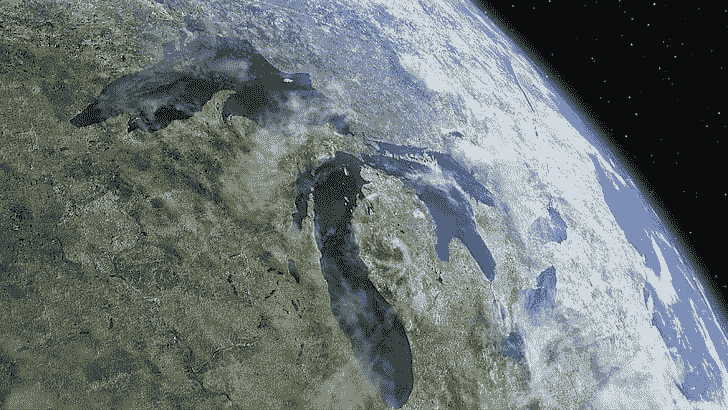
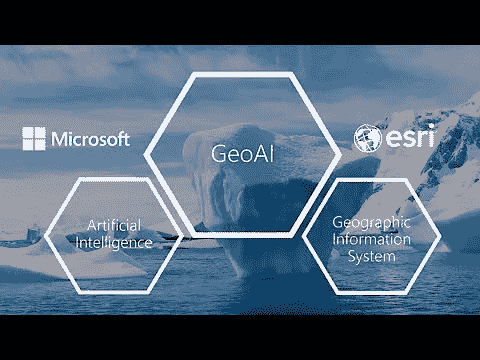

# 微软的“人工智能为地球”:人工智能如何帮助保护物种

> 原文：<https://towardsdatascience.com/microsofts-ai-for-earth-how-ai-helps-protect-species-3c8191f2b83d?source=collection_archive---------39----------------------->

*利用人工智能的潜力确保物种保护。微软的“AI for Earth”资助计划致力于这一目标，并支持阿拉斯加濒危物种保护的研究团队。*

在她的职业生涯之初，作为一名动物学家，艾琳·莫兰对她的日常生活有着不同的看法。动物学家通常坐在她的电脑前，而不是坐在阿拉斯加的海岸上，收集各种海洋生物的数据，以便研究它们的栖息地，并在未来能够更好地保护它们。数以千计的航空照片必须进行分析和评估。在她不断寻找濒危物种的过程中，对信息的评估通常需要很长时间，甚至在研究工作期间，这些信息也经常过时。需要一种更有效的解决方案。

## 评估:几小时而不是几个月

她与美国国家海洋和大气管理局(NOAA)的同事一起，提出了利用人工智能监控灰海豹数量的想法。研究小组首先为他们的飞机配备了更强大的相机，以拍摄高分辨率的航空照片。根据拍摄的照片，该团队开发了能够详细识别动物的算法，例如，从环境中区分海豹。这项技术现在使研究小组能够在几小时内记录海豹数量，而不是几个月。

## 聚焦本质:物种保护策略

对于微软的“AI for Earth”来说，研究小组的任务也是新的，因为尽管有许多模型可以识别图像中的人，但当时还没有技术可以识别海豹、熊或鲸鱼的图像。随着时间的推移，NOAA 和微软之间的图像和相关数据量增加了。合作之初，定期交换硬盘。如今，Azure 云连接显著改善了数据交换。此外，现在有一个扩展的机器学习培训，因此 NOAA 现在能够评估海豹种群的实时数据。

对于 Moreland 和她的团队来说，使用人工智能意味着一件高于一切的事情:时间。是时候制定保护策略并重新关注实际的研究工作了。

## 白鲸:人工智能探测到声音信号

当 Moreland 和她的研究小组在阿拉斯加沿海地区进行研究时，西雅图大学大气和海洋联合研究所(JISAO)的科学家 Manuel Castellote 正在研究阿拉斯加湾的白鲸。

由于航拍海洋动物几乎从未成功过，Castellote 专注于声学方法来建立鲸鱼的运动模式。一大优势:白鲸通过声音信号相互交流。为此，他们使用了广泛的曲目:从嗡嗡声到吱吱声，再到非常高的啁啾声，频率范围非常广，从 0.7 到 20 千赫。

为了能够识别鲸鱼信号，开发了一套算法，其命中率应该达到 99%，从而大大超过人工评估。

## 人的因素

卡斯特洛特还打算利用这项技术来调查“人类噪音”对鲸鱼行为的影响程度。“人类的噪音可以掩盖鲸鱼用来寻找食物和彼此交流的关键信号。如果这些动物不能进食、交配或繁殖，数量就不会增加，”卡斯特洛在微软的博客中说。“所以我们认为噪音是一个大问题，这也是我们关注的焦点。”

“人工智能拯救地球”项目目前在 71 个国家支持 435 个项目。