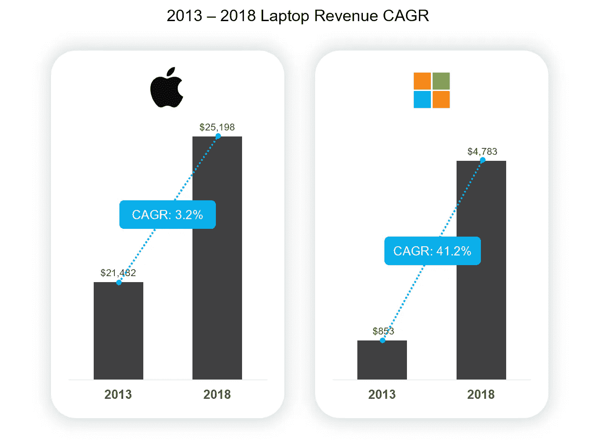
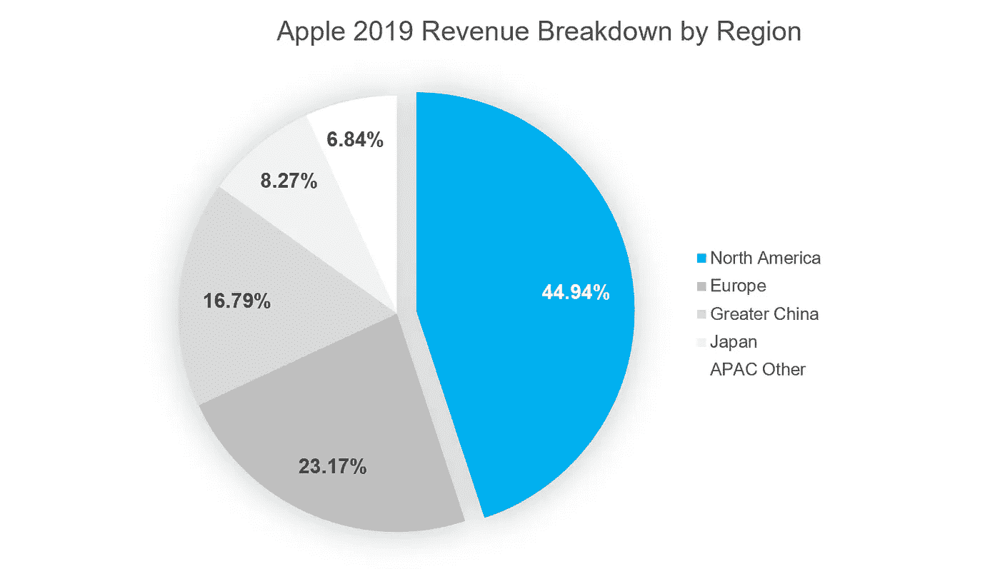

# 微软在硬件领域日益增长的主导地位

> 原文：<https://towardsdatascience.com/microsofts-bright-future-8c75f2e4dd38?source=collection_archive---------20----------------------->

## Surface Book 3 代表了微软的光明未来

免责声明 1:我拥有微软和苹果的一些股份。还有，这不是理财建议。

*免责声明 2:苹果公司在年度报告中将所有 Mac 销售归为一类，标为 Mac。包括台式机销售。在这个分析中，我假设 Mac 是笔记本电脑销售的主要代表——谁会拥有苹果台式机呢？*

2017 年 12 月，我冒险从使用苹果的 Macbook Pro 跳槽到微软的 Surface Book 2。从那时起，我就没有回头。与 Macbook Pro 相比，Surface Book 2 的创新性让我惊喜不已。在功能方面，微软超越了自己:它可以兼做一个巨大的 15 英寸平板电脑。它有一个强大的 NVIDIA 显卡，用于游戏和图形/视频编辑。它还集成了触摸屏，因此您可以轻松地与数字笔配对。在与苹果的竞争中，微软发现了一个强大的利基市场，开始开拓市场份额:功能价值。我认为这个广告将会为微软赢得很多未来的客户。Surface Book 3 是突出该公司成功的一个很好的例子。

# Surface Book 3 的隆重发布

我最欣赏微软 Surface Book 3 发布的部分是，他们将 Surface Book 2 用户记在了心里。其中一个原因可能是因为微软对 Surface 的策略是增长，而苹果的策略更侧重于保留。这个假设是基于我对苹果和微软笔记本电脑收入和市场份额的分析。

2019 年，苹果净营收约为 2610 亿美元。其中，近 260 亿美元来自 Mac 产品的销售(这包括台式机——但我们不要拿苹果的台式机成功开玩笑)。这大约是他们收入的 10%。相比之下，微软 2019 年的总收入为 1260 亿美元，而 Surface 系列占其中的近 60 亿美元(这也包括微软的 Surface Studio，这是一款桌面产品——可能不是收入的很大一部分)，或约为 5%。

我使用微软和苹果的 2019 年笔记本电脑收入数字创建的简化市场规模图表。

从市场规模的角度来看(假设笔记本电脑市场只有微软和苹果)，苹果占 81.4%，而微软占 18.6%——基于 2019 年的笔记本电脑收入。作为市场份额的少数股东，微软有更多的机会通过专注于高端笔记本电脑购买者来增加其份额，并将其转化为 Surface 买家。另一方面，苹果将经历更慢的增长(基于百分比)，因为它已经是成熟市场的市场领导者。这不仅体现在收入上，还体现在复合年增长率或 CAGR 上。

5 年 CAGR 比较:微软与苹果。我设计的。数据来源:各公司的年度报告。

微软 Surface 系列的收入增长令人印象深刻。五年来，微软的 Surface 销量 CAGR 增长了 41.2%，而苹果的 Mac 销量增长了 3.2%。很容易对比，可以看出微软的增长率要好得多。但是要避免这种诱惑，要认识到苹果从 2006 年开始销售 MacBooks。另一方面，微软是在 2013 年进入的，因此它可以更积极，由此产生的积极增长率是可以理解的。然而，这是令人印象深刻的增长，表明微软的 Surface 产品一直很受欢迎。

本着占领更多市场份额的精神，微软正专注于说服更多人购买 Surface Book 3。微软似乎更专注于将外部用户转化为 Surface 爱好者，而不是迫使其 Surface Book 2 用户购买新发布的 Surface Book 3，这可能导致糟糕的用户体验和潜在的客户流失。证据如下:

这是 Surface Book 2 还是 3？光看是看不出来的。来源:[微软官网](https://www.microsoft.com/en-us/store/configure/Surface-Book-3/8XBW9G3Z71F1?crosssellid=fbt-p2c&selectedColor=&preview=&previewModes=)

1.  Surface Book 2 和 Surface Book 3 的设计是一样的。一眼望去，没人能确定他们眼前的版本是 Surface Book 2 还是 Surface Book 3。
2.  Surface Book 3 的内部硬件规格令人印象深刻，但对于现有的 Surface Book 2 用户来说，这不是升级的必备产品。显卡从 NVIDIA 1060 升级到 NVIDIA 1660，内存从 16GB 增加到 32GB，对于离群的高级用户来说非常好。尽管如此，对于大多数用户来说，16GB 和 NVIDIA 1060 已经足够等待 Surface Book 4 甚至更高版本了。
3.  对于没有 Surface Book 2 的用户来说，购买 Surface Book 3 是有吸引力的，因为它具有前面提到的功能以及价格范围，与新一代 Macbook Pro 相比具有竞争力。下表列出了微软和苹果各种产品的价格范围。平均而言，微软的笔记本电脑产品(1831 美元)比苹果的(平均 2662 美元)便宜约 30%。具体来说，虽然 Surface Book 3 在仅比较基础价格时比 Macbook Pro 贵，但 Surface Book 的 max-spec 版本(3400 美元)比 Macbook Pro 的 max-spec 版本(6099 美元)便宜 44%。不过，Macbook Pro 的 max-spec 版本配备了两倍的内存(64GB)和四倍的磁盘空间(8TB)。当标准化规格(2TB 和 32GB RAM)时，Surface Book 3 便宜 500 美元，即 12.8%。

从苹果到 T2【微软的各种笔记本电脑选择的价格范围列表。从各自官方网站收集的数据。

这可能是一个巧合，微软正在采取这些措施来建立一个策略，方便地让现有的 Surface Book 爱好者满意。尽管如此，我认为他们是最有计算能力的。

# 微软在蚕食市场份额

我设计的笔记本电脑市场份额的简化可视化，只看微软和苹果。基于 2013-2019 年间各公司各自年报的收入数据。

自从[微软在 2012 年 10 月](https://en.wikipedia.org/wiki/Surface_(2012_tablet))发布第一代 Surface 以来，微软一直在大举蚕食笔记本电脑的市场份额。上面的图表显示了从 2013 年到 2019 年的六年间市场份额的变化(尽管只是基本的市场份额，假设微软和苹果是整个笔记本电脑市场)。在推出第一款 Surface Book 后的一年里，微软占了 3.8%——到 2019 年，这一比例增长了近 5 倍，达到 18.6%。

评论家可能会看着市场份额图抱怨说，只看微软和苹果并不是全貌，也不能保证微软甚至直接与苹果竞争。嗯，是的，我还没有从塞特亚·纳德拉本人那里得到直接确认，说有直接竞争的意图。但不管竞争是否是有意的，效果是可以感觉到的。看看下面的时间线。

苹果收入同比变化，与微软的发布保持一致。根据苹果公司提交的年度报告更改数据。来自维基百科的微软产品公告。面创 1，[面书 1](https://en.wikipedia.org/wiki/Surface_Book) ，[面书 2](https://en.wikipedia.org/wiki/Surface_Book_2)

将苹果笔记本电脑的收入变化与微软的发布时间表叠加起来，我们可以看到微软笔记本电脑产品的发布确实对苹果笔记本电脑的销售产生了一些潜在的影响。2013 年和 2016 年两次最糟糕的收入变化也是在微软发布主要笔记本电脑之前:分别是第一代 Surface 和第一代 Surface Book。2018 年，苹果笔记本电脑出现小幅负增长。在它之前，微软公布了 Surface Book 2。但是谁知道呢——有可能所有这些事件只是纯粹的巧合。

# 微软硬件采用的其他潜在催化剂

## iMessage 的价值不断下降

当我在 2017 年放弃我的 Macbook Pro 时，最让我害怕的是我正在断绝集成的便利性。通过只使用苹果产品，我可以在不同设备之间无缝切换；例如，我可以在手机上开始 iMessage 对话，然后跳到我的笔记本电脑上继续，反之亦然。

快进到 2020 年，我唯一一次使用 iMessage 是为了接收短信验证码。随着大量通信软件的出现，我所有的实时文本对话都开始进入 WhatsApp、Facebook Messenger、Discord、微信和 Slack。所有这些应用都与操作系统无关，所以无论我使用的是 Mac 还是 Windows PC，我都可以从移动设备跳到桌面设备。

资料来源:[统计局](https://www.statista.com/chart/4245/whatsapp-user-growth/)

趋势是远离 iMessage，这不仅仅是一个人的问题。其他通信技术的全球采用正在快速增长。[Whatsapp 2020 年用户达到 20 亿](https://techcrunch.com/2020/02/12/whatsapp-hits-2-billion-users-up-from-1-5-billion-2-years-ago/)。Slack 在 2019 年第四季度增长到[超过 1200 万日活跃用户](https://www.cnbc.com/2019/10/10/slack-says-it-crossed-12-million-daily-active-users.html)。中国移动应用微信的日活跃用户已经超过[10 亿](https://www.zdnet.com/article/daily-active-user-of-messaging-app-wechat-exceeds-1-billion/)。这些趋势不应该太令人惊讶，因为每个不使用苹果产品的人都可以使用这些应用程序无缝地从移动设备跳到桌面和其他设备。减少对苹果专属 iMessage 的依赖，也减少了对整个苹果生态系统的依赖。

## 当前的经济状况

尽管这两家公司都是国际性的，但其收入的最大部分仍来自北美。下图分解了苹果 2019 年的营收。这些数据是从苹果提交给 SEC 的 [2019 年度报告中收集的。2019 年，其全部收入的 44.9%来自北美。微软 2019 年收入](https://investor.apple.com/sec-filings/sec-filings-details/default.aspx?FilingId=13709514)[的 51.4%来自美国](https://microsoft.gcs-web.com/node/27091/html)。

数据来源:苹果 2019 年[年报](https://investor.apple.com/sec-filings/sec-filings-details/default.aspx?FilingId=13709514)。我设计的图表。

北美，尤其是美国目前的经济状况，是世界已经熟悉的。5 月 7 日， [CNN 报道](https://www.cnn.com/2020/05/07/economy/unemployment-benefits-coronavirus/index.html)“自三月中旬以来，五分之一的美国工人申请失业救济。”当人们还在争论这个国家是否陷入衰退时，CNN 也报道说“美国已经陷入衰退”

不管国家的经济支出类别是什么，事实仍然是人们对支出持谨慎态度，特别是由于不确定的工作条件(冻结招聘、修订报价、裁员和休假)，加上令人失望的股市表现(尽管它似乎正在良好地复苏)。这个国家何时重新开放存在不确定性，这增加了把钱留在口袋里而不是消费的压力。虽然这种支出的缩减起初似乎对微软或苹果不是好兆头，但也有两件事要记住。首先是[口红效应](https://en.wikipedia.org/wiki/Lipstick_effect)。

> “口红效应是一种理论，即当面临经济危机时，消费者会更愿意购买价格较低的奢侈品。例如，人们会买昂贵的口红，而不是买昂贵的毛皮大衣。潜在的假设是，即使出现危机，消费者也会购买奢侈品。当消费者对经济的信任度下降时，消费者会购买对其可用资金影响较小的商品。在化妆品市场之外，消费者可能会被昂贵的啤酒或体积更小、价格更低的产品所诱惑。
> 
> *来源:* [*维基*](https://en.wikipedia.org/wiki/Lipstick_effect)

我觉得苹果在这方面有优势。在奢侈品技术方面，它的品牌认知度比微软更强。我刚才说的话没有消息来源；你可以把它当作一个强烈的观点，但我认为没有多少人会不同意它。对于那些认为苹果品牌是“负担得起的”奢侈品的人来说，他们可能会在经济低迷时期继续购买苹果产品。但我也认为这将是少数购买者。

衰退期间的大多数购买者更有可能是那些购买必需品的人。这次购买有点不同，因为奢侈品的联想并不那么重要；相反，人们倾向于做出更明智的决定。我认为微软在这方面有优势，因为它的价格范围和上述功能。也就是说，经济环境对两家公司都不理想，所以总体来说不是一件好事。但这是一个机会，无论多么小，对于微软来说，这都是一个赢得用户的机会，这些用户开始重新考虑他们下一次购买昂贵的 Macbook Pro。

# 为什么人们不想购买微软硬件

## 苹果生态系统(不包括 iMessage)

虽然 iMessage 不再重要(之前讨论过)，但苹果生态系统的其余部分可能会产生一些依赖性，甚至是厂商锁定。例如，订阅 iCloud 并将其用作云存储可能会锁定用户继续购买苹果产品，因为 iCloud 在他们之外并不容易使用。

此外，隔空投送等苹果专用功能的重度用户可能会享受到只需在手机和桌面之间点击一下就能分享图像和视频的便利。像我这样的失败者，拥有苹果和微软的产品，需要额外点击几次(在 Slack 或电子邮件上给自己发送照片和视频，然后在我的桌面上打开)。虽然额外的几次点击听起来并不多，但它加起来会对用户体验产生很大的影响。

## 用户体验

用户体验是这样一种东西，如果你没有考虑过，那么仅仅听到它听起来是不可思议的。用户体验专家知道著名的[谷歌声称](https://www.hobo-web.co.uk/your-website-design-should-load-in-4-seconds/)如果一个移动网站不在三秒钟内加载，超过 50%的用户会离开。三秒钟起初听起来并不多，尤其是对于拨号时代的老手(在 AIM 上打我一下)。

但是如果你不相信这一点，那么下次你解锁你的手机，在你点击任何东西之前数到三。我打赌你会不耐烦的。我们很焦虑，尤其是在从技术中获得我们想要的东西的时候。像苹果这样的公司非常努力地让我们的事情变得非常简单，所以当谈到获得我们想要的东西时，当然有一个高标准——无论是加载时间，点击量，还是只是理解如何使用某些东西。

苹果在交付漂亮、极简的硬件设计和出色的用户体验方面做得非常出色。这就是为什么我仍然坚持使用 iPhones，我也没有任何转行的打算。不过，微软已经采取了一些非常积极的举措来改善用户体验和漂亮的设计。在这一点上，我不会说微软与苹果相比在这方面有所欠缺，但微软将不得不花费更多的资源来说服新的潜在客户，让他们相信它在这个领域同样出色。

# 下一个前沿

我很兴奋地看着微软未来几年的发展，我希望 Surface 产品的战略是微软想要为自己绘制的整体道路的一瞥。从财务上来说，Surface 的推出获得了巨大的成功。在功能方面，微软有策略地推动新一代 Surface Book 的发布，不要迫使现有用户升级，这可能会显得过于激进。该公司正在推进一项大胆而令人尊敬的战略，该战略正在发挥作用。