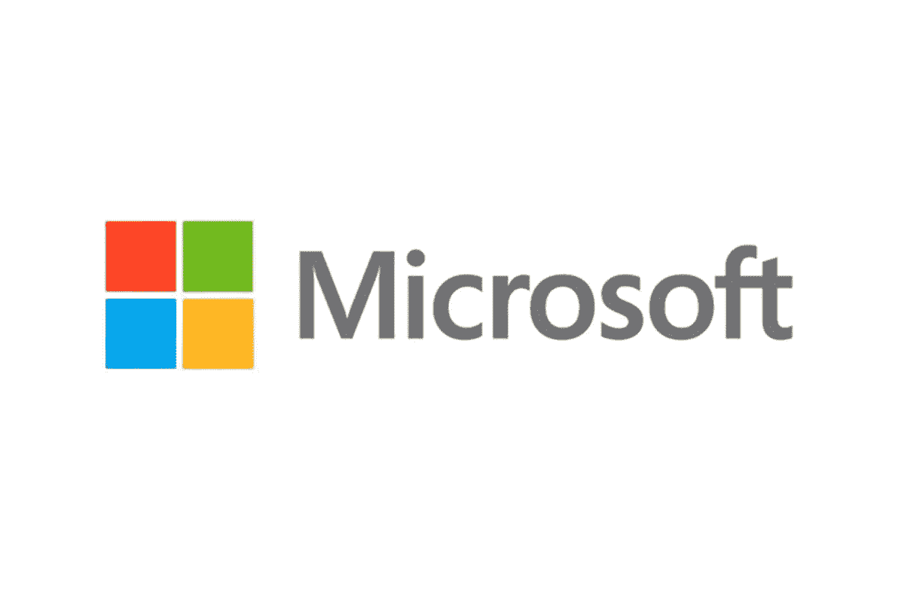

# 微软的数据科学家面试问题

> 原文：<https://towardsdatascience.com/microsofts-data-scientist-interview-questions-4c6f3a62ef64?source=collection_archive---------5----------------------->

***查看数据科学家职位空缺，华盛顿*** [***此处***](https://careers.microsoft.com/us/en/job/767941/Data-Scientist) ***！***

谈到技术，微软无疑是最大的玩家之一。当涉及到面试微软或任何巨头时，你都要从头开始。随着 Azure、AI 工具的出现，以及对机器学习的高度依赖，微软是数据科学行业领域的新兴大玩家。微软正在慢慢主导云计算行业。也就是说，微软当然需要雇佣比以往更多的数据科学家。

在过去的五年里，微软一直是数据科学家职位最大的招聘池之一。参加过微软的面试后，我写下面试时的环境变得更容易了。相信我，这并不可怕！微软让你感觉很舒服。招聘经理为你提供建议，招聘人员和团队成员确保你带着新知识离开面试现场。

在这篇博客中，我将详细介绍微软数据科学家的角色和职责、资格、面试筛选、典型的“微软问题”等等…

# 主要职责描述

典型的*角色或职责*部分包括以下几点:不是全部，而是一部分。现在，看一下这个角色的描述是非常重要的，因为你可能想在开始之前在你的简历中加入一些关键词。

1.  执行数据挖掘、统计研究、客户细分、剖析和建模，为业务需求提供解决方案，并支持长期数字营销战略
2.  通过利用复杂的数据源网络，执行统计分析、群组研究、机器学习和预测建模。
3.  每天组织和讨论大型数据集，对客户行为数据、转换和活动数据进行分析，以帮助企业识别模式、驱动因素并创建预测模型。
4.  与业务利益相关者合作，将洞察力转化为行动
5.  研究和评估来自不同来源的大量数据(例如，在线和离线数据、调查数据、行为数据、商业数据、文本数据等)。)来识别统计模式，形成建模的思路。
6.  进行探索性数据分析、机器学习、数据挖掘和统计，从大量行为数据中获得可操作的见解，从而构建解决方案。
7.  通过应用先进的 ML 技术进行实体提取、评分和主题聚类，构建文本分析解决方案。
8.  创建有意义的演示和分析，讲述一个关注洞察力而不仅仅是数据的“故事”
9.  通过应用数据科学定义和衡量成功的 KPIs 指标，帮助提高转化率或客户满意度。
10.  提供以数据为中心的分析领导力，促进数据驱动的决策制定

# 资格

*经历&资历*

1.  需要数据科学、经济学、分析学、统计学、计算机科学或相关学科的学士/硕士学位
2.  需要 2 年以上处理来自不同数据源的大量数据的机器学习工作经验(对于实习生职位，这不包括在内)
3.  强大的理论/算法背景，非常了解如何应用先进的统计技术来解决实际问题。
4.  至少在以下一个领域有丰富的知识和经验:数据挖掘，机器学习，统计分析，受控实验
5.  有从事大数据和 ML 技术的经验——Azure ML、Cosmos/Hadoop、Databricks、R、Python、SQL、SAS
6.  优秀的沟通和演示技巧，能够以简单易懂的故事/可视化方式向管理层和大型团队解释复杂的数据
7.  自我激励，能够独立工作并跨团队工作
8.  批判性思维和解决问题的技能
9.  强大的组织和优先排序技能

# 面试回合

这因角色、地点、团队、角色(全职还是实习)和许多其他因素而异。一般来说，微软坚持 3 轮筛选。

1.  与招聘经理进行 30 分钟的电话面试
2.  45-60 分钟的团队音频/视频访谈
3.  最终摊牌:45-60 分钟——现场面试/视频面试

不管你用什么方式与微软沟通，你都可以肯定地期望自己在编码。语言是你的选择，但你必须编码！

下面我整理了一份之前在微软数据科学家面试中被问到的所有面试问题的清单。2019 年 10 月我为微软面试时，我列出了这个问题列表，现在，这个列表是为准备微软面试的任何人准备的。

当我准备这些问题时，我相信并准备好自己去期待一系列完全不同的问题。但令我十分惊讶的是，我被问到了其中的 3 个问题。再说一次，这不是微软面试的圣经。这更取决于你会和哪个团队合作。如果是核心人工智能或深度学习工作，问题可以更具体地针对该领域。

我会说，让我们看一个“初级数据科学家面试问题”列表。

你可以肯定的一个问题是从你的简历中解释一个你做过的项目/论文。基本上，他们会要求你解释你列出的项目或论文，并试图围绕该项目提出问题；你学到了什么，面临的问题，解决方案，围绕它的一般问题。这是他们评判你能力的时候。这应该是一个令人欣慰的地方，在这里你可以谈论你所做的事情。但是不要低估它。围绕它也会有困难的问题。

我的一个项目让我处理中等规模的数据集，在解释那个项目中做了什么时，有人问我— *“如果你有大量未标记的数据和一小组正标记的数据(没有负标记可用)，你能想出一些使用这个数据集学习分类器的策略吗？您如何决定将哪个模型应用于您的数据？*

# 问题

*   为什么神经网络在工作，为什么它是一个蓬勃发展的领域？
*   什么是混淆矩阵？如何向一个非统计学的人解释？什么是假阳性和假阴性？
*   随机森林、套索和岭回归是如何工作的？套索和山脊的区别。
*   写一个函数来检查一个特定的单词是否是回文。
*   在整数列表中寻找子序列的最大值。
*   从有偏差的硬币中产生公平的硬币。
*   从一个以概率 p 和(1-p)返回 1/0 的函数生成 7 个等概率整数。
*   ROC 曲线和敏感性、特异性、混淆矩阵的含义是什么？
*   给定一个时间序列数据集，你将如何预测未来值？
*   如何向客户解释一个深度学习模型？
*   什么是 P 值？你将如何向团队中的非技术人员解释 p 值？
*   如何通过玩一些计算技巧来更快地计算逆矩阵？
*   描述梯度增强的工作原理。
*   在应用机器学习算法之前，描述数据争论和清理的步骤。
*   如何处理不平衡的二元分类？
*   如何检测一个新的观察值是否是异常值？什么是偏差-方差权衡？
*   解释支持向量机(SVM)。
*   合并 k(本例中 k=2)个数组并排序。
*   如何最好地从 500 万个搜索查询中选择一个有代表性的样本？
*   西雅图的三个朋友告诉你下雨了。各有 1/3 的说谎概率。西雅图下雨的概率有多大？
*   你能解释一下朴素贝叶斯的基本原理吗？你是怎么设定门槛的？
*   你能解释一下什么是 MapReduce 以及它是如何工作的吗？
*   如何检测一个新的观察值是否是异常值？
*   讨论如何从产品用户群中随机选择一个样本。
*   在整数列表中寻找子序列的最大值。
*   你会怎么总结一个 twitter feed？
*   在应用机器学习算法之前，解释数据争论和清理的步骤。
*   如何处理不平衡的二元分类？
*   如何测量数据点之间的距离？
*   定义方差。
*   箱形图和直方图有什么区别？
*   你如何解决 L2 正则化回归问题？
*   如何通过玩弄一些计算技巧来更快地计算逆矩阵？
*   如何不用计算器进行一系列计算？解释这些步骤背后的逻辑。
*   数据可视化的好坏有什么区别？
*   你如何找到百分位数？为它写代码。
*   从一系列值中找出最大和子序列。
*   L1 和 L2 有什么不同的正规化指标？
*   你能解释一下朴素贝叶斯的基本原理吗？你是怎么设定门槛的？
*   如何检测一个观察值是否是异常值？
*   什么是偏差-方差权衡？
*   讨论如何从产品用户群中随机选择一个样本。
*   k-means 收敛到全局解吗？如果有，能否给出直觉？如果没有，有什么策略可以让我们使用 k-means 得到更好的聚类？
*   与测试数据相比，训练数据的准确性有多重要？
*   你说的装袋助推是什么意思？所涉及的分类器的关键区别是什么？

这些是随着时间的推移积累的一些问题，不一定期望你所有的问题都来自这里，但至少我有三个问题。所以现在，当你在不久的将来参加微软的面试时，一定要在你的书签中加入这个故事来练习这个列表。

感谢您的阅读！我希望你喜欢这篇文章。一定要让我知道你在微软的数据科学面试中有什么问题。

面试愉快！

*免责声明:本文表达的观点仅代表我个人，不代表严格的观点。*

# 了解你的作者

拉什是芝加哥伊利诺伊大学的研究生。她喜欢将数据可视化，并创造有见地的故事。她是用户体验分析师和顾问、技术演讲者和博客作者。