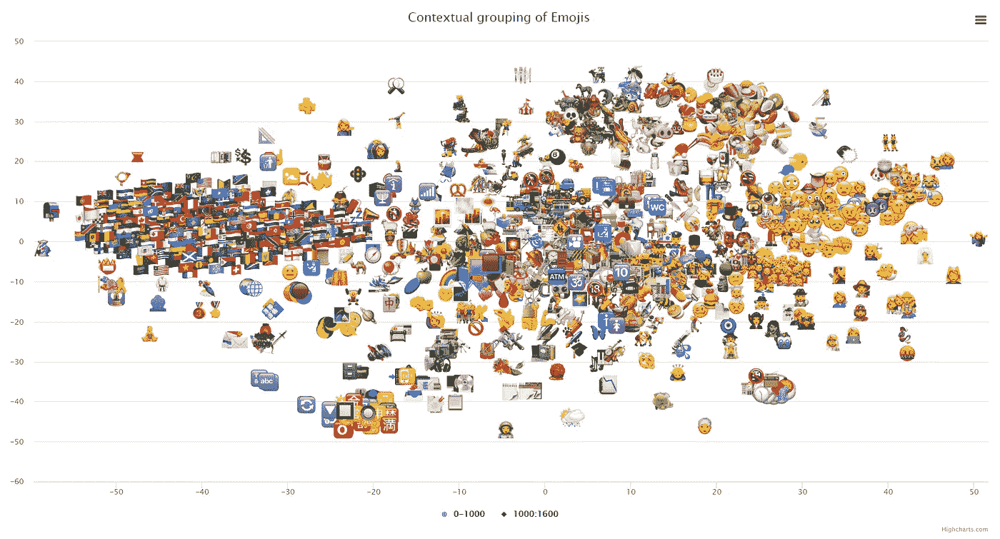
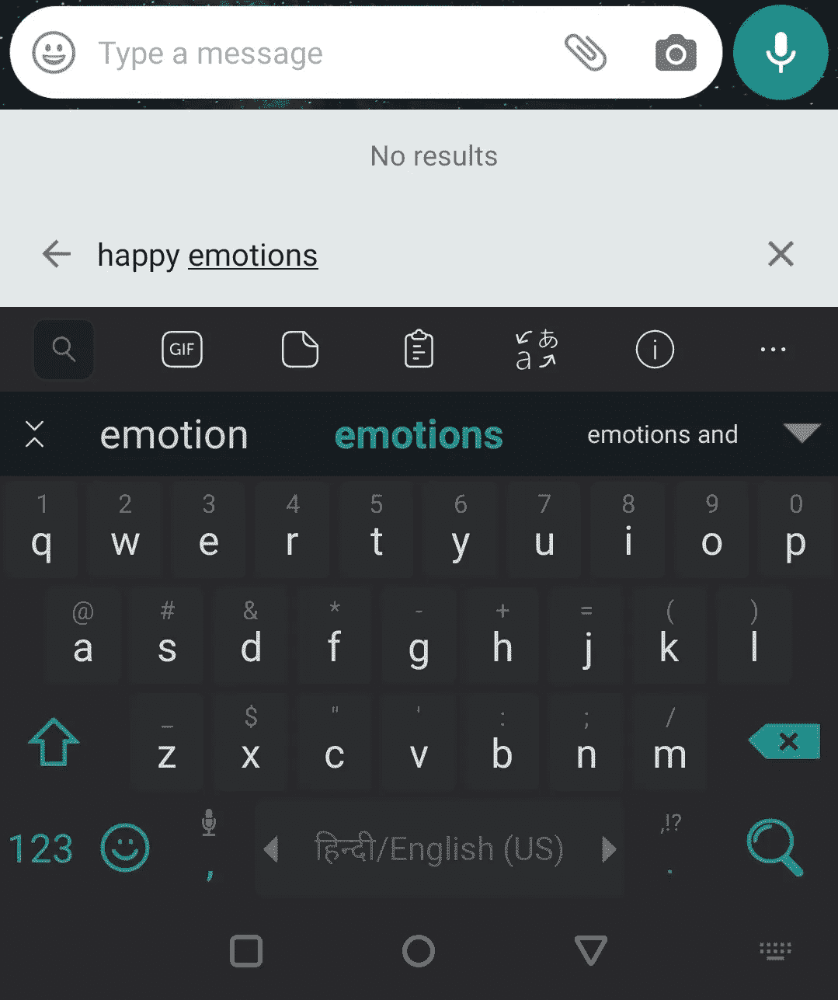
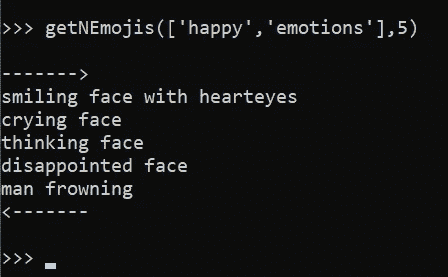

# 午夜黑客 2:使用文档嵌入的上下文搜索和表情分组

> 原文：<https://towardsdatascience.com/midnight-hack-episode-2-contextual-search-grouping-of-emojis-using-document-embedding-9bee5bbed6cc?source=collection_archive---------35----------------------->

引文:[http://www.satandigital.com/apps/EmojiPlot/](http://www.satandigital.com/apps/EmojiPlot/)

你好。！！欢迎来到我又一个愚蠢的项目。

所以前几天我在用 [**Whatsapp**](https://www.whatsapp.com/) 的时候，发现这个用关键词查找表情符号的很酷的小功能真的很有趣。现在，我很确定他们没有使用机器学习来实现这一点，这很可能是硬编码关键词和表情符号的简单映射。

但是，如果你能更进一步，不把搜索功能局限于那些预定义的关键词，而是根据搜索关键词的上下文含义来搜索表情符号，那会怎么样呢？

懒得通读？**你可以在这里查看表情图:**[http://www.satandigital.com/apps/EmojiPlot/](http://www.satandigital.com/apps/EmojiPlot/)

该图具有缩放和平移功能。单击并拖动鼠标进行缩放，使用 shift 键进行平移。

**并且抓取的数据集托管在这里:**[https://github.com/AtomicSpider/Emoji-Dataset](https://github.com/AtomicSpider/Emoji-Dataset)

该项目有 4 个部分:

1.  准备表情数据集
2.  生成表情符号的矢量或数字表示
3.  在 2D 空间绘制表情符号
4.  编写搜索脚本

1.  **准备表情数据集:**

一个简单的谷歌搜索把我带到了 https://unicode.org/，那里有所有表情符号、图像、Unicode ids、base64 数据 URIs 和名字的综合列表。

我编写了一个简单的 web 抓取脚本来下载所有的图像和元数据，并创建了一个主数据集 JSON，它也引用了图像文件。

数据集可以在这里找到:[https://raw . githubusercontent . com/atomic spider/e moji-Dataset/master/Dataset/Dataset . JSON](https://raw.githubusercontent.com/AtomicSpider/Emoji-Dataset/master/dataset/dataset.json)

生成表情数据集的脚本

**2。生成表情符号的矢量或数字表示:**

我遇到了[**word 2 vec**](https://radimrehurek.com/gensim/models/word2vec.html)**，**一个两层的神经网络，它可以提取单词并生成单词的多维向量表示。

word2vec、 [**doc2vec**](https://radimrehurek.com/gensim/models/doc2vec.html) **、**的文档等效，工作原理类似。doc2vec 获取文档或一组单词，并生成它的多维向量表示。

我决定使用 doc2vec，从表情符号名称中提取关键词，并为每个表情符号生成 300 维向量。

表情符号名称可以直接用作 doc2vec 模型的输入，但我继续使用 **nltk** (自然语言工具包)从名称中删除停用词以实现更好的准确性。

生成表情矢量的脚本

**3。2D 空间的剧情表情符号:**

酷！！！现在我们有了矢量数据，绘图应该很容易，对吗？对吗？？

引用:图片来自 giphy.com([https://giphy.com/gifs/the-office-mrw-d10dMmzqCYqQ0](https://giphy.com/gifs/the-office-mrw-d10dMmzqCYqQ0))

事实上，这部分花了我不少时间才弄明白。第一个问题是:你如何绘制 300 维的向量？

经过相当多的研究，我决定使用[**tSNE**](https://scikit-learn.org/stable/modules/generated/sklearn.manifold.TSNE.html)**并减少生成的表情向量的维数。**

**对！！！现在我们有了绘图数据，用表情符号生成一个简单的散点图就很容易了，对吗？对吗？？对吗？？？**

**引用:图片来自 giphy.com([https://media.giphy.com/media/26DOzMVt4i9GzzxyE/source.gif](https://media.giphy.com/media/26DOzMVt4i9GzzxyE/source.gif))**

**问题是，我想用表情符号作为分散点的自定义标记。遗憾的是 python 对此没有很好的支持。**

**R 中有一个库， **ggplot** 可以和[**dill/e mogg**](https://github.com/dill/emoGG)**一起使用来生成表情符号标记，但是剧情看起来不太好。此外，没有平移和缩放功能。****

****所以我决定使用[**high charts**](https://www.highcharts.com/)**导出数据和绘图。感谢我的同事 Vinoth，他帮助我弄清楚了如何在 HighCharts 中使用自定义标记。******

****导出高图表绘图的数据****

****用于绘制表情散点图的 Javascript 代码****

********

****引文:[http://www.satandigital.com/apps/EmojiPlot/](http://www.satandigital.com/apps/EmojiPlot/)****

****剧情页面可以在这里进入:****

******正如你所看到的，我们采用的方法能够很好地对表情符号进行分组。可以看到所有的旗帜在左边组合在一起，动物在中间上方，食物在右上方，表情符号在右边等等。******

********4。写一个搜索脚本:********

****对于从关键词中搜索表情符号，我们可以使用相同的 doc2vec 模型将搜索关键词转换为向量，并从表情符号向量列表中找到该向量的最近邻居。****

******结果:******

****如果你在 WhatsApp 的表情键盘上搜索快乐情绪，它不会产生任何结果。****

********

****引用:截图来自我的手机****

****但是通过我们的方法，我们能够用上下文信息搜索相关的表情符号，而不是硬编码的关键字映射。****

********

****引用:截图来自我的笔记本电脑****

****我的失眠之夜就此结束😁。****