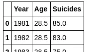
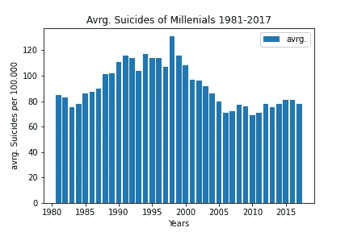
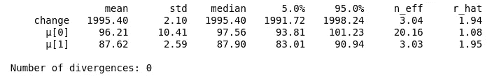
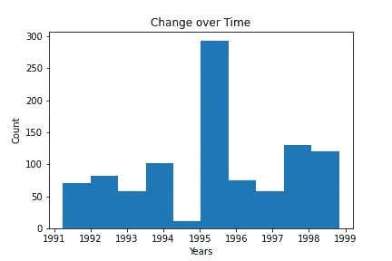
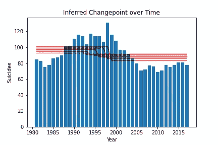
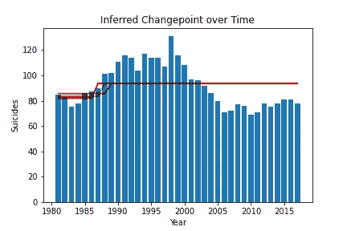

# 千禧年自杀|概率转折点分析

> 原文：<https://towardsdatascience.com/millennial-suicides-an-analysis-about-change-1bf3294a9030?source=collection_archive---------46----------------------->

## 一个简单而有意义的概率 Pyro 模型来揭示随时间的变化点。


**孤独**。一张由[萨莎·弗里明德](https://unsplash.com/@sashafreemind?utm_source=unsplash&utm_medium=referral&utm_content=creditCopyText)在 [Unsplash](https://unsplash.com/s/photos/lonely?utm_source=unsplash&utm_medium=referral&utm_content=creditCopyText) 上拍摄的照片

媒体的一个深刻观点和观察是，从 20 世纪 80 年代到 21 世纪初，英国年轻人的自杀率有所上升。你可能会在新闻、[和出版物](https://www.cdc.gov/mmwr/volumes/66/wr/mm6630a6.htm)中找到它，或者它只是被大众接受的事实。但是你怎么能让它变得可测量呢？

# 让假设变得有形

为了使这种说法可检验，我们寻找数据，并在英国国家统计局找到了自杀率的概况，特别是英格兰和威尔士。

[https://www . ons . gov . uk/visualizations/DVC 661/sizes/index . html](https://www.ons.gov.uk/visualisations/dvc661/suicides/index.html)

一般来说，在日常生活、商业或学术中，一种基本的问题是什么时候发生了变化。你假设随着时间的推移，一些事情已经发生了根本性的变化。为了证明你必须量化它。所以你得到一些关于主题的数据，并建立一个模型来**显示值发生变化的点**以及它们的大小。我们将研究如何做到这一点。

# 特别是千禧年自杀事件

根据手头的数据，我们取了千禧一代年龄组的平均值。为了简单起见，这意味着年龄在 25 到 35 岁之间。给定我们的数据集，我们可以将 20 世纪 80 年代以来千禧一代的平均自杀人数可视化如下:

```
suicide_millenials_df = suicide_data[suicide_data.Age.isin(range(23,35))].groupby(["Year"]).mean().reset_index()
# round values to closest integer
suicide_millenials_df["Suicides"] = suicide_millenials_df.Suicides.round()
suicide_millenials_df.head()
```



数据帧的头部应该是什么样子。



*图 1—1981 年至 2017 年英格兰和威尔士 25 至 35 岁年龄组的平均自杀率(每 10 万人)。*

从这些数据中，我们可以清楚地看到，随着时间的推移，直到 2000 年代初，数据稳步上升，然后下降，直到 2010 年代。我们好奇的一面想知道这到底是什么时候发生的，这样我们就可以出去寻找根本原因以及与那些影响趋势相关的潜在问题。让我们建立一个模型，找出究竟在哪一年中会出现实质性的变化。为了寻找一个特定的变化点，我们将使用[烟火苹果](https://pyro.ai/)作为一个概率框架。

# 怎么做

选择的方法是泊松回归，我们的变化率来自正半高斯。我们将使用[【2】](https://cscherrer.github.io/post/bayesian-changepoint/)中描述的数学基础。这需要:多年来的均匀先验分布 **T** ，半正态分布(高斯的正侧)的变化率 **μ** 用[反转括号](https://en.wikipedia.org/wiki/Iverson_bracket)表示。看着这些数据，我们为我们的比率设置了一个大的范围，因为我们想要捕捉从 75 到 130 的变化——大约 50。最后，我们通过泊松回归找到观察到的自杀率。

*注:回归需要我们从正态分布中取样。*

T∞U(1981，2017)，μ_ 0∞N+(0，50)，μ_ 1∞N+(0，50)，N _ T∞泊松(μ_[t>T])

这些参数是可以调整的——也许你会寻找不同尺度的变化，无论是随着时间的推移还是影响的大小。人们可能会考虑半柯西分布的更极端的值或简单的增加/减少规模。

# 烟火模型

```
def model(years, suicides):
    σ = pyro.param('σ', torch.ones(data_len))
    T = pyro.sample('change', dist.Uniform(1981, 2017))
    grp = (years > T) * 1
    # Independent events 
    with pyro.plate('rate', 2):
        μ = pyro.sample('μ', dist.HalfNormal(scale=50))
    y_obs = pyro.sample('obs', dist.Normal(μ[grp], σ), obs=suicides)
```

grp 给出了括号中μ的指数。
然后从正态分布中对模型观测值进行采样，考虑μ和比例=σ=1(模型中的最后一行)。
在运行这个模型之前，我们使用 PyTorch 将数据帧转换成可读取的张量，如下所示:

```
years = torch.from_numpy(suicide_millenials_df.Year.values)
suicides = torch.from_numpy(suicide_millenials_df.Suicides.values)
data_len = len(suicide_millenials_df)
```

对于拟合过程，我们利用 [MCMC 方法](https://www.sheffield.ac.uk/polopoly_fs/1.60510!/file/MCMC.pdf)进行贝叶斯推理。我们采样 1000 次迭代，让采样器老化 300 次迭代。

```
SAMPLES = 1000
WARMUP = 300
nuts_kernel = NUTS(model)
mcmc = MCMC(nuts_kernel, num_samples=SAMPLES, warmup_steps=WARMUP)
mcmc.run(years, suicides)
```

我们特别使用不干涉的[坚果取样器](http://www.stat.columbia.edu/~gelman/research/published/nuts.pdf)进行推断，并为我们的 Pyro 参数找到值，并建议您也这样做。注意，与变分推理方法相比，MCMC 需要时间。训练后，我们发现相对较高的接受概率约为 91.2%，步长ϵ ≈0.00198。

通过检查模型摘要，我们可以看到一切正常，没有出现偏差。虽然我们的 R-hat 值有点高。



现在，有了这些样本，我们可以显示一段时间内最频繁发生变化的时间:



*图 2 —跨年度变化点出现的直方图。*

我们继续绘制给定时间内的不同速率，以说明发生变化的点。

```
def pl(pt):
    grp = (years > pt['change']) * 1
    line = plt.plot(years, pt['rate0'] * (1 - grp) + pt['rate1'] * grp, 
      color='red', alpha=0.005) df.apply(pl, axis=1)
```



*图 3—1000 个样本随时间的变化率(红线)。从 1995 年到 1996 年，出现了下降趋势。*



*图 4——另一条随时间变化的比率为红线。我们看到在 1986 年至 1989 年期间发生了三起事件，这些事件表明了这种变化。运行 2000 个样本，1000 个就足够了。*

首先，我们用 1000 个样本运行前面描述的模型。这揭示了 1995 年前后的**变化点(见图 3 ),表明即将到来的下降趋势。这个比率用红线表示。这里，模型量化了更好发展的变化点**。
我们再次尝试运行模型，为此我们采集了 2000 个样本，模型收敛于 1986 年到 1989 年的**时间范围，这是另一个转折点**。这标志着**上升趋势**的潜在转折点。如果我们想揭示千禧一代自杀率上升背后的原因，我们必须在那个时间范围或更早的变化中寻找原因，其影响已经在这个时间范围内表现出来。
*可复制性注意:为你的 MCMC 推理设置一个随机种子或初始参数，这样你就可以复制你的发现。*****

# **开放式问题**

**我们已经表明，随着时间的推移，不仅仅发生一种变化。有一个增加比率的点数范围和一个减少比率的点数范围。人们可以扩展模型以获得一个以上的变点，使μ成为三维的或拟合一个完全不同的模型。**

# **总结模型**

**我们已经展示了如何从数据中获得时间变化的具体公式及其潜在概率。这被直接翻译成 Pyro，通过取样，我们可以推断出具体的变化点和这些变化发生的年份。**

**概率编程是一个强大的引擎。**

**完整的笔记本可以在这里找到:**

**[](https://github.com/RMichae1/PyroStudies/blob/master/changepoint_analysis.ipynb) [## RMI chae 1/烟火研究

### permalink dissolve GitHub 是超过 5000 万开发人员的家园，他们一起工作来托管和审查代码，管理…

github.com](https://github.com/RMichae1/PyroStudies/blob/master/changepoint_analysis.ipynb) 

# 这个问题的严重性

尽管这是数据科学的一篇介绍性文章，但自残和死亡是一个严肃的话题。万一你或你爱的人受到影响，那里有帮助和资源。所以我在这里给你们留下这样的信息:** 

# **参考**

1.  **英国国家统计局。 [*中年一代最容易死于自杀和药物中毒*](https://www.ons.gov.uk/peoplepopulationandcommunity/healthandsocialcare/healthandwellbeing/articles/middleagedgenerationmostlikelytodiebysuicideanddrugpoisoning/2019-08-13) 。[自杀率数据集](https://www.ons.gov.uk/visualisations/dvc661/suicides/datadownload.csv)。2019.**
2.  **C.谢勒。 [*贝叶斯变点检测用 PyMC3*](https://cscherrer.github.io/post/bayesian-changepoint/) *。* 2018。**
3.  **米（meter 的缩写））霍夫曼，盖尔曼。 [*不掉头采样器。* JMLR v15。2014 年](http://www.stat.columbia.edu/~gelman/research/published/nuts.pdf)。**