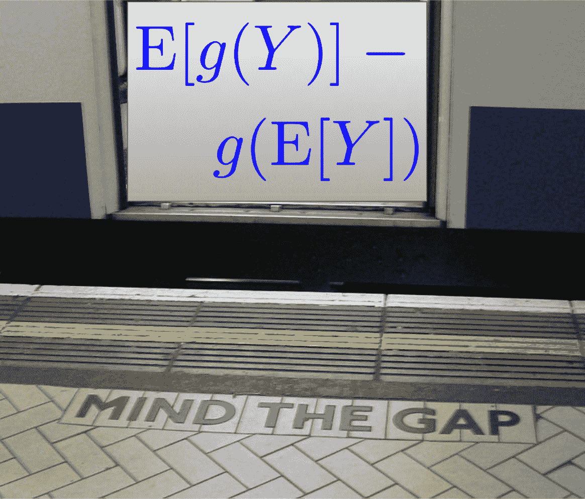
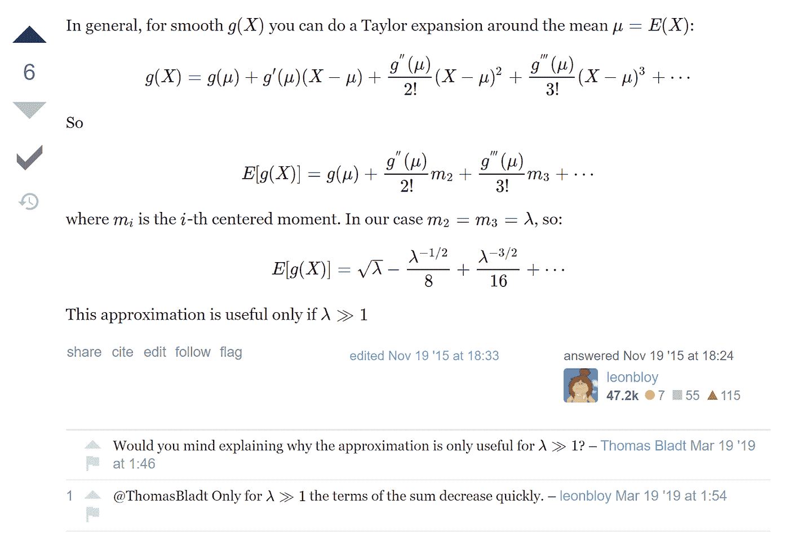
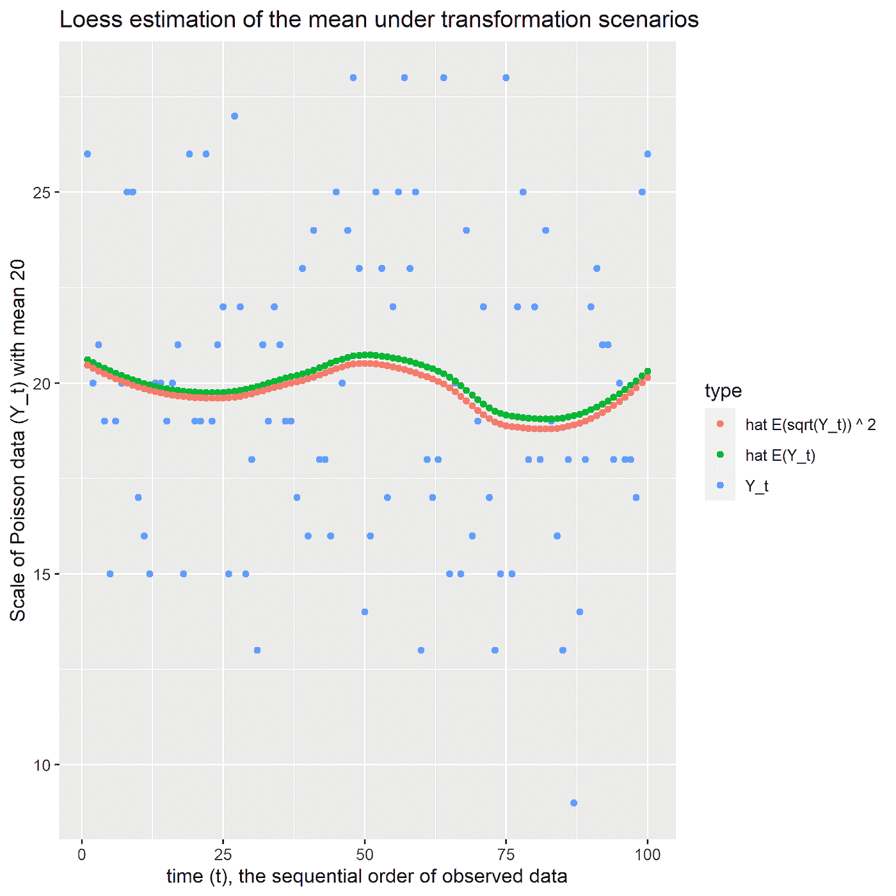
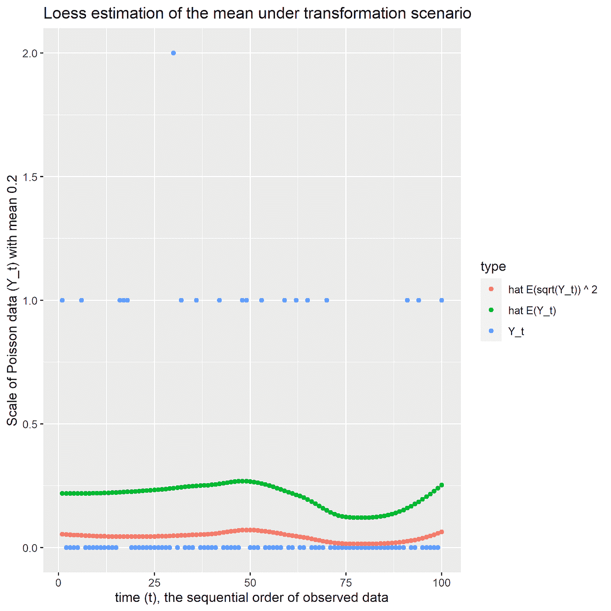

# 小心詹森差距

> 原文：<https://towardsdatascience.com/mind-the-jensen-gap-c54e0eb9e1b7?source=collection_archive---------34----------------------->

## 当在预测之前转换数据时，学习如何在返回到原始尺度时发现偏差

图片来源: [WillMcC](https://commons.wikimedia.org/w/index.php?curid=4379199) (已修改)

# 背景

在 Kaggle 的 [M5 预测-准确性竞赛](https://www.kaggle.com/c/m5-forecasting-accuracy)中，平方根转换毁了我团队的许多预测，并导致在最后时刻进行选择性的修补工作。尽管[的结果很好](https://nousot.com/blog/how-we-won-gold/)，但我们被提醒“重构偏差”会困扰原始尺度的预测，即使是平方根这样的普通变换。

# 平方根变换

对于[泊松数据](https://en.wikipedia.org/wiki/Poisson_distribution)，平方根的基本原理是它是方差稳定变换；理论上，值的平方根近似正态分布，具有恒定的方差和平均值，即原始平均值的平方根。这是一个近似值，正如[维基百科所说的](https://en.wikipedia.org/wiki/Poisson_distribution#Related_distributions)，其中“*收敛到常态(随着[原始均值]增加)的速度远远快于未转换的变量。*

想象一下，你决定在一个计数数据场景中求平方根，感觉很好，确信收敛到正态是“快速的”。然后，对平方根转换数据的平均值进行建模，然后获得平方根级别的预测。在某些时候，特别是在预测场景中，你必须回到最初的规模。这可能需要对模型估计的平均值求平方。M5 竞赛提醒人们，这种方法可能而且将会失败。

# 詹森差距

[詹森不等式](https://en.wikipedia.org/wiki/Jensen%27s_inequality)陈述了对于凸函数，在期望处求值的函数小于或等于该函数的期望，即 g(E[Y]) ≤ E[g(Y)]。对于凹函数，这个不等式是颠倒的。

同样的，**詹森间隙**定义为差值 E[*g*(*Y*)]-*g*(E[*Y*])，对于凸函数 *g. (* 作为题外话，注意当 *g* ( *x* )是平方函数时，詹森间隙【T32)

当把 *g* ( *x* )作为平方函数，把 *Y* 的*平方根作为随机变量时，詹森间隙就变成 E[*Y*]-E[sqrt(*Y*)]。因为数量是正，我们的重建平均值将向下偏移。为了进一步了解这个差距的大小，我们转向泰勒展开式。*

# 泰勒展开至近似偏差

对于[Mathematics stack exchange](https://math.stackexchange.com/questions/1536459/expected-value-of-square-root-of-poisson-random-variable)提示“*泊松随机变量*平方根的期望值”，[投稿人 Hernan Gonzalez](https://math.stackexchange.com/users/312/leonbloy) 解释了一个随机变量关于其均值的泰勒展开，如下图所示。

注意，展开至少需要原始分布的几个中心矩。对于泊松，前三个只是平均参数。

忽略均值估计量也是一个随机变量，我们可以通过逆变换运行上面的期望，即平方它，以了解任何泊松均值在原始尺度上的偏差(代数不在这里，但它在[演示代码](https://github.com/nousot/Public/blob/main/blog/simulate-transformation-bias.R)的第 34 行中计算)。)同样，利用随机变量平方根的性质，可以用同样的方法直接分析*g*(x)=*x*^*2*。这开启了偏差修正的可能性，这是一个有趣的命题，尽管它有自己的假设和复杂性。

## 近似分解

在他的回答接近尾声时，Gonzalez 提到，只有当原始泊松的平均值比 1 大很多时，近似"*才有用，并在评论中澄清这是必要的，以便"*总和的项快速减少。*”这是从原始术语后的均值被提升到负幂得出的。*

在 M5 竞赛中，许多商品的平均销售额都大大低于 1，因此使用平方根变换会导致糟糕的表现。为了了解这在实际样本中是如何发生的，下一节将通过模拟来研究这一现象。

# 示范

在本节中，我们使用黄土平滑器在原始比例和平方根比例上创建模型，并对后者的平均估计值进行平方。对于平均值为 20 和 0.2 的模拟泊松数据，我们绘制两组预测并检查偏差。代码不到 50 行，可以在 Nousot 的公共 Github 库中找到。

# 当平均值为 20 时

对于泊松随机变量的均值为 20 的情况，再转换偏差为负(如詹森不等式所说)，但也相对较小。在代码中，计算泰勒展开的前两项，并与平方根标度上的经验偏差进行比较。分别在-0.027 和-0.023，比较接近。

# 当平均值为 0.20 时

对于泊松随机变量的平均值为 0.20 的情况，情况就大不相同了。虽然延森不平等总是成立的，但相对而言，延森差距现在很大。此外，泰勒近似法已经完全失效，前两个偏差项总和为 0.419，而经验偏差为-.251(仍在平方根范围内)。

# 讨论

大卫·沃顿(David Warton)在 2018 年发表的论文“ [*为什么你不能为小计数*](https://onlinelibrary.wiley.com/doi/pdf/10.1111/biom.12728) 摆脱困境”表明了对小均值计数数据进行标准假设的无望。对于 M5 稀疏的时间序列来说，求平方根没有什么好处，反而会损失很多。至少，我们应该区别对待这些系列。(关于我们对卡尔曼滤波器的使用， [Otto Seiskari 的建议](https://medium.com/@oseiskar/hello-great-to-hear-you-found-my-kaggle-solution-inspiring-5ba651aee3e0)当模型被错误指定时，通过交叉验证进行调整尤其引人注目)。

沃顿的论文对一般转换的用户有一些严厉的言辞。我仍然相信，如果一个转换让你更接近标准假设，你的代码运行得更快，你享受更好的属性，那么它是值得考虑的。但是需要对数据环境中的转换属性进行诚实的探索，而这不是免费的。

通常，变换(及其逆变换)要么是凸的，要么是凹的，因此詹森不等式将保证以詹森间隙的形式出现偏差。如果你想知道为什么你从来没有听说过它，那是因为它经常被认为是近似误差。根据[高等(2018)](https://arxiv.org/pdf/1712.05267.pdf) ，

*“计算一个难以计算的[函数的期望]出现在从统计力学到机器学习理论的各种场景的理论估计中。解决这一问题的常用方法是……证明误差(即詹森差距)对于应用来说足够小。”*

当使用转换时，理解逆转换的属性(在数据的上下文中)是值得的。外面很危险。注意脚下，小心延森沟！