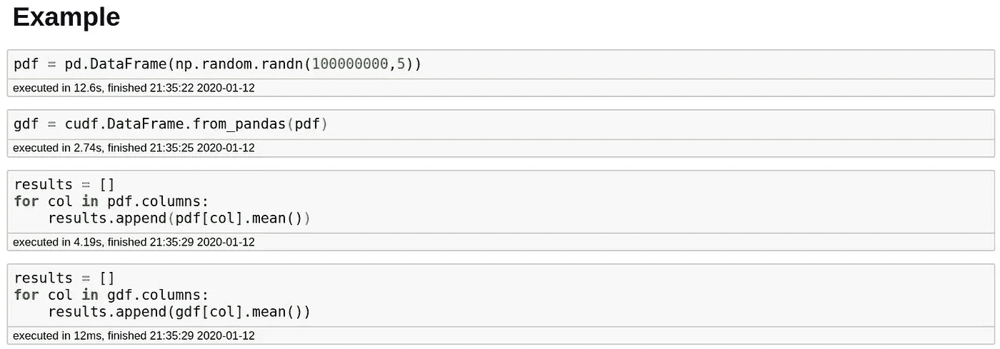
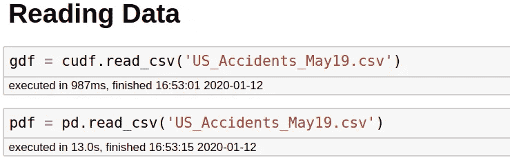
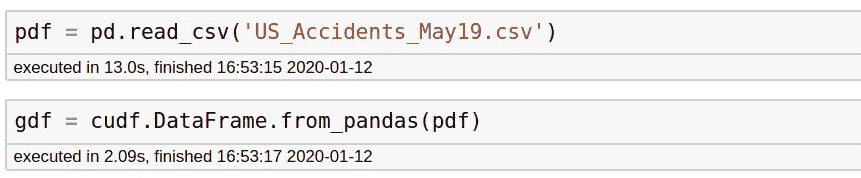
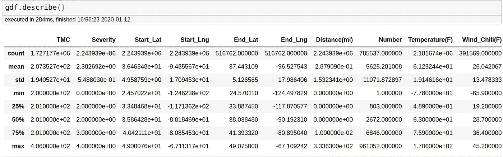
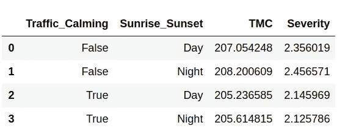
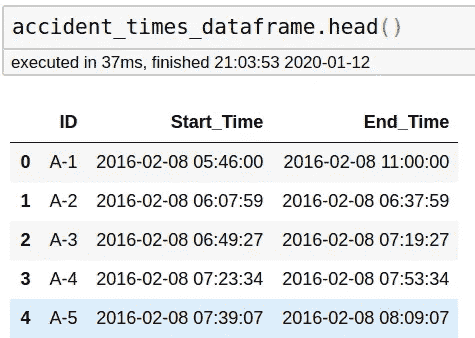
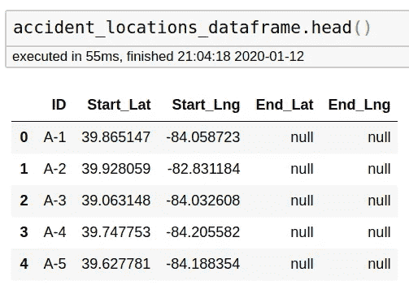
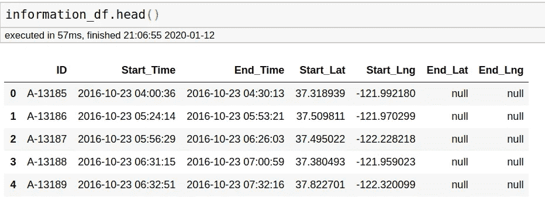
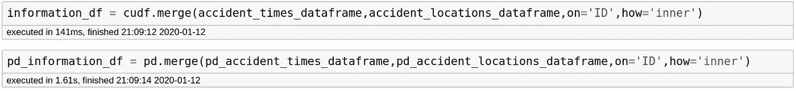

# GPU 上数据科学家的最小熊猫子集

> 原文：<https://towardsdatascience.com/minimal-pandas-subset-for-data-scientist-on-gpu-d9a6c7759c7f?source=collection_archive---------15----------------------->


所有这些小而强壮的熊猫，[来源](https://m.media-amazon.com/images/M/MV5BMTc4NDE0MTk3N15BMl5BanBnXkFtZTgwMDQwODM1NzE@._V1_QL50_SY1000_SX675_AL_.jpg)

## 使用 GPU 进行数据预处理

对于 pandas 来说，数据操作轻而易举，它已经成为 it 的一个标准，许多并行化库，如 Rapids 和 Dask，都是按照 Pandas 的语法创建的。

有时，我会写一些我经常使用的熊猫功能的[子集](/minimal-pandas-subset-for-data-scientists-6355059629ae)。 ***在这篇文章中，我将讨论在 GPU 上使用 cuDF 处理 Python 中的大多数数据操作案例。***

通篇都是一些零星的建议。

***PS:*** 为了进行基准测试，下面所有的实验都是在一台 128 GB RAM 的机器和一台 24 GB RAM 的泰坦 RTX GPU 上完成的。

# 什么是 Rapids CuDF，为什么要使用它？

> cuDF 基于 [Apache Arrow](http://arrow.apache.org/) 列内存格式构建，是一个 GPU 数据帧库，用于加载、连接、聚合、过滤和其他操作数据。

简单地说，Rapids CuDF 是一个旨在为 GPU 带来 pandas 功能的库。除了 CuDF 之外，Rapids 还提供了对 cuML 和 cuGraph 的访问，它们分别用于在 GPU 上处理机器学习算法和[图形。](/4-graph-algorithms-on-steroids-for-data-scientists-with-cugraph-43d784de8d0e)

这有什么好处呢？

典型的 GPU 有超过 2000 个 CUDA 核心。当使用 Dask 或多处理进行并行化时，Pandas 可以使用您的机器拥有的 8 个核心或 16 个 CPU 核心。现在，这些 CPU 内核的能力各不相同，但 CUDA 内核可以快速完成简单的计算，因此可以为我们提供显著的加速。

我的 GPU 泰坦 RTX 有大约 4600 个核心。这意味着我应该能够使用 GPU 并行化我的计算。

但问题是，编写运行 GPU 的代码很难。而 Rapids CuDF 解决了这个问题。

在我们进一步讨论之前，这里有一个简单的例子来说明 cuDF 如何帮助您。在这里，我试图得到我的随机数据帧中所有列的平均值，该数据帧有 1 亿行和 5 列。



***使用 cuDF 加速了大约 350 倍！！！代码基本保持不变。请记住，我使用的是 128 GB 内存的系统。***

# 安装— RAPIDS cuDF

所以现在我们确信 cuDF 是有益的，安装 RAPIDS 最简单的方法就是去[站点](https://rapids.ai/start.html)并使用发布选择器工具检查你需要什么。


对我来说，安装命令是:

```
conda install -c rapidsai -c nvidia -c conda-forge -c defaults rapids=0.11 python=3.7 cudatoolkit=10.1
```

对于启动或学习，您也可以从 Google Colab 笔记本开始，它预装了所需的 RAPIDS 环境。

在本帖中，我将使用[美国事故数据集](https://www.kaggle.com/sobhanmoosavi/us-accidents)来展示 CuDF 数据框架的能力。

# 使用 CuDF 读取数据

我们做的第一件事是读取数据源。我们可以从本地文件系统读取 cudf 中的数据

```
import cudf
gdf = cudf.read_csv('US_Accidents_May19.csv')
```

当我使用`pd.read_csv`功能读取时，这个命令花费了大约 1 秒，而不是 13 秒



我们也可以使用以下方式从 pandas 数据帧中读取数据:

```
pdf = pd.read_csv('US_Accidents_May19.csv')
gdf = cudf.DataFrame.from_pandas(pdf)
```



在这种情况下，我们可以将 cuDF 数据框架转换回 Pandas 数据框架，以便在需要时利用更成熟的 Pandas 生态系统。

```
pdf = gdf.to_pandas()
```

# 数据快照

看到一些数据总是有用的。首先，让我们尝试简单的 Head 和 Tail 命令:

您可以使用简单的`head`和`tail`命令来指定行数。

```
# top 5 rows
gdf.head()# top 50 rows
gdf.head(50)# last 5 rows
gdf.tail()# last 50 rows
gdf.tail(50)
```

您还可以使用以下命令查看简单的数据帧统计信息。

```
# To get statistics of numerical columns
gdf.describe()
```



您也可以使用普通函数，如:

```
print(gdf['TMC'].mean())# no of rows in dataframe
print(len(gdf))# Shape of Dataframe
print(gdf.shape)---------------------------------------------------------------
207.35274265463238
2243939
(2243939, 49)
```

***推荐:*** 一般用 Jupyter 笔记本工作， ***我特别注意让笔记本的前几个单元格包含这些数据的快照*** 。这有助于我随时看到数据的结构。如果我不遵循这个实践，我会发现我在代码中重复了很多次`.head()`命令。

# 处理数据框架中的列

## a.选择列

与熊猫一样，CuDF 允许您以两种方式选择列。像`df.Title`一样使用点运算符，像`df['Title']`一样使用方括号

我更喜欢第二个版本。为什么？

从长远来看，使用方括号版本会更好，这有几个原因。

*   如果您的列名包含空格，那么点版本将不起作用。例如，`df.Revenue (Millions)`不会工作，而`df['Revenue (Millions)]’`会。
*   如果您的列名是`count`或`mean`或任何预定义的函数，它也不会工作。
*   有时您可能需要在列名上创建一个 for 循环，其中列名可能在变量中。在这种情况下，点符号将不起作用。例如，这是可行的:

```
colname = 'height'
df[colname]
```

虽然这不会:

```
colname = 'height'
df.colname
```

相信我。省几个字不值得。

***建议:停止使用点运算符*** 。

## b.获取列表中的列名

它也像熊猫一样工作。

```
columnnames = cuda_df.columns
```

## c.指定用户定义的列名:

有时您想根据自己的喜好更改列名。我不喜欢我的列名中有空格或括号，所以我这样更改它们。

## d.设置特定列的子集:

有时，您只需要处理数据帧中的特定列。例如，分离数字列和分类列，或者移除不必要的列。假设在我们的例子中，我们只需要几列

```
gdf = gdf[['ID', 'Source', 'TMC', 'Severity', 'Start_Time', 'End_Time','Start_Lat', 'Start_Lng', 'End_Lat', 'End_Lng']]
```

## e.查看列类型:

调试时非常有用。如果您的代码抛出一个错误，说您不能添加一个`str`和`int`，您将希望运行这个命令。

```
gdf.dtypes
```

# 在 CuDF 中应用和 Lambda

`apply`和`lambda`是我在熊猫身上学到的最好的东西。每当我为新的列或过滤器构建复杂的逻辑时遇到困难，我就会使用`apply`和`lambda`。让我们看看是否可以在 CuDF 中使用它们。

## a.创建列

您可以通过多种方式创建新列。

如果你想要一个列是列的和或差，你可以使用简单的基本算法。

```
gdf['Somecol'] = (gdf['TMC'] + gdf['Severity']/10)/2
```

您也可以使用`applymap`对系列进行简单应用:

```
def somefunc(x):
    return x+2
gdf['Somecol'] = gdf['TMC'].applymap(somefunc)
```

但是有时我们可能需要围绕使用多个列创建新列来构建复杂的逻辑。

举个例子，假设我们要根据 Lats 和 Longs 计算哈弗线距离。

***我们怎么做呢？***

每当我遇到这样的问题，我就使用`apply/lambda`。让我首先向你展示我将如何用熊猫来做这件事。这里的许多代码摘自这篇[文章](https://medium.com/rapids-ai/user-defined-functions-in-rapids-cudf-2d7c3fc2728d)。

为了在 CuDF 中做同样的事情，我们必须使用`apply_rows`对多行应用一个函数。

看看哈弗辛距离函数的结构是如何变化的，以及我们如何用不同的方式来称呼它。注意这个函数以`hDistance`为参数，所以我们甚至在函数调用中指定了输出。

在后端，它使用 Numba 进行计算。

现在这一切都很好，但有几个警告:

*   它不接受字符串作为输入，所以如果你想使用字符串列，你不能。这是 CuDF 特性列表中的内容。
*   只有 CUDA python 支持的一些函数可以使用，而不是所有的 python 函数。支持功能的完整列表在[这里](https://numba.pydata.org/numba-doc/dev/cuda/cudapysupported.html)。

那么我们为什么要使用它呢？在这个特殊的例子中，熊猫用了 48 秒，而 CuDF 只用了 295 毫秒。这是一个 160 倍的加速。

## b.过滤数据帧

熊猫使数据帧的过滤和子集化变得相当容易。您可以使用标准运算符和`&,|,~`运算符对数据帧进行过滤和子集化。你可以用 cuDF 做同样的事情。

```
# Single conditiondf_dis_gt_2 = gdf[gdf['hDistance']>2]# Multiple conditions: ANDAnd_df = gdf[(gdf['hDistance']>8) & (gdf['TMC']>200)]# Multiple conditions: OROr_df = gdf[(gdf['hDistance']>8) | (gdf['TMC']>200)]# Multiple conditions: NOTNot_df = gdf[~((gdf['hDistance']>8) | (gdf['TMC']>200))]
```

很简单的东西。

# 数据帧上的聚集:`groupby`

`groupby`会出现很多次，每当你想聚集你的数据。Pandas 通过`groupby`功能让您高效地做到这一点，比如:

`df.groupby(list of columns to groupby on).aggregate({'colname':func1, 'colname2':func2}).reset_index()`

你必须担心提供两个主要的信息。

*   列列表至`groupby` on，和
*   列和要应用于这些列的函数的字典

`reset_index()`是一个重置数据帧索引的函数。每当我执行 groupby 时，我总是使用这个函数，您可能会认为它是 groupby 操作的默认语法。

有益的是，cuDF 的语法保持不变。

```
gdf_gby = gdf.groupby(['Traffic_Calming','Sunrise_Sunset']).agg({'TMC':'mean','Severity':'mean'}).reset_index()
```



***告诫:*** 我先试了一下`np.mean`这个函数，没用。它只提供基本功能`sum`、`mean`、`min`和`max`。

# 处理多个数据帧:连接和合并:

## `a. Concat`

有时我们从不同的来源获得数据。或者有人带着多个文件来找你，每个文件都有特定年份的数据。

***我们如何从这些多个数据帧中创建单个数据帧？***

这里我们将人工创建用例，因为我们只有一个文件。我们首先使用已知的基本过滤操作创建两个数据帧。

```
severity_lt_3 = gdf[gdf['Severity']<3]
severity_gte_3 = gdf[gdf['Severity']>=3]
```

这里我们从两个数据帧开始:severity_lt_3 包含严重性小于 3 的事故信息，severity_gte_3 提供严重性大于或等于 3 的事故信息。我们希望创建一个包含两种事故的单一数据框架。

```
fullseverity = cudf.concat([severity_lt_3,severity_gte_3])
```

## b.合并

您将遇到的大多数数据永远不会出现在单个文件中。其中一个文件可能包含特定电影的评级，另一个文件可能提供电影的投票数。

在这种情况下，我们有两个需要合并的数据帧，这样我们就可以在一个视图中拥有所有的信息。

这里我们将人工创建用例，因为我们只有一个文件。我们首先使用已知的基本列子集操作创建两个数据帧。

```
accident_times_dataframe = gdf[['ID','Start_Time','End_Time']]
accident_locations_dataframe = gdf[['ID','Start_Lat','Start_Lng','End_Lat','End_Lng']]
```



我们需要在一个数据框架中包含所有这些信息。我们该怎么做？这个语法也和熊猫一样。

```
information_df = cudf.merge(accident_times_dataframe,accident_locations_dataframe,on='ID',how='left')
```



我们为这个合并函数提供了四个属性——第一个 DF、第二个 DF、在哪一列上连接以及连接标准:`['left','right','inner','outer']`

***就计时而言，当我们使用 cudf 进行连接时，我们再次获得了 10 倍的加速。***



***推荐:*** 我通常最后总是用`left` join。你很少需要使用`outer`或`right.`来连接，实际上无论何时你需要做一个`right` 连接，你实际上只需要一个左连接，在合并函数中数据帧的顺序是相反的。

# 结论

***CuDF 是朝着正确方向迈出的一步，因为它提供了用于数据处理的 GPU，这占用了数据科学管道中的大量时间。***

***这里我试着说一下我经常使用的 cuDF 中的一些功能。NVIDIA 的人正在尝试实现更多的东西，所以请看看[文档](https://docs.rapids.ai/api/cudf/stable/)。***

***虽然熊猫的一些功能还没有实现，*** 但这不应该阻止我们利用已经为时间关键型应用和 Kaggle 实现的功能。

就我自己而言，在我的数据准备笔记本中，我在 cudf 和 pandas 数据框架之间切换了多次。

每当我有点赶时间的时候，它确实帮了我很大的忙。

我希望这篇文章对你有用，值得你花时间。我试图让这尽可能简单，但你可能总是**问我**或查看文档中的疑问。

全部代码都发布在我的 [Github Repo](https://github.com/MLWhiz/data_science_blogs/tree/master/cudf) 中，我在那里保存了我所有帖子的代码。你可以在 [Kaggle](https://www.kaggle.com/sobhanmoosavi/us-accidents) 找到数据。

另外，如果你想学习更多关于 Python 3 的知识，我想从密歇根大学调出一门关于学习[中级 Python](https://bit.ly/2XshreA) 的优秀课程。一定要去看看。

我以后也会写更多这样的帖子。让我知道你对他们的看法。在[](https://medium.com/@rahul_agarwal)**关注我或者订阅我的 [**博客**](http://eepurl.com/dbQnuX) 了解他们。一如既往，我欢迎反馈和建设性的批评，可以通过 Twitter [@mlwhiz](https://twitter.com/MLWhiz) 联系。**