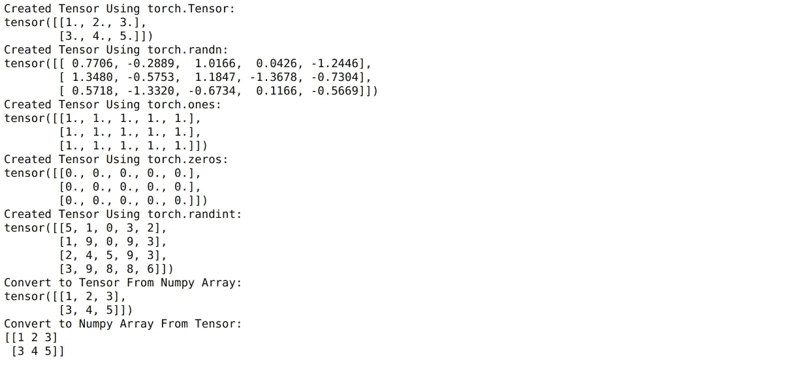
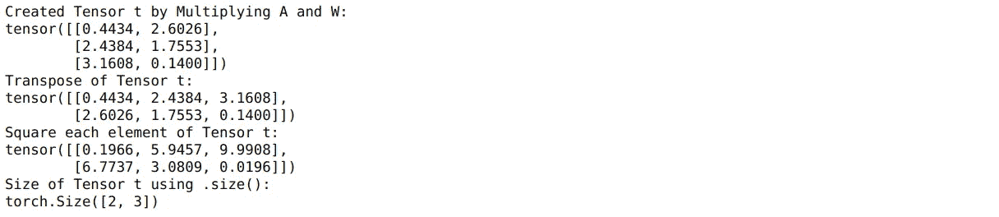
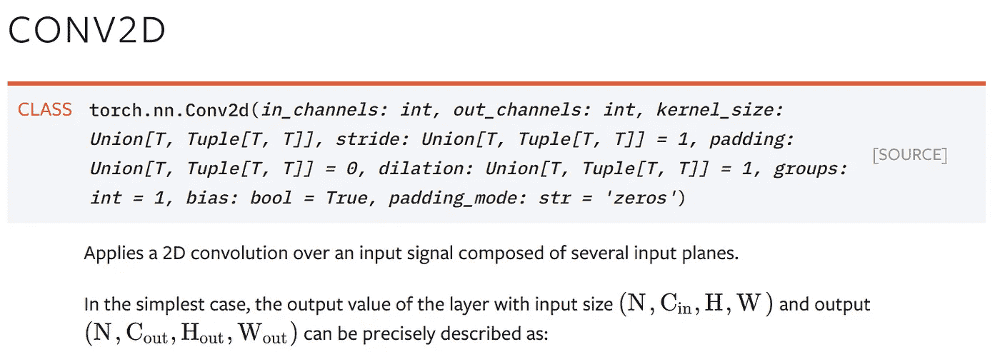
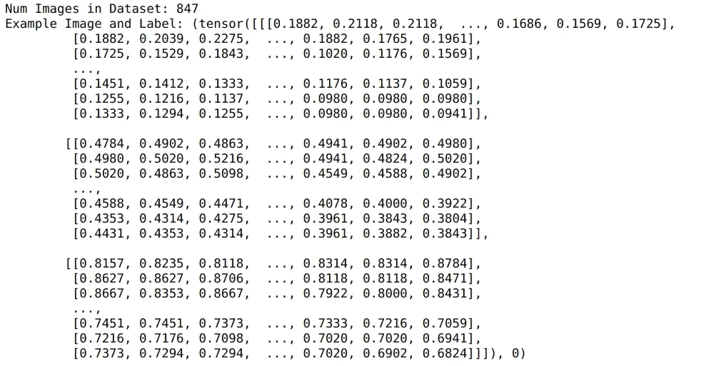
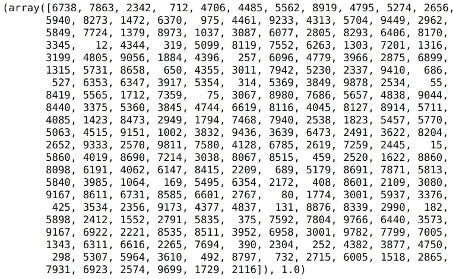
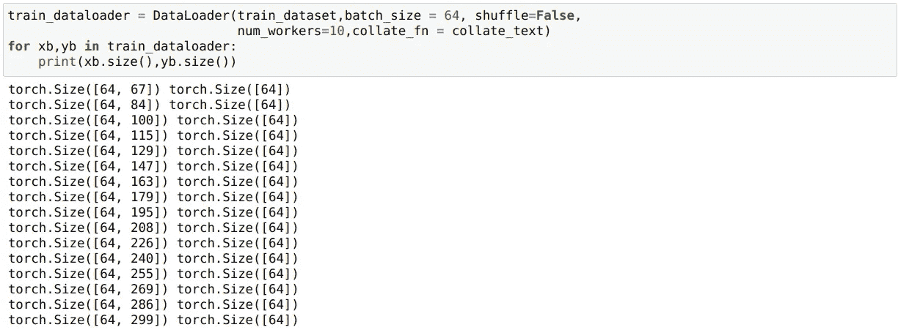
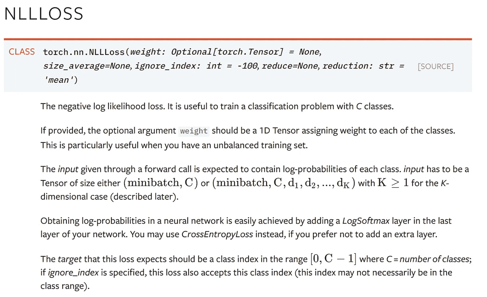
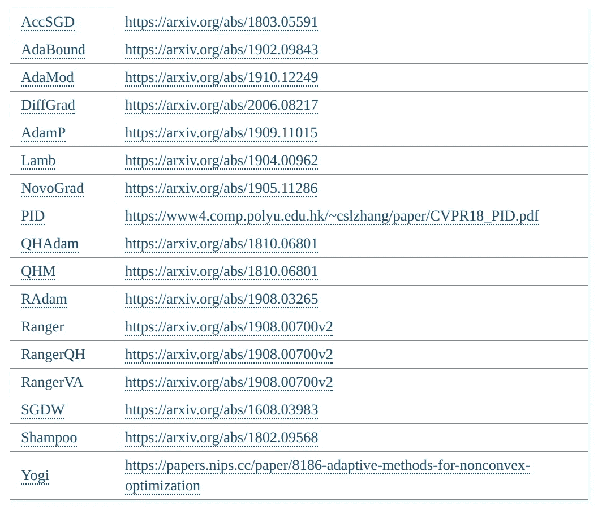

# 面向数据科学家的 PyTorch 最完整指南

> 原文：<https://towardsdatascience.com/minimal-pytorch-subset-for-deep-learning-for-data-scientists-8ccbd1ccba6b?source=collection_archive---------9----------------------->


图片由[денисмарчук](https://pixabay.com/users/Manuchi-1728328/?utm_source=link-attribution&utm_medium=referral&utm_campaign=image&utm_content=2462436)来自 [Pixabay](https://pixabay.com/?utm_source=link-attribution&utm_medium=referral&utm_campaign=image&utm_content=2462436)

## 进行深度学习时需要的 PyTorch 的所有功能。从实验/研究的角度来看。

***PyTorch*** 现在已经成为创建神经网络的事实标准之一，我喜欢它的界面。然而，对于初学者来说，掌握它有点困难。

我记得几年前，在做了大量实验后，我选择了 PyTorch。说实话，我花了很多时间才学会，但我很高兴我从 [Keras 转到了 PyTorch](/moving-from-keras-to-pytorch-f0d4fff4ce79) 。*py torch 具有高度的可定制性和 pythonic 语法，使用起来非常愉快，我会向任何想用深度学习来做一些繁重工作的人推荐它。*

因此，在本 PyTorch 指南中， ***我将尝试用 PyTorch 减轻一些初学者的痛苦，并介绍一些在用 Pytorch 创建任何神经网络时需要的最重要的类和模块。***

但是，这并不是说这只是针对初学者的，因为 ***我还将谈到******py torch 提供的高度可定制性，并将谈到定制图层、数据集、数据加载器和损失函数*** 。

如果你想充分发挥 Pytorch 的能力，Exxact Corporation 有一系列基于人工智能的工作站和服务器，起价 3700 美元，配有几个英伟达 RTX 30 系列 GPU，3 年保修和深度学习软件堆栈。

我们去喝点咖啡吧，☕ ️and，开始吧。

如果你想看某一部分，这里有一个目录表。

[张量](#de86)∘[1。创建一个张量](#22bf)t5】∘[2。张量运算](#136f)
[nn。模块](#ecb5)
[一言关于图层](#1a40)
[数据集和数据加载器](#b19e)
∘ [了解自定义数据集](#6066)
∘ [了解自定义数据加载器](#8b4f)
[训练神经网络](#f26b)
[损失函数](#8913)
∘ [自定义损失函数](#a312)
[优化器](#23e8)
[使用 GPU](#f034)

# 张量

张量是 PyTorch 中的基本构建模块，简单来说，它们是 NumPy 数组，但在 GPU 上。在这一部分，我将列出一些我们在处理张量时最常用的运算。这绝不是你能用张量做的一个详尽的操作列表，但是在进入更令人兴奋的部分之前，理解什么是张量是有帮助的。

## 1.创建一个张量

我们可以用多种方法创建 PyTorch 张量。这包括从 NumPy 数组转换为张量。下面只是一个小要点和一些例子，但是你可以用张量做更多的事情，就像你可以用 NumPy 数组一样。



## 2.张量运算

还是那句话，在这些张量上你可以做很多运算。完整的功能列表可在[这里](https://pytorch.org/docs/stable/torch.html?highlight=mm#math-operations)找到。



**注:**py torch 变量是什么？在 Pytorch 的早期版本中，张量和变量曾经是不同的，提供不同的功能，但现在变量 API[已弃用](https://pytorch.org/docs/stable/autograd.html#variable-deprecated)，变量的所有方法都与张量一起工作。所以，如果你不知道他们，没关系，因为他们是不需要的，如果你知道他们，你可以忘记他们。

# nn。组件


Fernand De Canne 在 [Unsplash](https://unsplash.com?utm_source=medium&utm_medium=referral) 上拍摄的照片

有趣的部分来了，我们现在要谈论一些在创建深度学习项目时 Pytorch 中最常用的构造。nn。模块可以让您将深度学习模型创建为一个类。你可以从`nn.Module`继承，将任何模型定义为一个类。每个模型类必然包含一个`__init__`程序块和一个`forward`通道块。

*   在`__init__`部分，用户可以定义网络将要拥有的所有层，但还没有定义这些层如何相互连接。
*   在`forward`传递块中，用户定义数据如何在网络中从一层流向另一层。

因此，简单地说，我们定义的任何网络看起来都像:

这里，我们定义了一个非常简单的网络，它接受大小为 784 的输入，并按顺序通过两个线性层。但是需要注意的是，在定义向前传递时，我们可以定义任何类型的计算，这使得 PyTorch 高度可定制以用于研究目的。例如，在我们疯狂的实验模式中，我们可能使用了下面的网络，在那里我们任意地附加我们的层。在这里，我们将第二个线性层的输出添加到第一个线性层(跳过连接)后再次发送回第一个线性层(老实说，我不知道这将做什么)。

我们还可以检查神经网络前向传递是否有效。我通常这样做，首先创建一些随机输入，并通过我创建的网络传递。

```
x = torch.randn((100,784))
model = myCrazyNeuralNet()
model(x).size()
--------------------------
torch.Size([100, 10])
```

# 关于层的一句话

Pytorch 非常强大，实际上您可以使用`nn.Module`自己创建任何新的实验层。例如，我们可以创建自己的**自定义线性层**，而不是使用上面 Pytorch 中的预定义线性层`nn.Linear`。

你可以看到我们如何在`nn.Parameter.`中包装我们的权重张量，这样做是为了使张量被认为是一个模型参数。来自 PyTorch [文档](https://pytorch.org/docs/stable/generated/torch.nn.parameter.Parameter.html#parameter):

> 参数是`[*Tensor*](https://pytorch.org/docs/stable/tensors.html#torch.Tensor)`的子类，当与`*Module*`一起使用时，它们有一个非常特殊的属性——当它们被指定为模块属性时，它们会被自动添加到参数列表中，并且会出现在`*parameters()*`迭代器中

正如您稍后将看到的，`model.parameters()`迭代器将是优化器的一个输入。但稍后会详细介绍。

现在，我们可以在任何 PyTorch 网络中使用这个自定义层，就像任何其他层一样。

但是话又说回来，如果 Pytorch 没有提供许多在各种神经网络架构中经常使用的现成层，它就不会被如此广泛地使用。一些例子是:`[nn.Linear](https://pytorch.org/docs/stable/generated/torch.nn.Linear.html#torch.nn.Linear)`、`[nn.Conv2d](https://pytorch.org/docs/stable/generated/torch.nn.Conv2d.html#torch.nn.Conv2d)`、`[nn.MaxPool2d](https://pytorch.org/docs/stable/generated/torch.nn.MaxPool2d.html#torch.nn.MaxPool2d)`、`[nn.ReLU](https://pytorch.org/docs/stable/generated/torch.nn.ReLU.html#torch.nn.ReLU)`、`[nn.BatchNorm2d](https://pytorch.org/docs/stable/generated/torch.nn.BatchNorm2d.html#torch.nn.BatchNorm2d)`、`[nn.Dropout](https://pytorch.org/docs/stable/generated/torch.nn.Dropout.html#torch.nn.Dropout)`、`[nn.Embedding](https://pytorch.org/docs/stable/generated/torch.nn.Embedding.html#torch.nn.Embedding)`、`[nn.GRU](https://pytorch.org/docs/stable/generated/torch.nn.GRU.html#torch.nn.GRU)/[nn.LSTM](https://pytorch.org/docs/stable/generated/torch.nn.LSTM.html#torch.nn.LSTM)`、`[nn.Softmax](https://pytorch.org/docs/stable/generated/torch.nn.Softmax.html#torch.nn.Softmax)`、`[nn.LogSoftmax](https://pytorch.org/docs/stable/generated/torch.nn.LogSoftmax.html#torch.nn.LogSoftmax)`、`[nn.MultiheadAttention](https://pytorch.org/docs/stable/generated/torch.nn.MultiheadAttention.html#torch.nn.MultiheadAttention)`、`[nn.TransformerEncoder](https://pytorch.org/docs/stable/generated/torch.nn.TransformerEncoder.html#torch.nn.TransformerEncoder)`、`[nn.TransformerDecoder](https://pytorch.org/docs/stable/generated/torch.nn.TransformerDecoder.html#torch.nn.TransformerDecoder)`

我已经将所有层链接到它们的来源，在那里您可以阅读关于它们的所有内容，但是为了显示我通常如何试图理解一个层和阅读文档，我将在这里尝试查看一个非常简单的卷积层。



因此，Conv2d 层需要一个高度为 H、宽度为 W 的图像作为输入，并带有`Cin`通道。现在，对于 convnet 中的第一层，`in_channels`的数量是 3(RGB)，`out_channels`的数量可以由用户定义。最常用的`kernel_size`是 3x3，常用的`stride`是 1。

为了检查一个我不太了解的新图层，我通常会尝试查看该图层的输入和输出，如下图所示，我将首先初始化该图层:

```
conv_layer = nn.Conv2d(in_channels = 3, out_channels = 64, kernel_size = (3,3), stride = 1, padding=1)
```

然后通过它传递一些随机输入。这里 100 是批量大小。

```
x = torch.randn((100,3,24,24))
conv_layer(x).size()
--------------------------------
torch.Size([100, 64, 24, 24])
```

因此，我们根据需要从卷积运算中获得输出，并且我有足够的信息来说明如何在我设计的任何神经网络中使用这一层。

# 数据集和数据加载器

在训练或测试时，我们如何将数据传递给我们的神经网络？我们肯定可以像上面那样传递张量，但 Pytorch 也为我们提供了预先构建的数据集，使我们更容易将数据传递给我们的神经网络。您可以查看 [torchvision.datasets](https://pytorch.org/docs/stable/torchvision/datasets.html) 和 [torchtext.datasets](https://pytorch.org/text/datasets.html) 提供的完整数据集列表。但是，为了给出数据集的具体示例，假设我们必须使用文件夹将图像传递到图像神经网络，该文件夹包含以下结构的图像:

```
data
    train
        sailboat
        kayak
        .
        .
```

我们可以使用`torchvision.datasets.ImageFolder`数据集获得如下示例图像:



这个数据集有 847 幅图像，我们可以使用索引来获取图像及其标签。现在我们可以使用 for 循环将图像逐个传递给任何图像神经网络:

```
for i in range(0,len(train_dataset)):
    image ,label = train_dataset[i]
    pred = model(image)
```

***但那不是最优的。我们想做批处理。*** 我们其实可以多写一些代码，批量追加图片和标签，然后传递给神经网络。但是 Pytorch 为我们提供了一个实用的迭代器`torch.utils.data.DataLoader`来实现这一点。现在我们可以简单地将我们的`train_dataset`包装在数据加载器中，我们将获得批量而不是单个的例子。

```
train_dataloader = **DataLoader**(train_dataset,batch_size = 64, shuffle=True, num_workers=10)
```

我们可以简单地使用批处理进行迭代:

```
for image_batch, label_batch in train_dataloader:
    print(image_batch.size(),label_batch.size())
    break
------------------------------------------------------------------
torch.Size([64, 3, 224, 224]) torch.Size([64])
```

所以实际上，使用数据集和数据加载器的整个过程变成了:

在我之前关于使用深度学习进行图像分类的博客文章中，你可以在这里看看这个具体的例子。

这很棒，Pytorch 确实提供了很多现成的功能。但是 Pytorch 的主要功能来自其巨大的定制性。如果 PyTorch 提供的数据集不适合我们的用例，我们也可以创建自己的自定义数据集。

## 了解自定义数据集

为了编写自定义数据集，我们可以利用 Pytorch 提供的抽象类`torch.utils.data.Dataset`。我们需要继承这个`Dataset`类，并需要定义两个方法来创建自定义数据集。

*   `__len__`:返回数据集大小的函数。在大多数情况下，这个代码很容易编写。
*   `__getitem__`:将索引`i`作为输入并返回索引`i`处的样本的函数。

例如，我们可以创建一个简单的自定义数据集，从文件夹中返回一个图像和一个标签。请注意，大多数任务都发生在`__init__`部分，我们使用`glob.glob`来获取图像名称并进行一些常规预处理。

另外，请注意，我们在 `__getitem__`方法中一次打开一个图像，而不是在初始化时打开。在`__init__`中没有这样做，因为我们不想把所有的图像都加载到内存中，只需要加载需要的图像。

我们现在可以像以前一样使用这个数据集和实用程序`Dataloader`。它就像 PyTorch 提供的前面的数据集一样工作，但是没有一些实用函数。

## 了解自定义数据加载器

**这一部分有点高深，在阅读这篇文章时可以跳过，因为在很多情况下都不需要。但是我在这里添加它是为了完整性。**

假设您希望向处理文本输入的网络提供批处理，只要批处理中的序列大小保持不变，网络就可以接收任意长度的序列。例如，我们可以有一个可以处理任意长度序列的 BiLSTM 网络。如果你现在不理解其中使用的图层，那也没关系；只知道它可以处理大小可变的序列。

该网络期望其输入为形状(`batch_size`、`seq_length`)，并与任何`seq_length`一起工作。我们可以通过向模型传递两个不同序列长度(10 和 25)的随机批次来检查这一点。

```
model = BiLSTM()
input_batch_1 = torch.randint(low = 0,high = 10000, size = (100,**10**))
input_batch_2 = torch.randint(low = 0,high = 10000, size = (100,**25**))
print(model(input_batch_1).size())
print(model(input_batch_2).size())
------------------------------------------------------------------
torch.Size([100, 1])
torch.Size([100, 1])
```

现在，我们希望为这个模型提供紧密的批次，这样每个批次都具有基于批次中最大序列长度的相同序列长度，以最小化填充。这有一个额外的好处，使神经网络运行更快。事实上，这是在卡格尔举行的 Quora 无诚意挑战赛中获胜的方法之一，在那里运行时间至关重要。

那么，我们该怎么做呢？让我们先编写一个非常简单的自定义数据集类。

此外，让我们生成一些随机数据，我们将使用这个自定义数据集。



一个随机序列和标签的例子。序列中的每个整数对应于句子中的一个单词。

我们现在可以使用自定义数据集:

```
train_dataset = CustomTextDataset(X,y)
```

如果我们现在尝试在这个数据集上使用带有`batch_size` > 1 的 Dataloader，我们将会得到一个错误。这是为什么呢？

```
train_dataloader = DataLoader(train_dataset,batch_size = 64, shuffle=False, num_workers=10)
for xb,yb in train_dataloader:
    print(xb.size(),yb.size())
```


发生这种情况是因为序列具有不同的长度，而我们的数据加载器期望我们的序列具有相同的长度。请记住，在前面的图像示例中，我们使用变换将所有图像的大小调整为 224，因此我们没有遇到这个错误。

***那么，我们如何遍历这个数据集，使得每一批都有长度相同的序列，但不同的批可能有不同的序列长度呢？***

我们可以在 DataLoader 中使用`collate_fn`参数，让我们定义如何在特定的批处理中堆叠序列。要使用它，我们需要定义一个函数，它将一个批处理作为输入，并根据批处理中的`max_sequence_length`返回(`x_batch`、`y_batch`)填充的序列长度。我在下面的函数中使用的函数是简单的数字运算。此外，该函数被适当地注释，以便您可以理解发生了什么。

我们现在可以将此`collate_fn`与我们的数据加载器一起使用，如下所示:

```
train_dataloader = DataLoader(train_dataset,batch_size = 64, shuffle=False, num_workers=10,**collate_fn** **=** **collate_text**)for xb,yb in train_dataloader:
    print(xb.size(),yb.size())
```



请注意，这些批次现在具有不同的序列长度

这一次它将工作，因为我们已经提供了一个定制的`collate_fn.`,并看到现在这些批次具有不同的序列长度。因此，我们将能够像我们希望的那样，使用可变的输入大小来训练我们的 BiLSTM。

# 训练神经网络

我们知道如何使用`nn.Module.`创建神经网络，但是如何训练它呢？任何需要训练的神经网络都有一个类似于下图的训练循环:

在上面的代码中，我们运行五个时期，并且在每个时期中:

1.  我们使用数据加载器遍历数据集。
2.  在每次迭代中，我们使用`model(x_batch)`向前传递
3.  我们使用`loss_criterion`计算损失
4.  我们使用`loss.backward()`调用反向传播损失。我们根本不用担心梯度的计算，因为这个简单的调用为我们做了所有的事情。
5.  使用`optimizer.step()`采取优化步骤来改变整个网络中的权重。这就是使用在`loss.backward()`调用中计算的梯度来修改网络权重的地方。
6.  我们通过验证数据加载器来检查验证分数/指标。在进行验证之前，我们使用`model.eval().`将模型设置为评估模式。请注意，我们不会在评估模式下反向传播损耗。

到目前为止，我们已经讨论了如何使用`nn.Module`创建网络，以及如何通过 Pytorch 使用定制数据集和数据加载器。所以让我们来谈谈损失函数和优化器的各种可用选项。

# 损失函数

Pytorch 为我们最常见的任务提供了各种损失函数，比如分类和回归。一些最常用的例子是`[nn.CrossEntropyLoss](https://pytorch.org/docs/stable/generated/torch.nn.CrossEntropyLoss.html#torch.nn.CrossEntropyLoss)`、`[nn.NLLLoss](https://pytorch.org/docs/stable/generated/torch.nn.NLLLoss.html#torch.nn.NLLLoss)`、`[nn.KLDivLoss](https://pytorch.org/docs/stable/generated/torch.nn.KLDivLoss.html#torch.nn.KLDivLoss)`和`[nn.MSELoss](https://pytorch.org/docs/stable/generated/torch.nn.MSELoss.html#torch.nn.MSELoss).`你可以阅读每个损失函数的文档，但是为了解释如何使用这些损失函数，我将通过`[nn.NLLLoss](https://pytorch.org/docs/stable/generated/torch.nn.NLLLoss.html#torch.nn.NLLLoss)`的例子



NLLLoss 的文档非常简洁。如中所示，此损失函数用于多类分类，并基于文档:

*   预期的输入需要大小为(`batch_size` x `Num_Classes` ) —这些是我们创建的神经网络的预测。
*   我们需要输入中每个类的对数概率——为了从神经网络中获得对数概率，我们可以添加一个`LogSoftmax`层作为网络的最后一层。
*   目标需要是类别数量在(0，C-1)范围内的类别的张量，其中 C 是类别的数量。

因此，我们可以尝试将这个损失函数用于简单的分类网络。请注意最后一个线性图层后的`LogSoftmax`图层。如果你不想使用这个`LogSoftmax`层，你可以直接使用`[nn.CrossEntropyLoss](https://pytorch.org/docs/stable/generated/torch.nn.CrossEntropyLoss.html#torch.nn.CrossEntropyLoss)`

让我们定义一个随机输入传递到我们的网络来测试它:

```
# some random input:X = torch.randn(100,784)
y = torch.randint(low = 0,high = 10,size = (100,))
```

并通过模型得到预测:

```
model = myClassificationNet()
preds = model(X)
```

我们现在可以得到损失为:

```
criterion = nn.NLLLoss()
loss = criterion(preds,y)
loss
------------------------------------------
tensor(2.4852, grad_fn=<NllLossBackward>)
```

## 定制损失函数

定义你的自定义损失函数也是小菜一碟，只要你在损失函数中使用张量运算，你应该没问题。例如，这里是`customMseLoss`

```
def customMseLoss(output,target):
    loss = torch.mean((output - target)**2)     
    **return** loss
```

你可以像以前一样使用这个自定义损耗。但是请注意，我们这次没有使用 criterion 实例化损失，因为我们已经将它定义为一个函数。

```
output = model(x)
loss = customMseLoss(output, target)
loss.backward()
```

如果我们愿意，我们也可以用`nn.Module`把它写成一个类，然后我们就可以把它当作一个对象来使用。下面是一个 NLLLoss 自定义示例:

# 优化者

一旦我们使用`loss.backward()`调用得到梯度，我们需要采取一个优化步骤来改变整个网络中的权重。Pytorch 使用`torch.optim`模块提供了各种不同的现成优化器。比如:`[torch.optim.Adadelta](https://pytorch.org/docs/stable/optim.html#torch.optim.Adadelta)`、`[torch.optim.Adagrad](https://pytorch.org/docs/stable/optim.html#torch.optim.Adagrad)`、`[torch.optim.RMSprop](https://pytorch.org/docs/stable/optim.html#torch.optim.RMSprop)`以及应用最广泛的`[torch.optim.Adam](https://pytorch.org/docs/stable/optim.html#torch.optim.Adam).`

要使用 PyTorch 中最常用的 Adam 优化器，我们可以简单地用以下代码实例化它:

```
optimizer **=** torch.optim.Adam(model.parameters(), lr=0.01, betas=(0.9, 0.999))
```

然后在训练模型时使用`optimizer**.**zero_grad()`和`optimizer.step()`。

我不讨论如何编写定制优化器，因为这是一个不常见的用例，但如果你想有更多的优化器，请查看 [pytorch-optimizer](https://pytorch-optimizer.readthedocs.io/en/latest/) 库，它提供了许多其他在研究论文中使用的优化器。此外，如果你想创建自己的优化器，你可以使用 [PyTorch](https://github.com/pytorch/pytorch/tree/master/torch/optim) 或[py torch-optimizer](https://github.com/jettify/pytorch-optimizer/tree/master/torch_optimizer)中实现的优化器的源代码来获得灵感。



来自 [pytorch-optimizer](https://github.com/jettify/pytorch-optimizer) 库的其他优化器

# 使用 GPU/多个 GPU

到目前为止，我们所做的一切都是在 CPU 上进行的。如果你想使用 GPU，你可以使用`model.to('cuda')`将你的模型放到 GPU 中。或者想用多个 GPU，可以用`nn.DataParallel`。这里有一个实用函数，它检查机器中的 GPU 数量，并在需要时使用`DataParallel`自动设置并行训练。

我们唯一需要改变的是，如果我们有 GPU，我们将在训练时将数据加载到 GPU。这就像在我们的训练循环中添加几行代码一样简单。

# 结论

Pytorch 用最少的代码提供了很多可定制性。虽然一开始可能很难理解整个生态系统是如何用类来构建的，但最终，它是简单的 Python。在这篇文章中，我试着分解了你在使用 Pytorch 时可能需要的大部分内容，我希望读完这篇文章后对你来说更有意义。

你可以在我的 [GitHub](https://github.com/MLWhiz/data_science_blogs/tree/master/pytorch_guide) repo 上找到这篇文章的代码，我在这里保存了我所有博客的代码。

如果你想学习更多关于 Pytorch 的基于课程的结构，看看 IBM 在 Coursera 上的[深度神经网络与 PyTorch](https://coursera.pxf.io/jWG2Db) 课程。还有，如果你想了解更多关于深度学习的知识，我想推荐这门关于[计算机视觉中的深度学习](https://coursera.pxf.io/NKERRq)的优秀课程

谢谢你的阅读。将来我也会写更多初学者友好的帖子。在[](https://medium.com/@rahul_agarwal?source=post_page---------------------------)**关注我或者订阅我的 [**博客**](http://eepurl.com/dbQnuX?source=post_page---------------------------) 了解他们。一如既往，我欢迎反馈和建设性的批评，可以通过 Twitter[**@ mlwhiz**](https://twitter.com/MLWhiz?source=post_page---------------------------)联系**

**此外，一个小小的免责声明——这篇文章中可能会有一些相关资源的附属链接，因为分享知识从来都不是一个坏主意。**

**[](https://mlwhiz.medium.com/membership) [## 通过我的推荐链接加入 Medium-Rahul Agarwal

### 作为一个媒体会员，你的会员费的一部分给了你所阅读的作家，你可以在…上看到所有的故事

mlwhiz.medium.com](https://mlwhiz.medium.com/membership)**