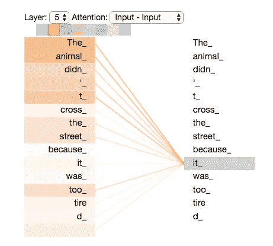
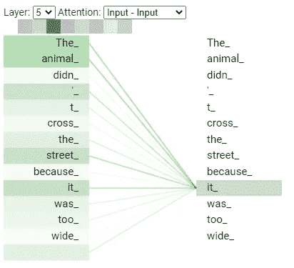

# 假装你熟悉伯特的最低要求

> 原文：<https://towardsdatascience.com/minimal-requirements-to-pretend-you-are-familiar-with-bert-3889023e4aa9?source=collection_archive---------33----------------------->

## 通过将元数据从文本中分离出来，BERT 将使你的项目更有价值和创造性

杰里米·毕晓普在 [Unsplash](https://unsplash.com/) 上的照片

一波又一波对数据科学技术的炒作日复一日地高涨。你们中的许多人可能已经厌倦了通过大大小小的宣传来为一项新的提议带来解决方案，或者在会议中假装自己熟悉新的人工智能技术。本文的目标是没有强大数据科学背景的管理人员、初级数据科学家和对 NLP 感兴趣的开发人员，目标是帮助他们用最少的知识熟悉 BERT，并问“我们能在这个项目中使用 BERT 吗？”在头脑风暴会议中聪明地。

# **目录**

1.  为什么我们现在要学习 BERT 并使用它？
2.  伯特是如何深入浅出地工作的？
3.  BERT 给你的项目带来了什么价值？
4.  我们在哪里可以了解更多关于伯特的信息？

# 1.为什么我们现在要学习 BERT 并使用它？

由于炒作和有偏见的成功故事，推迟学习数据科学领域的新技术有时是一个好策略。先说我关于“现在”的简短回答。BERT 是由谷歌在 2018 年开发并发布的，经过两年的时间，围绕这种方法的[开源社区](https://huggingface.co/)已经成熟，我们可以使用他们开发的令人惊叹的工具箱。我们应该了解 BERT，因为它缓解了模型训练效率方面的问题，不像 Culurciello 在[RNN/LSTM 的陨落](/the-fall-of-rnn-lstm-2d1594c74ce0)中讨论的传统递归神经网络。我们应该使用 BERT，因为得益于 [Hugging Face 的框架](https://github.com/huggingface/transformers)，它很容易微调和使用模型，并且我们可以通过对您的代码进行小的修改，从 BERT 切换到其他最先进的 NLP 模型——有时只需要几行修改。

# 2.伯特是如何深入浅出地工作的？

BERT 的正式名称有点长，它代表来自变压器的**双向编码器表示。先说最后一个词，这是最重要的。 **Transformer** 是一种神经网络架构，BERT 及其衍生产品继承了类似的架构。与递归神经网络不同，变压器不需要按顺序处理输入序列。这意味着 Transformer 在处理句子的中间或结尾之前，不需要处理句子的开头。另一方面，RNN 需要处理订单中的输入；因此，它产生了瓶颈。这个特性给了 Transformer 在模型训练期间运行并行化更多的自由。**

那么，我们来看第一个词**双向**。如果体系结构是定向的，那么它要么从左到右要么从右到左处理输入。BERT 摆脱了按顺序处理输入的魔咒，并且 BERT 可以根据一个单词的所有环境来了解它的上下文。这种方法被称为掩蔽语言模型，不同于通过预先给定单词作为输入来预测下一个单词来创建语言模型的传统方法。

来自 BERT 的剩余部分是**编码器表示**。在开始解释之前，让我问一个问题。你认为什么时候一个人很好地理解了一句话？我认为仅仅理解一个句子中词汇的含义是不够的。一个合理的答案是当某人理解一个句子的上下文时。那么，如何判断一个人是否理解上下文呢？对我来说，一个可测量的、介绍性的方法是某人是否理解指示代词的来源，如句子中的“它”、“这个”或“那个”。BERT 包括编码器来理解单词的上下文。编码器的架构彼此相同，每个都由两个组件组成:**自关注**和前馈神经网络。除了这些因素，我将只关注自我关注。

让我用一句“动物没有过马路是因为**它**太累了。”展示自我注意机制如何解释“它”我们知道“它”指的是这句话中的“动物”，并且它被 BERT 预训练模型正确地解释如下。

来源:[杰伊·阿拉姆的《变形金刚》](http://jalammar.github.io/illustrated-transformer/)

现在，我们知道自我关注有能力理解单词之间的关系，但下一个问题是它解释得有多好。为了回答这个问题，我把原来的句子修改为“动物没有过马路是因为**它**太**宽**”而不是“太累了。”正如你在下面的图片中看到的，最强的联系存在于“动物”和“它”之间，这与我的预期不同。

图片由作者通过谷歌托管的 [Tensor2Tensor 笔记本](https://colab.research.google.com/github/tensorflow/tensor2tensor/blob/master/tensor2tensor/notebooks/hello_t2t.ipynb#scrollTo=OJKU36QAfqOC)修改原文。

每个伯特的编码器都有多个自我关注头，我的期望是其中一个自我关注头会捕捉到“它”和“街道”之间的关系，因为“街道”太宽了。尽管 BERT 有能力理解上下文，但对于相对简单的句子，它还不是完美的。作为免责声明，我使用预训练的 BERT 验证了我的假设，但其他 BERT 衍生产品会表现得更好，因为训练数据集的大小增加了，其架构也有所改善。如果你有兴趣了解自我关注和多头关注机制是如何一步一步工作的，请阅读杰伊·阿拉姆的《图解变形金刚》。

# 3.BERT 给你的项目带来了什么价值？

BERT 的成功应用是文本分类、问题回答和情感分析。这些成果还不够成熟，但是我们也可以将 BERT 应用于命名实体识别和文本摘要。关于自然语言生成，最成功的模型是微软开发的基于转换器的生成语言模型[图灵-NLG](https://www.microsoft.com/en-us/research/blog/turing-nlg-a-17-billion-parameter-language-model-by-microsoft/) 。如果你需要从文本中梳理出模式，比如电子邮件、文档和客户评论，我建议在实验阶段应用 BERT 及其衍生工具。

我已经列出了 BERT 的常见应用，BERT 肯定是一个很好的方法，但请不要搜索一种方法可以解决的项目，因为 BERT 或其他 NLP 模型的真正价值是为业务部门及其客户创建新的元数据。像电子邮件分类这样的项目作为 BERT 的应用是直观的，但是对于许多业务问题来说，电子邮件的类别可能是中间产品而不是最终产品。在实践中，这种中间产品将通过与传统方法相结合，为您的项目带来更多的价值。

例如，如果您对客户流失分析感兴趣，您可以使用 BERT 从客户和代理之间的文本通信中提取元数据，例如客户情绪、代理对客户的响应质量以及问题类别。此外，您可以将所有或部分这些元数据与其他传统元数据相结合，例如交互的新近性和频率、代理的响应时间以及客户花费的金额。除了客户流失分析之外，我们还可以进行营销分析，根据客户各自面临的分类问题或挑战的组合，建议交叉销售或追加销售，从而使用 BERT 提供的元数据提高客户满意度。当然，我们可以利用客户报告的这些问题组合，通过创建针对故障的假设来改进自己产品的质量/功能。然后，我们可以跟踪分类问题的分布随时间的变化，以测试所提出的假设是否正确。我相信，通过以创造性的方式将元数据连接成点，我们可以为业务部门和客户提供更高的价值。我不会在本文中提及，但由于解决方案需要复杂的开发和操作流程，因此 [MLOps](https://cloud.google.com/solutions/machine-learning/mlops-continuous-delivery-and-automation-pipelines-in-machine-learning) 或 ML 管道的概念变得更加重要。

# 4.我们在哪里可以了解更多关于伯特的信息？

让我分享这些链接来加深你对 BERT 的理解，因为我的帖子只涉及了最基本的概念。

**面向经理、开发人员和初级数据科学家**

1.  杰伊·阿拉莫的《变形金刚图》

这是我最喜欢的博文，也是最好的下一步。如果你对线性代数感到不舒服，你可以跳过这篇文章中间的矩阵计算，以大局为重。

2.[深度学习 2019 —杰瑞米·霍华德的图像分类](https://www.youtube.com/watch?v=XfoYk_Z5AkI&list=PLfYUBJiXbdtSIJb-Qd3pw0cqCbkGeS0xn)

该系列没有涵盖 BERT，但仅观看第一个视频就可以帮助您体验深度学习的现代框架，以及与四年前使用 TensorFlow 不同，微调模型是多么容易。此外，如果你对课程的数量感到不知所措，你不需要观看所有的视频，因为课程 1、2 和 4 需要通过图像分类和 NLP，这是需要覆盖的最小领域。

**面向开发人员和初级数据科学家**

3.杰伊·阿拉姆的《word 2 vec》

这是杰伊·阿拉姆的又一篇好文章。我很难理解高维度的单词嵌入，比如 256 或 512。这篇文章通过展示许多可视化的例子，让我了解了二维单词嵌入的概念。

4.克里斯·麦考密克[伯特研究系列](https://www.youtube.com/watch?v=FKlPCK1uFrc&list=PLam9sigHPGwOBuH4_4fr-XvDbe5uneaf6)

我更喜欢 Jay Alammer 的博客来理解这些概念，因为它具有创造性的视觉表现。但是，如果您喜欢从视频和代码中学习，本系列将更适合您，因为 Chris McCormick 使用 Jupyter 笔记本来展示如何实际实现这些概念的示例。