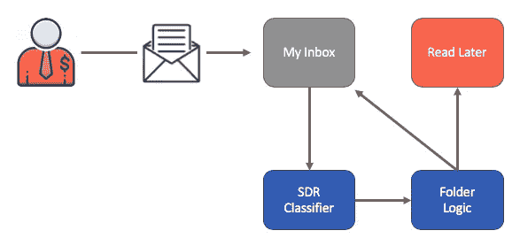
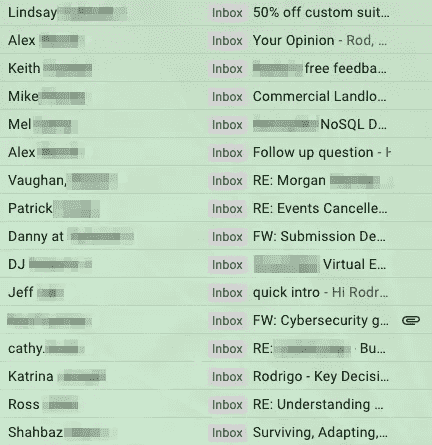
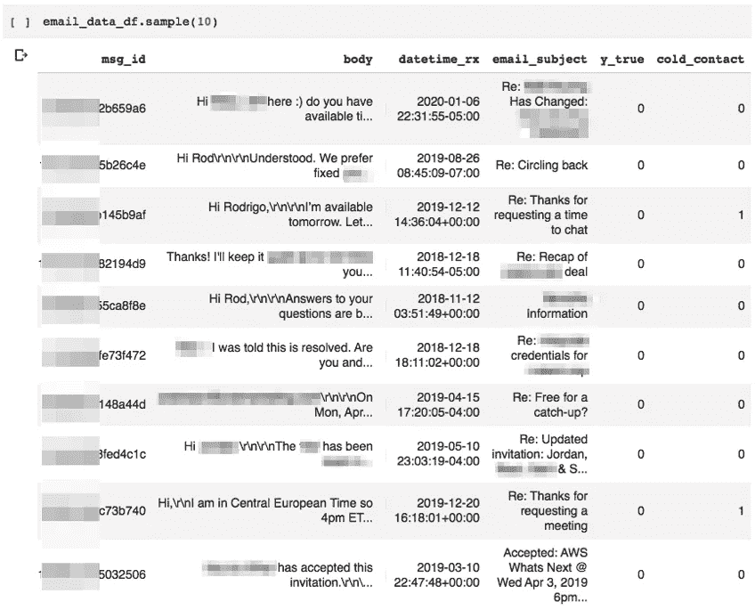
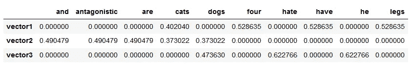
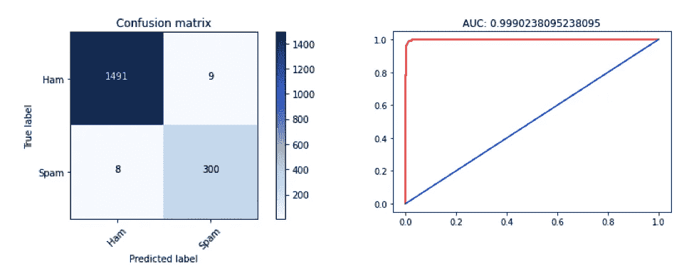

# 通过自然语言处理减少收件箱中的销售邮件

> 原文：<https://towardsdatascience.com/minimizing-sales-emails-in-my-inbox-with-natural-language-processing-38296b562da7?source=collection_archive---------61----------------------->

每天我打开收件箱都会看到几十封我不认识的人发来的未读邮件，要求*给我 15 分钟时间，让他们帮我解决这个或那个问题。*

2011 年，亚伦·罗斯(Aaron Ross)的书《可预测的收入》(forecast Revenue)推广了这一概念，向 B2B 潜在客户发送冰冷的电子邮件，要求会面，这已经成为全球 B2B SaaS 公司的主要增长策略。事实上，秘密已经泄露，每个人(显然还有他们的母亲)都在发送潜在客户邮件来招揽生意。(例如，参见 [30 个保证建立关系的销售潜在客户电子邮件模板](https://blog.hubspot.com/sales/sales-email-templates-guaranteed-to-get-a-response)。)而且理由很充分——这很有效！

那么，当每个 B2B 公司向世界各地的每个潜在客户发送电子邮件时，会发生什么？我们的收件箱变得更加嘈杂，让我们更难专注于重要的电子邮件。

> 可预测的收入带来了什么？

即使是强大的电子邮件服务，如 Gmail 和 Outlook，也不会将这些 SDR 电子邮件归类为垃圾邮件。这是可以理解的，因为特别提款权不是在兜售伟哥、要求资金转移等等。Gmail 的“推广”过滤器呢？没有帮助。销售代表经常通过[销售支持技术](https://support.outreach.io/hc/en-us/articles/205022548-Connect-Outreach-with-Gmail)使用他们公司的 Gmail 或 Outlook 电子签名发送电子邮件，例如 Outreach，这似乎绕过了常见的“简讯”过滤器。

如果不加控制，SDR 电子邮件将继续入侵收件箱，降低相关内容的关注度。

## 回收收件箱

为了应对这一困境— *,但实际上是作为开发我的 NLP、Docker 和微服务技能的借口,* —我设计、编码并部署了一个 SDR 电子邮件检测器，可通过 API 端点访问。

该系统通过 OAuth 连接到用户的 Gmail，确定收到的电子邮件是否是`from_SDR`，并将这些电子邮件移动到一个特殊的文件夹中“稍后阅读”如果电子邮件不是`from_SDR`，那么它会将分类邮件留在主收件箱中。

# 构建 SDR 电子邮件检测器

垃圾邮件检测与我的项目最为相似。这里有许多方法，从使用“单词包”计数矢量化的简单朴素贝叶斯方法到使用双向递归神经网络进行单词嵌入的复杂深度学习模型。尽管我尝试了上述所有方法，但本文将重点关注使用 TF-IDF 矢量化的线性 SVM 实现。

## 获取培训数据

无论采用哪种方法，应用机器学习最重要的部分是(1)获得良好的数据，以及(2)为训练和测试准备数据。

获取训练数据相对简单。我在收件箱里过滤了与销售相关的关键词，查看了数千封电子邮件。如果邮件来自销售开发代表(SDR)，我会在邮件中添加标签`SDR`。大约八个小时后，我在收件箱里标记了 1000 封 SDR 邮件:

然后，我从收件箱里取出了 4000 封非 SDR 电子邮件。我故意对非 SDR 电子邮件进行过采样，以再现现实世界中发生的类别不平衡，同时注意到需要有足够的`SDR`信号(例如，我的数据的 20%)，以便我的分类器学习一些有意义的东西。

接下来，我启动了 Google Colab 笔记本电脑，将电子邮件下载到熊猫数据框中。

`service`对象创建一个到 Gmail API 和目标收件箱的连接。(注意，您需要[设置一个谷歌云平台账户](https://support.google.com/googleapi/answer/6158862?hl=en)来注册一个应用程序并获得一个`client_secret.json`。)

然后，我编写了一个函数来获取大量与查询匹配的消息:

上面的函数返回了一个邮件 id 数组，该数组必须从 Gmail API 中迭代获取。为此，我编写了以下函数，该函数调用每条消息并解析正文、发件人、主题、日期/时间和其他有趣的字段。假设能够查询标签(例如，`label:SDR`来检索我收件箱中的所有 SDR 电子邮件)，我提前知道电子邮件数组是`y_true=1`还是`y_true=0`，这是我的函数用来标记 Dataframe 中每一行的参数:

但是还有一个函数需要定义，这是迄今为止最棘手的:`get_email_data(message_id)`。这一重要功能将 Gmail 编码的回复转换成可以解析并保存到数据帧中的文本。这绝不是完美的，因为我来[是为了了解](http://blog.magiksys.net/parsing-email-using-python-content)的电子邮件有多复杂多样。您将注意到正确解析电子邮件所需的嵌套逻辑和多部分遍历，因为如果电子邮件包含附件、HTML、明文和其他边缘情况，它们的编码会有所不同。

最后，我导入了`pickle`来保存我的数据帧，这帮助我节省了 API 调用和重新获取相同数据的时间:

基础工作完成后，我决定做一些功能工程，如果收件箱用户从未给发件人发送过邮件，就添加一个等于 1 的`cold_contact`标志:

我还试验了其他特性(比如 sender/return_path 不匹配，以及统计之前 90 天、60 天、30 天内发送的电子邮件数量等等)，但是我将省去您查看这些代码的麻烦，因为它们并没有显著提高我的模型的性能。

以下是我的数据框架中的一些示例行和列:

## 使用自然语言处理训练 SDR 电子邮件检测器

有了电子邮件数据，我必须将电子邮件处理成一种便于分类的格式。如上所述，有许多方法可以做到这一点，我选择使用术语频率-逆文档频率矢量化来表示每封电子邮件的正文。

引用[单页教程](http://www.tfidf.com/)的话:

> 通常，tf-idf 权重由两项组成:第一项计算归一化项频率(tf)，aka。单词在文档中出现的次数，除以该文档中的总单词数；第二项是逆文档频率(IDF ),计算为语料库中文档数量的对数除以特定术语出现的文档数量。
> 。。。
> 考虑包含 100 个单词的文档，其中单词 cat 出现 3 次。cat 的频率项(即 tf)则为(3 / 100) = 0.03。现在，假设我们有 1000 万个文档，其中 1000 个文档中出现了单词 cat。然后，逆文档频率(即 idf)计算为 log(10，000，000 / 1，000) = 4。因此，tf-idf 重量是这些量的乘积:0.03 * 4 = 0.12。

将每封电子邮件想象成矩阵中的一行，其中电子邮件的每个单词是一个特征(例如，一列)，其值由上面的公式给出。[例如](https://aiaspirant.com/bag-of-words/):

问题来了:我要存储(即内存问题)和分析(即 CPU 时间)数百万字/列的数据吗？不。诀窍是预处理电子邮件，这样我就能得到更少、更高的信号词。

## 预处理电子邮件文本

[Jay Patel 提供了关于如何将原始文本转换为机器学习算法可以矢量化和消费的形式的深度报道和示例。我跟随他的领导，编写了这些函数来删除 HTML、标点符号和低信号词:](/setting-up-text-preprocessing-pipeline-using-scikit-learn-and-spacy-e09b9b76758f)

您会注意到上面代码中的`lemmatizer`。这个概念超出了这篇文章的范围，但是值得一提的是，[lemma tion](https://en.wikipedia.org/wiki/Lemmatisation)是减少书面文本维数的另一种方法，以便*运行*、*运行*、*运行*、*运行*、*运行*等。，都简单地用一个词来表示:*跑*。

为了将上面的功能付诸实践，我使用了 Sam T 在这篇[文章中描述的 ColumnTransformers。在这里，我定义了一个转换器，它接受一个带有“body”列的数据帧，并使用上面确定的清理函数处理每一行:](/custom-transformers-and-ml-data-pipelines-with-python-20ea2a7adb65)

重要的是，这个转换器使用`remainder='passthrough'`来保存和传播管道中的其他数据帧列。清理邮件正文变得轻而易举。我只需要运行功能`clean_text_CT_passthrough.transform(some_dataframe)`。

但是更好的是，我可以使用 SKLearn 管道和 ColumnTransformers 链接多个预处理步骤。例如，在此代码片段中，我重新调整了 dataframe 的单个列，使其与 TF-IDF 矢量化计算的值范围成比例:

例如，在一个版本中，我尝试添加了一个功能，可以计算每封电子邮件中的字数。虽然文本矢量化是在 0 →1 的数量级上，但字数在 0 → 1，500 的范围内，并且在没有重新调整的情况下，该模型由于过分强调字数特征而失败。与其他列一样，上面的函数将字数重新调整到 0 → 1 的范围。

最后，我执行了单词矢量化，并将这些列组合成一个单独的向量，以便进行分类。

得到的对象`classification_pipe`有`.fit`、`.predict`和其他你期望从 SKLearn 分类器中得到的函数。这些是可用的，因为我在第 8–9 行定义了一个分类器，并在第 24 行将其添加到管道中。

## 把所有的放在一起

我从存储的 pickle 中加载了电子邮件数据，并将身体重铸为`string`。接下来，我创建了一个训练/测试数据分割，将`stratify=y_df.y_true`传递给`train_test_split`函数，这样我的分割将使用类似的类不平衡作为我的目标变量进行采样。然后，我使用训练数据调用了`classification_pipe.fit`函数。最后，我使用 F1 分数和其他指标评估了我的模型的性能:

以下是优化文本预处理、TF-IDF 矢量器和 SVM 参数后我的模型的结果:

> F1 得分:98.34%
> AP: 95.06%
> 精度:97.09%
> 召回率:97.40%

尽管总有进一步优化的空间，但鉴于 F1 的高分(98.34)和我起步时的显著进步(83.44)，我觉得这是一个很好的停止点。

# 后续步骤:部署模型

为了构建本文开头描述的系统，我的 Gmail 小程序应该通过 API 调用这个模型。这是本系列下一篇文章[的重点。在那里，我将我的模型容器化，部署到 AWS ECR，并使用 Chalice 构建一个 web 可访问的 API 端点。](/dockerize-deploy-and-call-my-sdr-email-detector-model-via-api-68e238b7ecff)

为了避免上面冗长的代码片段，我把大部分的`import`语句放在了[这个要点](https://gist.github.com/silverfoxf7/8c21dc2fb428869f1a07fd836bbb5261)中。如果您运行这里描述的代码，请务必检查并包含这些内容。

让这个帖子成为可能，要感谢的人太多了。以下是几个对我的冒险有重大指导意义的例子: [Sie Huai Gan](https://medium.com/u/65d58216b9a9?source=post_page-----38296b562da7--------------------------------) (关于 [Niaves Bayes](/email-spam-detection-1-2-b0e06a5c0472) 和[深度学习垃圾邮件分类器](/spam-filtering-system-with-deep-learning-b8070b28f9e0))， [Paul Blankley](https://www.linkedin.com/in/paulblankley) (关于评估指标)， [Mikko Ohtamaa](https://medium.com/u/6c2ddb3a3ac5?source=post_page-----38296b562da7--------------------------------) (关于[电子邮件解析](https://gist.github.com/miohtama/5389146))， [Alain Spineux](https://github.com/aspineux) ( [解释电子邮件部分](http://blog.magiksys.net/parsing-email-using-python-content))，[Zac Stewart](https://medium.com/u/93115235d099?source=post_page-----38296b562da7--------------------------------)( [Mathieu Blondel(在](https://medium.com/u/93115235d099?source=post_page-----38296b562da7--------------------------------)[上使用管道、转换器和 GridSearchCV](https://scikit-learn.org/stable/auto_examples/model_selection/grid_search_text_feature_extraction.html) )， [Sam T](https://medium.com/u/37a762d5c9bc?source=post_page-----38296b562da7--------------------------------) (在[管道上使用自定义转换器](/custom-transformers-and-ml-data-pipelines-with-python-20ea2a7adb65))， [Ken Syme](https://stackoverflow.com/questions/39121104/how-to-add-another-feature-length-of-text-to-current-bag-of-words-classificati) (在 ColumnTransformer 中组合文本和表格数据)， [Jay M. Patel](https://medium.com/u/8dc22d6b3ace?source=post_page-----38296b562da7--------------------------------) (在 NLP 的文本预处理上)， [Ryan Cranfill](https://medium.com/u/ddb7af95566?source=post_page-----38296b562da7--------------------------------) (在[管道中添加自定义函数预处理文本](https://ryan-cranfill.github.io/sentiment-pipeline-sklearn-3/) [Michelle Fullwood](https://medium.com/u/bb3e9cd0147a?source=post_page-----38296b562da7--------------------------------) (关于[管道和特征联合](https://michelleful.github.io/code-blog/2015/06/20/pipelines/))，以及 [Benjamin Bengfort](https://medium.com/u/881e4b12cc5d?source=post_page-----38296b562da7--------------------------------) ， [Rebecca Bilbro](https://medium.com/u/2f4ae5984d27?source=post_page-----38296b562da7--------------------------------) ， [Tony Ojeda](https://medium.com/u/95b168d0e792?source=post_page-----38296b562da7--------------------------------) (关于[通过管道进行文本矢量化](https://www.oreilly.com/library/view/applied-text-analysis/9781491963036/ch04.html))。 感谢大家花时间分享你们的知识！