# 最小化成本函数:梯度下降

> 原文：<https://towardsdatascience.com/minimizing-the-cost-function-gradient-descent-a5dd6b5350e1?source=collection_archive---------2----------------------->

## 梯度下降算法在 python 中是如何工作和实现的？


[Gabriel](https://unsplash.com/@spenas88?utm_source=medium&utm_medium=referral) 在 [Unsplash](https://unsplash.com?utm_source=medium&utm_medium=referral) 上拍摄的照片

想象你在一座山顶上，想要下山。可能有许多可用的路径，但您希望以最少的步数到达底部。你如何能想出一个解决方案？为了回答这个问题，我们将解决梯度下降问题。

梯度下降是最简单的算法之一，不仅用于线性回归，而且用于机器学习的许多方面。几个想法建立在这个算法上，它是机器学习的一个关键和基础的部分。

**这个音符的结构:**

*   梯度下降
*   将梯度下降应用于线性回归
*   梯度下降变体
*   案例研究

这是一张很长的便条。喝杯咖啡或茶，我们开始吧。

快速回顾一下我上一篇[笔记](https://medium.com/nothingaholic/understanding-the-mean-squared-error-df41e2c87958):

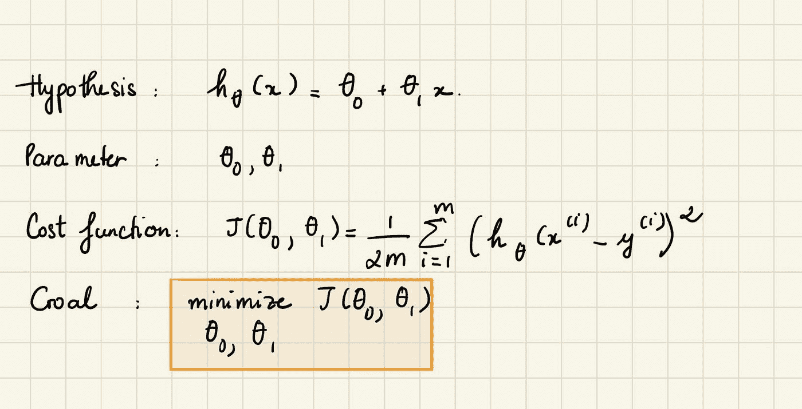

上一篇笔记的评论

所以我们有了假设函数，我们有了一种方法来衡量它与数据的吻合程度。我们现在需要估计假设函数中的参数θ0 和θ1。

这里是问题设置。假设我们有一个函数 J，为θ0，θ1。我们想在函数 J 的θ0 和θ1 上最小化(θ0，θ1)。事实证明梯度下降是解决这个普遍问题的算法。我们将从θ0 和θ1 的一些初始猜测开始。它们是什么并不重要，但一个常见的选择是我们把θ0 设为 0，θ1 设为 1。在梯度下降中，我们要做的是不断改变θ0 和θ1 一点点，试图减少 J(θ0，θ1)，直到风力达到最小值，或者可能达到局部最小值。

> **梯度下降**是一种有效的优化算法，试图找到成本函数的局部或全局最小值。

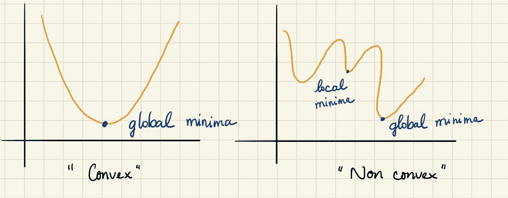

全局最小值与局部最小值

> **局部最小值**是我们的函数低于所有邻近点的点。不可能通过制造无穷小的步长来降低成本函数值。
> 
> **全局最小值**是获得我们函数的绝对最小值的点，但是全局最小值在实际中很难计算。

**成本函数 vs 梯度下降**

我们可能会争辩说，如果成本函数和梯度下降都用于最小化某个东西，那么区别是什么，我们可以使用其中一个而不是另一个吗？

嗯，一个**成本函数**是我们想要最小化的东西。例如，我们的成本函数可能是训练集的误差平方和。**梯度下降**是一种求多元函数最小值的方法。

> 所以我们可以使用梯度下降作为工具来最小化我们的成本函数。

假设我们有一个包含 n 个变量的函数，那么梯度就是长度为 n 的向量，它定义了成本增长最快的方向。所以在梯度下降中，我们沿着梯度的负值到达成本最小的点。在机器学习中，成本函数是我们应用梯度下降算法的函数。

我假设读者已经熟悉微积分，但是在这里我将提供一个微积分概念如何与最优化相关的简要概述。所以不要担心朋友，只要和我在一起…这是一种直觉！

机器学习在优化问题中使用[导数](https://en.wikipedia.org/wiki/Derivative)。导数用于决定是否增加或减少权重来增加或减少目标函数。如果我们能计算一个函数的导数，我们就知道朝哪个方向去最小化它。

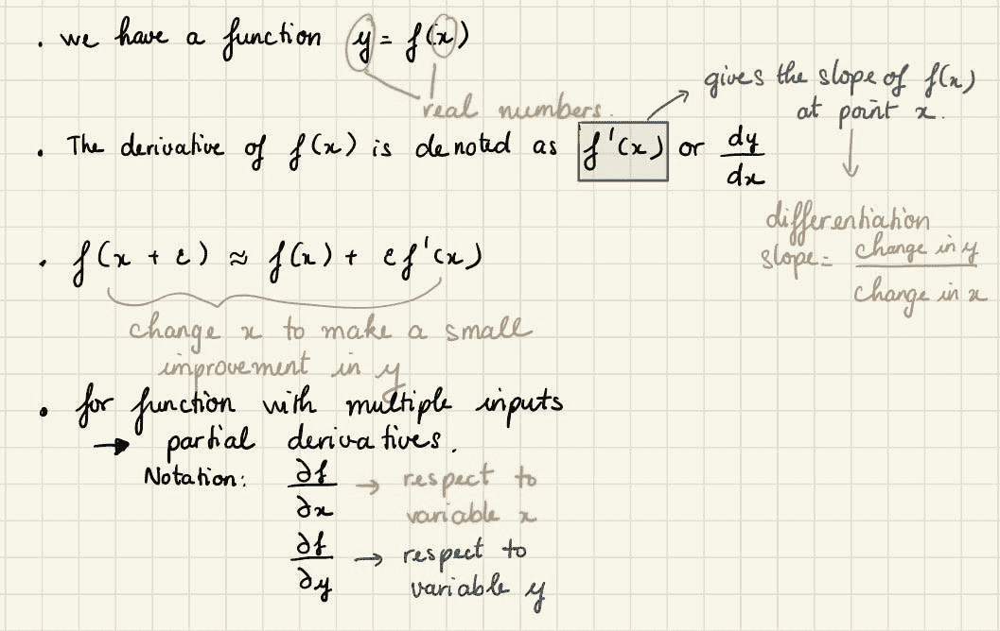

一些符号

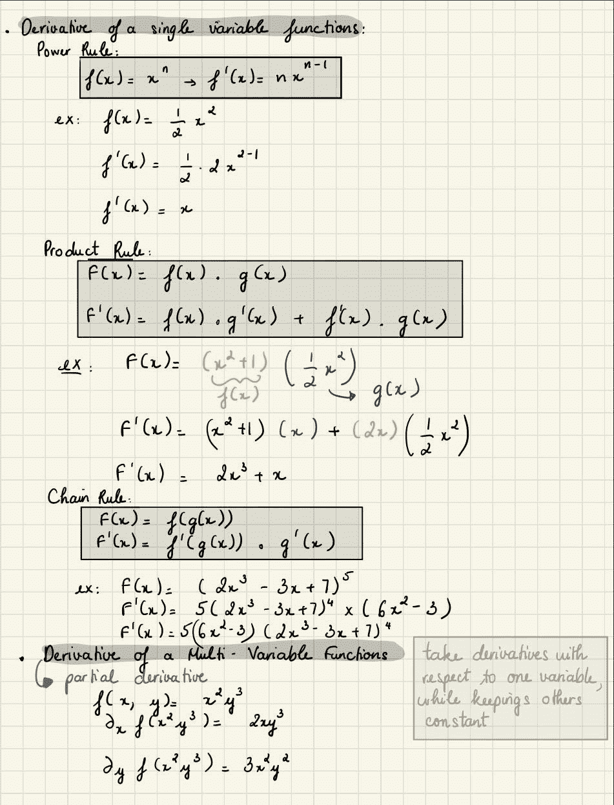

导数快速复习

假设我们有一个函数 y = f(x)。f’(x)导数给出了 f(x)在 x 点的斜率，它规定了如何调整输入的微小变化，以获得输出的相应变化。假设，f(x) = 1/2 x

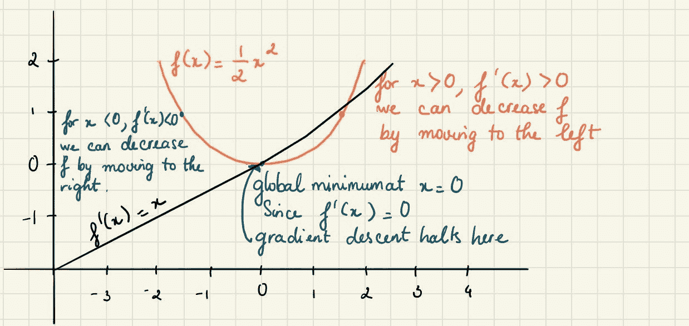

我们可以用导数符号相反的小步长来减少 f(x)。当 f'(x) = 0 时，导数不提供关于移动方向的信息。f'(x) = 0 的点称为**临界点。**

[**收敛的概念**](http://mathworld.wolfram.com/ConvergentSequence.html) 是一个定义明确的数学术语。这意味着“最终”一系列元素越来越接近单一值。那么一个算法收敛意味着什么呢？从技术上讲，收敛的不是算法，而是算法正在处理或迭代的值。为了说明这一点，假设我们正在编写一个算法，打印圆周率的所有数字。

我们的算法开始打印如下数字:

```
x0 = 3.1
x1 = 3.14
x2 = 3.141
x3 = 3.1415
x4 = 3.14159
...
```

正如我们所看到的，该算法打印出接近圆周率的递增数字。我们说我们的算法收敛于π。而我们把这样的函数叫做**凸函数**(像碗的形状)。现在，让我们考虑梯度下降的公式:

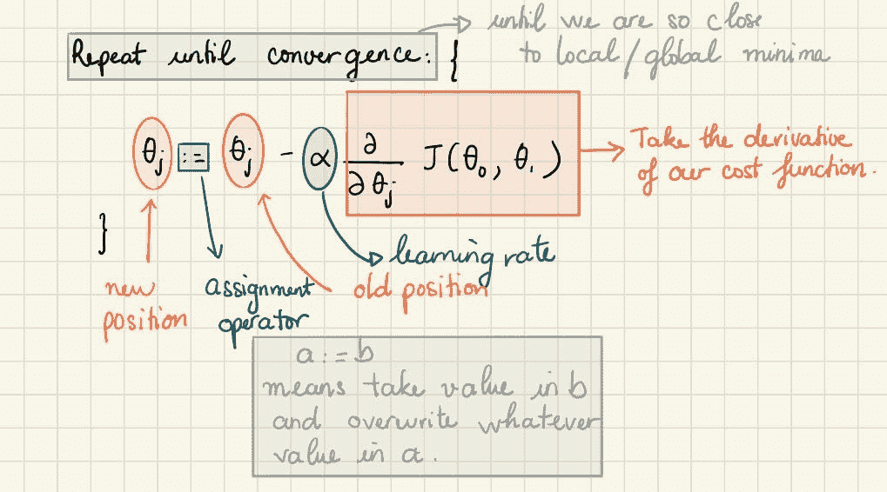

梯度下降公式

我们通过对成本函数求导(函数的切线)来实现这个公式。切线的斜率是该点的导数，它会给我们一个前进的方向。我们沿着下降速度最快的方向逐步降低成本函数。每一步的大小由参数α (alpha)决定，称为**学习率**。

> **学习率**决定了梯度下降算法的步长。

为了有效地达到局部最小值，我们必须适当地设置我们的学习率参数α，不能太高也不能太低。根据初始点在图上的开始位置，它可能会在不同的点结束。通常，学习率的值是手动选择的，通常从 0.1、0.01 或 0.001 开始。

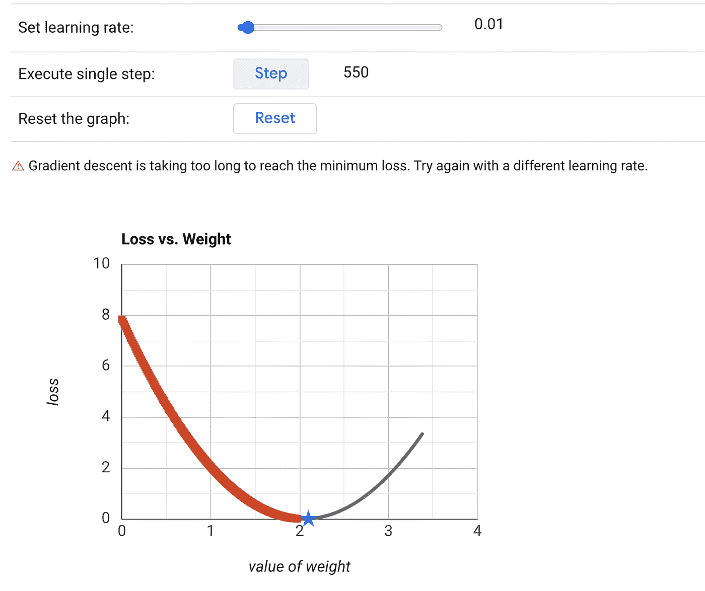

来源:[ML-速成班](https://developers.google.com/machine-learning/crash-course/fitter/graph)

在这种情况下，梯度下降的计算时间太长；我们需要提高学习率。

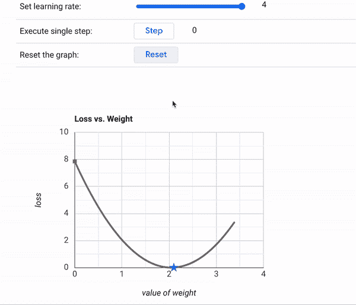

来源:[ML-速成班](https://developers.google.com/machine-learning/crash-course/fitter/graph)

如果我们的学习曲线只是上上下下，没有达到最低点，我们应该尝试降低学习速度。

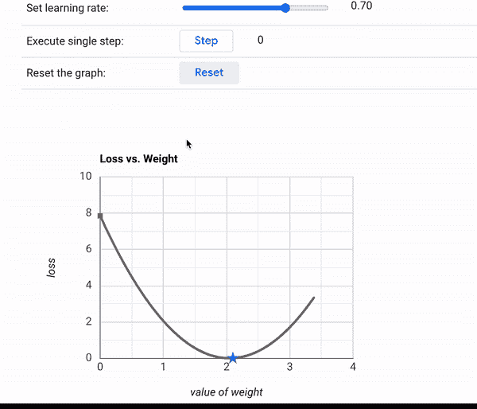

来源:[ML-速成班](https://developers.google.com/machine-learning/crash-course/fitter/graph)

注意:

*   如果学习率太大，损失会四处反弹，可能达不到局部最小值。
*   如果学习率太小，那么梯度下降将最终达到局部最小值，但是需要很长时间来达到这个目的。
*   如果梯度下降正常工作，成本函数应该随时间降低。

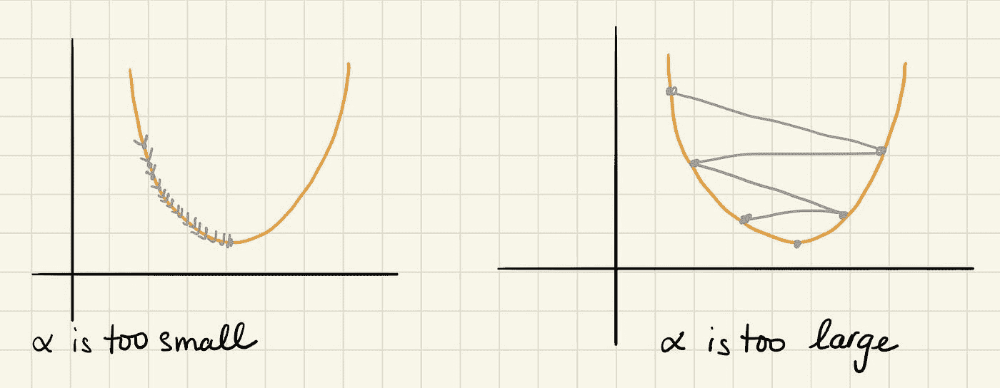

我们如何将这个想法形象化？

假设我们在莱尔山(约塞米蒂国家公园的最高点)，我们沿着河边的小路徒步下山。这里的梯度下降工作正是我们的目标——到达山的最底部。Mount Lyell 是在空间中绘制的数据，代表目标函数的曲面，我们移动的步长是**学习率。**山上的最低点是函数的成本达到最小值的值(我们的模型呈现更高精度的参数α)。

还假设莱尔山的形状是这样的，河流不会停在任何地方，会直接到达山脚(像一个碗状)。在机器学习中，我们会达到我们的**全局最小值。**然而，现实生活中并非如此。这条河在下降的过程中可能会遇到很多坑。它可能被困在坑中，无法向下移动，这是机器学习中的一个**局部最小值**。

当我们在山谷中时，我们没有办法再下山了。我们可以说我们已经**融合**。在机器学习中，当梯度下降不能再降低成本函数并且成本保持在同一水平附近时，我们可以说它已经收敛到最优。收敛的迭代次数可能变化很大。

这里的要点是初始值和学习率。根据我们从第一点开始的位置，我们可能会到达不同的局部最优值。此外，根据我们迈出的步伐的大小(学习速度)，我们可能会以不同的方式到达山脚。这些值对于决定我们是到达山脚(全局最小值)还是被困在坑里(局部最小值)很重要。

所以我们知道梯度下降是一种寻找函数最小值的优化算法。我们如何将算法应用于线性回归？

要应用梯度下降，这里的关键术语是导数。

1.  **取成本函数，对θ0 和θ1 取偏导数，看起来是这样的:**

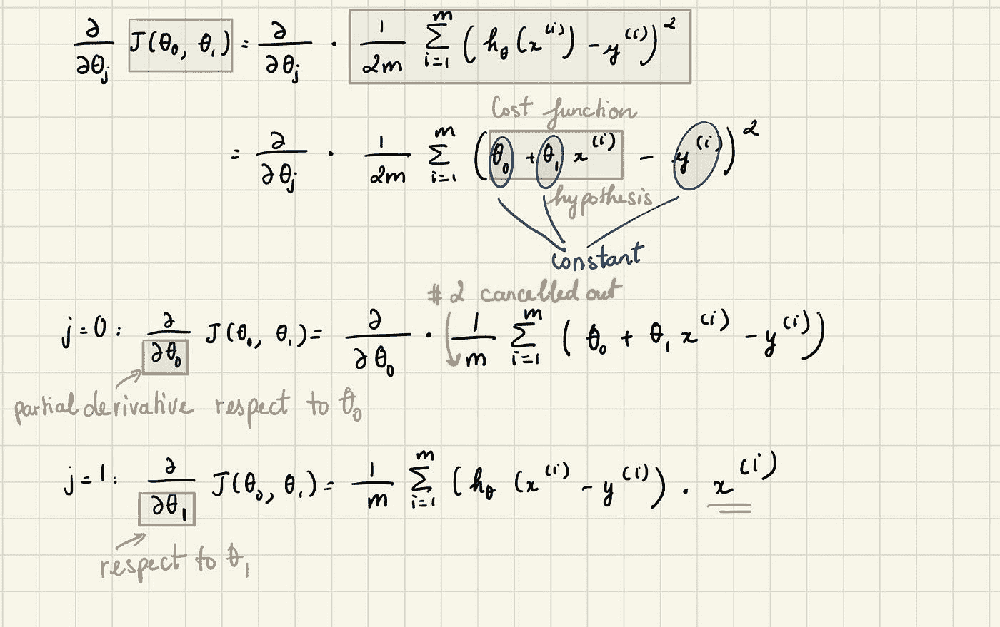

为了求偏导数，我们保持其他变量不变。比方说，我们想对θ0 求导，我们只把θ1 当作常数，反之亦然。

但是为什么我们要在方程中使用偏导数呢？这样我们就有办法衡量我们的假设函数与数据的吻合程度。我们需要估计假设函数中的参数(θ0 和θ1)，也就是说，我们想知道θ0 和θ1 的变化率值。在微积分中，偏导数将函数的变化率表示为一个变量的变化，而其他变量保持不变。我们将关于θ0 和θ1 的偏导数应用于成本函数，以将我们指向最低点。

**2。将它们重新插入我们的梯度下降算法**

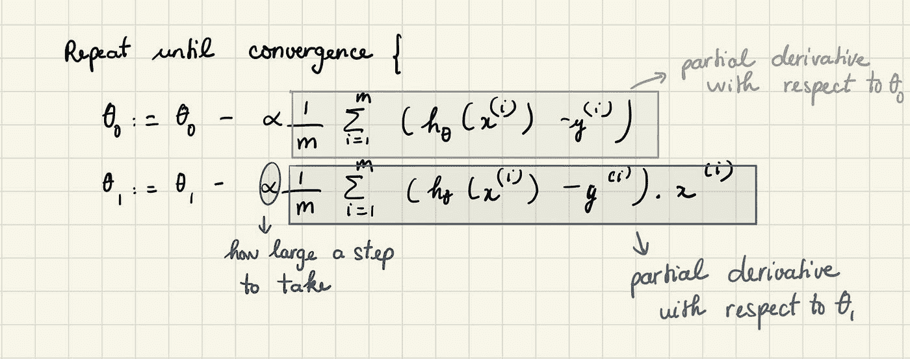

要找到最佳最小值，重复步骤，对θ0 和θ1 应用不同的值。换句话说，重复这些步骤直到收敛。

寻找θ0 和θ1 的最优值的过程，就是最小化我们的导数。

因此，为了在迭代的下一步求解梯度，我们使用更新的θ0 和θ1 值迭代通过我们的数据点，并计算它们的偏导数。这个新的梯度告诉我们在当前位置的成本函数的斜率，以及我们应该移动以更新参数的方向。我们更新的大小是由学习率控制的。

**梯度下降的利弊**

*   一个简单的算法，易于实现，每次迭代都很便宜；我们只需要计算一个梯度
*   然而，它通常很慢，因为许多有趣的问题不是强凸的
*   不能处理不可微的函数(最大的缺点)

# 梯度下降变体

根据用于计算梯度的数据量，有三种类型的梯度下降方法:

*   批量梯度下降
*   随机梯度下降
*   小批量梯度下降

**批量梯度下降**

*   在批量梯度下降中，为了计算成本函数的梯度，我们计算训练数据集中每个示例的误差，然后求和。只有在评估完所有示例后，才会更新模型。
*   如果我们有 1000 个样本，或者在最坏的情况下，一百万个样本，会怎么样？梯度下降算法需要运行一百万次。所以批量梯度下降不太适合大型数据集。

正如我们所见，批量梯度下降在这里不是一个最佳解决方案。它需要大量的计算资源，因为整个数据集需要保留在内存中。因此，如果我们只需要向最小值移动一步，我们应该计算一百万次成本吗？

**随机梯度下降**

*   在 SGD 中，我们在每次迭代中使用一个训练样本，而不是使用整个数据集来对每步进行求和，也就是说，SGD 对每个观察值执行一次参数更新。因此，它只需要一个来执行参数更新，而不是遍历每个观察值。

注意:在 SGD 中，在 for 循环之前，我们需要随机打乱训练样本。

*   SGD 通常比批量梯度下降更快，但是它到达最小值的路径比批量梯度下降更随机，因为 SGD 一次只使用一个例子。但是我们对路径不感兴趣，只要它给我们最少和更短的训练时间就可以了。
*   SGD 广泛用于大型数据集训练，计算速度更快，并且可以允许并行模型训练。

**小批量梯度下降**

*   小批量梯度下降是浴梯度下降和随机梯度下降的结合。
*   小批量梯度下降在每次迭代中使用 n 个数据点(而不是 SGD 中的一个样本)。

# 案例研究:

我们已经了解了实现线性回归所需的一切。现在是时候看看它在数据集上是如何工作的了。通过用 Python 实现一个简单的线性回归，我学到了很多。我希望你看完我的笔记后能学到一两件事。

我从国家海洋和大气管理局下载了波士顿的天气报告。你可以在 [Kaggle](https://www.kaggle.com/) 上搜索比赛、数据集和其他解决方案。我们的数据集包含气象站每天记录的天气状况信息。信息包括平均温度(TAVG)、季节至今的冷却度天数(CDSD)、该期间的极端最高温度(EMXT)、季节至今的加热度天数(HDSD)、最高温度(TMAX)、最低温度(TMIN)。在本例中，我们希望将输入要素作为最低温度来预测最高温度。

让我们用 Python 弄脏自己的手，好吗？


资料来源:giphy.com

1.  **导入所有需要的库:**

```
import pandas as pd
import numpy as np
import matplotlib.pyplot as plt
import seaborn as seabornInstance
from sklearn.model_selection import train_test_split
from sklearn.linear_model import LinearRegression
%matplotlib inline
```

2.**使用 pandas 导入 CSV 数据集:**

```
df = pd.read_csv(‘climate.csv’)
df.dropna(inplace = True)
```

我们使用 dropna()函数来删除丢失的值。

3.**检查数据集中的行数和列数。**

```
df.shape
```

我们应该收到输出(903，9)，这意味着我们的数据包含 903 行和 9 列。

通过使用 describe()函数，我们可以看到数据集的统计细节:

```
df.describe()
```

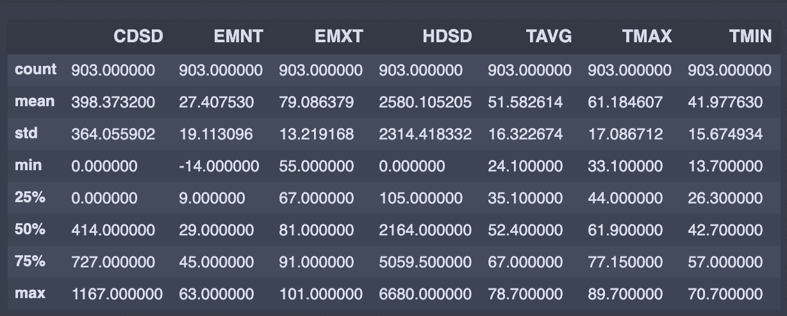

4.**可视化我们的数据集，看看我们能否手动找到数据之间的任何关系。**

```
fig,(ax1) = plt.subplots(1, figsize = (12,6))
ax1.scatter (X, y, s = 8)
plt.title (‘Min vs Max Temp’)
plt.xlabel(‘TMIN’)
plt.ylabel(‘TMAX’)
plt.show()
```

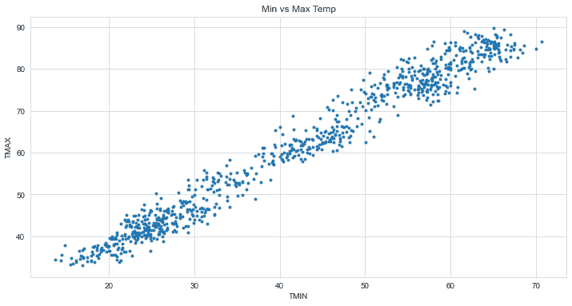

5.**将数据分为“属性”和“标签”。**

属性是自变量，而标签是因变量，其值将被预测。在我们的数据集中，我们只有两列。我们想根据 TMIN 记录来预测 TMAX。因此，我们的属性集将由存储在 X 变量中的“TMIN”列组成，标签将是存储在 y 变量中的“TMAX”列。

```
X = df[‘TMIN’].values.reshape(-1,1).astype(‘float32’)
y = df[‘TMAX’].values.reshape(-1,1).astype(‘float32’)
```

6.**将 80%的数据分割成训练集，而将 20%的数据分割成测试集。**

test_size 变量是我们指定测试集比例的地方。

```
X_train, X_test, y_train, y_test = train_test_split(X, y, test_size=0.2, random_state=0)
```

7.**训练我们的算法。**

为此，我们需要导入 LinearRegression 类，实例化它，并调用 fit()方法以及我们的训练数据。

```
h = LinearRegression()
h.fit(X_train,y_train)
print(h.intercept_) # to retrieve theta_0
print(h.coef_) # to retrieve theta_1
```

对于θ_ 0，结果应该是大约 16.25，而对于θ_ 1，结果应该是大约 1.07。

8.**做一些预测。**

为此，我们将使用我们的测试数据，看看我们的算法预测百分比分数的准确性如何。

```
y_pred = h.predict(X_test)
compare = pd.DataFrame({‘Actual’: y_test.flatten(), ‘Predicted’: y_pred.flatten()})
compare
```

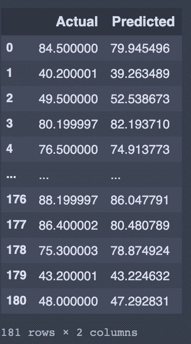

实际值和预测值的比较

从上表中我们可以看出，预测的百分比与实际的百分比很接近。让我们用测试数据画一条直线:

```
fig,(ax1) = plt.subplots(1, figsize = (12,6))
ax1.scatter (X_test, y_test, s = 8)
plt.plot(X_test,y_pred, color = ‘black’, linewidth = 2)\
plt.show()
```

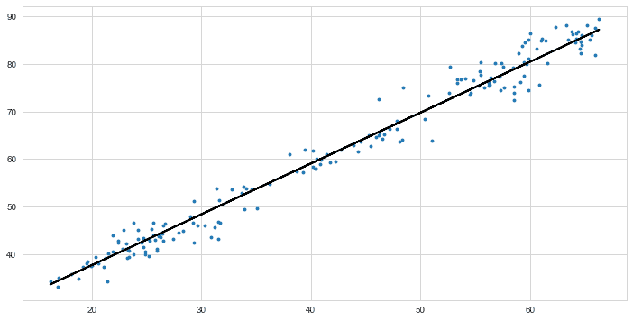

预测与实际图非常接近，这表明方差值很小。

9.**实施线性回归**

```
#pick some random value to start with
theta_0 = np.random.random()
theta_1 = np.random.random()def hypothesis (theta_0,theta_1,X):
    return theta_1*X + theta_0def cost_function (X,y,theta_0,theta_1):
    m = len(X)
    summation = 0.0
    for i in range (m):
        summation += ((theta_1 * X[i] + theta_0) - y[i])**2
    return summation /(2*m)def gradient_descent(X,y,theta_0,theta_1,learning_rate):
    t0_deriv = 0
    t1_deriv = 0
    m = len(X)

    for i in range (m):
        t0_deriv += (theta_1 * X[i] + theta_0) - y[i]
        t1_deriv += ((theta_1 * X[i] + theta_0) - y[i])* X[i]theta_0 -= (1/m) * learning_rate * t0_deriv
    theta_1 -= (1/m) * learning_rate * t1_deriv

    return theta_0,theta_1def training (X, y, theta_0, theta_1, learning_rate, iters):
    cost_history = [0]
    t0_history = [0]
    t1_history = [0]

    for i in range(iters):
        theta_0,theta_1 = gradient_descent(X, y, theta_0, theta_1, learning_rate)
        t0_history.append(theta_0)
        t1_history.append(theta_1)
        cost = cost_function(X, y, theta_0, theta_1)
        cost_history.append(cost)
          if i%10 == 0:
              print ("iter={}, theta_0={}, theta_1={}, cost= {}".format(i, theta_0, theta_1, cost))return t0_history, t1_history, cost_history
```

对于 2000 次迭代，我们选择学习率等于 0.01，并绘制我们的成本函数 J

```
t0_history, t1_history, cost_history = training (X, y, theta_0, theta_1, 0.01, 2000)#Plot the cost function
plt.title('Cost Function J')
plt.xlabel('No. of iterations')
plt.ylabel('Cost')
plt.plot(cost_history)
plt.ylim(ymin=0)
plt.xlim(xmin=0)
plt.show()
```

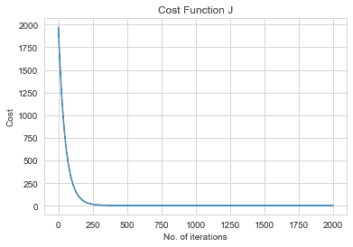

我发现了一个很酷的方法，用 Matplotlib 的动画来可视化我们的数据。模型需要 449 次迭代才能非常接近最佳拟合线。

```
import matplotlib.animation as animationfig = plt.figure()
ax = plt.axes()# set up our plot
plt.ylabel(“TMAX”)
plt.xlabel(“TMIN”)
plt.title(‘Linear Regression’)
plt.scatter(X, y, color =’gray’,s =8)
line, = ax.plot([], [], lw=2)
plt.close()#Generate the animation data,
def init():
    line.set_data([], [])
    annotation.set_text('')
    return line, annotation# animation function.  This is called sequentially
def animate(i):
    #print(i)
    x = np.linspace(-5, 20, 1000)
    y = past_thetas[i][1]*x + past_thetas[i][0]
    line.set_data(x, y)
    annotation.set_text('Cost = %.2f e10' % (past_costs[i]/10000000000))
    return line, annotationanim = animation.FuncAnimation(fig, animate, init_func=init, frames=np.arange(1,400), interval=40, blit=True)from IPython.display import HTML
HTML(anim.to_html5_video())
```

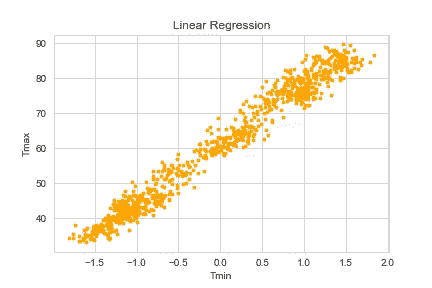

# 就是这样！

在这篇笔记中，我们学习了最基本的机器学习算法——梯度下降。我们在 Scikit-Learning 机器学习库的帮助下实现了一个简单的线性回归。在下一篇笔记中，我们将重点介绍[多元线性回归](https://medium.com/nothingaholic/multiple-linear-regression-with-python-22e2087cd628)。

任何努力最难的部分是开始，你已经度过了，所以不要停止！

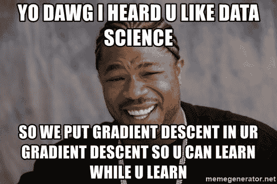

来源:memgenerator.net

幸运的是，线性回归在几乎所有的机器学习课程中都有很好的教授，并且有相当数量的可靠资源来帮助我们理解线性回归模型的不同部分，包括背后的数学。如果你发现自己想要了解更多，下面是更多的资源。

1.  [优化学习率](https://developers.google.com/machine-learning/crash-course/fitter/graph)
2.  [消除深度学习中所有不好的局部极小值](https://arxiv.org/abs/1901.00279)(康奈尔大学)
3.  [消除深度学习中所有不好的局部极小值](http://www.mit.edu/~kawaguch/pub/elimination2020.pdf)(麻省理工学院)
4.  [什么是收敛？](https://ai.stackexchange.com/questions/16348/what-is-convergence-in-machine-learning#:~:text=Convergence%20is%20a%20term%20mathematically,series%29%20is%20a%20converging%20series.)
5.  [为什么要可视化梯度下降优化算法？](/why-visualize-gradient-descent-optimization-algorithms-a393806eee2)
6.  案例分析— [Moneyball —线性回归](/moneyball-linear-regression-76034259af5e)
7.  [将您的数据分为培训和测试](https://stackoverflow.com/questions/13610074/is-there-a-rule-of-thumb-for-how-to-divide-a-dataset-into-training-and-validatio#:~:text=Split%20your%20data%20into%20training,indeed%20a%20good%20starting%20point%29&text=You%20should%20see%20both%20greater,the%20same%20procedure%20in%20reverse.) (80/20)
8.  [两个变量梯度下降的偏导数](https://math.stackexchange.com/questions/70728/partial-derivative-in-gradient-descent-for-two-variables)
9.  要处理的免费数据: [Lionbridge AI](https://lionbridge.ai/datasets/10-open-datasets-for-linear-regression/) ，[数据集搜索](https://datasetsearch.research.google.com/)