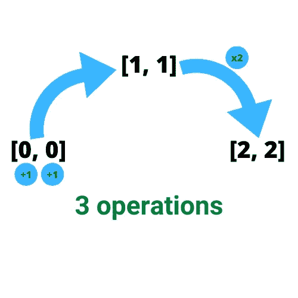
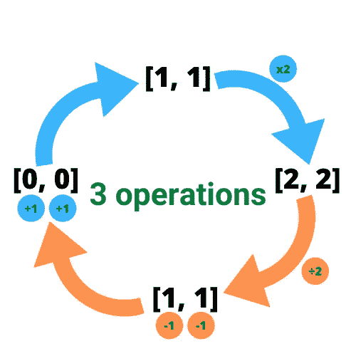

# 使用 Python 和 Javascript 创建目标数组的最少函数调用次数

> 原文：<https://towardsdatascience.com/minimum-numbers-of-function-calls-to-make-target-array-with-python-and-javascript-a354eb8fddcb?source=collection_archive---------42----------------------->

## 使用 Python 和 Javascript 解决方案:解决中等 leetcode 问题

# 理解问题

[创建目标数组](https://leetcode.com/problems/minimum-numbers-of-function-calls-to-make-target-array/)的最小函数调用次数是 leetcode 的一个中等问题，我希望你已经仔细阅读了这个问题并尝试解决它。这个问题要求你得到最少的运算次数，以便得到想要的数组。现在的问题是，我们怎样才能做这样的运算来计数它的个数，以尽可能少的方式到达目标数组。

# 最初的想法

让我们以这个例子为例，将[2，2]作为目标数组，我们想知道到达该数组的最少操作数。因此，我们从[0，0]开始，将每个元素加 1(现在是 2 次运算)达到[1，1]，然后将整个数组乘以 2 (1 次运算)达到我们想要的目标数组[2，2]，因此我们有 3 次运算来达到本例中所需的数组，如下所示:

图片由[作者](https://www.ezzeddinabdullah.com/posts/minimum-numbers-of-function-calls-to-make-target-array-with-python-and-javascript)

但是很难从[0，0]移动到[2，2],因为可能会错误地猜测我们想要到达的下一个数组。我们可以更好地从[2，2]向后移动到[0，0]，如下所示:

图片由[作者](https://www.ezzeddinabdullah.com/posts/minimum-numbers-of-function-calls-to-make-target-array-with-python-and-javascript)

在这种情况下，我们可以用除法代替乘法，用减法代替加法，如橙色所示，我们最终会得到相同数量的运算。

# 更好的路径

所以现在我们有两个主要的操作要做:除法和减法。似乎当数组中的所有元素都可以被 2 整除时，我们会使用除法，但如果是奇数，我们会使用减法。整数除法可以让我们不用担心奇数的存在，因为偶数和奇数将被除法运算，剩下的就是对每个存在的奇数的运算次数，这可以通过计算余数来完成。任何数被 2 除的余数不是 1 就是 0。如果是 1，我们表示这个数是奇数，然后我们知道这是一个操作。

以下是用 Python 和 Javascript 计算整数除法和余数的一些脚本:

# 计算机编程语言

# java 描述语言

# 承认

Python 代码是我和我最好的朋友 [Nour](https://github.com/noureddin) 的共同作品。他实际上在 gist 上做出了贡献，解释了在 leetcode 上发现的更有效的解决方案，请参见这个[奇妙的 gist](https://gist.github.com/noureddin/d2981404efd76cf15ec944639afe92a4) :

# 动机是

*   [Array.prototype.some()](https://developer.mozilla.org/en-US/docs/Web/JavaScript/Reference/Global_Objects/Array/some) ‍
*   [创建目标数组的最小函数调用次数| Leetcode 1558](https://www.youtube.com/watch?v=4z6sgk9NELo&ab_channel=CompetitiveCoding) ‍
*   [Python 中的 map()、filter()和 reduce()并举例](https://stackabuse.com/map-filter-and-reduce-in-python-with-examples/)
*   [映射、过滤和缩小](https://book.pythontips.com/en/latest/map_filter.html) ‍
*   [JavaScript 中带余数的整数除法？](https://stackoverflow.com/a/4228376/4604121)

# 更多的解决问题？

你可能想看看更多解决问题的东西:)

 [## 用 Python 和 Javascript 实现图论中到达所有节点的最小顶点数

### 用图论解决一个中等 leetcode 问题

medium.com](https://medium.com/swlh/minimum-number-of-vertices-to-reach-all-nodes-by-graph-theory-with-python-and-javascript-642b8134799e)  [## Python 和 Javascript 中正则表达式的千位分隔符

### 在 Python 和 Javascript 解决方案中使用正则表达式:解决千位分隔符这一简单的 leetcode 问题

medium.com](https://medium.com/analytics-vidhya/thousand-separator-by-regular-expressions-with-python-and-javascript-7edf8ed7e331)  [## 用 Python 动态编程实现彩色矩形

### 使用 Python 解决方案的动态编程:让我们学习如何考虑彩色矩形，一个 1800 点…

medium.com](https://medium.com/an-idea/colored-rectangles-by-dynamic-programming-with-python-a20576a44610) 

# *最初发布*

 [## EzzEddin 使用 Python 和 Javascript 创建目标数组的最小函数调用数…

### 创建目标数组的最小函数调用次数是 leetcode 中的一个中等问题，我希望你已经阅读了…

www.ezzeddinabdullah.com](https://www.ezzeddinabdullah.com/posts/minimum-numbers-of-function-calls-to-make-target-array-with-python-and-javascript)