# 在 LinkedIn 上挖掘数据

> 原文：<https://towardsdatascience.com/mining-data-on-linkedin-9b70681b1467?source=collection_archive---------5----------------------->

## 使用职称、同事等


照片由[格雷格·布拉](https://unsplash.com/@gregbulla?utm_source=medium&utm_medium=referral)在 [Unsplash](https://unsplash.com?utm_source=medium&utm_medium=referral) 上拍摄

LinkedIn 是一个专注于职业和商业关系的社交网站。在这篇文章中，我将介绍一些挖掘数据的方法。

*   使用 LinkedIn OAuth 凭据发出 LinkedIn API 请求。
*   将 LinkedIn 连接下载为 CSV 文件。
*   做一些数据分析。

在我们开始之前，请记住，所有要求您安装`python3-linkedin`库的教程现在都不起作用了。

```
p̶i̶p̶ ̶i̶n̶s̶t̶a̶l̶l̶ ̶p̶y̶t̶h̶o̶n̶3̶-̶l̶i̶n̶k̶e̶d̶i̶n̶
```

不要在下面的代码上浪费时间。

```
p̶i̶p̶ ̶i̶n̶s̶t̶a̶l̶l̶ ̶p̶y̶t̶h̶o̶n̶3̶-̶l̶i̶n̶k̶e̶d̶i̶n̶f̶r̶o̶m̶ ̶l̶i̶n̶k̶e̶d̶i̶n̶ ̶i̶m̶p̶o̶r̶t̶ ̶l̶i̶n̶k̶e̶d̶i̶n̶
̶
̶A̶P̶I̶_̶K̶E̶Y̶ ̶=̶ ̶'̶w̶F̶N̶J̶e̶k̶V̶p̶D̶C̶J̶t̶R̶P̶F̶X̶8̶1̶2̶p̶Q̶s̶J̶e̶e̶-̶g̶t̶0̶z̶O̶4̶X̶5̶X̶m̶G̶6̶w̶c̶f̶S̶O̶S̶l̶L̶o̶c̶x̶o̶d̶A̶X̶N̶M̶b̶l̶0̶_̶h̶w̶3̶V̶l̶'̶
̶A̶P̶I̶_̶S̶E̶C̶R̶E̶T̶ ̶=̶ ̶'̶d̶a̶J̶D̶a̶6̶_̶8̶U̶c̶n̶G̶M̶w̶1̶y̶u̶q̶9̶T̶j̶o̶O̶_̶P̶M̶K̶u̶k̶X̶M̶o̶8̶v̶E̶M̶o̶7̶Q̶v̶5̶J̶-̶G̶3̶S̶P̶g̶r̶A̶V̶0̶F̶q̶F̶C̶d̶0̶T̶N̶j̶Q̶y̶G̶'̶
̶R̶E̶T̶U̶R̶N̶_̶U̶R̶L̶ ̶=̶ ̶'̶h̶t̶t̶p̶:̶/̶/̶l̶o̶c̶a̶l̶h̶o̶s̶t̶:̶8̶0̶0̶0̶'̶
̶
̶a̶u̶t̶h̶e̶n̶t̶i̶c̶a̶t̶i̶o̶n̶ ̶=̶ ̶l̶i̶n̶k̶e̶d̶i̶n̶.̶L̶i̶n̶k̶e̶d̶I̶n̶A̶u̶t̶h̶e̶n̶t̶i̶c̶a̶t̶i̶o̶n̶(̶A̶P̶I̶_̶K̶E̶Y̶,̶ ̶A̶P̶I̶_̶S̶E̶C̶R̶E̶T̶,̶ ̶R̶E̶T̶U̶R̶N̶_̶U̶R̶L̶,̶ ̶l̶i̶n̶k̶e̶d̶i̶n̶.̶P̶E̶R̶M̶I̶S̶S̶I̶O̶N̶S̶.̶e̶n̶u̶m̶s̶.̶v̶a̶l̶u̶e̶s̶(̶)̶)̶
̶p̶r̶i̶n̶t̶ ̶a̶u̶t̶h̶e̶n̶t̶i̶c̶a̶t̶i̶o̶n̶.̶a̶u̶t̶h̶o̶r̶i̶z̶a̶t̶i̶o̶n̶_̶u̶r̶l̶ ̶ ̶#̶ ̶o̶p̶e̶n̶ ̶t̶h̶i̶s̶ ̶u̶r̶l̶ ̶o̶n̶ ̶y̶o̶u̶r̶ ̶b̶r̶o̶w̶s̶e̶r̶
̶a̶p̶p̶l̶i̶c̶a̶t̶i̶o̶n̶ ̶=̶ ̶l̶i̶n̶k̶e̶d̶i̶n̶.̶L̶i̶n̶k̶e̶d̶I̶n̶A̶p̶p̶l̶i̶c̶a̶t̶i̶o̶n̶(̶a̶u̶t̶h̶e̶n̶t̶i̶c̶a̶t̶i̶o̶n̶)̶
```

# 创建 LinkedIn 应用程序

首先，我们需要创建一个 LinkedIn 应用程序，去 https://www.linkedin.com/developers/apps[参观](https://www.linkedin.com/developers/apps)并遵循指南。我创建了一个名为`MyLinkedIn`的应用程序。

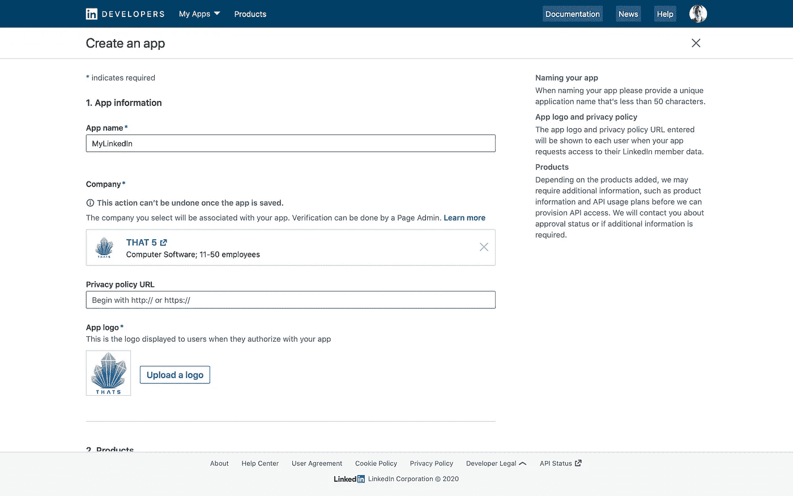

我们需要通过向页面管理员发送 URL 来获得公司验证。下面是我的例子中的 URL。

```
[https://www.linkedin.com/developers/apps/verification/05ab9ce8-766e-46d5-a922-5778df7db07e](https://www.linkedin.com/developers/apps/verification/05ab9ce8-766e-46d5-a922-5778df7db07e)
```

如果没有公司来验证您的申请，请创建一个新的公司。

# 如何获得 LinkedIn 的 API 访问权限？

LinkedIn 提供了一项服务，让人们通过基于 OAuth 的 API 将他们的 LinkedIn 档案和网络带到你的站点或应用程序中。

通过使用 Python 来使用 LinkedIn 的 API，您不需要安装任何库，只需要如下导入库。

```
import requestsimport stringimport random
```

下一步是获得 API 访问权，记下客户端 ID 和密码。

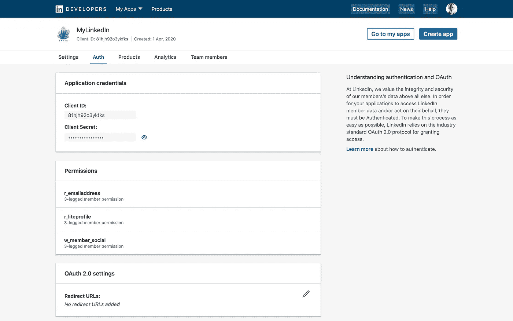

编写一个脚本来获取访问令牌。

```
# Copy the client ID, secret, and redirect URI in the fields below
CLIENT_ID    = '...'
CLIENT_SECRET = '...'
REDIRECT_URI = 'http://localhost:8000'

# Generate a random string to protect against cross-site request forgery
letters = string.ascii_lowercase
CSRF_TOKEN = ''.join(random.choice(letters) for i in range(24))

# Request authentication URL
auth_params = {'response_type': 'code',
               'client_id': CLIENT_ID,
               'redirect_uri': REDIRECT_URI,
               'state': CSRF_TOKEN,
               'scope': 'r_liteprofile,r_emailaddress,w_member_social'}

html = requests.get("https://www.linkedin.com/oauth/v2/authorization",
                    params = auth_params)

# Print the link to the approval page
print(html.url)

# Click the link below to be taken to your redirect page.
```

在我的情况下，链接如下，只需点击它。

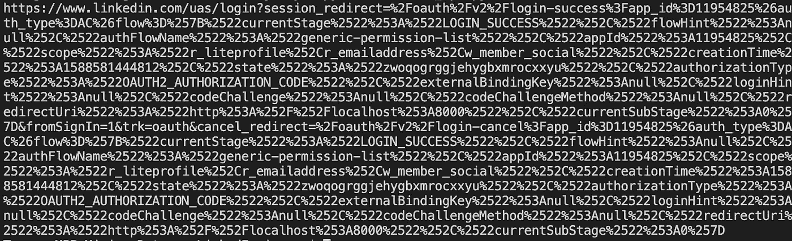

您将通过点击`allow`按钮进入，如下所示。LinkedIn 在授予对您的应用程序的访问权限(给予适当的权限)后，会将用户重定向回您的网站的 URL。

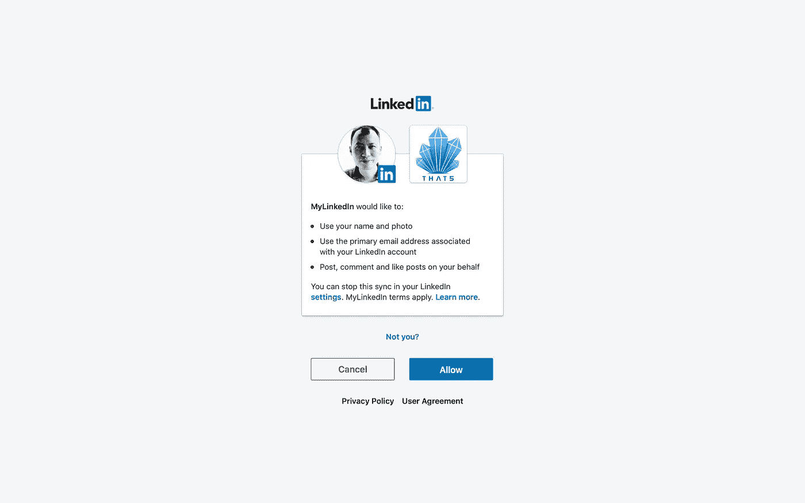

LinkedIn 在授予对您的应用程序的访问权限(给予适当的权限)后，会将用户重定向回您的网站的 URL。

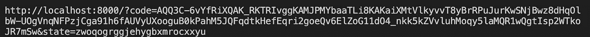

这意味着 authorization_code 的值是`AQQ3C.......JR7mSw`，它是在`&code=…`之后的代码，但不包括`&state=…`。将此访问令牌传递给应用程序。

```
AUTH_CODE ='AQQ3C.......JR7mSw'

ACCESS_TOKEN_URL = 'https://www.linkedin.com/oauth/v2/accessToken'

qd = {'grant_type': 'authorization_code',
      'code': AUTH_CODE,
      'redirect_uri': REDIRECT_URI,
      'client_id': CLIENT_ID,
      'client_secret': CLIENT_SECRET}

response = requests.post(ACCESS_TOKEN_URL, data=qd, timeout=60)

response = response.json()

access_token = response['access_token']

print ("Access Token:", access_token)
print ("Expires in (seconds):", response['expires_in'])
```

它显示的结果如下。

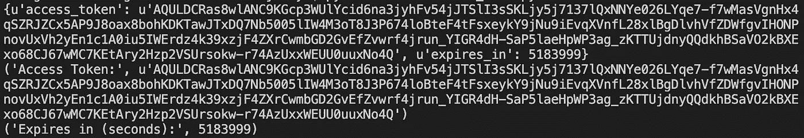

# 我们检索 LinkedIn 的个人资料

发出 HTTP 请求以检索个人配置文件。

```
import json

params = {'oauth2_access_token': access_token}
response = requests.get('https://api.linkedin.com/v2/me', params = params)

print(json.dumps(response.json(), indent=1))
```

它将返回我的 LinkedIn 个人资料。有许多字段选择器可以让客户端从 API 获取更多信息。

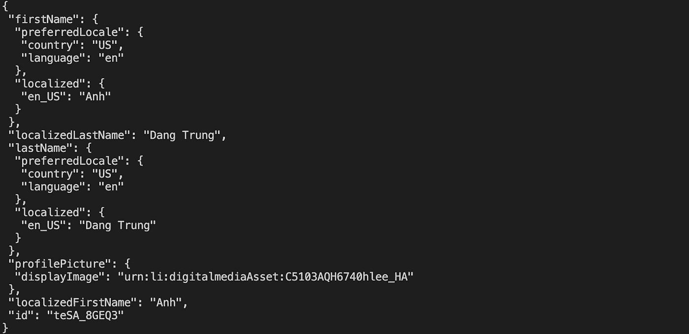

# 我们还可以显示特定的字段

请参见 https://developer.linkedin.com/docs/fields/positions[的](https://developer.linkedin.com/docs/fields/positions)部分，了解可以被传入以检索附加配置文件信息的附加字段选择器的详细信息。(*LinkedIn API 限制了可以查询的数据，例如，你不能再使用该 API 来检索你在 LinkedIn⁴的关系列表*)。

```
params = {'oauth2_access_token': access_token,
          'fields': ["localizedFirstName,localizedLastName,id"]}
response = requests.get('https://api.linkedin.com/v2/me', params = params)

print(json.dumps(response.json(), indent=1))
```

在这里，我们得到了`localizedFirstName`文件和`localizedLastName`文件。它返回的结果如下。

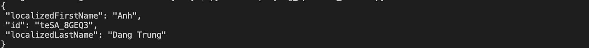

我们可以使用字段选择器语法来请求 API 的附加细节。

```
params = {'oauth2_access_token': access_token,
          'fields': ['lastName:(preferredLocale:(country,language))']}
response = requests.get('https://api.linkedin.com/v2/me', params = params)

print(json.dumps(response.json(), indent=1))
```

它显示了结果。

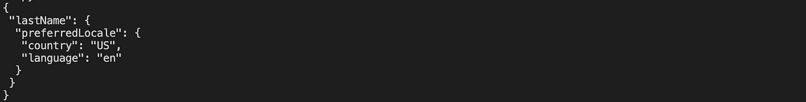

# 我们可以下载您的个人资料数据，并读入 CSV 格式的连接数据

去下载你的 LinkedIn 数据 https://www.linkedin.com/psettings/member-data here⁵:。

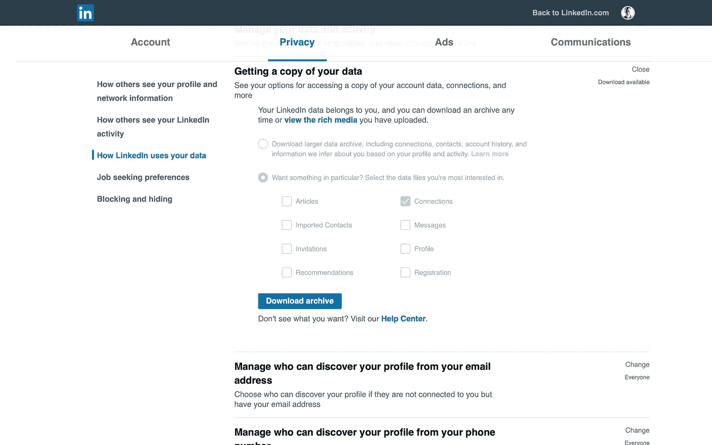

一旦收到请求，LinkedIn 将准备好您的个人资料档案，您可以下载。这是我的 csv 文件(名为`Connections.csv`)。

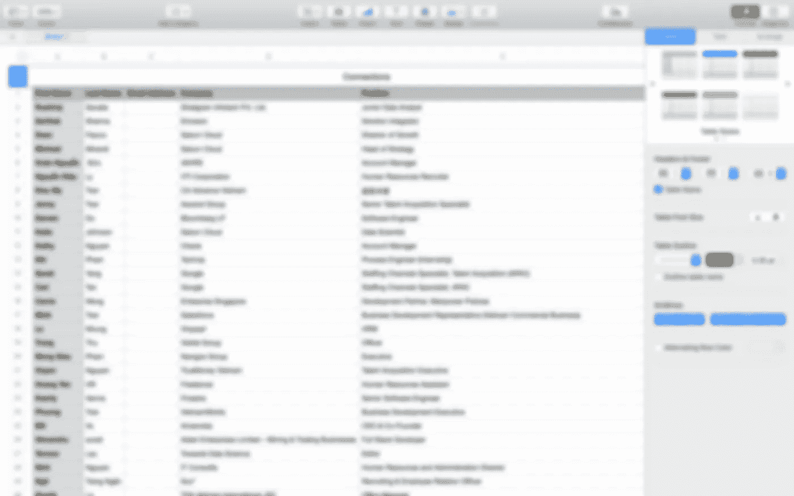

# 最后，我们做了一些数据分析

现在，您已经对如何访问 LinkedIn 的 API 有了基本的了解，让我们深入一些更具体的分析。

首先，我们加载数据文件。

```
import os
import csv

CSV_FILE = os.path.join('./', 'resources', 'Connections.csv')

csvReader = csv.DictReader(open(CSV_FILE), delimiter=',', quotechar='"')
contacts = [row for row in csvReader]
```

它指向我们的“Connections.csv”文件。现在，我们试图知道有多少人在谷歌工作。

```
workingAtGoogle = 0

for contact in contacts:
    for t in contact['Company'].split('/'):
        if (t == 'Google'):
            workingAtGoogle = workingAtGoogle+1
print('There are %d people who are working at Google.' % (workingAtGoogle))
```

我有 129 个在谷歌工作的熟人。


接下来，我们在寻找我的关系中有多少 CEO？

```
whoareceos = 0

for contact in contacts:
    for t in contact['Position'].split('/'):
        if (t == 'CEO'):
            whoareceos = whoareceos+1

print('There are %d people who are CEOs.' %(whoareceos))
```

它显示在我的连接中有 253 人是 CEO。


我们还试图将 LinkedIn 网络可视化。使用`pandas`库加载数据文件。

```
import pandas as pd

df = pd.read_csv(CSV_FILE)
print(df.head())
```

它列出了我的连接如下。

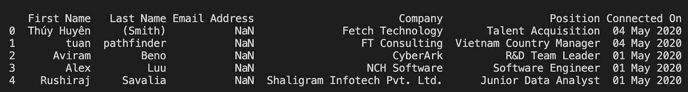

它包括我网络中每个人的电子邮件、当前职位和公司，以及他们何时成为我网络的一部分。

分析我们连接的时间。

```
import plotly.express as px

fig = px.scatter(df, x="First Name", y="Connected On")
fig.show()
```

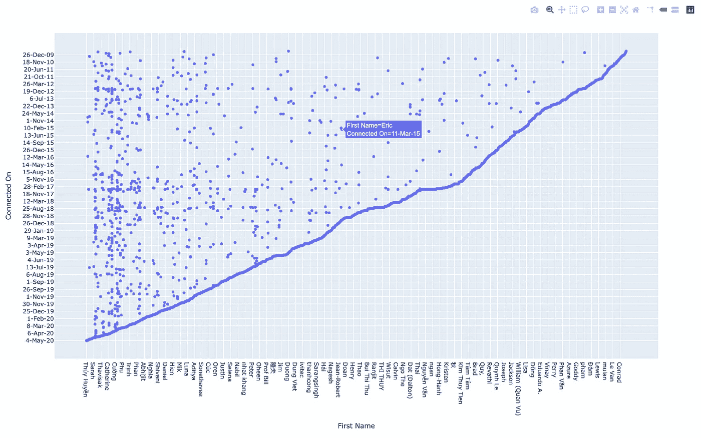

因为打印多行 CSV 文件显然不是可视化或理解我的网络的最佳方式。我使用 plotly.express 库在一个地方可视化我的整个网络。

```
fig = px.treemap(df, path=['Position', Company'], width=1200, height=1200)

fig.show()
```


很简单，对吧？我们学习了如何获得对 LinkedIn 的 API 访问。我们也做一些 API 请求。最后，我们在 LinkedIn 连接中做了一个简单的数据分析。

# 参考

[1][http://developers.linkedin.com/documents/authentication](http://developers.linkedin.com/documents/authentication)

[2][https://docs . Microsoft . com/en-us/LinkedIn/consumer/integrations/self-serve/sign-in-LinkedIn？上下文= LinkedIn/消费者/上下文](https://docs.microsoft.com/en-us/linkedin/consumer/integrations/self-serve/sign-in-with-linkedin?context=linkedin/consumer/context)

[3][https://developer.linkedin.com/docs/fields/positions](https://developer.linkedin.com/docs/fields/positions)

[4][https://developer . LinkedIn . com/blog/posts/2015/developer-program-changes](https://developer.linkedin.com/blog/posts/2015/developer-program-changes)

[5]https://www.linkedin.com/psettings/member-data