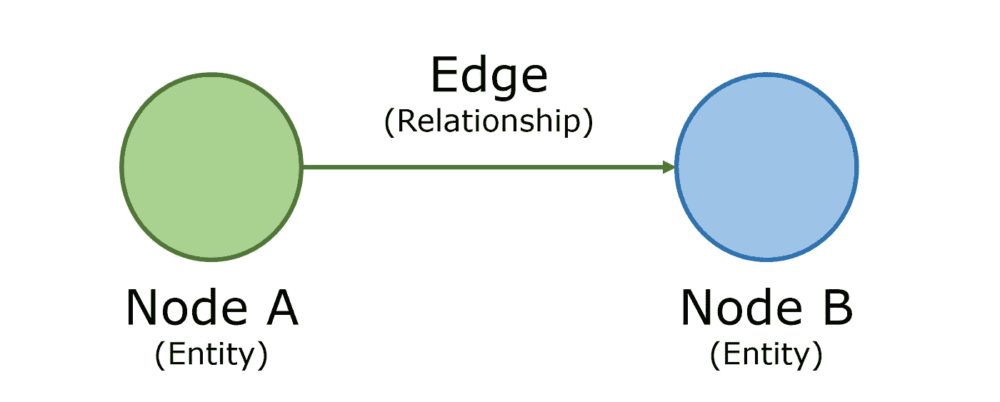
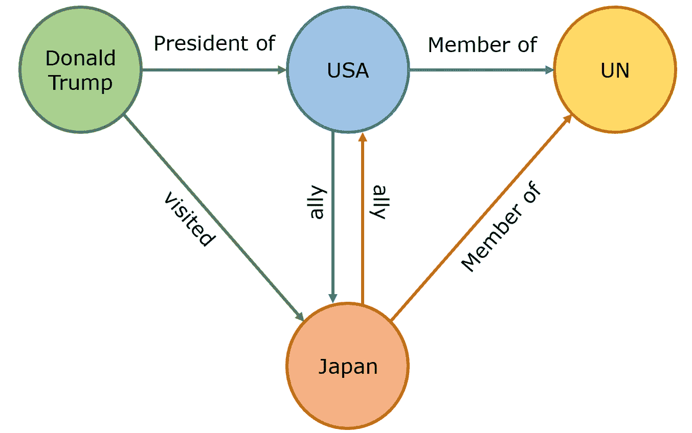
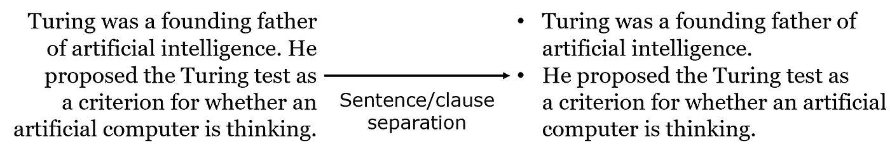
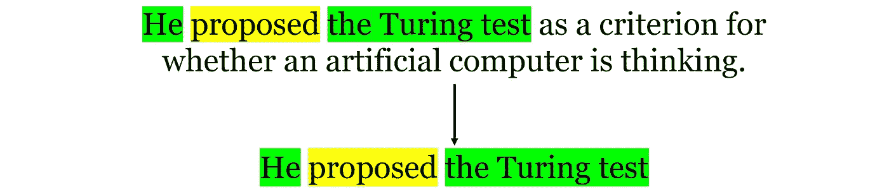
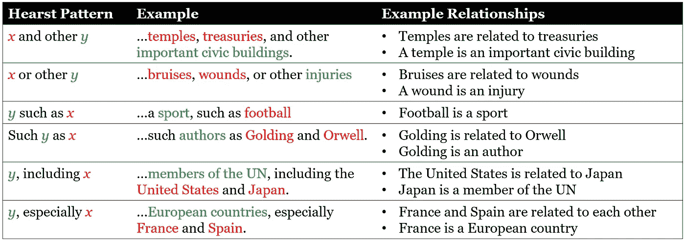
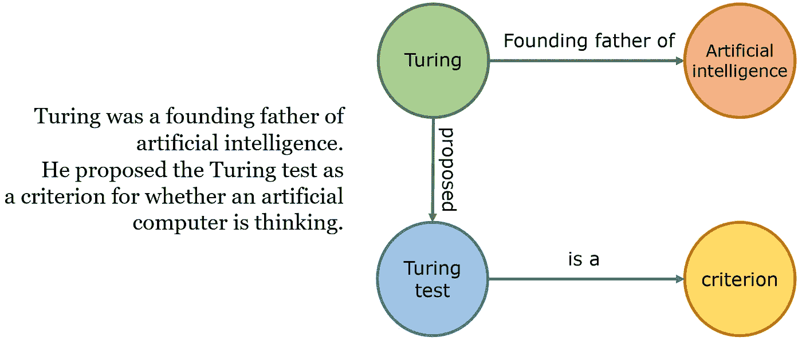

# 从混沌中挖掘秩序:自然语言处理与图论的巧妙融合

> 原文：<https://towardsdatascience.com/mining-order-from-chaos-the-ingenious-and-creative-fusion-of-nlp-graph-theory-954b10e2f976?source=collection_archive---------59----------------------->

[资料来源:Unsplash](https://unsplash.com/photos/-lp8sTmF9HA)

## 为什么基于图表的方法如此美妙

机器学习算法从一开始就被设计用来处理数字。对于可以很容易地转换成数字形式的数据，这种方法效果很好；无论是图像还是声音，这类问题的解决方案都被迅速开发和部署。然而，有一个领域还没有完全被机器掌握——语言，因为它显然是人类的。

将语言转换成数字的可行方法最终总是会丢失信息。例如，考虑 TF-IDF 矢量化，这是一种非常标准的文本到数字转换方法，对于非常简单的任务来说足够好，但无法理解语言的细微差别，如讽刺、上下文、文化参考、习语和具有多重含义的单词。即使有了像 BERT 这样的里程碑式的解决方案，自然语言处理可能仍然是机器学习领域中最有改进空间的领域。

或许，为了解决这样一个充满例外和细微差别的独特问题，机器学习工程师需要找到更具创造性的解决方案——毕竟，不是每个问题都可以通过使用神经网络变体来解决或可行地部署。以图论为例，它是一个经常被忽视或抛弃的数学领域，由莱昂哈德·欧拉在 1736 年通过思考柯尼希斯堡的七座桥问题而创立。图论和自然语言处理似乎不太可能一起工作，但它们确实一起工作了——在这两项研究的惊人巧妙和创造性的融合中，它们的交叉为 NLP 和机器学习作为一个整体的更多样化的解决方案铺平了道路。

> 除非另有说明，所有图片均由作者创作。

可以说，知识(语义)图是数据科学中最迷人的概念之一。知识图的应用、扩展以及从混乱的非结构化文本中挖掘秩序的潜力确实令人兴奋。

该图由节点和边组成，其中节点表示实体，边表示关系。图中没有实体可以重复两次，当图中有足够多的实体时，每个实体之间的联系可以揭示信息世界。

只是有了几个实体，有趣的关系就开始出现了。一般来说，实体是名词，关系是动词；例如，“美国是北约的成员”将对应于图形关系“[实体美国]到[实体北约]和[关系成员]”。仅仅使用三到四个信息句子的文本，就可以构建一个基本的知识图表:

想象一下一篇完整的维基百科文章，甚至一整本书所包含的知识量！人们可以利用这些丰富的数据进行详细的分析；例如，确定最重要的实体或实体在接收端最常见的动作或关系。不幸的是，虽然构建知识图对人类来说很简单，但却不可扩展。我们可以构建简单的基于规则的自动图形生成器。

为了演示知识图构建的自动化，考虑一位伟大的计算机科学家和人工智能创始人艾伦·图灵的传记专家。既然我们已经确定实体是名词，动词是关系，那么让我们首先将文本分成块，每个块包含两个对象之间的关系。

一个简单的方法是用句子来分隔，但更严格的方法是用子句来分隔，因为在一个句子中可能有许多子句，因此也有关系(“她遛狗去公园，然后她买了食物”)。

识别所涉及的对象(实体提取)是一项更加困难的任务。考虑“图灵测试”:这是一个嵌套实体的例子，或者一个实体在另一个实体的名字中。虽然词性标注对于单个单词的名词来说已经足够了，但是对于多个单词的名词，还需要使用依存解析。

依存句法分析的任务是识别一个句子并给它分配一个基于句法的结构。因为依存关系树是基于语法而不是逐词的，所以它不在乎一个对象由多少个词组成，只要它被其他结构(如动词(' proposed ')或过渡短语(' as a…')所包围。它还被用来寻找联系两个对象的动词，系统地遵循它认为是句子的句法和语法规则。人们也可以使用类似的方法将代词(“他”、“她”、“他们”)与它所指的人联系起来(代词解析)。

值得一提的是，人们还可以通过添加同义词来构建知识图；为了简单起见，教程通常会显示同一个单词重复多次的例子，但是对人类来说，重复使用同一个单词是如此的被轻视，以至于作者积极地寻找同义词(与另一个单词意思相同的单词)。一种方法是使用赫斯特模式，该模式以加州大学伯克利分校计算语言学研究员兼教授马蒂·赫斯特命名。在她广泛的研究中，她发现了一组重复出现的模式，可以可靠地用来提取信息。

这些赫斯特模式经常出现，尤其是在像维基百科或百科全书这样的大型文本存储库中。通过记录所有这些词的含义和关系以及名词-动词-名词关系，知识图表将拥有大量的信息和理解。毕竟，人类识别与其他事件或物体相关的物体并与之互动(“嘿，我在篮球锦标赛上赢得了那个奖杯！”).

使用各种简单的规则，可以从一段文本创建一个完整的知识图。从理论上讲，在维基百科上创建的知识图比任何一个人都聪明，因为它理解某些对象与其他对象的关系和上下文，因此能够建立一个关于各种主题的更深层次知识的详细武器库。

基于一段文本的示例知识图。随着更多信息的加入，它将呈指数级增长。

然而，语言中总有例外，使用基于规则的方法来创建知识图似乎已经过时了。一种更现代的基于神经网络的方法可能能够构建一个知识图，该知识图对文本的古怪和转折具有更强的鲁棒性和适应性。

文本摘要是自然语言处理的重要组成部分。虽然肯定有许多重型方法可以做到这一点，如编码器-解码器模型，但与基于图形的方法相比，它可能会矫枉过正，甚至性能更差。文本摘要的关键是选择文本的重要方面并对它们进行编辑。这被称为文本摘要的*提取*方法；这种方法不是生成新的文本，而是在文档中找到最重要的句子。

一旦在文本上创建了知识图表，它将可能是巨大的。毕竟，图的大小随着每个额外的节点呈指数增长，并且图中有大量的细节和细微差别。这允许应用图归约算法，该算法根据几个因素来计算节点的“中心性”，这些因素包括与其他节点的连接的频率和权重，以及它们所连接的节点的属性。然后根据句子中元素和关系的重要性给每个句子打分，分数最高的几个句子将进入最后的总结。

这种方法很棒，原因有几个:

*   它是无人监管的。与另一种流行的提取摘要方法不同，其中训练分类器(很可能是神经网络)来预测一个句子是否应该被包括在摘要中，它不受训练标签中缺乏丰富性或客观性的限制。
*   它适用于所有语言。创建知识图并利用其成果是普遍的，因为它强调关系，而不一定是实体名称的价值。这对于许多其他的 NLP 框架来说是不可能的。
*   它可以按主题分开。图形建模的美妙之处在于，你会在语义图中发现集群，每个集群代表一个特定的主题。我们可以确保该算法不会被一个流量很大的主题分散注意力，同时还有其他突出的但联系较少的聚类(主题),因为它的目标是中心性。

图论在自然语言处理中的潜力令人眼花缭乱——例如，文档的相似性(其中每个文档都是一个节点)或文本的动态聚类。文本数据的图论实现也非常容易理解，并且有能力改变文本挖掘和分析的领域。在 NLP 的范围之外，图论在研究疾病和网络的影响方面变得越来越重要。

是时候发挥创造力，开始探索了。

# 如果你喜欢，

你可能也会喜欢我关于机器学习的一些其他文章。

 [## 注入随机性如何提高模型精度

### 自举聚合的魔力

medium.com](https://medium.com/swlh/how-injecting-randomness-can-improve-model-accuracy-11cdc04b3eeb)  [## 如果整流线性单元是线性的，它们如何增加非线性？

### 神经网络最喜欢的功能背后的直觉

medium.com](https://medium.com/analytics-vidhya/if-rectified-linear-units-are-linear-how-do-they-add-nonlinearity-40247d3e4792)