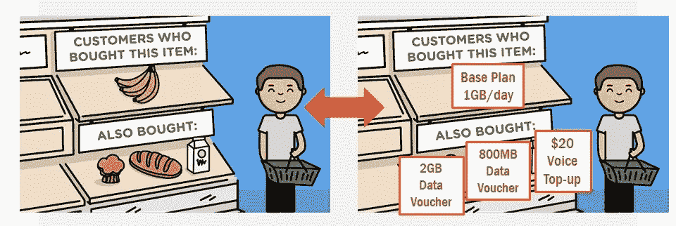
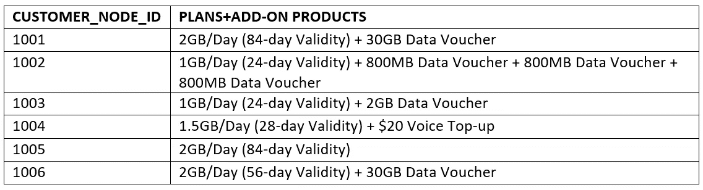
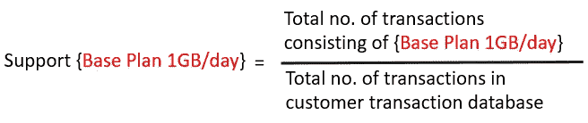
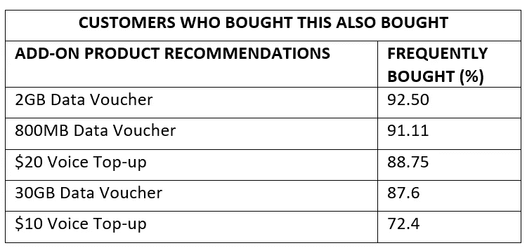

# 挖掘电信产品推荐

> 原文：<https://towardsdatascience.com/mining-telecom-product-recommendations-cfe455f3e563?source=collection_archive---------30----------------------->

## 传统推荐系统在电信行业的应用原则

# 摘要

在当前信息过载的时代，人们越来越难找到相关内容。推荐系统已经被引入来帮助人们从大量的选择中检索潜在有用的信息。它是一个基于数据分析向用户推荐产品、服务和信息的系统，在解决信息爆炸问题方面变得越来越重要。

近年来，在为电子商务、电子学习和电子治理中的各种基于网络的应用提供个性化推荐服务的方向上，已经采取了重要的步骤。然而，令人惊讶的是，尽管这一系统是必需的，但至今仍未出现在电信部门。因此，本博客探讨了电信公司对推荐系统的需求，以帮助其客户在线选择最合适的电信计划/产品。博客以开发和实现电信产品/服务的个性化推荐系统作为结尾，从数据中挖掘关联规则，为新客户找到合适的电信产品包/计划/产品。

# 介绍

尽管人工智能(AI)无疑有能力改变电信行业，但它在很大程度上仍是一个新兴领域。然而，我认为电信公司在利用人工智能技术方面处于独特的有利地位，这主要是因为他们已经习惯于处理人工智能和机器学习(ML)所依赖的海量数据。由于这不是一时的时尚，所以电信公司必须与人工智能进行长期博弈，并考虑探索较少的领域，以释放新的收入流。

人工智能和人工智能需要大量的数据才能正常工作，但数据也必须有足够的质量。如果没有适当数量的高质量数据，人工智能或 ML 模型推荐的决策就不太可能准确或成功。

> 从积极的一面来看，电信公司确实可以访问大量数据，可能比大多数其他行业的公司都要多。然而，困难在于捕获正确的数据集，并以 ML 所需的粒度存储它们。

以传统的方式收集高质量的数据是一回事，但是以特定的方式获取这些数据是另一回事，您可能需要以特定的方式来解决一个用例。如今，大多数电信运营商的网页都有大量的选择，这使得客户越来越难找到自己想要的产品。

*如果同一个网页可以根据现有客户过去的选择，自动向您推荐各种附加产品/捆绑包，您不认为这将非常重要吗？*

# 需要电信推荐系统



将传统推荐系统的概念应用于电信行业(来源-[https://bit.ly/3f4XhA3](https://bit.ly/3f4XhA3)

可以根据其他用户的选择对推荐系统进行微调，以迎合用户简档/偏好。该系统的优点是通过应用信息过滤算法，基于特定用户的显性和隐性偏好，向他们建议正确的项目(基础计划或附加产品)。我用来实现的算法叫做 Apriori。

## 算法描述

> Apriori 算法——它只是对客户交易数据库的研究，以确定不同计划/产品的购买之间的依赖关系。
> 
> 换句话说，就是“什么配什么”的学问。

客户交易的详细信息的可用性导致了自动寻找存储在数据库中的项目之间的关联的技术的发展。示例—网络运营商在其数据库中收集关于每个计划/基础包以及附加产品的客户交易的数据。这种数据库由大量交易记录组成，其中每个记录列出了客户购买的基础计划或附加产品。

# 实施步骤

## 第一步

通过使用 Python 对客户交易数据执行基本 EDA，很可能会观察到某些基础包/计划比其他包/计划出现得更频繁。因此，作为第一步，显示一个流行的基础包列表是个好主意。假设所有数据都存储在 pandas dataframe 'df '中，我们可以使用下面的代码获得流行的基础包/计划列表。

```
df["BASE_PACKAGE_NAME"].value_counts()
```

## 第二步

使用 Python 将这些数据转换成每个记录都列出用户购买的所有商品的表单不会有太大的困难。



客户交易数据库快照

> *在这个阶段，我们想知道*某些组的商品是否总是一起购买*，这可以在 Apriori 算法的帮助下找到。*

```
#Convert the dataframe to a list
records = df.values.tolist()#Generate association rules with required 
#minimum support, confidence and lift
from apyori import apriori
association_rules = apriori(records, min_support=0.3346, min_confidence=0.20, min_lift=3, min_length=3)
association_results = list(association_rules)
```

Apriori 算法中有四个性能指标。这些参数用于排除结果中支持度和置信度分别低于最小支持度、置信度、提升或长度的关联规则。

1.  **min_support** —介于 0 和 1 之间的浮点值；用于选择支持值大于参数中指定值的项目。



**2。min_confidence** —介于 0 和 1 之间的浮点值；用于筛选可信度大于参数中指定的可信度阈值的规则。


**3。min_lift** —指定入围规则的最小提升值。


**4。min_length** —指定希望在关联规则项目集中看到的最小项目数。

min_support、min_confidence 和 min_lift 参数的最佳值可以通过尝试不同的值并检查它们是否在项集之间产生有效的关联来设置。

## 第三步

以可理解的格式获取关联规则可能是一个挑战；以下是我如何克服的。请注意，**‘前任’**是在数据中找到的项目，而**‘继任者’**是结合前任找到的项目。

```
#Create a dataframe with all the necessary information
df = pd.DataFrame(columns=('Items','Predecessor','Successor','Support','Confidence','Lift'))Support =[]
Confidence = []
Lift = []
Items = []
Predecessor= []
Successor=[]for RelationRecord in association_results:
    for ordered_stat in RelationRecord.ordered_statistics:
        Support.append(RelationRecord.support)
        Items.append(RelationRecord.items)
        Predecessor.append(ordered_stat.items_base)
        Successor.append(ordered_stat.items_add)
        Confidence.append(ordered_stat.confidence)
        Lift.append(ordered_stat.lift)df['Items'] = list(map(set, Items))                                   
df['Predecessor'] = list(map(set, Predecessor))
df['Successor'] = list(map(set, Successor))
df['Support'] = Support
df['Confidence'] = Confidence
df['Lift']= Lift#Sort the dataframe based on confidence 
df.sort_values(by ='Confidence', ascending = False, inplace = True)
```

## 第四步

如果“前任”列值等于客户从流行套餐列表中选择的基础套餐名称，则通过挑选“继任者”列中的项目来提供正确的推荐。

```
#Picking the records for a particular plan/base_package that has been selected by the customer on the GUI
package_name = "1GB/Day(24 day Validity)"index=[]
for key, value in df["Predecessor"].iteritems(): 
    if len(value) == 1 and package_name in value:
        print(key,value)
        index.append(key)

recommendations = df[df.index.isin(index)]
```

瞧啊。



产品推荐列表

请注意，频繁购买百分比是置信度参数的度量，它是由前面提到的 Apriori 算法计算的。


# 结论和未来工作

作为电信行业的一员，我已经有将近 5 年的时间了，我看到任何人工智能项目都有各种各样的技术和组织问题；这并不奇怪，因为人工智能是一个不切实际的东西，你需要给组织一些有形的东西。因此，从概念到实际项目的飞跃，或者从试点人工智能概念验证项目到实际部署是一个进一步的挑战。这篇博客中描述的关联规则挖掘方法证明了自动化相似性分析的好处，并且在我看来是电信公司的基本业务用例。非常重要的是，要清楚地了解这种投资的成功要素。

更进一步，上述实现仅限于为通过 web-GUI/kiosk 订阅网络的新客户提供推荐。该模型可以通过在初始阶段添加聚类算法向现有/新客户提供推荐来改进；这将根据年龄、工资、地理数据等对客户进行细分。此外，Apriori 算法的一些缺点是生成的规则太多，并且项目集的罕见组合往往会被忽略，因为它们不满足最低支持要求。使用更健壮的算法将有助于解决这个问题。

*感谢您的阅读！*

# 参考

[1][https://www.appliedaicourse.com/](https://www.appliedaicourse.com/)

[2]电信和人工智能:创造人工智能驱动的电信行业需要什么——2019 年 5 月，由 STL Partners 主办，诺基亚提供支持。

[3]北京农业信息技术研究中心和北京计算机科学技术学院的研究文章——利用缺失数据提高 Top-𝑁Recommendation 性能。

[4]研究文章 IEEE Communications Magazine 的预测性电信网络管理的推荐系统架构。