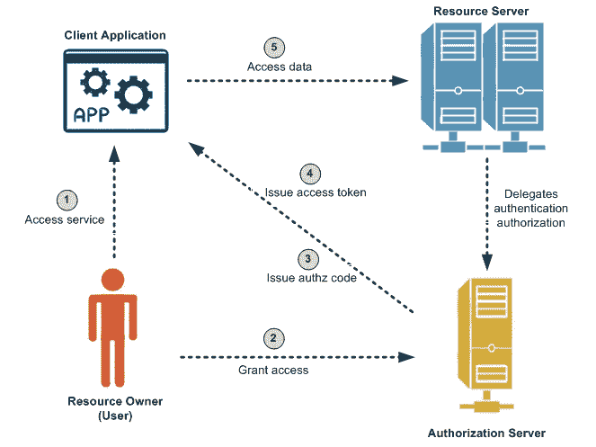
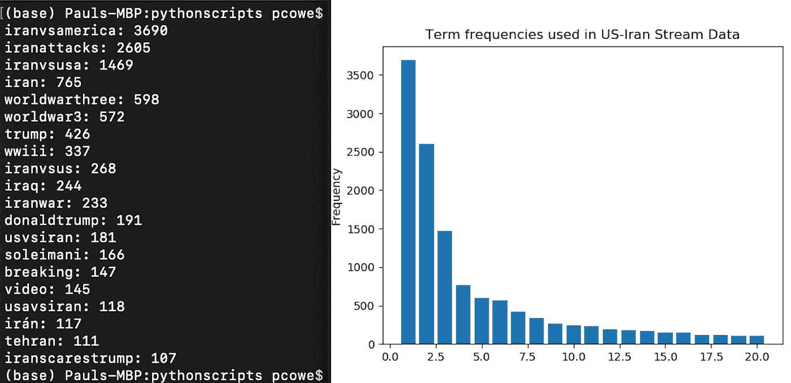
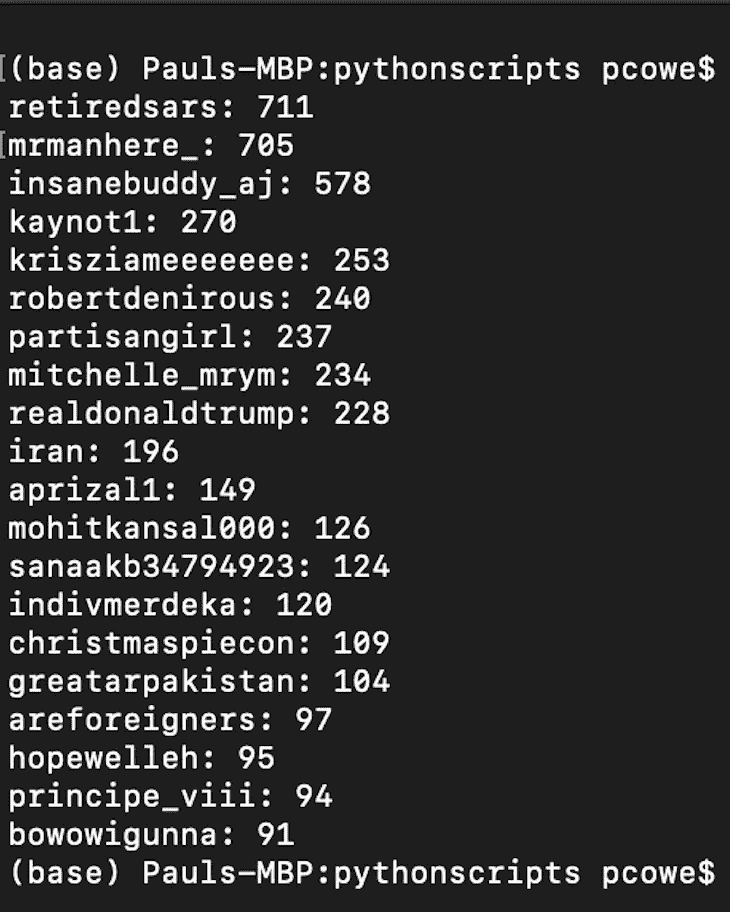
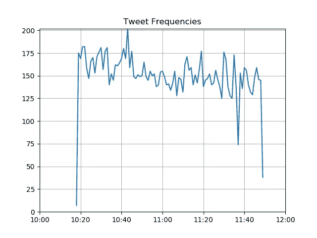
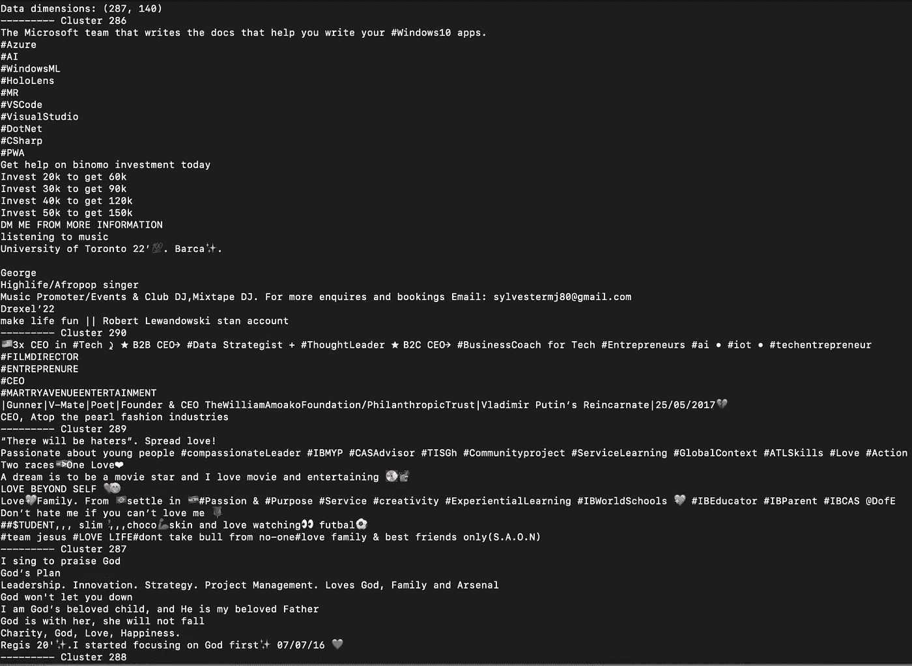
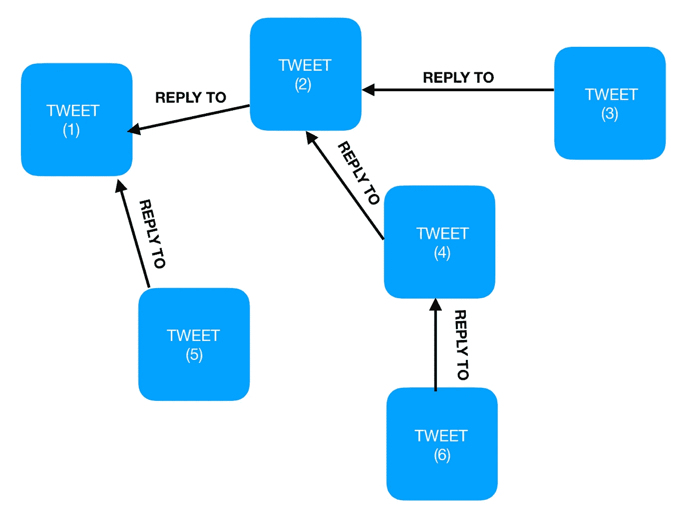
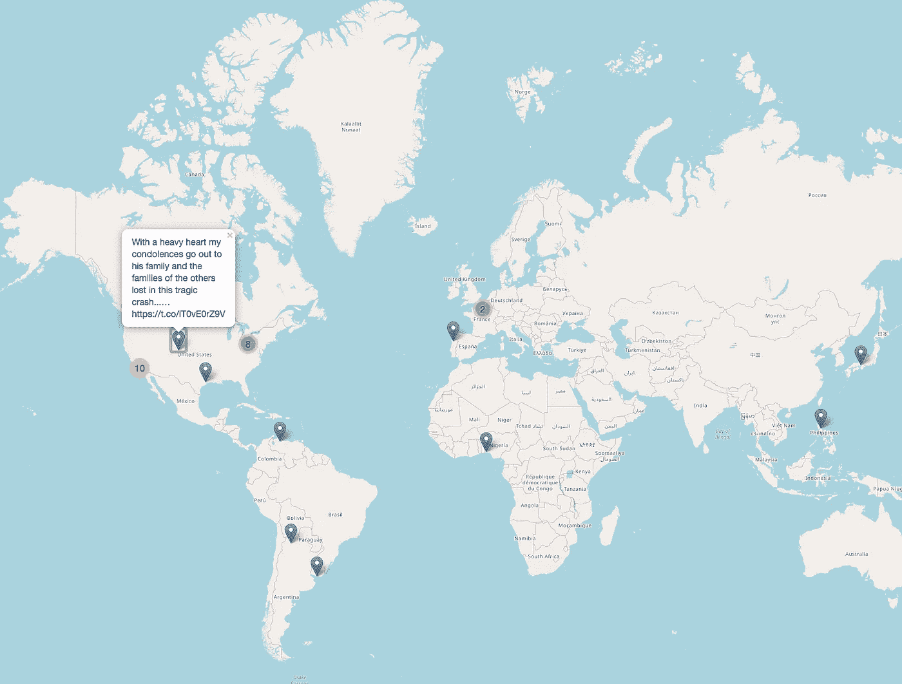
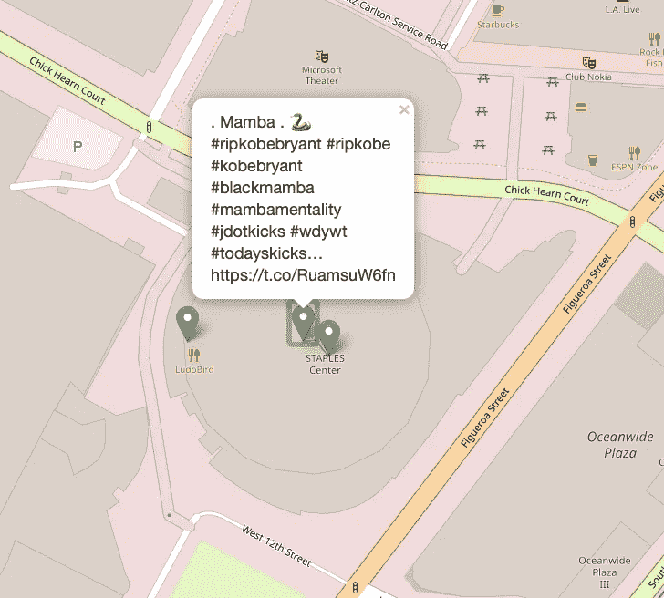

# 挖掘 Twitter 数据

> 原文：<https://towardsdatascience.com/mining-twitter-data-ba4e44e6aecc?source=collection_archive---------10----------------------->

## *社交媒体内部*


来自 cnbc.com[的劳伦·费纳的照片](https://www.cnbc.com/2019/06/07/how-trolls-use-twitter-lists-to-target-and-harass-other-users.html)

*Twitter 是一种微博和社交网络服务，用户在这里发布内容并与帖子互动，即所谓的“推文”。今天，Twitter 已经普及了标签的使用，作为一种分组对话的方式，并允许用户关注特定主题的对话。*

# **目标**

每天有超过 5 亿条推文，你可以想象这个平台的信息有多丰富。这个项目的目标是收集和分析 twitter 数据，以发现有趣的信息和隐藏的模式。

这篇文章是我完成这项任务的经验的“技术反映”。我将展示并简要解释相关的代码片段以及我的分析结果。以下是我认为值得讨论的关键步骤的概述。

# **概述**

1.  证明
2.  数据收集
3.  数据清理和预处理
4.  建模和分析
5.  结论

# **认证**

在这个应用程序中，使用行业标准 OAuth 流程执行身份验证步骤，该流程涉及用户、消费者(应用程序)和资源提供者(Twitter)。这里的关键是，用户名和密码等凭证的交换只发生在用户和资源提供者之间。所有其他交易所都是由代币驱动的。



甲骨文[OAuth 程序照片](https://docs.oracle.com/cd/E50612_01/doc.11122/oauth_guide/content/oauth_intro.html)

*   创建一个 [Twitter 开发者账户](https://developer.twitter.com)。您需要一个开发者帐户来访问 twitter API。一旦您[创建了一个应用](http://apps.twitter.com)，您就可以生成*消费者密钥*、*消费者秘密*、*访问令牌*和*访问秘密*
*   我选择 tweepy 作为我的 Twitter API 客户端，并且我选择为我的令牌创建环境变量，因为它提高了安全性并且是语言不可知的。以下是我如何设置我的 twitter 客户端。

```
import os
import sys
from tweepy import API
from tweepy import OAuthHandlerdef get_twitter_auth():
 **#set up twitter authentication**# Return: tweepy.OAuthHandler objecttry:
        consumer_key = os.environ['TWITTER_CONSUMER_KEY']
        consumer_secret = os.environ['TWITTER_CONSUMER_SECRET']
        access_token = os.environ['TWITTER_ACCESS_TOKEN']
        access_secret= os.environ['TWITTER_ACCESS_SECRET']
    except KeyError:
        sys.stderr.write("TWITTER_* environment variables not set\n")
        sys.exit(1)
    auth = OAuthHandler(consumer_key, consumer_secret)
    auth.set_access_token(access_token, access_secret)
    return authdef get_twitter_client():
 **#Setup twitter API client.**# Return tweepy.API objectauth = get_twitter_auth()
    client = API(auth)
    return client
```

# **数据收集**

初步设置后。我可以立即开始收集数据并与 API 交互。

**与 twitter 的 REST API 交互**

*   所有 REST 端点都允许你“回到过去”，这意味着我们能够搜索已经发布的推文。

**与 twitter 的流媒体应用编程接口互动**

*   流式 API 展望未来。一旦你打开了一个连接，你就可以让它保持开放并及时向前。通过保持 HTTP 连接打开，我们可以在发布时检索所有符合过滤标准的推文。
*   这通常是下载大量推文的首选方式。
*   就我而言，我想调查 2019 年 12 月美伊紧张局势期间用户之间的实时对话，所以我决定播放所有带有趋势标签的推文，如#USIran #USvsIran #Iranattacks

下面是我如何实现一个定制的流监听器。

```
class CustomListener(StreamListener):
 **""" Custom StreamListener for streaming twitter data."""**def __init__(self, fname):
        safe_fname = format_filename(fname)
        self.outfile = "stream_%s.jsonl" % safe_fnamedef on_data(self, data): #called when data is coming through. This method simply stores data as it is received in a .jsonl file. Each line in this file will contain a single tweet in json format try:
            with open(self.outfile, 'a') as f:
                f.write(data)
                return True
        except BaseException as e:
            sys.stderr.write("Error on_data: {}\n".format(e))
            time.sleep(5)
        return True
                                **...**if __name__ == '__main__':
    query = sys.argv[1:] # list of CLI argumentsquery_fname
    query_fname = ' '.join(query) # string
    auth = get_twitter_auth()
    twitter_stream = Stream(auth, CustomListener(query_fname))
    twitter_stream.filter(track=query, is_async=True)
```

# **数据清理和预处理**

因此，在流了大约一个小时后，我设法收集了来自用户的 13，908 条谈论美伊紧张局势的推文。我将这些推文存储在一个. jsonl 文件中，现在是预处理文本的时候了。以下是我执行的一些预处理任务:

**使用 nltk 库进行标记化**

记号化是指将文本流分解成单词、短语、符号等记号。tweet 的内容包括表情符号、用户提及、hasthags、URL 等。因此，在使用 nltk 库时，我将展示如何使用 TweetTokenizer 类作为工具来适当地标记 twitter 内容。

**停止字清除**

停用词没有内容承载，所以我们需要删除它们。这类词包括冠词、副词、符号、标点符号等。频率分析显示，这些字符串在文档中出现的频率最高。

**正常化**

规范化用于聚合同一单位中的不同术语。执行大小写规范化将有助于自动将这些字符串与最初不同的大小写进行匹配，以便它们可以聚合在同一术语下。

```
import sys
import string
import json
from collections import Counter
from nltk.tokenize import TweetTokenizer
from nltk.corpus import stopwords
import matplotlib.pyplot as pltdef process(text, tokenizer=TweetTokenizer(), stopwords=[]):
    """ Process tweet text:
        - Lowercase
        - tokenize
        - stopword removal
        - digits removal
        Return: list of strings
    """text = text.lower()
    tokens = tokenizer.tokenize(text)
    return [tok for tok in tokens if tok not in stopwords and not tok.isdigit()]if __name__ == '__main__':
    fname = sys.argv[1]
    tweet_tokenizer = TweetTokenizer()
    punct = list(string.punctuation)
    stopword_list = stopwords.words('english') + punct + ['rt', 'via', '...']tf = Counter()
    with open(fname, 'r') as f:
        for line in f:
            tweet = json.loads(line)
            tokens = process(text=tweet['text'], tokenizer=tweet_tokenizer, stopwords=stopword_list)
            tf.update(tokens)
        for tag, count in tf.most_common(20):print("{}: {}".format(tag, count))**#plot results**y = [count for tag, count in tf.most_common(20)]
    x = range(1, len(y)+1)plt.bar(x, y)
    plt.title("Term frequencies used in US-Iran Stream Data")
    plt.ylabel("Frequency")
    plt.savefig('us-iran-term-distn.png')
```

# **建模和分析**

在上面的片段中，我通过创建我收集的 tweets 中最常用的 20 个术语的术语分布的可视化表示来开始分析。



前 20 个常用术语和术语分布

继续分析，我在数据集中搜索每个人都在谈论的关键人物，找到他们被提及的频率。



提及频率结果

有了这些信息，我就确切地知道我可以开始调查哪些概要文件来接收更相关的提要。然而，令人震惊的是，realdonaldtrump 在与此问题相关的热门用户提及中排名第八。

**时间序列分析**

*   时间序列是由给定时间间隔内的连续观察值组成的数据点序列
*   它可以用来重新排序推文，并跟踪用户对实时事件(如体育、政治选举、新闻)的反应

在这个应用程序中，我执行了一个时间序列分析，以监控随着更多关于这个话题的新闻发布，用户是如何发 tweet 的。在我看来，在我上传视频的一个小时内，用户们一直在积极地发关于这个话题的推文，在上午 10:45 左右收集了 200 条推文



**用户、关注者和朋友**

我决定探索一些顶级用户的个人资料、关注者名单和“关注者”(或朋友)，以进行进一步分析。以下是我如何从 twitter 上获取这些信息的。

```
**#get followers for a given user**fname = "Twitter_Profiles/{}/followers.jsonl".format(screen_name)
    with open(fname, 'w') as f:
        for followers in Cursor(client.followers_ids, screen_name=screen_name).pages(max_pages):
            for chunk in paginate(followers, 100):
                users = client.lookup_users(user_ids=chunk)
                for user in users:
                    f.write(json.dumps(user._json)+"\n")
            if len(followers) == 5000:
                print("More results available. Sleeping for 60 seconds to avoid rate limit")
                time.sleep(60)**#get friends for a given user**fname = "Twitter_Profiles/{}/friends.jsonl".format(screen_name)
    with open(fname, 'w') as f:
        for friends in Cursor(client.friends_ids, screen_name=screen_name).pages(max_pages):
            for chunk in paginate(friends, 100):
                users = client.lookup_users(user_ids=chunk)
                for user in users:
                    f.write(json.dumps(user._json)+"\n")
            if len(friends) == 5000:
                print("More results available. Sleeping for 60 seconds to avoid rate limit")
                time.sleep(60)**# get user's profile**
    fname = "Twitter_Profiles/{}/user_profile.json".format(screen_name)
    with open(fname, 'w') as f:
        profile = client.get_user(screen_name=screen_name)
        f.write(json.dumps(profile._json, indent=4))
```

**衡量影响力和参与度**

*   参与度指标提供了对用户对推文和其他内容的反应的评估，通常是为了增加流量而创建的。在 twitter 上，用户通过点赞或转发的方式参与，这为推文提供了更多的可见性
*   了解用户的影响力包括结合用户的推文参与度统计数据分析用户的覆盖范围。

```
**#Build up a list of followers**
    followers_file1 = 'Twitter_Profiles/{}/followers.jsonl'.format(screen_name1)
    followers_file2 = 'Twitter_Profiles/{}/followers.jsonl'.format(screen_name2)with open(followers_file1) as f1, open(followers_file2) as f2:
        reach1 = []
        reach2 = []
        for line in f1:
            profile = json.loads(line)
            reach1.append((profile['screen_name'], profile['followers_count']))
        for line in f2:
            profile = json.loads(line)
            reach2.append((profile['screen_name'], profile['followers_count']))**#Load basic statistics**
    profile_file1 = 'Twitter_Profiles/{}/user_profile.json'.format(screen_name1)
    profile_file2 = 'Twitter_Profiles/{}/user_profile.json'.format(screen_name2)
    with open(profile_file1) as f1, open(profile_file2) as f2:
        profile1 = json.load(f1)
        profile2 = json.load(f2)followers1 = profile1['followers_count']
        followers2 = profile2['followers_count']tweets1 = profile['statuses_count']
        tweets2 = profile['statuses_count']sum_reach1 = sum([x[1] for x in reach1]) #sum up all of a user's followers, followers
    sum_reach2 = sum([x[1] for x in reach2])
    avg_followers1 = round(sum_reach1/ followers1, 2)
    avg_followers2 = round(sum_reach2/ followers2, 2)**#Load the timelines for two users to observe the number of times their tweets have been favorited**
    timeline_file1 = 'user_timeline_{}.jsonl'.format(screen_name1)
    timeline_file2 = 'user_timeline_{}.jsonl'.format(screen_name2)
    with open(timeline_file1) as f1, open(timeline_file2) as f2:
        favorited_count1, retweet_count1 = [], []
        favorited_count2, retweet_count2 = [], []
        for line in f1:
            tweet = json.loads(line)
            favorited_count1.append(tweet['favorite_count'])
            retweet_count1.append(tweet['retweet_count'])for line in f2:
            tweet = json.loads(line)
            favorited_count2.append(tweet['favorite_count'])
            retweet_count2.append(tweet['retweet_count'])
```

*   完整的脚本可以在我的 [GitHub](https://github.com/owecodes/mining-twitter) 上找到

**挖掘社交社区**

*   一个社会群体是一群有着共同条件的人，比如地理区域，相同的宗教信仰，或者有着相同兴趣的人。
*   **明确的社区** —有共同兴趣的人明确知道他们是否属于某个社区，并且通常了解所述社区中的其他成员是谁。
*   **隐性社区**——当成员拥有共同的兴趣，但彼此之间没有明确而紧密的联系时，隐性社区就出现了

在下一节中，我将演示我如何分析用户数据，以便**将一堆用户资料**分成组，目的是发现用户的隐含社区。

**聚类分析**

聚类分析是一种机器学习技术，用于以这样一种方式对项目进行分组，即同一聚类中的对象彼此相似，而与其他聚类中的对象不相似。以下是该脚本的一些关键要点。

*   我用了 K-means 算法来达到这个目的。
*   每个用户简档被表示为一个向量。基于用户描述，我使用 TF-IDF 方法来衡量一个词在给定上下文中的权重/重要性
*   我们可以限制 tfidf 矢量器提取的要素数量(通过显式指定 max_features 或指定 min_df 和 max_df 的范围)。基于文档频率排除特征的想法是为了避免不具有代表性的特征。限制它们也可以用来加速计算。
*   ngram 是 n 个项目的连续序列，在这个上下文中，它指的是被标记为单词序列的文本。使用 ngrams 的好处是它能够捕捉短语。
*   下面是我如何根据用户 bios 进行聚类分析的。

```
from sklearn.feature_extraction.text import TfidfVectorizer
from sklearn.cluster import KMeansdef get_parser():
    parser = ArgumentParser("Clustering for followers")
    parser.add_argument('--filename') 
    parser.add_argument('--k', type=int) 
    parser.add_argument('--min-df', type=int, default=2) 
    parser.add_argument('--max-df', type=float, default=0.8) 
    parser.add_argument('--max-features', type=int, default=None) 
    parser.add_argument('--no-idf', dest='user_idf', default=True, action='store_false') 
    parser.add_argument('--min-ngram', type=int, default=1) 
    parser.add_argument('--max-ngram', type=int, default=1) 
    return parserif __name__ == '__main__':
    parser = get_parser()
    args = parser.parse_args()
    if args.min_ngram > args.max_ngram:
        print("Error: incorrect value for --min--ngram ({}): it cant be higher than \
        --max--value ({})".format(args.min_ngram, args.max_ngram))
        sys.exit(1)
    with open(args.filename) as f:
 **#load data**users = []
        for line in f:
            profile = json.loads(line)
            users.append(profile['description'])
 **#create vectorizer**
        vectorizer = TfidfVectorizer(max_df=args.max_df,
                                    min_df=args.min_df,
                                    max_features=args.max_features,
                                    stop_words='english',
                                    ngram_range=(args.min_ngram, args.max_ngram),
                                    use_idf=args.user_idf)**#fit data**
        X = vectorizer.fit_transform(users)
        print("Data dimensions: {}".format(X.shape))**#perform clustering**
        km = KMeans(n_clusters=args.k)
        km.fit(X)
        clusters = defaultdict(list)
        for i, label in enumerate(km.labels_):
            clusters[label].append(users[i])**#print 10 user description of this cluster**for label, description in clusters.items():
            print("--------- Cluster {}".format(label+i))
            for desc in description[:10]:
                print(desc)
```



聚类分析的结果

因此，您可以看出，该脚本在根据用户个人资料中的简历对用户进行细分方面表现得相当不错。我在这个例子中使用了我的 twitter 个人资料，你可以看出我的社区中有一些投资者、技术爱好者、企业家和宗教人士。这让我想起了一句流行的话——“给我看你的朋友，我就知道你是谁” 。该脚本还可以用来更深入地研究其他用户的个人资料，以发现他们所属的隐含社区。

**图形挖掘和会话分析**

当许多用户参与对话时，一个“回复”网络就出现了。下图展示了 twitter 上的一个对话模型，节点是 tweets，边是“回复”关系。



对话模型

自然，这种结构可以很容易地映射到图形数据结构。该模型的一些关键要点:

*   一对多基数
*   没有周期

出于这些原因，我建立了一个**有向无环图**的模型，并使用这个图的属性和图论中的算法来挖掘对话。下面是我使用的图形挖掘技术的代码片段。

```
import sys
import json
from operator import itemgetter
import networkx as nxdef usage():
    print("Usage")
    print("python {} <filename>".format(sys.argv[0]))if __name__ == "__main__":
    if len(sys.argv) != 2:
        usage()
        sys.exit(1)fname = sys.argv[1]
    with open(fname) as f: #takes in a jsonl file of tweets as input
        graph = nx.DiGraph()
        for line in f:
            tweet = json.loads(line)
            if 'id' in tweet:
                graph.add_node(tweet['id'],
                                tweet=tweet['text'],
                                author=tweet['user']['screen_name'],
                                created_at=tweet['created_at'])
                if tweet['in_reply_to_status_id']:
                    reply_to = tweet['in_reply_to_status_id']
                    if reply_to in graph and tweet['user']['screen_name'] != graph.node[reply_to]['author']:  #if the user is not replying to themselves
                        graph.add_edge(tweet['in_reply_to_status_id'], tweet['id'])

**#Print some basic stats**print(nx.info(graph))**#Find most replied tweet** 
        sorted_replied = sorted(graph.degree(), key=itemgetter(1), reverse=True)most_replied_id, replies = sorted_replied[0]
        print("Most replied tweet ({} replies:".format(replies))
        print(graph.node[most_replied_id])**#Find longest conversation (longest path)**
        print("Longest discussion:")
        longest_path = nx.dag_longest_path(graph)
        for tweet_id in longest_path:
            node = graph.node[tweet_id]
            print("{} (by {} at {})".format(node['tweet'], node['author'], node['created_at']))
```

*   节点的入度:给定 tweet 的回复数量
*   根:对话的开始
*   叶子:谈话的结束
*   最长路径算法:用于查找最长对话的 tweet。
*   我使用 networkX 库，因为它提供了图形结构的高效计算

**动态地图**

最后，为了总结我的分析，我通过在地图上绘制它们，创建了这些推文来自哪里的可视化表示。

**地理数据的提取**

使用 GeoJSON 库，我从一个流文件中提取了每条 tweet 的几何数据。我用这个地理数据的 geo.json 扩展名创建了一个输出文件

```
**#read dataset of tweets in jsonl file and produce a geoson file** associted with geographical data
import json
from argparse import ArgumentParserdef get_parser():
    parser = ArgumentParser()
    parser.add_argument('--tweets')
    parser.add_argument('--geojson')
    return parserif __name__ == "__main__":
    parser = get_parser()
    args = parser.parse_args()**#Read tweet collection and build geo data structure.**
    with open(args.tweets, 'r') as f: #read dataset of tweets
        geo_data = {
        'type' : "FeatureCollection",
        'features' : []
        }for line in f:
            tweet = json.loads(line)
            try:
                if tweet['coordinates']:
                    geo_json_feature = {
                        "type" : "Feature",
                        "geometry": {
                        "type" : "Point",
                        "coordinates" : tweet['coordinates']['coordinates']
                        },
                        "properties": {
                        "text" : tweet['text'],
                        "created_at" : tweet['created_at']
                        }
                    }
                    geo_data['features'].append(geo_json_feature)
            except KeyError:
                #Skip if json doc is not a tweet (errors, etc)
                continue
 **#Save geo data**
    with open(args.geojson, 'w') as fout:
        fout.write(json.dumps(geo_data, indent=4))
```

**创建动态地图**

我使用了 leav 库来生成一个交互式地图。优点是，HTML 无缝地处理 python 数据结构与 Javascript、HTML 和 CSS 组件之间的转换。

```
from argparse import ArgumentParser
import folium
from folium.plugins import MarkerCluster
import jsondef get_parser():
    parser = ArgumentParser()
    parser.add_argument('--geojson')
    parser.add_argument('--map')
    return parserdef make_map(geojson_file, map_file):tweet_map = folium.Map(Location=[50, 5], max_zoom=20)marker_cluster = MarkerCluster().add_to(tweet_map)geodata= json.load(open(geojson_file))for tweet in geodata['features']:
        tweet['geometry']['coordinates'].reverse()
        marker = folium.Marker(tweet['geometry']['coordinates'], popup=tweet['properties']['text'])
        marker.add_to(marker_cluster)**#Save to HTML map file**
    tweet_map.save(map_file)if __name__ == '__main__':
    parser = get_parser()
    args = parser.parse_args()
    make_map(args.geojson, args.map)
```



动态地图(缩小)



动态地图(放大)

正如你所看到的，这个脚本可视化了人们在 NBA 传奇人物科比·布莱恩特去世时发微博的不同地点。该脚本将来自特定区域的用户推文聚集在一起，并精确定位每条推文发布的确切位置。

这些结果是在事件公开后几个小时，从 15 分钟的推特风暴流中产生的。您可以在这里 查看完整的 [**地图并与之互动**](http://www.paulowe.com/tweet_map.html)

# 结论

这都是为了挖掘 Twitter 数据。我真的很喜欢参与这个项目。我的 GitHub 上有完整的源代码，可以提供给任何对实现这个项目感兴趣的人。