# 挖掘 Covid19 上的 Twitter 话语

> 原文：<https://towardsdatascience.com/mining-twitter-discourse-on-covid19-a2b6df66daee?source=collection_archive---------50----------------------->

## 通过自然语言处理技术和社会网络分析理解电晕话语

学分:eloutput.com

# 介绍

当 3 月 11 日世界卫生组织宣布新冠肺炎为疫情时，推特上出现了一个关于它的重大活动。这是一个预期的现象，因为社交媒体平台可以帮助实时跟踪自然灾害。在这方面，Twitter 似乎是了解这种情况下会发生什么的首选场所，以至于它已经更新了其[新冠肺炎政策](https://blog.twitter.com/en_us/topics/company/2020/covid-19.html#unverifiedclaims)，声称将删除误导性的推文，这些推文可能“煽动人们采取行动，引起大范围的恐慌、社会动荡或大规模混乱”

在本帖中，我们将使用一些数据科学技术来研究围绕这种新型病毒的 Twitter 话语。出于这个原因，我们使用了这个[数据集](https://www.kaggle.com/smid80/coronavirus-covid19-tweets)，它包含了大约 2700 万条使用冠状病毒相关标签的推文。即:

*#冠状病毒，#冠状病毒爆发，#冠状病毒大流行，#covid19，#covid_19，#epitwitter，#ihavecorona。*

考虑到这一点，我们尝试回答以下问题:

*   更多关于冠状病毒的推文是否表明公众意识和严重性增强，并导致公众更容易接受限制传播的措施，如社会距离，从而减少感染？
*   一些标签比其他的传播得更快吗？
*   推特用户倾向于讨论(推特回复)或分享(引用的推特)吗？
*   人们在推特上谈论特定的症状吗？

我们用一些基本的社交网络分析(第 1 部分)和 NLP(第 2 部分:即将到来)来做这件事。在这个项目中已经实现了不同的技术和任务，例如，文本处理、测量图形度量、使用 word2vec 嵌入文本分类模型、最大似然迭代学习、应用 SVD 进行降维等等。我们在 Github 上提供这个[报告](https://github.com/JulianLopezB/covid19-tweets)中的所有结果和代码。

虽然结果并不像我预期的那样，但总体来说，这次练习和学习值得我花时间去做。我学到了很多东西，提高了自己的黑客技能，应用了以前从未用过的技术。

# 探索性分析

首先，我们得到数据。Kaggle 提供了一个 [API](http://networksciencebook.com/) 来下载数据集，我准备了这个[笔记本](https://github.com/JulianLopezB/covid19-tweets/blob/master/notebooks/download-kaggle-dataset.ipynb)提供了一个详细的指南，提供了使用 API 访问数据集的必要步骤。数据摘录如下:

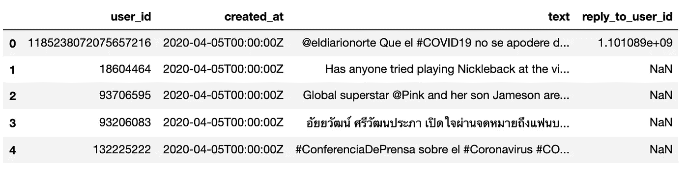

一些基本数据证实，世卫组织在 3 月 11 日宣布爆发疫情，在推特上引发了巨大的活动。下图显示了不同国家的每日推文量，其中美国的推文数量占全球推文总量的大部分。然而，从那时起，这种活动开始减少。

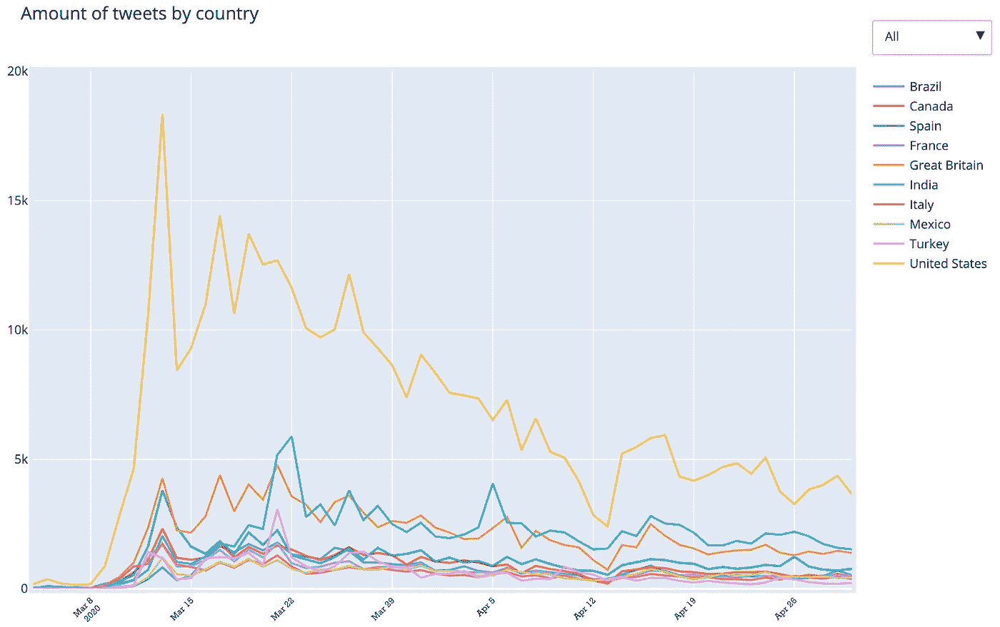 [## 各国的推文数量| Julian lb | plot ly 制作的折线图

### Julianlb 的交互式图表和“按国家划分的推文数量”数据是一个折线图，显示了巴西、加拿大、西班牙…

chart-studio.plotly.com](https://chart-studio.plotly.com/~JULIANLB/5.embed) 

一条 tweet 可以有两个属性。它可以是对另一条推文的回复和/或引用(如带有个人评论的转发)。否则，它只是一条简单的推文。人们可以使用这些属性来查看辩论(回复)或分享(引用/转发)是否解释了 Twitter 上围绕特定主题的活动。我们做到了这一点，但我们没有比较主题，而是比较了国家。下面的图表显示了不同国家的被引用、回复和推文总数。

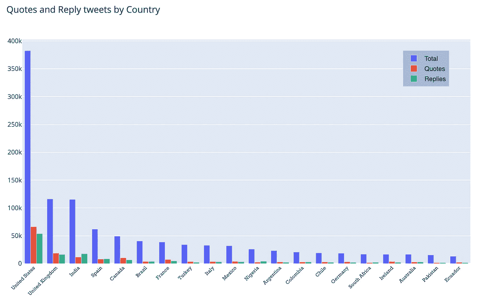

下面的气泡图显示了相同的见解。

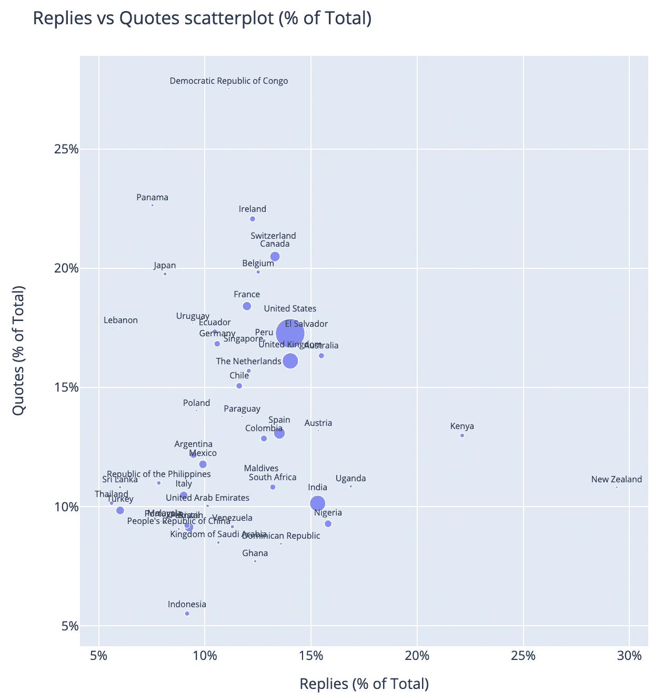

你可以在这里找到该图的互动版本:

 [## 回复与引用散点图(占总数的%)

### Julianlb 的“回复 vs 引用散点图(占总数的百分比)”的交互图和数据是 a；有回复(占总数的%)

chart-studio.plotly.com](https://chart-studio.plotly.com/~JULIANLB/52.embed) 

# 第 1 部分:社会网络分析

我们的第一种方法涉及图论。你会在这个[笔记本](https://github.com/JulianLopezB/covid19-tweets/blob/master/notebooks/Covid19-Tweets-Part1%20(SNA).ipynb)中找到本节所做分析的所有代码。学习图论的一些很酷的资源是:

*   Jure Lecsovek 的[课程](https://web.stanford.edu/class/cs224w/)关于用图形进行机器学习
*   有趣的阿尔伯特-拉斯洛·巴拉巴希的网络科学数字[书](http://networksciencebook.com/)。

我们继续对数据进行预处理。这尤其包括提取与每条推文相关的标签，并删除重复的标签。在第 2 部分中，我们将过滤掉非英语推文，并进行一些文本清理(即，删除符号、提及、URL、标点和停用词)，以便我们可以训练 Word2Vec 模型(使用预处理的语料库将允许我们将推文转移到向量空间)，而在第 3 部分中，我们将使用原始文本训练语言模型。

在下面的示例中，您可以大致了解数据经过预处理后的样子:

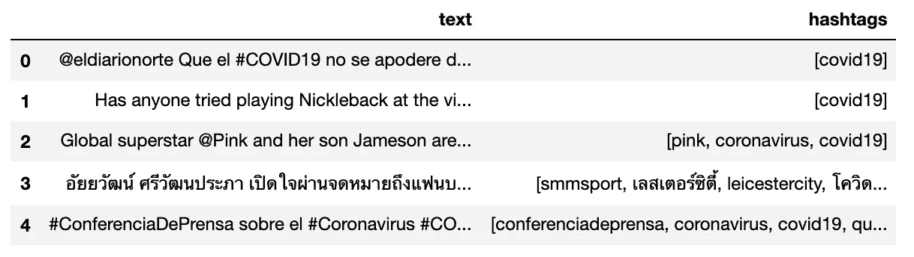

既然我们已经解析了与每条 tweet 相关联的标签，我们可以从共享一个公共标签的 tweet 创建回复网络。这种网络将由表示图的结构的边的列表组成，即回复的源和目的地用户。例如，下面的数据帧显示，用户 *45993399* 回复了用户 *976542720* 一条与标签*#社交消失*相关的推文。

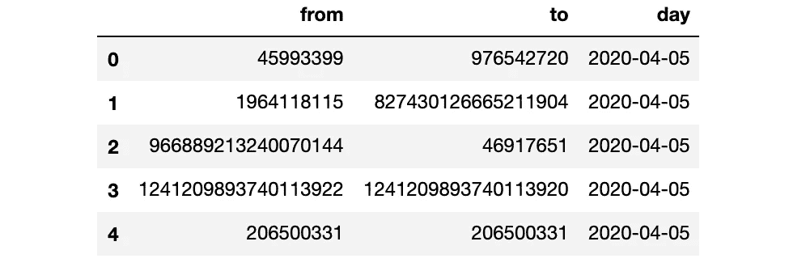

这些链接/关系在下图中显示为一个网络，节点大小根据节点度数而变化。

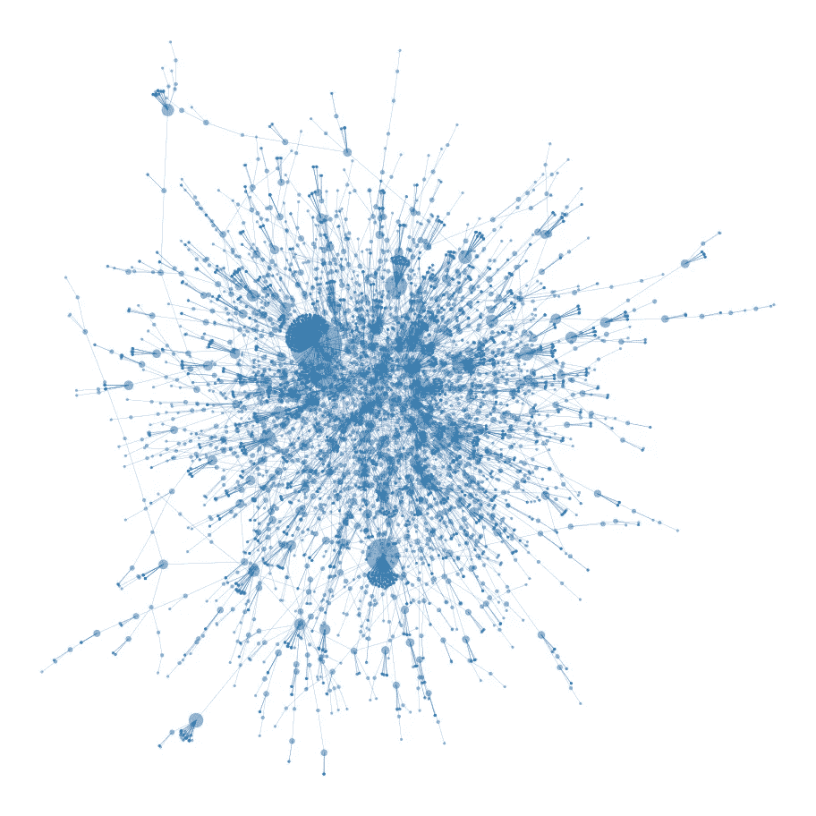

在创建更多的图表之前，我们应该先看看语料库中最流行的标签(见下图)。

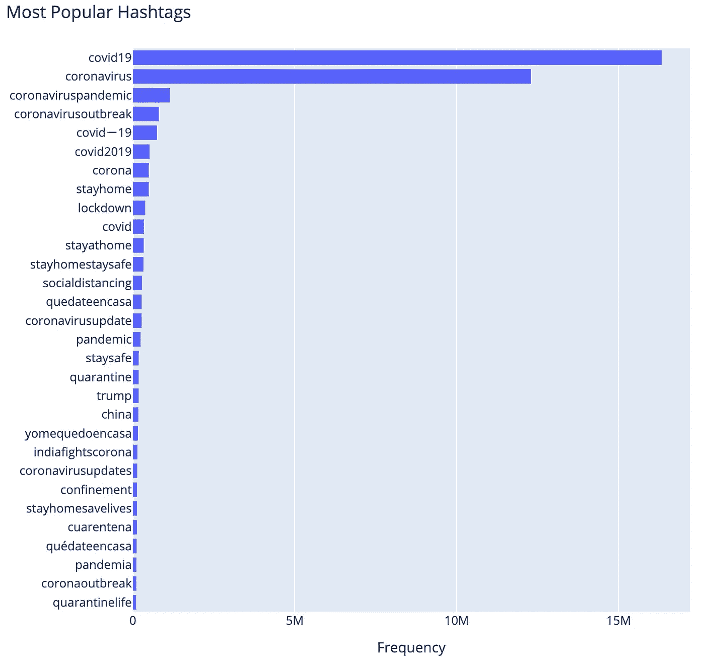

我们选择*‘stayat home’，‘lockdown’，‘social distanding’，‘flattenthecurve’，‘masks 4 all’，*和*‘trump’*作为我们在分析中感兴趣的标签。然而，我们不会一次使用所有的推文来创建图表。相反，我们迭代地计算它们，将每天出现的新边添加到图形中。通过这种方式，我们可以看到标签图是如何随时间演变的。

为了跟踪每个图的结构演变，并将它们相互比较，我们基于图论中的共同属性来计算一些度量:

*   节点数量:唯一用户的数量
*   边数:用户之间的链接数或回复数(不加权)
*   直径:网络中所有计算出的最短路径中最长的一条。
*   平均度:边的数量除以节点的数量。
*   度数等级:对数标度的度数直方图
*   分类系数:*分类系数*表示网络中的节点倾向于连接到其他相似的节点。在这种情况下，我们计算链接节点对之间的度的[皮尔逊相关系数](https://en.wikipedia.org/wiki/Pearson_correlation_coefficient)。 *r* 的正值表示相似程度的节点之间的相关性，而负值表示不同程度的节点之间的关系。

可以计算许多其他有趣的度量，如[平均路径长度](https://www.google.com/search?q=average+path+length&oq=average+path+length&aqs=chrome..69i57j35i39j0l6.2722j0j4&sourceid=chrome&ie=UTF-8) h、[中心性](https://en.wikipedia.org/wiki/Centrality)度量、[聚类系数](https://en.wikipedia.org/wiki/Clustering_coefficient)。但是这些都是计算量很大的，所以我们将只使用前面提到的指标。

此外，我们为此分析设计了一个特定的指标，其正式定义如下。我们称之为“添加到图表中的新边”:

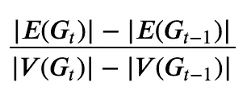

其中 G_t 是时间 t 和 V(G)处的图，E(G)是图 G 的顶点(节点)和边。

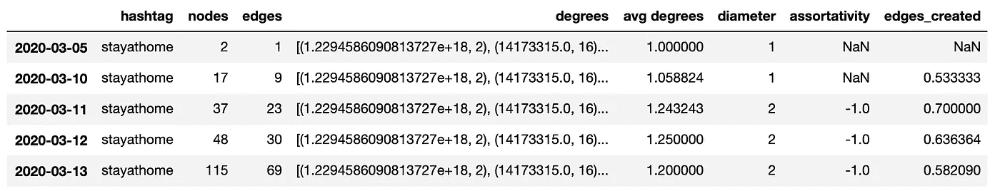

下图显示了我们的分析结果。从 3 月 4 日到 4 月 29 日，我们每天都计算所有网络的指标。

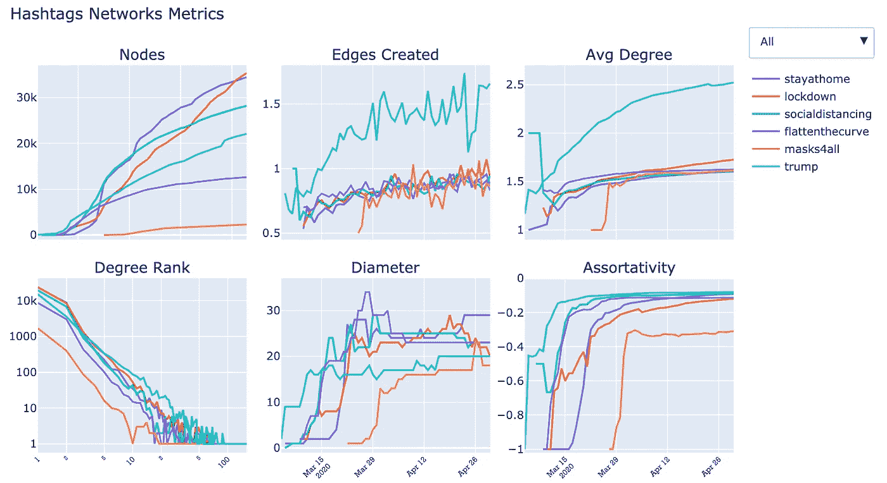

Plotly 中的一个交互式破折号被用来单独可视化标签指标(见下面的链接)

 [## Hashtags Networks Metrics |由 Julianlb | plotly 制作的折线图

### Julianlb 的“Hashtags Networks Metrics”的交互式图表和数据是一个折线图，显示了 stayathome、lockdown…

chart-studio.plotly.com](https://chart-studio.plotly.com/~JULIANLB/14.embed) 

# 结果

首先，值得注意的是，与其他网络相比，#trump 的网络平均度显著增加，而其独特节点的数量减少。网络的直径也是如此。回想一下，直径是网络中最长的路径，我们可以推断#trump tweets 的到达范围比#flattenthecurve 要低。一个可能的原因是#trump 网络中的节点倾向于与和它们邻居相连的节点相连，我们可以通过看到更高的分类系数来支持这一假设。此外，与其他网络相比，#trump 的网络度具有较少的低度节点(连接数)，而具有较多的高度节点。如果对网络的[简并度](https://en.wikipedia.org/wiki/Degeneracy_(graph_theory)#:~:text=The%20degeneracy%20of%20a%20graph%20is%20a%20measure%20of%20how,the%20arboricity%20of%20a%20graph.&text=k%2Ddegenerate%20graphs%20have%20also%20been%20called%20k%2Dinductive%20graphs.)进行分析，这个结果会更加丰富，这可能会给我们一些证据，证明巨魔可能部分解释了这种活动。

在相反的方向，#flattenthecuved 具有很大的扩散，达到最高直径，考虑到它的节点数和平均度较低。同样，#mask4all 是最小的网络，它的传播速度非常快，几天之内就达到了其他网络的平均直径。

***Julian Lopez baas ch****是一位经济学家转型的数据科学家，对人工智能充满热情。他获得了理学硕士学位。布宜诺斯艾利斯 Torcuato Di Tella 大学经济学学士和理学硕士。巴塞罗那 Pompeu Fabra 大学的智能交互系统。你可以在* [*Twitter*](https://twitter.com/JulianLBaasch) *或*[*Linkedin*](https://www.linkedin.com/in/julianlopezba/)*上找到他，或者你可以在他的* [*网站*](http://julianlopezb.github.io) *上找到他的更多作品。*