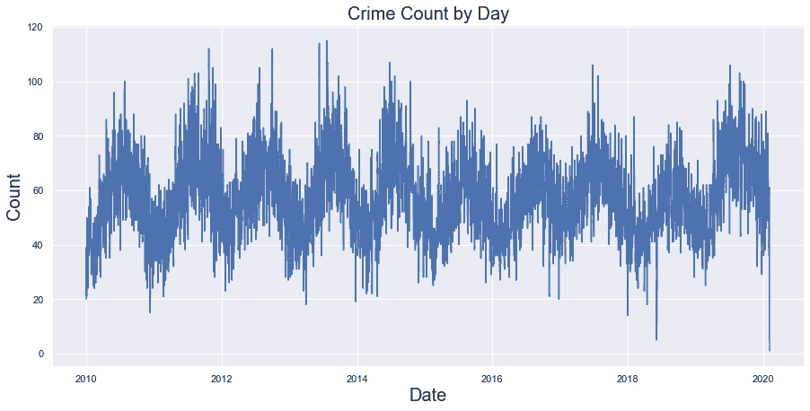
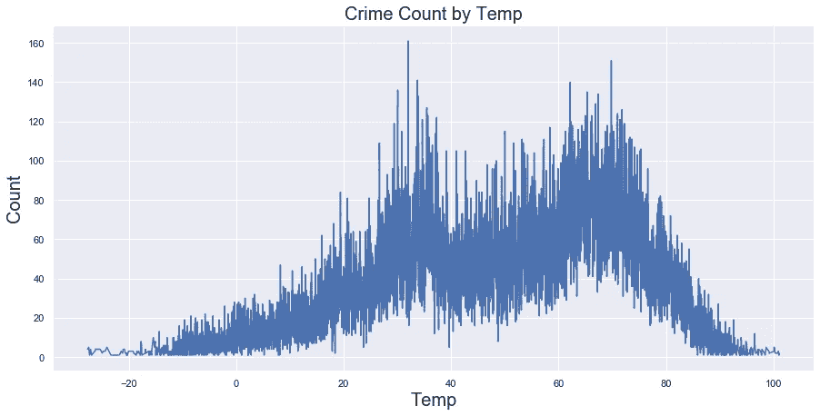
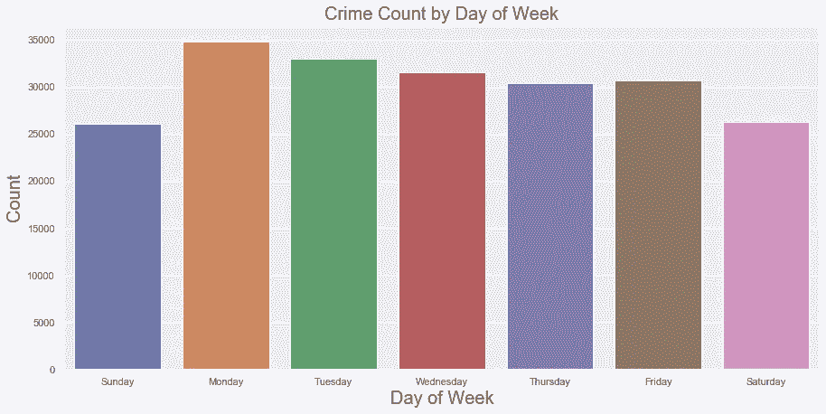
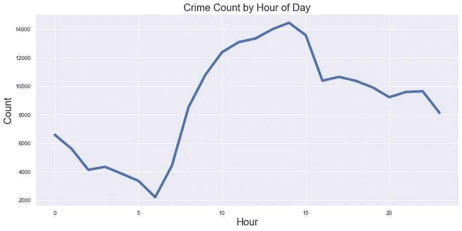
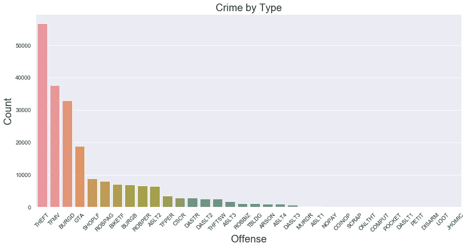
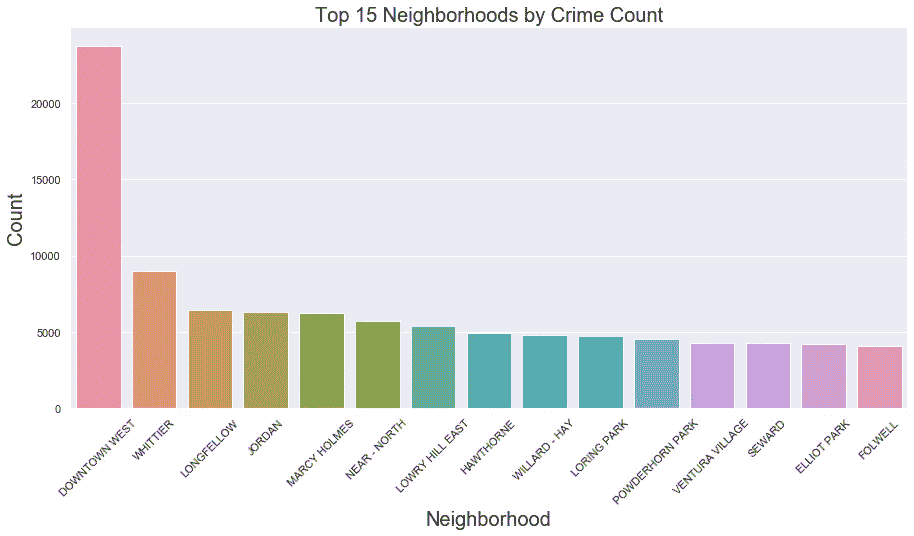
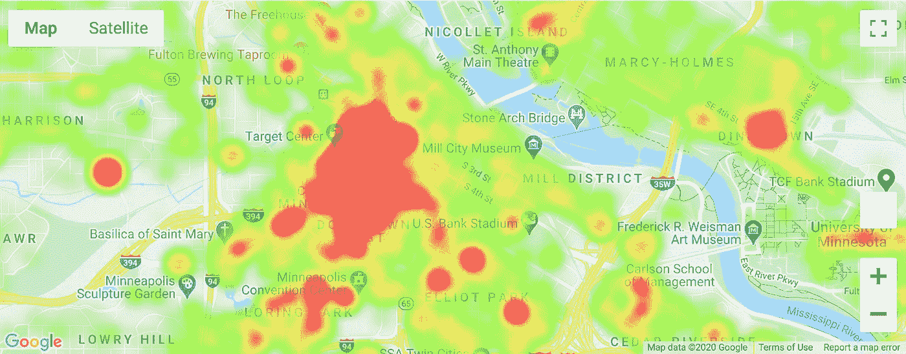
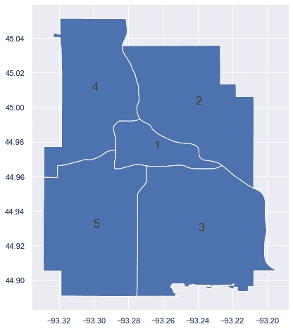

# 少数派报告是现实吗？

> 原文：<https://towardsdatascience.com/minis-minority-report-a-reality-pt-1-2-813104fcf1f?source=collection_archive---------28----------------------->

## 使用数据和机器学习在犯罪发生之前预测犯罪

马特·波波维奇在 [Unsplash](https://unsplash.com/s/photos/crime?utm_source=unsplash&utm_medium=referral&utm_content=creditCopyText) 上的照片

***鸣谢:我与 Bryan Bruno 和 Ksenia Luu 一起在西北大学为我们的研究生项目 capstone 进行犯罪预测项目。***

*注意:这是深入犯罪预测世界的两部分系列的第一部分。这第一部分将进入犯罪数据的初始 EDA，第二部分将深入应用人工智能来预测高犯罪率地区，甚至在它发生之前。*

回到 2002 年，我看到汤姆·克鲁斯和他的预防犯罪小组在人们实际犯罪之前就逮捕他们。一个如此牵强的想法，以至于我在有生之年都没有想到会有这样的事情发生。现在，随着我们继续我们的人工智能革命之旅，海量数据和处理能力不仅变得更容易获得，而且获得成本也更低，“犯罪前”的现实正变得不那么反常。好吧好吧好吧。我们不要想得太多。这里涉及到人权问题(你知道，在被证明有罪之前是无辜的)。因此，这个想法，至少相对于我们当地的警察(联邦政府可能与我们的反恐工作关系更密切)，可能仍然有点遥远。然而，不远的将来是找到更多的方法来利用我们拥有的与以前犯下的罪行有关的所有数据，并用其他数据来源丰富这些数据，以更好地了解未来可能发生更多类似罪行的地点和时间。这最终会导致警官更有效的安置、时间安排和日常工作，因为他们可以更科学地确定何时、何地以及为什么将他们的警官集中在他们社区的特定区域。最终结果不仅是更有效地利用我们的执法时间，而且是一个更安全的社区。真正的共生关系。

随着我们继续步入人工智能时代，每个行业都开始理解和利用人工智能的力量。无论是推荐产品或电视节目，预测欺诈，优化供应链，预测职业运动员的受伤情况，还是预测机器故障，仅举几例，我们正在看到人工智能在各地得到应用。如果没有某种形式的人工智能，当今社会几乎没有什么问题是无法解决或优化的。人工智能的力量是巨大的。然而，正如《蜘蛛侠》中的本叔叔所说的那样，*“能力越大，责任越大”*并不是所有的行业都承担了采用人工智能的能力和潜力的全部责任。一个这样的行业是执法部门。更具体地说，是我们尊贵而卑微的地方警察局。

我首先要说的是，我不会因为当地警方对游戏的反应稍慢而责怪他们。他们通常预算较少，使用陈旧的数据系统，当他们理所当然地将所有注意力放在周围社区的福祉和安全上时，他们几乎没有时间去挖掘数据和数字。由于这种差距，将数据*和*科学(即数据科学)引入他们的日常世界是一个巨大的机会。

事不宜迟，让我们直接进入数据。我住在美丽的城市明尼阿波利斯，所以很自然，我会调查发生在明尼阿波利斯的犯罪事件。该市在位于[的 opendata 网站上提供了超过 10 年的历史犯罪数据。在下载和阅读了 10 年的犯罪数据集后，我准备好了……在对数据进行了大量的清理和预处理，如格式化、命名、子集、分组、连接、删除空值等之后……你们得到了你们都去过的图片，完成了。然后我就购买了(很便宜！)从](http://opendata.minneapolismn.gov/) [openweathermap](https://openweathermap.org/) 开始，明尼阿波利斯 30 多年的每小时天气数据。目的是让我可以加入这些数据，看看明尼阿波利斯的天气如何影响犯罪的每小时模式。提示一下，因为这里真的很冷，有时真的很热，天气会在这一切中起很大的作用。总之，我有一个超过 200，000 行的相当大的数据集。

首先，让我们看看犯罪在过去 10 年中是如何波动的，是否有任何季节性或周期性的行为。

明尼阿波利斯的犯罪率在过去 10 年里与日俱增

显然，这里有一些季节性的行为。我想知道这是否与我们在“Minne-snowta”中必须应对的极端温度有关。嗯嗯。

明尼阿波利斯市过去 10 年的临时犯罪统计

有趣的是，天气似乎确实对犯罪有一些影响，因为极端情况下犯罪最少，然而，在这里看到一个双模态结构有点令人惊讶。我的猜测是更正常的钟形曲线，但这肯定会要求更深入地探究可能导致这种情况的原因。那星期几和一天中的时间呢？这些与犯罪有潜在的关联吗？

也许有点令人惊讶的是，我们认为周一、周二和周三是犯罪率最高的日子——非常有趣！也许更多的盗窃和入室行窃，因为人们回去工作，把他们的房子和/或汽车留在无人看管的地方？

正如预期的那样，我们看到犯罪在一天中的不同时间波动很大。它在中午到下午 2 点的时间段达到高峰，在凌晨 2 点到 6 点左右逐渐消失，显然所有的罪犯都想睡个好觉。

犯罪类型呢？嗯，看起来明尼阿波利斯有很多盗窃癖，因为“其他盗窃”、“机动车盗窃”、“住宅入室盗窃”、“汽车大盗窃”和“入店行窃”是最常见的五种犯罪(我注意到可能有机会将一些类似的犯罪归为更广泛的类别，如“暴力犯罪”、“盗窃/抢劫”、“汽车相关犯罪”等)。取决于分类模型做得有多好)。

现在，让我们来了解一下哪里是犯罪发生最多的地方。当然，有些社区比其他社区更值得关注。

好的，这些是明尼阿波利斯犯罪率最高的 15 个街区。西部市中心是明尼阿波利斯市中心的心脏，这里的犯罪率绝对是最高的。太好了！除非你不是明尼阿波利斯人，否则你根本不知道这些街区在哪里！这就是谷歌地图的用武之地。幸运的是，python 有一个名为 *gmaps* 的伟大包来处理谷歌地图。这允许您绘制 google 地图并在地图上对数据进行分层，以便从地理角度交互式地查看数据集的不同元素。它对于创建地理热图非常有用，这正是我要做的。我将首先通过创建一个以明尼阿波利斯市的质心为中心的谷歌地图来创建基础图层。实例化基础地图后，我将创建一个热点图图层，放置在显示明尼阿波利斯市“盗窃”犯罪热点图的基础图层之上。

*(注意:在用 python 创建谷歌地图时，你需要创建一个谷歌 API 密匙来验证你对谷歌的请求。最好将这个 API 键保存在全局环境变量中，而不是硬编码。gmaps 的一大资源就是* [*这里*](https://jupyter-gmaps.readthedocs.io/en/latest/index.html) *)。*

使用谷歌地图的明尼阿波利斯犯罪热图

瞧啊。这漂亮地绘制了一个交互式热图，您可以更好地从视觉上了解明尼阿波利斯市的高犯罪率地区。在本案中，我们关注的是与“盗窃”相关的犯罪。不幸的是，我不能在 Medium 中嵌入具有该功能的地图(据我所知)，但你们已经明白了要点。

最后，也是为了好玩，我将使用 geopandas 读取明尼阿波利斯警区的形状文件(也可以在他们的 [opendata](http://opendata.minneapolismn.gov/) 站点上找到)。这样做的目的不是展示什么令人兴奋的东西，而是展示如何轻松地将形状文件读入 python，从而在 EDA 中获得一些潜在的有价值的视觉发现。

明尼阿波利斯警区

如您所见，geopandas 使得在 python 中导入和使用形状文件变得非常容易。它们最终表现得和正常的熊猫数据帧非常相似，这太棒了！因此，我们在明尼阿波利斯有五个区，第三区的总面积最大(随后是最高的总犯罪率)，第一区的每平方英尺犯罪率最高，因为这个区覆盖了我们整个市区，所以它比所有其他区的人口密度都高。请注意，我做了一些进一步的分析，以获得我没有包括在这里的见解。这张图显示了明尼阿波利斯的选区在地理上是如何划分的。

很明显，在 EDA 中还有很多方法可以分割和可视化这些数据，但是为了简洁起见，我不会一一列举。真正的意图是给你一个想法，我们如何开始思考重要的犯罪预测——不仅仅是明尼阿波利斯，而是任何大都市。我还想引入更多的数据源来进一步丰富这个数据集，并确保我可以从机器学习模型中获得高质量的预测。说到 ML，这将是所有这一切的下一个阶段，最终目标是高质量的机器学习(或者甚至深度学习，如果我们想疯狂的话！)模型，准确预测未来犯罪高发区。我希望你能留下来！

Github 链接->[https://github . com/michaelhaugan/NWU-研究生-课程/树/硕士/顶点](https://github.com/michaelhaugan/NWU-Graduate-Coursework/tree/master/Capstone)