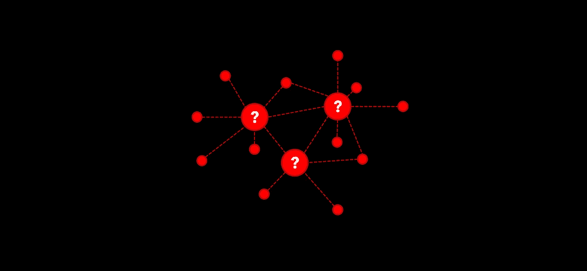
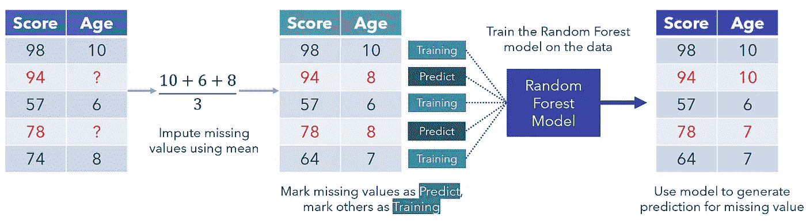
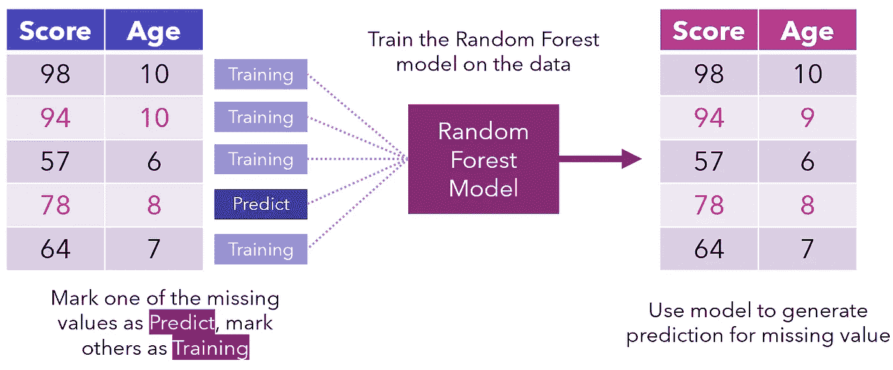

# MissForest:最佳缺失数据插补算法？

> 原文：<https://towardsdatascience.com/missforest-the-best-missing-data-imputation-algorithm-4d01182aed3?source=collection_archive---------17----------------------->

作者创建的图像。

## 告别 KNN-估算

缺失数据经常困扰现实世界的数据集，因此输入或填充缺失值具有巨大的价值。不幸的是，标准的“懒惰”插补方法，如简单地使用列中值或平均值，效果并不好。

另一方面，KNN 是一种基于机器学习的插补算法，已经取得了成功，但需要调整参数 *k* ，此外，容易受到 KNN 的许多弱点的影响，如对离群值和噪声敏感。此外，根据具体情况，这种方法的计算成本可能很高，需要存储整个数据集并计算每一对点之间的距离。

MissForest 是另一种基于机器学习的数据插补算法，它基于随机森林算法。该算法的创造者 Stekhoven 和 Buhlmann 在 2011 年进行了一项研究，在随机引入缺失值的数据集上比较了插补方法。MissForest 在所有指标上都优于所有其他算法，包括 KNN 估算，在某些情况下超过 50%。

首先，使用中位数/众数插补填补缺失值。然后，我们将缺失的值标记为“Predict ”,将其他值标记为训练行，这些训练行被输入到一个随机森林模型中，该模型被训练为基于`Score`预测`Age`。然后填充为该行生成的预测，以生成转换后的数据集。

假设数据集被截断。作者创建的图像。

这种遍历缺失数据点的过程会重复几次，每次迭代都会改进越来越好的数据。这就像站在一堆石头上，同时不断增加更多的石头来提升自己:模型使用它当前的位置来进一步提升自己。

该模型可以在接下来的迭代中决定调整预测或者保持预测不变。

作者创建的图像

迭代继续进行，直到满足某个停止标准或经过一定次数的迭代。一般来说，数据集在四到五次迭代后会变得很好，但这取决于缺失数据的大小和数量。

使用 MissForest 有很多好处。首先，它可以应用于数字和分类的混合数据类型。对分类数据使用 KNN 估算需要首先将其转换为某种数值度量。这个尺度(通常是 0/1，带有[虚拟变量](/stop-one-hot-encoding-your-categorical-variables-bbb0fba89809))几乎总是与其他维度的尺度不兼容，所以数据必须标准化。

类似地，不需要预处理。由于 KNN 使用了朴素的欧几里得距离，所以各种各样的操作，如分类编码、标准化、规范化、缩放、数据分割等。以确保它的成功。另一方面，随机森林可以处理这些方面的数据，因为它不像 K 近邻那样对特征关系进行假设。

MissForest 对噪声数据和[多重共线性](/multicollinearity-impacts-your-data-science-project-more-than-you-know-8504efd706f?source=---------7------------------)也很稳健，因为随机森林有内置的特征选择(评估[熵和信息增益](https://medium.com/analytics-vidhya/understanding-entropy-the-golden-measurement-of-machine-learning-4ea97c663dc3?source=your_stories_page---------------------------))。当数据集的预测值较弱或要素之间的相关性较大时，KNN 估算法的预测结果较差。

KNN 的结果也在很大程度上取决于 k 的值，这必须通过一种基本上是无所不能的方法来发现。另一方面，随机森林是非参数化的，因此不需要调整。它还可以处理高维数据，并且不像 KNN 估算那样容易受到维数灾难的影响。

另一方面，它也有一些缺点。首先，尽管它占用的空间较少，但如果数据集足够小，运行 MissForest 的成本可能会更高。另外，它是一个算法，而不是一个模型对象；这意味着它必须在每次估算数据时运行，这在某些生产环境中可能行不通。

使用 MissForest 很简单。在 Python 中，可以通过`missingpy`库来完成，它有一个类似于`sklearn`的接口，并且有许多与`RandomForestClassifier` / `RandomForestRegressor`相同的参数。完整的文档可以在 GitHub [这里](https://github.com/epsilon-machine/missingpy)找到。

模型的好坏取决于数据，因此必须妥善处理数据集。下次需要估算缺失数据时，考虑使用 MissForest！

感谢阅读！

如果你对最新的文章感兴趣，可以考虑[订阅](https://andre-ye.medium.com/subscribe)。如果你想支持我的写作，通过我的推荐链接加入 Medium 是一个很好的方式。干杯！