# 缺失数据对冰淇淋销售与温度相关性的影响

> 原文：<https://towardsdatascience.com/missing-data-effects-on-the-correlation-between-ice-cream-sales-and-temperature-f4bb2b3fcde1?source=collection_archive---------23----------------------->

Freepik 上的[用户 6694312](https://www.freepik.com/user6694312) 的照片

## 处理缺失数据的最佳实践

## 缺失数据存在于许多现实世界的数据集中。在这里，我分享一个最好的技术来处理这个问题。

每当我遇到一个没有**或**丢失数据的数据集时，我会立刻开始对*的数据完整性*和数据清理产生怀疑，据说数据清理是事先完成的。

我们永远不应该闭上眼睛，避免处理缺失的数据。我们需要调查和理解为什么我们可能没有缺失数据，和/或为什么我们有缺失数据。在任何情况下，问一问也无妨，但此外，真正关心我们处理的数据是我们的**责任**。

> 两个经验法则:总是质疑没有**或**缺失数据的数据集！同样，总是质疑数据集**有**缺失数据！

虽然人们可能会认为没有缺失数据是一件好事，事实也确实如此，但现实情况是发现数据集*有*缺失数据是非常常见的。出现这种现象的原因多种多样，了解原因对于缓解这一问题非常重要。我们今天的重点将是我们可以用来更好地管理丢失数据的技术，而不是为什么会发生这种情况。

特别是，我们将关注数值的缺失数据，因为这通常是处理缺失数据时的瓶颈，也是很多人出错的地方。

也就是说，基本上有两种主要方法来处理这种常见问题:

在存在缺失数据的地方(比如行和列)丢弃观察值。

b ----利用插补，根据某种统计指标或其他参数，在空白处填入数值。

## **缺失数据揭晓**

在探索任何数据集时，首先要做的事情之一就是寻找丢失的值。一旦您检测到 NAs(缺失值)的存在，您希望努力理解它们缺失的原因，以及获取“原始”数据的努力是否值得。或者即使有这样做的可能性。你必须尽快决定取舍。

事实是，无论您使用何种技术来处理丢失的数据，都不会比拥有原始数据更好。所以，如果你有办法，努力获得一个没有缺失数据的数据集总是好的(这听起来很天真，是吧？！).

在首次评估从未见过的数据集时，您可以遵循以下三个基本步骤——假设它有缺失数据:

I-获取缺失数据的总数。建立处理它们的初始阈值。这将取决于数据集的大小和性质，这里没有“一刀切”的解决方案。例如，如果全部缺失数据只占全部数据的大约 1%,您可能想要决定丢弃那些观察值。请记住，每次删除要素和/或观测值时，您都有可能降低您的分析能力。

**II——探究我们丢失数据的原因。**一种方法是进行一项名为“利特尔完全随机缺失(MCAR)测试”的测试。该测试将检查缺失数据是否完全随机缺失。

**III —检查缺失数据的模式。**常见的模式有*任意*(随机)和*单调*(系统)。要检查模式，您可以绘制一个图表来帮助您可视化缺失的数据。通常，倾向于随机模式的*任意*是我们发现最多的。

好了，现在我们已经了解了一点皮毛，让我们回到处理缺失数据的两个主要策略。

## **A——在存在缺失数据的情况下删除观察值**

我注意到许多研究论文在面对缺失数据时采取了这种方法。在许多情况下，人们决定放弃特性和观察。我猜这似乎是一个“安全的地方”，但事实是，通过删除数据，我们减少了优化分析的机会。因为有些数据集很难获得，所以我们希望尽可能避免丢弃观察值和特征。

我们应该做的是，测试不同的技术，并寻找可以产生更好结果的输出。为此，考虑你试图回答的问题，以及你试图解决的问题。完美的世界是没有缺失数据，但事实是:真实世界的数据，最有可能的是，*会有*缺失数据，没有一种完美的方式或技术来处理这个问题。

## b——利用插补，根据某种统计指标或其他参数，用一个值填充空白空间。

这就是事情变得有趣的地方。有不同的插补技术可供我们选择。插补可能很可怕，在某些情况下并不理想。这是一个崎岖的地形，也许是人们更喜欢放下数据的原因之一。

在下一节中，我们将进行一项实验，看看处理缺失数据的三种不同方法会如何影响，例如，两个变量之间的相关性:给定年份的温度和冰淇淋销售额。

# 实验

照片由 Freepik 上的 [stolyevych_yuliya](https://www.freepik.com/stolyevych-yuliya) 拍摄

在这个实验中，我向您展示了三种处理缺失数据的实用方法:

1-删除存在缺失数据的行。

2-使用平均值/中值输入缺失数据的值。

3-使用最大似然估计输入数据。

这个想法是为了展示这三种技术是如何影响冰淇淋销售和温度之间的相关性的。而且，我们会看到最坏的和最好的一个来使用。我提醒你，我们必须明白每个数据集都是独一无二的，所以，如果你在不同的数据集上尝试，你可能会得到不同的结果。

思路是打开讨论，给出思路，一定要 ***实验*** 之前，致盲，挑一个手法。

在下表中，您将看到一年中所有月份的登记值。我们有温度(华氏)和月销售额(美元)的所有值。如您所见，没有丢失值。

这是我们的出发点，也是我们在面对缺失数据时决定如何处理时，用来分析上述技术影响的基准。

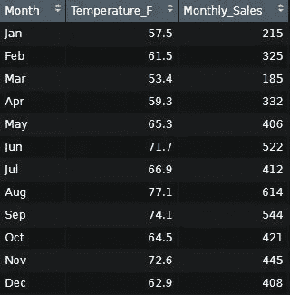

表 1——冰淇淋月销售额和各月温度。数据来源可以在这里找到[。](https://www.mathsisfun.com/data/correlation.html)

下面是原始数据集的一些基本统计数据(没有 NAs)。你不会在这里看到*标准差*，因为我想保持简单明了。然而，根据您选择的处理缺失数据的技术，您也可以预期它对标准差(和方差)的影响。

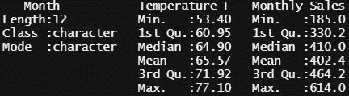

表 2 —基本统计数据

此外，这里有一个图，这样我们可以更好地形象化事件随时间的变化:

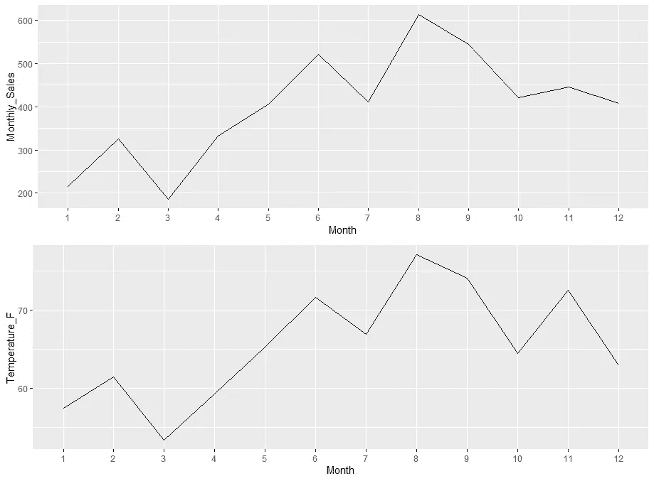

图 1 —冰淇淋销售和温度随时间的变化。

单看这两个图，就能看出一个很强的格局。两条线互相模仿。换句话说，如果一个上升，另一个也会上升，反之亦然。我不会在这里探究因果关系和相关性之间的概念。

但是温度和销量的相关性大概是 **0.96** 。这是一个*非常强的相关性*。在这种情况下，它是高度正相关的。点击此链接[此处](https://www.mathsisfun.com/data/correlation.html)了解更多信息。

我不会在这篇文章中涉及共线性，但是值得一提的是，如果我们正在处理一个回归模型，我们将不得不调查共线性。在接下来的图中，我们可以找到相关分数和其他见解，如我们正在研究的这两个变量的分布。

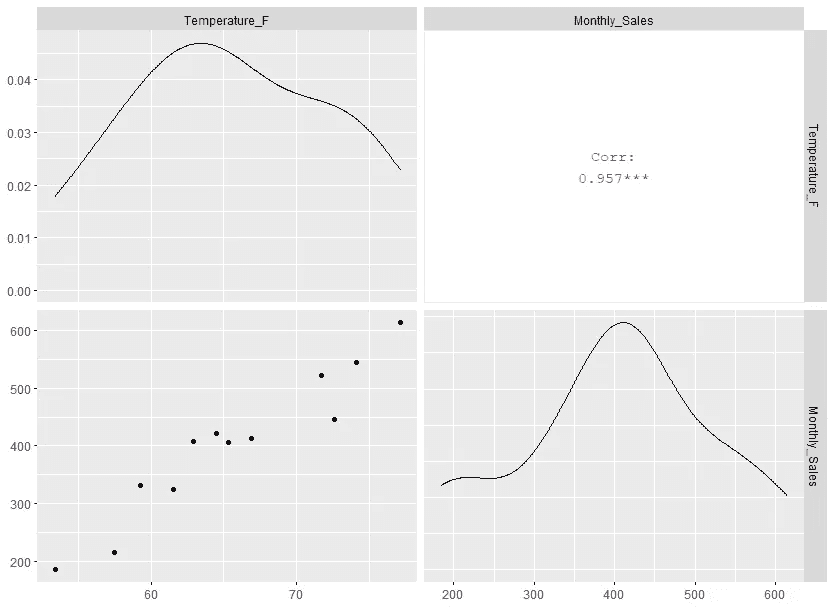

图 2 —成对

我们可以通过绘制下面的散点图，用置信区间来更好地形象化这种强相关性。当我们开始处理这个数据集时，这将是一个需要记住的重要情节。

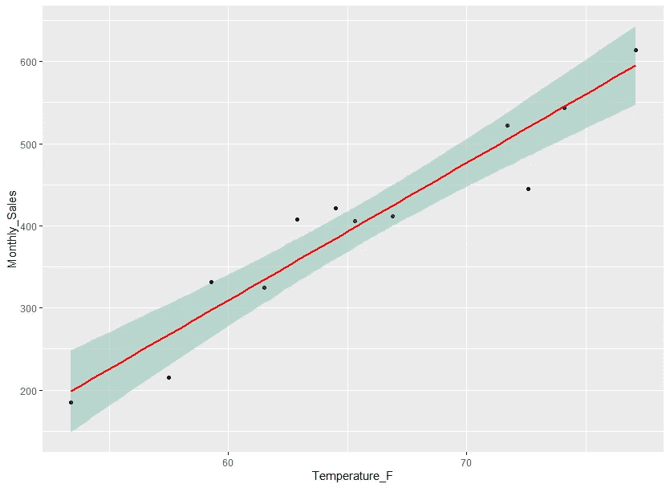

图 3—相关图

好吧，这都是非常基本的分析。许多人会认为，如果温度升高，冰淇淋的销量也会增加。到目前为止没什么特别的，对吧？！

做所有这些的目的只是为了展示在一个“完美的”数据集上执行的分析。我所说的*完美*，只是指没有丢失数据。现在我们知道真正的数字是什么样的了。

当我们第一次得到一个有缺失值的数据集时，问题是如果我们有所有的数据(没有 NAs ),我们永远不会知道事情看起来会像*一样。这就是我做所有这些初步评估的原因，向你展示“完美世界”。*

## 1-删除存在缺失数据的行。

继续我们的实验，我们知道在数据集中引入缺失值。例如，查看下表，您会注意到我们不知道三月份销售了多少(例如，“月销售额”列在三月份为 NA)。

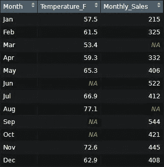

表 3 —引入缺失值(NAs)。

在这种方法中，我们将删除任何一行——在本例中是 month——在任何一列中缺少数据。这种方法也被称为“完全案例分析”。问题是，在这个过程中，我们最终丢弃了我们拥有的原始数据。

如下所示，删除所有 NAs 后，三月份的所有数据都不见了。最重要的是，我们现在有更少的观察。我们有 7 个，而不是 12 个。

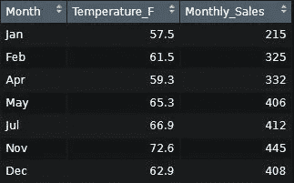

表 4 —删除 NAs 后

原来，现在温度和销量的相关性是 **0.85** 。虽然，我们可以说这种新的相关性仍然很强，但这已经是一个显著的下降了。

问题是，当你用一个真实的数据集删除变量时，你永远不知道你损失了多少。在这里，我们能够测量一点点，并了解丢弃变量会如何影响您的分析。

看看删除 NAs 后的下一个图:

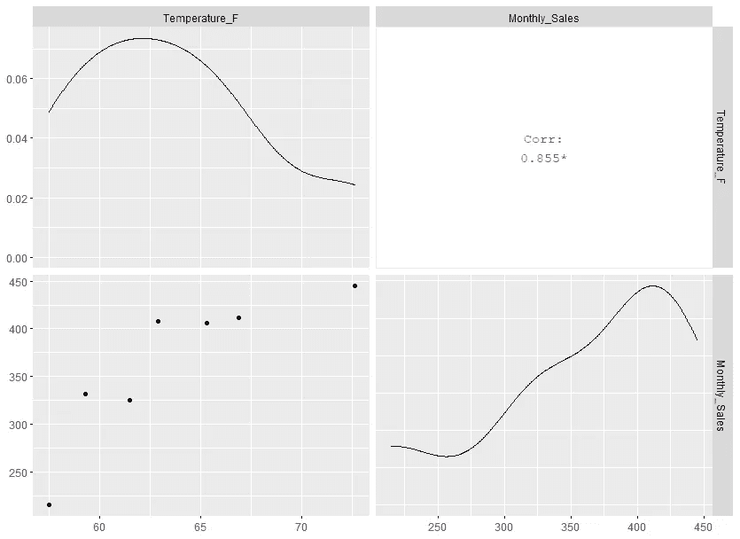

图 4 —删除 NAs 后成对出现

根据一般经验，如果丢失的数据量很小，我们应该决定删除变量。大概是 1%左右。显然，这不是一成不变的，你必须不断尝试。

## 2-使用平均值/中值输入缺失数据的值。

我承认我对此有罪。我的意思是，谁以前没用过*均值*或*中位数*输入数据？！这是一个人想到的最直观的想法之一。但是请从现在开始，不要再用这种方法了。

> “我们是认真的，但我保证我们不刻薄”——洛德

使用用于删除 NAs 的同一个表，我们知道用平均值*填充缺失值如下:*

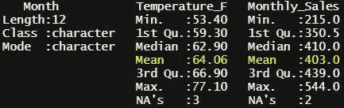

表 5 —缺少值的基本统计数据

请记住，使用*平均值*或*中位数*，结果是非常相似的。为了简单起见，我只展示了使用*平均值*的例子。但是，使用中间值*也是不好的——尽管通常危害较小。*

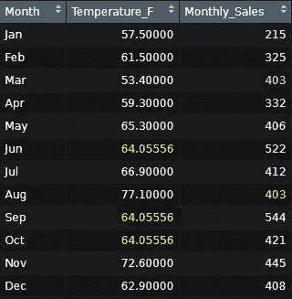

表 6-用平均值填充缺失值

如上所示，我们保留了相同数量的观察值——12 个月——但是使用*均值*的效果是毁灭性的。

我们的相关性直线下降。现在，温度和销售额之间的相关系数为 **0.36** 。见下文:

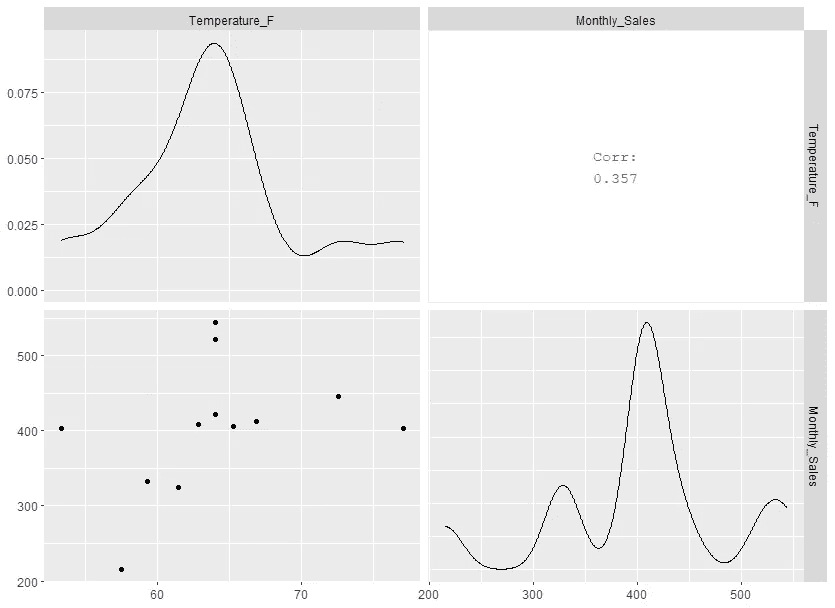

图 5 —用平均值填充 NAs 后成对出现

简而言之，我们可以假设这两个变量之间不再有很强的相关性。这就是在这个特定的实验中，使用平均值*对我们的数据集**的影响。***

这完全影响了我们的分析。看看下面这张图:

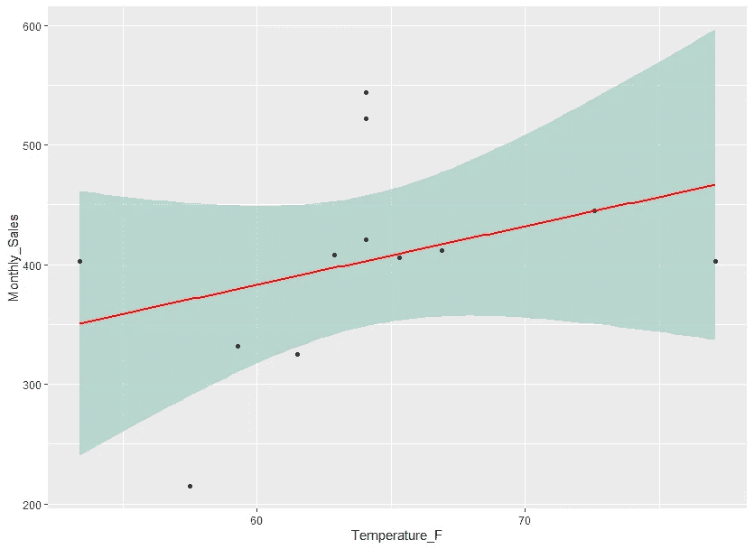

图 6-无显著相关性

假设你在卖冰淇淋。如果你知道接下来一周左右气温会上升，通常情况下，你会为你的销售增加做好准备。但是，由于我们得到的这种微弱的相关性，你不能再到处去买太多的冰淇淋了！

那是因为置信区间太大了。虽然你仍然可以期望增加你的销售额，但你不能在这上面下太大的赌注。仅这一点就使决策过程变得复杂。

在这种情况下，人们可能会发现自己“不得不”赌博，而这绝对是我们不想做的事情！

> 我是说，永远不要用卑鄙的手段！

## 3-使用最大似然估计输入数据。

我们能做得更好吗？我们当然可以！

输入数据的最佳方法之一是最大似然估计(MLE)。这种方法“为具有(潜在)缺失值的多元正态数据寻找均值向量和方差-协方差矩阵的最大似然估计。”得到协方差分数后，我们需要将它从协方差转换成相关性。在此查看文档[。](https://www.imsbio.co.jp/RGM/R_rdfile?f=mvnmle/man/mlest.Rd&d=R_CC)

正如我们在下面看到的，我们得到了温度[2]和销售[3]之间的关联分数为 0.93**。**

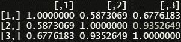

表 7 —使用**最大似然估计**后的相关性

使用这种方法的缺点是我们没有太多可用的文档。然而，实验是编写和做所有这些测试的全部意义。

还有其他可用的方法，我没有时间在这里介绍，如鼠标(使用链式方程的多重插补)。更多[此处](http://dept.stat.lsa.umich.edu/~jerrick/courses/stat701/notes/mi.html)。

**一言以蔽之，没有处理缺失数据的神奇公式**。我们想要的是，减轻任何给定数据集中缺失数据的影响。

# 结论

最大的收获是，我们必须尝试不同的方法来处理缺失数据。在这里起作用的，在不同的数据集上可能不起作用(真的吗？).

我的目标是引起人们对这个问题的关注，因为人们经常忽视它。他们选择了一种方法，并与之结合。尝试不同的事情，看看什么能给你最好的结果，这总是好的。

我们在这里看到，使用*意味着，*是最差的方法；但是利用 MLE 是最好的方法。剔除缺失值比使用*均值*要好。

局限性之一是因为这个数据集太小，而且相关性很强，所以很难得出合理的结论。例如，即使删除了数据，相关性仍然很强。当在不同的数据集上尝试这种技术时，情况可能不是这样。

下次当您遇到包含 NAs 的数据集时，请考虑一下您可以更好地处理它的可能性。只是永远不要考虑使用平均值或中间值。求你了。

## 额外收获:一个简单的最佳实践

警告！这个例子中的数据和我们到目前为止讨论的内容无关。

让我确保在处理缺失数据时，特别是在引入插补时，强调一个 ***良好实践*** 。

不幸的是，许多人在输入数据时，不管用什么方法，都倾向于填充原始特征(行/列)中缺失的值。这样做的问题是，假设您将数据传递给其他人来处理，她/他将永远不会知道我们丢失了数据，他们也不会知道您使用的方法。最重要的是，你也可以忘记你对数据集做了插补。遵循这个简单的技巧可以帮助您获得整洁的文档处理。

如果你还是不明白，这里有一个我想出来的例子(这都是哑的/虚构的数据):

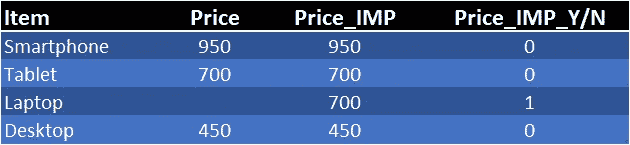

表 8—缺失数据最佳实践

分解这张桌子:

想象一下，假设你销售一些电子产品，出于某种原因，你没有笔记本电脑的价格。您决定应用一些插补(IMP)来填充该空间，但不是直接在价格列上这样做，而是创建一个新列 **Price_IMP** ，并用一个值填充该空白空间。接下来，创建一个附加特征— **Price_IMP_Y/N** —作为应用插补的快速眼点的二进制指示器。瞧啊。你只是创造了一个简单的方法来跟踪插补。

如何命名你的新特性取决于你和你的团队。这里的要点是，无论何时你使用插补，你必须以某种方式指明，并保持原始特征的完整性。别忘了透露你用了什么方法，为什么。