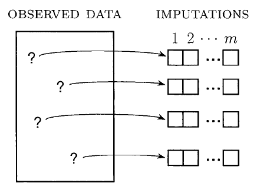
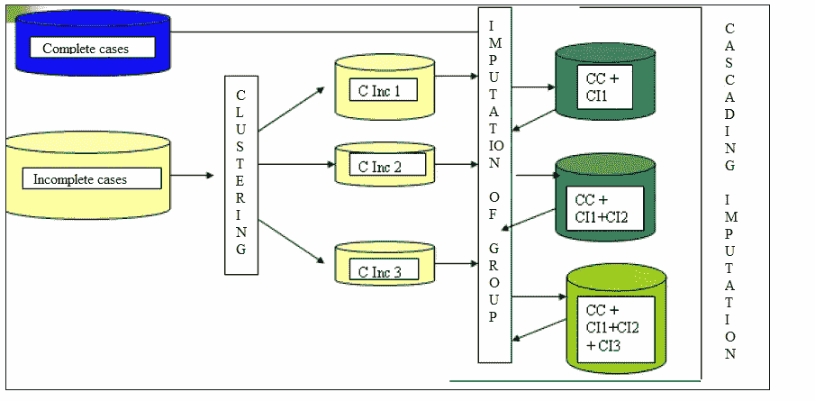

# 缺失数据插补

> 原文：<https://towardsdatascience.com/missing-data-imputation-5c664ad77ef?source=collection_archive---------13----------------------->

## 关于如何处理缺失数据插补的概念和技术

来源:https://pixabay.com/pt/

在的上一篇文章中，称为 [*缺失数据的问题*](/the-problem-of-missing-data-9e16e37ef9fc) *，*我介绍一下这个问题的基本概念。在本文中，我将解释一些关于如何为其他值替换缺失值的技巧。

> 归罪的想法既诱人又危险。它之所以诱人，是因为它可以诱使用户进入一种愉快的状态，相信数据毕竟是完整的；它之所以危险，是因为它将问题足够小，可以以这种方式合法处理的情况和应用于真实和估算数据的标准估计值存在重大偏差的情况混为一谈[Little and Rubin，2019]。

# 简单数据插补

从本质上讲，*简单数据插补*是一种用于为每个缺失项目插补一个值的方法。根据 Little 和 Rubin [2019]的说法，简单数据插补可定义为缺失值预测分布的平均值或提取值，需要一种基于观察数据创建插补预测分布的方法，并定义了生成该分布的两种通用方法:显式建模和隐式建模。

在显式建模中，预测分布基于正式的统计模型，例如多元正态分布，因此假设是显式的。显式建模的例子有平均插补、回归插补、随机回归插补。

在隐式建模中，重点是算法，这意味着一个底层模型。假设是隐含的，但仍然需要仔细评估，以确保它们是合理的。这些是隐式建模的例子:*热卡*插补、替换插补和*冷卡*插补。

## 显式建模

1- *平均值插补*:缺失值被替换为特定单元或类内形成的所有数据的平均值。这种技术不是一个好主意，因为平均值对异常值等数据噪声很敏感。Tavares 和 Soares [2018]将其他一些技术与均值进行了比较，并得出均值不是一个好主意的结论。

2- *回归插补*:缺失值替换为对该单元观察到的项目的缺失项目回归生成的预测值。均值插补可被视为回归插补的特殊情况，其中预测变量是对均值进行插补的单元格的虚拟指标变量[Little and Rubin，2019]。

3- *随机回归插补:*缺失值替换为回归生成的预测值加上反映预测值不确定性的残差。正态线性回归和逻辑回归模型就是例子。

## 隐式建模

1- *热卡插补*:这种情况下的想法是，在执行数据插补之前，使用一些相似性标准对数据进行聚类。这是最常用的技术之一。

2- *替换:*这种技术在调查环境中更方便，包括用当前样本中未观察到的替代单位替换无响应单位。

3- *冷板插补:*该技术包括替换外部来源的一个常数的缺失值，例如来自同一调查的先前实现的值。这种技术类似于替换，但是在这种情况下，使用常数值，并且在替换技术中，可以使用不同的值来替换丢失的值。

4- *复合方法(混合):*该技术建议结合不同的其他技术来预测似是而非的值。例如，结合热卡和回归插补来预测缺失值(这种方法与下面显示的方法略有不同)。

# 多重数据插补

单一插补用单一值替换未知缺失值，然后将其视为真实值[Rubin，1988]。因此，单一插补忽略了不确定性，几乎总是低估方差。多重插补通过考虑插补内的不确定性和插补间的不确定性，克服了这个问题。

多重数据插补方法为每个缺失值产生 *n* 个建议。这 n 个值中的每一个都被指定为似是而非的值，并且创建 n 个新的数据集，就好像在每个数据集中发生了简单的插补一样。通过这种方式，一个表中的一列生成 n 个新的数据集，使用特定的方法对这些数据集进行逐个分析。这些分析在第二步中被组合，生成或合并该数据集的结果。图 1 说明了这些概念，多重插补流程的步骤如下:

1-对于在数据集记录中具有缺失值的每个属性，生成一组要估算的 *n* 值；

2-对每个数据集执行统计分析，该数据集是通过使用在前一项中生成的 n 个替换建议之一而生成的；

3-将所执行分析的结果进行组合，以产生一组结果。

图 1:多重插补示意图，其中 m 是插补次数。来源:改编自[Schaferand Graham，2002 年]

我在文献中没有发现选择 n 的数目的共识，并且由于为每个新的似是而非的值生成了大量的数据集，因此为 n 选择一个高的数目可能对整个过程没有执行性。

# 复合数据插补

由 Soares [2007]提出，复合插补是一类插补技术，它在预测待插补的新值之前，结合执行 KDD(数据库中的知识发现)过程中使用的一个或多个任务。例如，组合执行像 *k-means* 这样的聚类算法和/或像 *PCA* 这样的选择特征算法，然后执行一些机器学习算法来预测新值。这种技术可用于单次或多次插补。Soares[2007]还介绍了*缺失数据插补委员会的概念*，即在所有预测中，用某种统计方法评估更合理的值。

综合插补流程基于以下要素的定义:

*   ᵢ:数据库知识发现过程中的一项任务。
    例子:T *₁* =特征选择，T *₂* =聚类，T₃ =关联规则的创建，T₄ =插补，等等。
*   →:定义 KDD 任务优先顺序的运算符。表达式 *X* → *Y* 表示任务 *X* 在任务 *Y* 之前。
    举例:*聚类→插补*表示聚类任务将先于插补任务。
*   E( *v* ，b):从数据库 b 中输入一个属性 *v* 过程中使用的策略 E( *v* ，b)用 t*₁*→t*₂*→……→t*ₘ*表示，其中 T *ₘ* 必然是一个插补任务。
*   α*ᵢ*:插补过程中使用的算法。
    举例:α*₁*=均值，α*₂*= k 近邻算法。
*   定义
    算法应用优先顺序的操作符。表达式α*ᵢ*α*ⱼ*意味着在算法α*ⱼ*之前应用算法α*ᵢ*。
*   P( *v* ，b):从数据库 b 中输入属性 v 的过程中使用的插补方案，P( *v* ，b)用
    α*₁*α*₂*α*ₚ*表示，其中α*ₚ*必然是
    插补的算法。
    例:α*₁*α*₂*α₃代表
    算法的顺序应用α*₁*= k 形心算法，α*₂*=主成分分析，α₃= k 近邻算法。
*   ψ *ᵢ:* 应用α*ᵢ*算法的实例，根据参数θ*ᵢ=*{θ*ᵢ₁，*θ*ᵢ₂，…，*θ*ᵢₚ}.* ψᵢ *= f(Aᵢ，*θ*ᵢ)*
*   I(v，B):数据库 B 的属性 v 的插补计划的实例，由算法应用的 q 个实例的有序序列表示。ψ*₁*ψ*₂*……ψ*ₚ，*其中*ψ*ₚ*这必然是
    插补算法应用的一个实例。*
*   ε(I( *v，B)):* 运行计划
    属性 *v* 的实例时的误差的度量。

插补计划假定的插补值集合将由该计划所有实例中平均误差最低的实例值组成(ε(*p*(*v*)=ε(I*ₖ*(*v*))，其中ε(I*ₖ*(*v*)<ε(I

*这样，我们可以将复合插补定义为在补充数据库 *B* 的属性 *v* 中缺失数据的过程中应用一种或多种策略。*

# *级联数据插补*

*Ferlin [2008]提出的级联插补法考虑了之前的数据插补法，以执行下一次插补法。先前补充的数据组在级联效应中被重新用于后面组的插补。采用这种分而治之的方法，可以简化估算过程，提高估算的数据质量。在你的实验中，Ferlin [2008]利用了 Soares [2007]提出的方法，并在输入数据之前执行一个 KDD 任务(在她的例子中是聚类)。图 2 说明了这些概念。*

**

*图 2:级联插补概念。来源:改编自[费林，2008 年]*

*在本文中，我展示了一些处理缺失数据插补的技术和概念。这类问题没有解决方法。因此，必须对每个病例进行研究，以确定更好的治疗方法。在接下来的文章中，我将展示一些数据插补的结果。*

# *参考*

1.  *斯查费和格雷厄姆(2002 年)。缺失的数据:我们对技术现状的看法。心理学方法，7(2):147。*
2.  *Little，R. J .和 Rubin，D. B. (2019 年)。缺失数据的统计分析，第 793 卷。*
3.  *Tavares，R. d. S .，卡斯塔涅达，r .，Ferlin，c .，Goldschmidt，r .，Alfredo，L. V. C .，Soares，J. d. A. (2018)。关于起诉法官的程序。塞尔索·苏科·达·丰塞卡·塞费特/RJ，第 1-6 页。*
4.  *鲁宾博士(1988 年)。多重插补概述。美国统计协会调查研究方法部分的进展，第 79-84 页。Citeseer。*
5.  *你听到了吗 j。(2007 年)。数据挖掘中的预处理:一项补充比较研究。博士论文。系统工程与计算。ufrj 2007。*
6.  *费林克劳迪娅。多元计费:级联方式。里约热内卢，RJ，2008 年。*