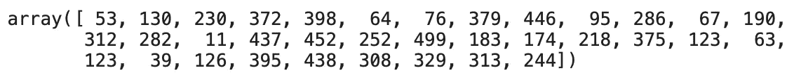

# 如何用 Python 和 KNN 处理缺失数据

> 原文：<https://towardsdatascience.com/missing-value-imputation-with-python-and-k-nearest-neighbors-308e7abd273d?source=collection_archive---------16----------------------->

## 使用机器学习算法处理缺失数据

缺失值插补并不是一项很难完成的任务。方法范围从简单的平均值插补和完全删除观察到更先进的技术，如[小鼠](/stop-using-mean-to-fill-missing-data-678c0d396e22)。如今，更具挑战性的任务是选择使用哪种方法。今天我们将探索一种简单而高效的估算缺失数据的方法——KNN 算法。


[背景照片](https://www.freepik.com/photos/background)由 [freepik](http://www.freepik.com) 创作

KNN 代表*K-最近邻*，这是一种基于定义的最近邻数量进行预测的简单算法。它计算要分类的实例与训练集中所有其他实例之间的距离。您可以从这里了解如何从头开始实现它:

[](/lets-make-a-knn-classifier-from-scratch-e73c43da346d) [## 让我们从头开始制作一个 KNN 分类器

### 你只需要一点钱和一点时间。包括源代码。

towardsdatascience.com](/lets-make-a-knn-classifier-from-scratch-e73c43da346d) 

顾名思义，我们不会将该算法用于分类目的，而是用于填充缺失值。本文将使用房价数据集，这是一个简单而著名的数据集，只有 500 多个条目。这里可以下载[。](https://www.kaggle.com/arslanali4343/real-estate-dataset)

这篇文章的结构如下:

*   数据集加载和浏览
*   KNN 插补
*   估算优化
*   结论

# 数据集加载和浏览

如前所述，您可以通过[链接](https://www.kaggle.com/arslanali4343/real-estate-dataset)下载房屋数据集。此外，确保你已经进口了*熊猫*和*熊猫*。这是前几行的样子:


作者图片

默认情况下，数据集的缺失值非常少，一个属性中只有五个缺失值:


作者图片

让我们改变这一点。这不是你通常会做的事情，但是我们需要更多的缺失值。首先，让我们创建两个随机数数组，范围从 1 到数据集的长度。第一个数组有 35 个元素，第二个有 20 个元素(任意选择):

```
i1 = np.random.choice(a=df.index, size=35)
i2 = np.random.choice(a=df.index, size=20)
```

下面是第一个数组的样子:



作者图片

你的数组会有所不同，因为随机过程是随机的。接下来，我们将用 NANs 替换特定指数的现有值。方法如下:

```
df.loc[i1, 'INDUS'] = np.nan
df.loc[i2, 'TAX'] = np.nan
```

现在让我们再次检查丢失的值—这一次，计数不同:


作者图片

这就是我们从估算开始所需要的。让我们在下一节做这件事。

# KNN 插补

整个插补归结为 4 行代码，其中一行是库导入。我们需要来自`sklearn.impute`的`KNNImputer`，然后以一种众所周知的 Scikit-Learn 方式创建它的一个实例。该类需要一个强制参数—`n_neighbors`。它告诉估算者参数 k 的大小。

首先，让我们选择一个任意的数字 3。我们稍后将优化这个参数，但是 3 已经足够好了。接下来，我们可以在我们的估算器上调用`fit_transform`方法来估算缺失数据。

最后，我们将把得到的数组转换成一个`pandas.DataFrame`对象，以便于解释。代码如下:

```
from sklearn.impute import KNNImputer

imputer = KNNImputer(n_neighbors=3)
imputed = imputer.fit_transform(df)
df_imputed = pd.DataFrame(imputed, columns=df.columns)
```

那不是很容易吗？现在让我们检查缺失值:


作者图片

不出所料，一个都没有。然而，还有一个问题——**我们如何为 K 选择正确的值？**

# 估算优化

由于目标变量是连续的(MEDV)，该住房数据集旨在通过回归算法进行预测建模。这意味着我们可以训练许多预测模型，其中缺失值用不同的 K 值进行估算，并看看哪一个执行得最好。

但是首先，进口。我们需要从 Scikit-Learn 获得一些东西——将数据集分成训练和测试子集，训练模型，并验证它。我们选择了*随机森林*算法进行训练，但是这个决定又是任意的。RMSE 被用于验证:

```
from sklearn.model_selection import train_test_split
from sklearn.ensemble import RandomForestRegressor
from sklearn.metrics import mean_squared_error

rmse = lambda y, yhat: np.sqrt(mean_squared_error(y, yhat))
```

以下是执行优化所需的步骤:

1.  迭代 K 的可能范围——1 到 20 之间的所有奇数都可以
2.  使用当前 K 值进行插补
3.  将数据集分成训练和测试子集
4.  符合随机森林模型
5.  在测试集上预测
6.  使用 RMSE 评估

这听起来很多，但归结起来大约有 15 行代码。以下是片段:

```
def optimize_k(data, target):
    errors = []
    for k in range(1, 20, 2):
        imputer = KNNImputer(n_neighbors=k)
        imputed = imputer.fit_transform(data)
        df_imputed = pd.DataFrame(imputed, columns=df.columns)

        X = df_imputed.drop(target, axis=1)
        y = df_imputed[target]
        X_train, X_test, y_train, y_test = train_test_split(X, y, test_size=0.2, random_state=42)

        model = RandomForestRegressor()
        model.fit(X_train, y_train)
        preds = model.predict(X_test)
        error = rmse(y_test, preds)
        errors.append({'K': k, 'RMSE': error})

    return errors
```

我们现在可以用修改后的数据集(3 列中缺少值)调用`optimize_k`函数，并传入目标变量(MEDV):

```
k_errors = optimize_k(data=df, target='MEDV')
```

就是这样！`k_errors`数组看起来像这样:


作者图片

或者，直观地表示:


作者图片

看起来 **K=15** 是给定范围内的最佳值，因为它产生的误差最小。我们将不讨论错误的解释，因为这超出了本文的范围。让我们在下一部分总结一下。

# 离别赠言

缺失数据插补很容易，至少是编码部分。是**推理**让它变得困难——理解哪些属性应该被估算，哪些不应该被估算。例如，由于客户没有使用该类型的服务，可能会丢失一些值，因此进行插补毫无意义。

咨询领域专家并研究该领域永远是一条路要走。实际的编码很容易。

[**加入我的私人邮件列表，获取更多有用的见解。**](https://mailchi.mp/46a3d2989d9b/bdssubscribe)

*喜欢这篇文章吗？成为* [*中等会员*](https://medium.com/@radecicdario/membership) *继续无限制学习。如果你使用下面的链接，我会收到你的一部分会员费，不需要你额外付费。*

[](https://medium.com/@radecicdario/membership) [## 通过我的推荐链接加入 Medium-Dario rade ci

### 作为一个媒体会员，你的会员费的一部分会给你阅读的作家，你可以完全接触到每一个故事…

medium.com](https://medium.com/@radecicdario/membership) 

*原载于 2020 年 10 月 21 日 https://betterdatascience.com*[](https://betterdatascience.com/impute-missing-data-with-python-and-knn/)**。**