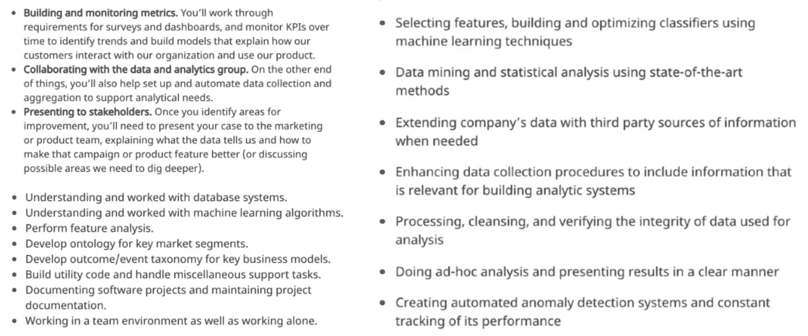

# 我作为数据科学家所犯的错误

> 原文：<https://towardsdatascience.com/mistakes-ive-made-as-a-data-scientist-e38f8c314ac6?source=collection_archive---------11----------------------->

## 21 世纪最性感工作的 10 种摸索方法

照片由来自[佩克斯](https://www.pexels.com/photo/anxious-young-lady-with-tickets-and-passport-on-red-background-4127635/?utm_content=attributionCopyText&utm_medium=referral&utm_source=pexels)的[古斯塔沃·福林](https://www.pexels.com/@gustavo-fring?utm_content=attributionCopyText&utm_medium=referral&utm_source=pexels)拍摄

数据科学可能会有压力，但也非常有益和有利可图。

一些活动是我们效率的倍增器(例如:拒绝使用空闲时间)。

**不**做其他活动也能事半功倍。

以下是我犯过的错误，这些错误要么阻碍了我个人的职业生涯，要么阻碍了我公司的职业生涯。

# **不了解数据科学工作的不同类型**

我曾以“数据科学家”的身份加入一家公司，希望做预测建模。但最终还是写了后端应用代码。这是我的错。

我之前的数据科学角色专注于构建模型，我错误地认为新角色会类似。

在“数据科学”的保护伞下有许多类型的工作。再加上糟糕的工作描述，你就有了困惑的秘诀。

来自 Indeed 的 3 份不同的数据科学工作

浏览一下数据科学的帖子，你会发现工作可以分为几类:

*   商业智能
*   数据分析
*   ML 工程
*   数据工程
*   软件工程

在接受一份工作之前，试着了解它的细节。探查你正在面试的团队中的某个人是你最好的选择。否则，你可能很快就要找新工作了。

# **没有导师**

在没有外界帮助的情况下，我花了一个月的时间为一个 ML 问题绞尽脑汁。当一位新导师建议研究一种特定的技术时，我只用了一周就解决了这个问题。

**我不知道我不知道的事情**。也就是说，我对现存的 NLU 技术并不熟悉。但我的导师有博士学位和该领域的工作经验。

> 你不知道你不知道什么。

初创公司通常会让你在你不擅长的领域工作。当你不知道相关技术的词汇时，很难找到解决方案。

没有高级工程师或导师的帮助，任何人都不应该在像人工智能这样的高科技领域工作。这是一个巨大的乘数。

# 项目失败时不承认

在花了 2 周的时间用一个新模型替换现有模型后，现有模型仍然有更好的性能。

我没有减少损失，而是又花了两周时间进行投机性的管道调整，希望能有所改善。没用。我们扔掉了新模型，还有浪费的两个星期。

时间盒让我停下来。一个失败项目挫伤了我的自尊心，让我继续前进。

> Timebox，不要 scopebox。
> 
> - *领先的精益软件开发*

我们这些孤立在数据科学团队中的人无法全面了解公司的优先事项。我们可以增加价值的项目数不胜数。有些人会失败，我们必须继续前进。

如果你在一个非关键项目上超过了规定的时间，并且更多的时间不能保证它的成功，放弃它通常是明智的解决方案。

# 项目结束后不写汇报笔记

我创业时的优先事项发生了变化，我回到了一年半前放弃的 NLP 项目上。没有关于尝试过的方法或研究的文档，所以我又从头开始。

鉴于初创公司的优先事项不断变化，放弃一个项目，然后在晚些时候再回来做是很常见的。

其他时候项目失败了，我们不记得为什么，管理层想再次尝试同样的事情。

保留一个失败/正在进行的项目的中央存储库被低估了。参考已提交的代码、研究链接以及对已尝试内容的注释，将有助于您在重新开始项目时快速恢复。

# 拖延寻求帮助

我讨厌浪费人们的时间。我倾向于在回去寻求进一步的建议之前，详尽地尝试来自资深人士/顾问的每一个建议。为此我推迟了会议。教科书式的完美主义者。

过早请求帮助和过晚请求帮助只有一线之隔。

如果有人同意做你的顾问，他们想帮助你。他们也有经验知道什么时候你在错误的道路上走得太远，即使你不知道。

获得建议，尝试，跟进。

如果你能自己解决问题，你就不需要他们了。

*我意识到有些人完全不考虑问题就寻求帮助——这一点不适合他们。*

# 不承认你一无所知

早在我的机器学习生涯之前，我在喝咖啡时遇到了我的第一位人工智能导师。

> 导师:你以前实现过机器学习吗？我:神经网络导师:你用过哪些框架？我:嗯。Python。

事实上，我对 ML 的所有了解都是从吴恩达的[深度学习课程](https://www.coursera.org/learn/neural-networks-deep-learning)中学到的。但我想听起来聪明点。

我们最终在一起工作。也就是说，不要假装你知道你不知道的事情。有实地经验的人在一英里外就能闻到胡说八道。帮助承认自己弱点的人也更容易。

# 没有项目的学习

我花了几个月的时间阅读我已经不记得的技术和理论。笔记和未命名的 Jupyter 笔记本不可避免地会丢失。

另一方面，我回想起每一次我将学到的东西整合到一个工作应用程序中，发布 Jupyter 代码，或者写一篇博客文章。

后者的另一个好处是很容易返回并引用工作代码。

让自己对你花时间学习的所有东西的某种产出负责。

# 开发与探索的错误平衡

*隐射了* [*多臂土匪*](https://en.wikipedia.org/wiki/Multi-armed_bandit) *的问题，* ***剥削*** *是使用你知道的技巧，而* ***探索*** *是尝试新的技巧。你两者都需要。*

变得对一些机器学习库过于舒适也有它的缺点。你开始在你已经知道的技术范围内看到所有的 ML 问题。

在我的特定场景中，一个我从未听说过的库远远超过了我的 hacky Sklearn 实现。

当开始一个新问题时，采取[第一原则](https://en.wikipedia.org/wiki/First_principle)的方法来避免探索不足。

# 不编写可重用的函数

一个面试任务需要建立一个标准的 NLP 管道，包括通常的疑点(清理、词条化、向量化、模型选择等)。

鉴于完成任务的时间有限，我希望我已经准备好了可导入的管道模块。

我花了几个小时才完成这个项目，而不是看起来像个神童一样在 30 分钟内完成。虽然我通过了面试阶段，但这是很难的时候，它本来是容易的。

> 我选择一个懒惰的人去做艰苦的工作。因为一个懒惰的人会找到一个简单的方法去做。
> ——比尔·盖茨

如果您发现自己在 Jupyter 笔记本上不止一次地编写相同的代码，请帮自己一个忙，编写自己的可重用模块。

# 低估领域知识的重要性

我已经建立了使用错误功能的机器学习管道。我曾在一些公司工作过，这些公司生产他们行业不需要的产品。

接触一个行业，拥有领域知识是软件开发中最被低估的部分。

领域知识比编码技能更难获得。它是在野外工作多年后建成的。

1.  当心对领域知识不感兴趣的工程师。在某个时候，他们会碰壁。
2.  只有当至少一个创始人在产品所面向的行业有丰富的经验时，才加入一家初创公司。

# 结论

职业生涯不会长到让你自己犯所有的错误。如果我们能互相学习就更容易了。

工作稳定已经成为过去，但我们仍然可以通过多做正确的事情，少做错误的事情来达到顶峰。

希望你喜欢阅读我所犯的错误。

作为一名数据科学家，你摸索过吗？