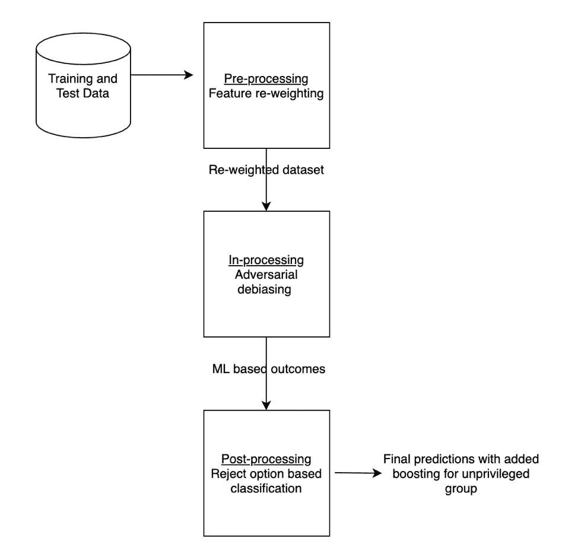
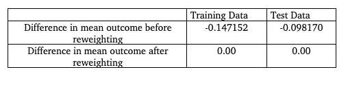
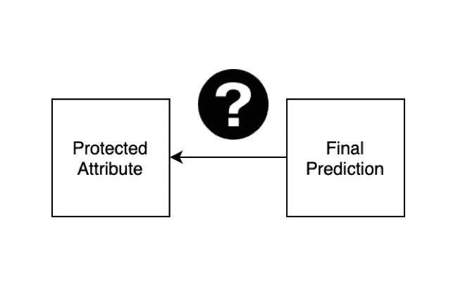
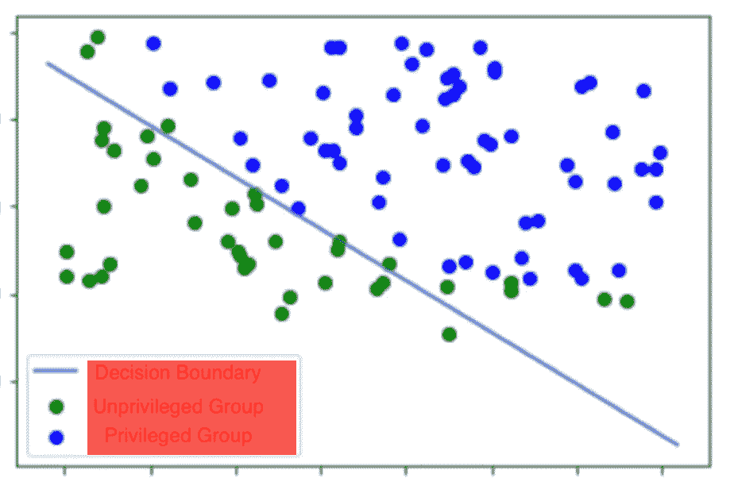
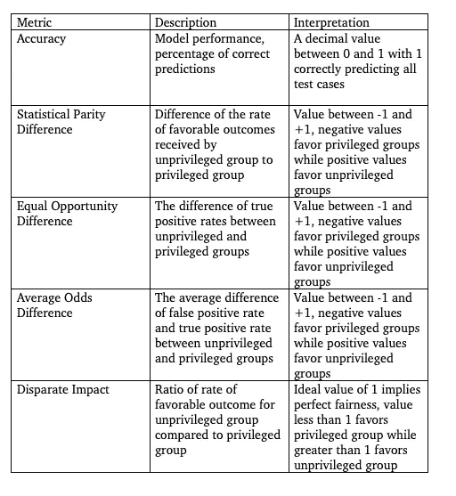
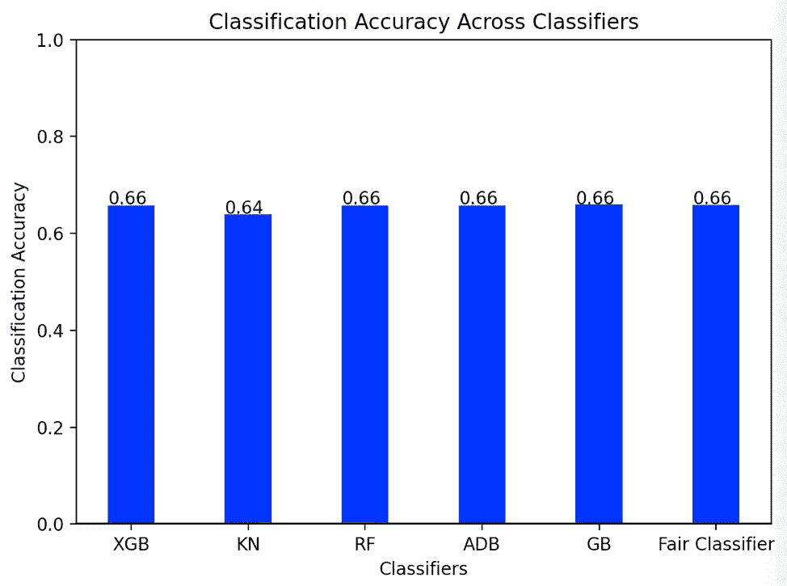
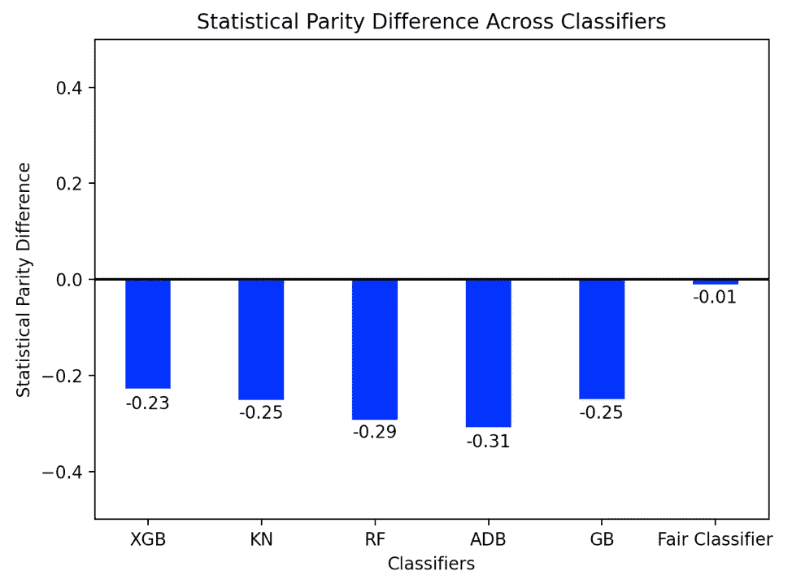
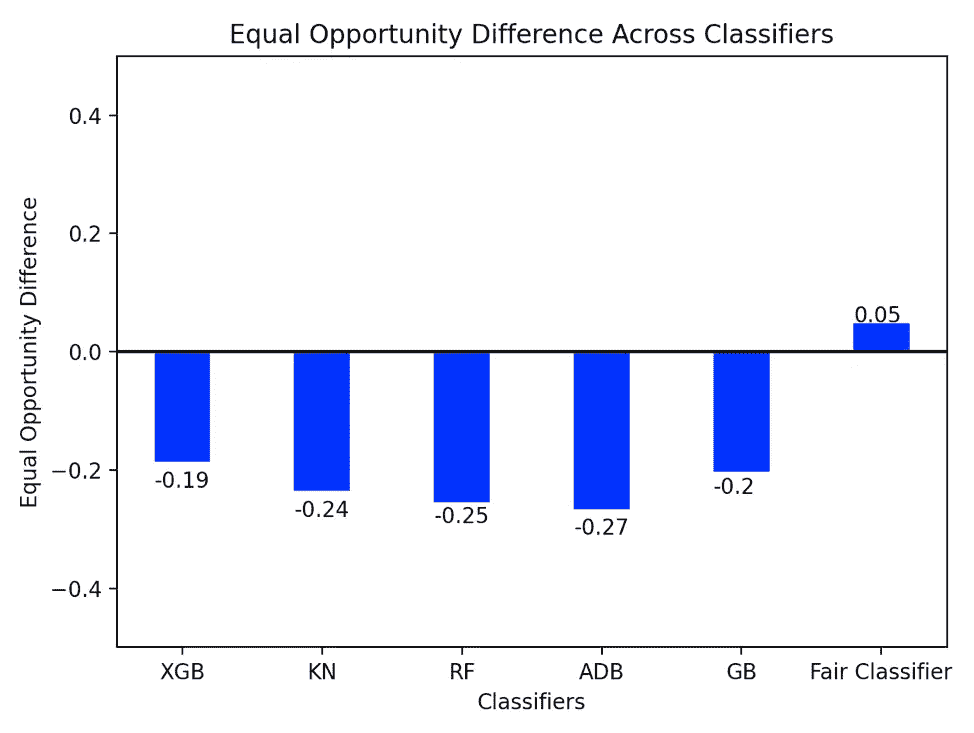

# 减轻机器学习中的偏差:MLFairnessPipeline 简介

> 原文：<https://towardsdatascience.com/mitigating-bias-in-machine-learning-an-introduction-to-mlfairnesspipeline-42e007dce0a5?source=collection_archive---------59----------------------->

Pixabay 在 Pexels 上拍摄的照片

# **机器学习中的偏差**

偏见有许多不同的形式，影响着所有的人群。它可以是隐式的，也可以是显式的，通常很难检测到。在机器学习领域[的偏见](https://medium.com/better-programming/understanding-racial-bias-in-machine-learning-algorithms-1c5afe76f8b)往往很微妙，很难识别，更不用说解决了。为什么这是一个问题？机器学习中的隐性偏见具有非常真实的后果，包括拒绝贷款、更长的刑期以及对弱势群体的许多其他有害结果。设计模型的数据科学家和运行模型的计算机可能不会对某个特定群体产生明显的偏见，那么偏见是如何产生的呢？无论是种族、性别、宗教、性取向，还是其他形式的认同，在导致不利结果的群体和因素之间都存在着[相关性](https://amplitude.com/blog/2017/01/19/causation-correlation)。这是一个典型的相关性与因果性的问题，对于成为这种范式受害者的人群来说，这是一个现实世界的后果。MLFairnessPipeline 有两个用途:

1.发现对弱势群体的偏见

2.减轻对弱势群体的偏见，并在不牺牲性能和分类准确性的情况下提供更公平和公正的预测

# **什么是 MLFairnessPipeline？**

MLFairnessPipeline 是一个端到端的机器学习管道，具有以下三个阶段:

1.预处理—因子重新加权

2.处理中——对抗性去偏神经网络

3.后处理—基于剔除选项的分类

图一。多公平管道方案设计

MLFairnessPipeline 在上述三个阶段中的每一个阶段都消除了偏差。受保护的属性用于将数据分为特权组和非特权组。该属性本质上可以是任何特征，但最常见的用例是种族和性别。流水线保持精度和性能，同时减少偏差。

这种划分的一个很好的用例是设计决定刑期的模型。在确定刑期时，对个人再次犯罪的可能性进行了计算，并给予了非常重的考虑。由于系统性的种族偏见，少数民族经常被预测为更有可能再次犯罪，因此如果我们试图在这种情况下减轻偏见，我们将使用“种族”作为我们的受保护属性，并将非洲裔美国人和西班牙裔美国人视为弱势群体，将高加索人视为特权群体，因为他们经常获得更有利的结果和优惠待遇。

# **预处理**

在模型被训练之前，在我们的受保护属性和组被选择之后，特征被重新加权以有利于弱势组，从而在训练模型之前给他们一个提升。在上面的使用案例中，当评估重新犯罪的可能性时，高加索人比少数民族多 10-15%的可能获得有利的结果。重新加权后，这种 10-15%的有利结果差异将减少到 0。

图二。重新加权前后有利结果的平均值

# **进行中**

在预处理之后，我们进入正在处理的阶段，在那里进行学习并建立我们的模型。MLFairnessPipeline 然后使用 TensorFlow 建立一个神经网络，并利用对抗性去偏置。这实际上需要两个模型:一个由用户指定，以尝试从一组特征中预测指定的结果，第二个对抗模型基于训练模型的结果来尝试和预测受保护的属性。这样做的目的是确保受保护的属性和结果之间的单向关系，从而确保受保护的属性不会根据结果被猜到。通过打破受保护的属性和结果之间的联系，我们确保了在有利和不利的群体之间有一组更平等的结果。

图 3。对手模型功能的可视化表示

使用对抗去偏置，我们的目标是使我们的对手模型难以基于最终预测来预测受保护的属性

# **后处理**

我们管道中的第三个也是最后一个阶段是后处理。现在我们有了一个训练好的模型和一组预测，后处理阶段利用基于拒绝选项的分类在决策边界附近的特权和弱势群体之间交换结果。通过定义决策边界，用户可以指定交换结果的阈值。如果特权群体的成员在决策界限之上的阈值内，意味着提供了有利的结果，则他们与得到不利结果但仍在界限之下的阈值内的弱势群体的成员交换。这种预测的交换增加了对弱势群体有利的额外推动，以提供一组更公平的预测。

图 4。决策边界的表示以及 ROC 如何在非特权群体和特权群体之间交换预测

# 【MLFairnessPipeline 如何衡量成功？

为了从公平的角度判断性能，MLFairnessPipeline 提供了关键公平指标的测量，并将模型性能与由几种流行的机器学习分类算法组成的对照组进行比较。选定的测量如下:

图 5。使用的公平性度量表

控制组中当前支持的分类器是 XGBoost 分类器、KNeighbors 分类器、随机森林、AdaBoost 分类器和 GradientBoost 分类器。下面是一组样本图表，比较了我们的对照组和 fair 分类器在上述样本用例中的性能。

图 6。将对照组与公平分类器进行比较的分类准确度

此图比较了上述样本用例中与再次犯罪的可能性相关的准确性。我们看到所有型号都有相似的性能

图 7。对照组分类器与公平分类器相比的统计奇偶差异

该图比较了我们的对照组和我们的公平分类器的统计奇偶差异。我们看到，在我们的控制组中有一个非常重的特权群体的偏好，但在我们的公平分类器中几乎完全平等的分裂

图 8。对照组和公平分类者之间的均等机会差异

在我们的对照组中，我们看到了机会均等差异的巨大差异，偏向特权群体，但我们的公平分类器实际上显示了对弱势群体的偏见

# **结论**

总之，MLFairnessPipeline 为数据科学家提供了检测和减轻其模型中多种形式偏差的机会，同时保持相同程度的准确性和性能