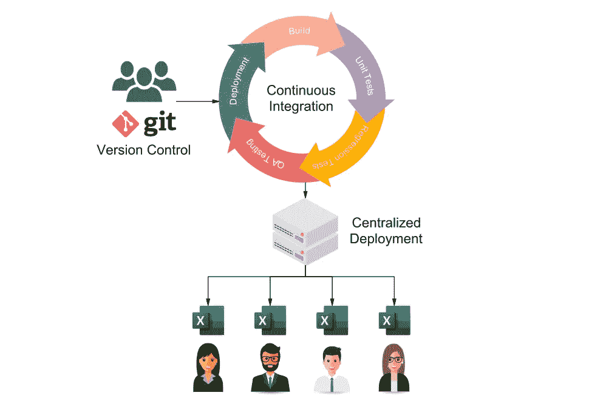
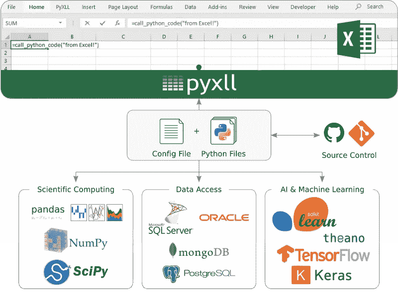

# 使用 Excel 降低终端用户计算风险

> 原文：<https://towardsdatascience.com/mitigating-end-user-computing-risk-with-excel-4108a5e6acad?source=collection_archive---------29----------------------->

您可以拥有强大的 EUC 策略，同时还能使用 Excel！(图片作者本人)

越来越多的公司开始重视与终端用户计算或 EUC 相关的风险。简而言之，终端用户计算是指允许终端用户在他们可用的规定解决方案之外执行复杂计算的任何系统。

金融行业的一个典型例子是，一名交易员在 Excel 中开发了自己的交易模型，然后使用该模型在市场上进行交易。这个模型在公司的风险系统之外，因此风险管理团队或模型验证团队没有办法验证这个模型，他们甚至可能不知道它的存在。

有几个引人注目的案例，复杂的 Excel 电子表格被发现有错误，后来这些企业损失了数百万美元。

需要指出的是，在绝大多数情况下，用户不会使用终端用户计算来有意规避雇主制定的政策或程序。最常见的动机是，最终用户最了解他们试图解决的问题，而且他们通常最有能力解决该问题，并使用他们可用的工具。

# 为什么终端用户计算会成为一个问题

管理层、其他最终用户和潜在客户接受并信任作为最终用户计算结果(如 Excel)生成的报告和数据。

计算中的错误很难追踪，并且在电子表格的情况下，可以在同一报告的不同版本之间传播。即使一个用户发现并修复了一个电子表格中的错误，又有多少次同样的错误被复制并粘贴到其他表格中呢？

测试电子表格中编写的代码实际上是不可能的。在 Excel 中，VBA (Excel 的脚本语言)嵌入在电子表格中，因此不能像专业软件开发中的标准做法那样进行测试。

在 EUC 环境中编写的代码不能被有效地审计。当代码嵌入到电子表格中时，没有一个中心位置可供您查找用于运营业务的代码，这些代码分散在不同用户和团队的不同电子表格中，通常很少对代码的质量和正确性负责。

对于个人来说，构建他们自己的复杂“主表”并不少见，其中包含了他们执行工作所需的一切。有了它，他们的工作效率非常高，一切都很好，但是当那个人不得不把工作移交给别人的时候，会发生什么呢？突然，他们小心翼翼维护了多年的电子表格被揭露出来——一个没有人敢碰的纸牌屋！

对我来说很好！(图片[维基共享资源](https://upload.wikimedia.org/wikipedia/commons/7/71/Tangled_cables_at_Tokyo_Festival_of_Modular_2013.jpg)

# 目标是什么？

在某些软件开发圈子里，最终用户有时被视为敌人。如果你是一名开发人员，你可能会想，禁止使用 Excel 将是一个好的解决方案，但让我解释一下为什么不是。

为什么最终用户首先使用 Excel？Excel 是一个非常强大的工具，它可以帮助他们比没有它更有效地完成工作，这就是他们使用它的原因！

如果我们把 Excel 拿走，他们电子表格中的每一个小功能都将被许多不同的应用程序所取代。为了有效地工作，所有这些应用程序都需要巧妙地集成在一起。此外，每当用户需要做一些特别的计算或者用一个新的想法做实验时，就需要开发人员编写新的功能来执行。您有多余的开发资源来处理这个问题吗？

即使这是可行的(许多公司都在尝试)，问问你自己，这对最终用户来说是更好还是更坏？如果你还不知道这个问题的答案，那就等着“导出到 Excel”按钮被添加到你的新应用程序中吧！现在你有两个问题——你有更多的东西要维护*和*你有 Excel 电子表格！

那太好了…你现在能添加一个“导出到 Excel”按钮吗？(图片作者本人)

所有这些中真正重要的是什么？

*   为最终用户提供一套工具来*帮助他们执行*。
*   确保关键代码经过*测试和可审计*。
*   保持对 Excel 之外的业务逻辑和数据的控制*。*
*   保持一定程度的灵活性*而不*危及结果的完整性、可审核性和可再现性。

# 有什么解决办法？

如果我们不把 Excel 当作一个具有内置函数的工具来执行低级操作(这可能会很快失去控制)，而是把 Excel 当作一个前端或交互式计算器来实现高级功能，专门为最终用户的需求而构建，会怎么样呢？

Excel 电子表格中常见的错误来源是从另一个系统复制和粘贴数据。从多个不同的系统或其他电子表格中复制数据时尤其如此。跟踪电子表格中使用的数据的来源和完整性是一个难题。

想象一下，如果 Excel 具有从这些外部系统直接检索数据的功能，而不是复制和粘贴所需的数据。不再有复制和粘贴错误，数据的来源从所使用的函数中是清楚的，并且数据的完整性得到了保证，因为它是直接来源的。

复杂的 Excel 电子表格的其他主要问题是笨拙的 VBA 代码和像意大利面条一样的单元格关系。这些是使用太低级的功能来实现复杂结果的副产品。如果我们可以用专门为解决我们特定领域的问题而设计和构建的高级功能来代替这些功能，会怎么样呢？

例如，您不必编写 VBA 代码或创建一个充满中间结果的复杂表格来计算一组现金流的 IRR，您可以使用 Excel 内置的“IRR”或“XIRR”函数。其他问题呢，比如利率互换的定价？最终用户不需要创建一个电子表格来完成这个重复的任务，这无疑会涉及到不可测试的 VBA 代码的使用，如果给他们提供一个高级功能来执行这个特定的计算会怎么样呢？

使用高级域特定函数降低了 Excel 工作簿本身的复杂性。复杂性转移到了这些工作表函数上，如果编写得当，这些函数可以被测试、审计并分发给需要它们的每个人。通过将这些高级功能保持在特定工作簿之外，可以轻松地将修复和更新部署到每个人，而不必修改每个单独的工作簿。

# 编写一个 Excel 加载项并没有你想象的那么难！

我们上面描述的编写自定义 Excel 函数是通过编写 Excel 插件实现的。

传统上，只有两种方法来编写 Excel 加载项；在 VBA 或 C 或 C++中。如今，有更多的选项可供选择，许多不同的编程语言都有解决方案，包括 [Python](https://www.pyxll.com?utm_source=medium) 、 [Java](https://exceljava.com?utm_source=medium) 、 [C#](https://excel-dna.net) 、 [JavaScript](https://docs.microsoft.com/en-us/office/dev/add-ins/reference/javascript-api-for-office) 、 [Scala](https://exceljava.com/docs/tutorials/scala.html?utm_source=medium) 、 [Kotlin](https://exceljava.com/docs/tutorials/kotlin.html?utm_source=kotlin) 、 [Clojure](https://exceljava.com/docs/tutorials/clojure.html?utm_source=medium) 甚至 [D](https://symmetryinvestments.github.io/excel-d/) 。

在 VBA 编写插件确实比在工作簿中直接嵌入 VBA 有一些优势。VBA 加载项可以编写一次，供多个用户和工作簿使用，但它仍有一些缺点。VBA 插件很难测试，并且保存为二进制文件，不适合版本控制系统。这些问题中有一些是由橡皮人 VBA 解决的，所以如果你有特别的需要继续使用 VBA，那当然值得一看。

为了与现有系统集成，您可以选择一种流行的插件技术，与您正在使用的语言兼容。不要提供“导出到 Excel”按钮或计划报告，而是将数据作为具有查询或过滤数据选项的 Excel 函数。减少在 Excel 中完成的工作量将使您的工作簿更简单，因此更容易理解。

*   **Python** : PyXLL，【https://www.pyxll.com】T4
*   **Java 和其他 JVM 语言** : Jinx，[https://exceljava.com](https://exceljava.com)
*   **C#** : Excel DNA，[https://excel-dna.net](https://excel-dna.net)

Python 是目前非常流行的选择。这很容易学，但是一旦你开始学习，你会发现这门语言有很大的深度，而且几乎每个领域都有大量的第三方软件包。它的开发人员友好的语法适合那些刚刚起步的人。大多数已经熟悉 VBA 的用户不会觉得这个转变太令人畏惧，并且会发现他们的努力得到了丰厚的回报。

Java 和 C#是企业环境中最常用的两种语言。在完全相同的环境中，Excel 的使用率最高！使用这些语言来扩展 Excel，使其具有特定于企业最终用户需求的高级功能，这是一种轻松的方式，可以减少对高度复杂的 Excel 电子表格的依赖，同时保持最终用户高度灵活的工作方式。

无论您选择哪种语言，将代码移出 Excel 都会打开单元测试、回归测试、持续部署的大门，并最终让您的最终用户计算回到掌控之中。

Python 是一个受欢迎的选择，部分原因是有大量高质量的包可用。(图片作者本人)

# 最后一点:部署

为了确保每个最终用户访问为他们编写的功能的正确版本，需要一种为他们部署更新的方法。

例如，如果在几个电子表格使用的函数中发现一个错误，在进行了充分的测试之后，需要让使用该函数的每个人都可以使用该更改。由于代码是在 Excel 插件中，而不是在每个工作簿中重复，所以现在任务更简单，更不容易出错。

最简单的部署方法是在共享网络驱动器上托管 Excel 加载项。当您需要进行更改时，可以更新加载项，每个人在重新启动 Excel 时都会获得最新版本。这依赖于每个人在使用 Excel 时都能访问网络驱动器，网络驱动器的任何中断都会导致加载项不可用。这可能并不适用于所有情况，您可能会考虑更好的部署方法。

PyXLL(用于 Python)和 Jinx(用于 Java 和其他 JVM 语言)都支持定制脚本，以便于自我更新。每次 Excel 启动时，这可用于下载和安装最新版本的外接程序。

*   [分发 Python 代码](https://www.pyxll.com/docs/userguide/distribution.html?utm_source=medium)
*   [扫把星启动脚本](https://exceljava.com/docs/config/startup.html?utm_source=medium)

用 Excel-DNA 编写的 C#外接程序可以打包到一个 MSI 中，该 MSI 可以使用组策略进行部署。

*   [Excel-DNA Wix 安装程序](https://github.com/Excel-DNA/WiXInstaller)
*   [使用组策略远程安装软件](https://support.microsoft.com/en-gb/help/816102/how-to-use-group-policy-to-remotely-install-software-in-windows-server)

(图片作者本人)

# 概括起来

随着业务逻辑和数据访问作为高级功能向 Excel 用户公开，电子表格的复杂性大大降低。将这些函数从单个工作簿中释放出来，并将其作为 Excel 加载项进行部署，这样可以:

*   与现有系统的集成
*   电子表格中使用的代码的自动化测试
*   集中式版本控制
*   持续部署

通过确保最终用户拥有他们需要的工具，最终用户在 Excel 中的计算问题得以缓解。Excel 外接程序的开发周期通常比自定义应用程序的开发周期快得多，因为添加新功能时不需要更改用户界面。这大大减少了新功能的影响时间。留在 Excel 中可以提高工作效率，尤其是在任务多变、需要分析和实验的情况下。维护一个具有高级功能的 Excel 插件可以确保电子表格不会失控。