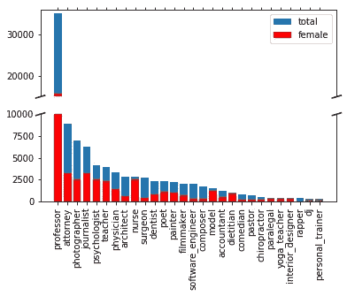
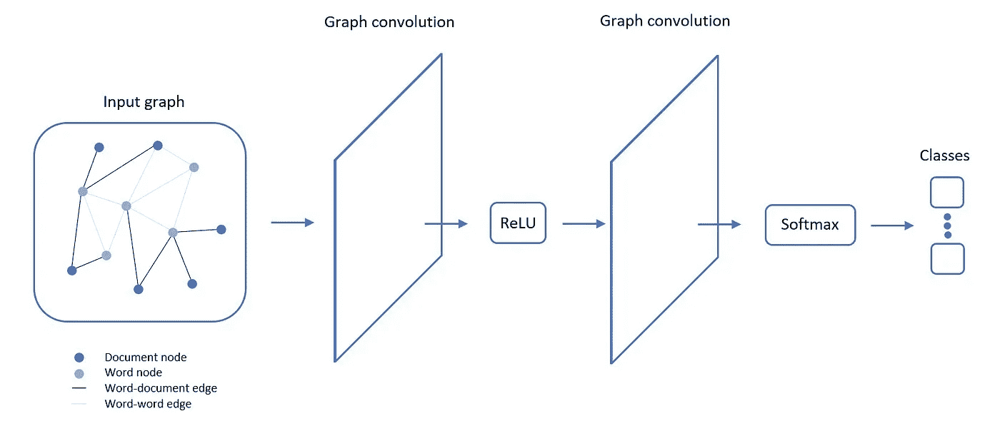
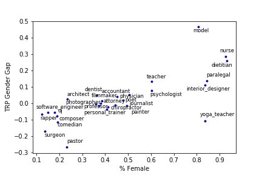

# 减轻职业分类中的性别偏见

> 原文：<https://towardsdatascience.com/mitigating-gender-bias-in-occupation-classification-805edb389729?source=collection_archive---------40----------------------->

## [公平和偏见](https://towardsdatascience.com/tagged/fairness-and-bias)

## 图卷积网络的一个新应用

*由* [*阿格尼耶斯卡*](https://medium.com/u/8676aed1508e?source=post_page-----805edb389729--------------------------------)*[*哈里塔*](https://medium.com/u/1e1c1ee9a466?source=post_page-----805edb389729--------------------------------)*[*约翰娜·梅尔*](https://medium.com/u/2a2115cd2a43?source=post_page-----805edb389729--------------------------------) *和* [*娜塔莎·巴特*](https://medium.com/u/5ae3ebeb4f62?source=post_page-----805edb389729--------------------------------)**

****

**由 pch.vector / [Freepik](https://www.freepik.com/free-photos-vectors/abstract) 设计**

**随着越来越多的证据表明，基于自然语言处理(NLP)的机器学习模型的一些输出可能会传播社会偏见，我们研究了在工作传记的职业分类中减轻性别偏见。通过图形卷积网络的新颖使用，我们发现通过去除诸如“她”之类的明确性别指标，职业预测中的性别偏见减少了。然而，仍然存在明显的差距，强调需要进一步研究去偏向这一自然语言处理任务。我们训练过的模型和分析的演示可以在 [Github](https://github.com/natashabutt/GCN-bias) 上找到。**

# **背景**

**相关工作研究了通过调整算法、去偏差单词嵌入和去偏差训练语料库来减少 NLP 任务中的性别偏差。我们关注去偏向训练语料库。德阿尔蒂加等人(2019 年)发现，通过清理性别指标，词袋、快速文本词嵌入和深度递归神经网络在职业分类中存在显著的性别差距。通过姚等人(2018)的文本图卷积网络(TextGCN)的新颖使用来扩展这项研究，我们显式地利用了关于我们的训练语料库的全局结构的信息，并联合学习单词和文档嵌入，从而捕获更多的潜在信息。**

# **我们的数据**

**在我们的实验中，我们考虑了德阿尔蒂加等人(2019)的生物偏见数据集的子集，它由传记和取自每个传记第一句话的相应职业标签组成。该子集包括具有 28 个不同职业标签的 97，798 个传记，其中第一句在分类任务中被排除。虽然*教授*是最频繁的职业(35136 本传记)，最不频繁的职业是*私人教练* (332 本传记)。女性传记的比例从 12.3% ( *说唱歌手*)到 93.5% ( *营养师*)不等。**

****

**按职业和性别分列的传记分布情况**

# **TextGCN 模型**

**TextGCN 将一个具有对应于单词和传记的节点的单一异构图作为输入。因此，图中的节点数等于人物传记的数量加上词汇的字数。如果一个单词存在于一个文档中，则构建任何单词-文档边缘，并使用 TF-IDF(频率-逆文档频率)对其进行加权。类似地，如果词对语义相似，则构建词-词边缘，这通过正的逐点互信息值来测量。我们性能最好的 TextGCN 架构由一个包含 200 个单元的隐藏层组成。在图卷积之间，使用 ReLU 激活，并且 softmax 函数用作最终分类器。目标函数是所有标记传记的交叉熵损失。**

****

**TextGCN 架构**

# **结果**

**我们将性别差距定义为在给定职业和性别的情况下，个人职业被正确预测的概率的性别差异。例如，*模型*的性别差距是女性模型被预测*模型*的概率减去男性模型被我们训练的模型预测*模型*的概率。对于一些职业，我们观察到性别差距接近于零，比如记者。然而，对于其他职业，我们观察到性别差距远非零，比如外科医生。总体而言，显而易见，对于妇女任职人数不足的职业，性别差距往往是负面的，反之亦然，这意味着性别差距和性别失衡之间存在正相关关系。相关系数为 0.73。**

****

**按职业分列的女性概率的性别差距**

**去除明确的性别指标缩小了性别差距，如下图所示，我们的最佳拟合线有一个较浅的梯度。此外，我们的相关系数降低到 0.69。然而，在性别失衡更加明显的特定职业中，性别差距仍然很大。因此，虽然删除性别指标减少了我们预测中的性别偏见，但要完全消除这一任务的偏见，还有更多工作要做。**

****

**有无性别指标的性别差距比较**

# **结论**

**近年来，基于 NLP 的机器学习方法在越来越多的任务中得到了广泛应用，如自动决策、推荐任务和阅读理解。随着这些系统在我们的日常生活中变得越来越普遍，它们从仅仅是被动的系统转变为对社会产生更积极的影响，影响哪些媒体文章出现在订阅源上或人们看到哪些招聘广告。在招聘中，我们已经证明了职业分类器可以做出带有性别偏见的预测。取消明确的性别指标只能缓解这种偏见。我们希望我们的文章能引起对去偏向 NLP 任务的进一步研究的需要。为了消除职业分类的偏差，我们接下来将对 BERT、ALBERT 和 RoBERTa 的预测进行对比分析。**

# **参考**

**[1]德-阿尔蒂加、玛利亚&罗马诺夫、阿列克谢&瓦拉赫、汉娜&查耶斯、珍妮弗&博格、克里斯蒂安&乔尔德乔娃、亚历山德拉&盖依克、沙欣&肯塔帕迪、克里希纳拉姆&卡莱、亚当。(2019)." Bios 中的偏差:高风险环境中语义表征偏差的案例研究."120–128.[https://arxiv.org/abs/1901.09451](https://arxiv.org/abs/1901.09451)**

**[2]梁耀、毛成胜和罗原。(2018)."用于文本分类的图形卷积网络."https://arxiv.org/abs/1809.05679**

**[3]生物偏差数据集，德阿尔蒂加等人(2019 年)，【https://github.com/Microsoft/biosbias **