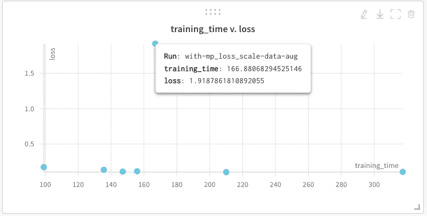

# tf.keras 模型的混合精度训练

> 原文：<https://towardsdatascience.com/mixed-precision-training-for-tf-keras-models-4fb7500fd37a?source=collection_archive---------53----------------------->

## [生产中的机器学习](https://towardsdatascience.com/tagged/production-ml)

## 了解如何为`tf.keras`模型整合混合精度训练，以加快模型训练时间。

[探索为文章](https://app.wandb.ai/sayakpaul/mixed-precision-tf-keras)进行的实验的交互式仪表板。

在本文中，我们将了解如何将混合精度(MP)训练整合到您的 tf.keras 训练工作流中。混合精度训练是 NVIDIA 在[本文](https://arxiv.org/abs/1710.03740)中提出的。它让我们能够以更快的速度训练大型神经网络，而网络性能的下降为零或非常小。这是我们将要报道的-

*   为 tf.keras 模型合并混合精度训练的几个选项
*   执行混合精度训练时要记住的事项
*   这些选项的实践示例
*   使用权重和偏差(W&B)来比较不同混合精度训练实验的结果

如果你想了解混合精确训练的细节，我强烈推荐以下资源:

*   Sylvian Gugger 的[混合精确训练](https://forums.fast.ai/t/mixed-precision-training/20720)
*   [本期 PyCon SG 2019 教程](https://drive.google.com/open?id=1dVkpmttGWf49_3wk0PSY97Wgqfc4TEJczzwEtsbmzXQ)作者 Timothy Liu
*   [英伟达的混合精度训练](https://docs.nvidia.com/deeplearning/sdk/mixed-precision-training/index.html)

我们开始吧！

> 点击查看代码[。](https://github.com/sayakpaul/Mixed-Precision-Training-in-tf.keras-2.0/)

# 在`tf.keras` (TensorFlow 2)中加入混合精度训练

TensorFlow 2.0 提供以下选项，帮助您轻松整合混合精度训练-

*   [TF . train . experimental . enable _ mixed _ precision _ graph _ rewrite](https://www.tensorflow.org/api_docs/python/tf/train/experimental/enable_mixed_precision_graph_rewrite)
*   [TF . keras . mixed _ precision . experimental . losscale optimizer](https://www.tensorflow.org/api_docs/python/tf/keras/mixed_precision/experimental/LossScaleOptimizer)
*   [TF . keras . mixed _ precision . experimental . set _ policy](https://www.tensorflow.org/api_docs/python/tf/keras/mixed_precision/experimental/set_policy)

根据我的经验，我发现后两种方法更有效。然而，为了激活混合精度训练，需要一些配置。我们将在后面的章节中看到它们。但在此之前，让我们讨论一些使用混合精度训练时要记住的要点。

# 使用 MP 训练时要记住的事项

请注意，您无法通过现成的 MP 培训获得显著的绩效提升。使用 MP 训练时，我们需要记住一些要点-

*   例如，MP 培训仅*在 NVIDIA GPUs 的 Volta 一代、特斯拉 V100、特斯拉 T4 上受支持。*
*   为了能够从 MP 培训中获得最大收益，您应该将它与大型网络变压器、ResNet50 等一起使用。网络的架构(即网络包含的层、激活的种类)在这里扮演着重要的角色。我无法在 VGG16 这样的网络上获得任何性能提升。
*   维度(批次、通道、图像大小、密集节点)应该是 8 的倍数。
*   使用计算机视觉模型时，使用分辨率越高的图像越好。

# 使用 tf.keras 进行混合精确训练

在本节中，我们将看到一些使用`tf.keras`进行混合精确训练的实践例子。正如我在开始提到的，你可以在[这个报告](https://github.com/sayakpaul/Mixed-Precision-Training-in-tf.keras-2.0)中找到完整的实验。

## 数据集简介

我的实验数据来自于 Vidhya Hackathon 的分析。给你一组像下面这样的图片，你需要预测给定船只的类别-

先睹为快

图像的‍The 标签被给出如下编码

训练集中有 6252 个图像，测试集中有 2680 个图像。不幸的是，测试集中的图像完全没有标记(在黑客马拉松中应该如此)。在实验中，我只使用了 6252 张图片。

数据集的格式如下-

其中，`train.csv`和`test` _ApKoW4T.csv 分别包含训练图像和测试图像的名称。

现在我们已经对数据集有了一个大致的介绍，我们可以继续探索实际操作的例子。

## 为 MP 培训设置明确的策略

`tf.keras.mixed_precision.experimental.set_policy` 允许我们设置网络各层的默认策略。这里的策略是指特定层的`dtype`。有多种方法可以在 tf.keras 中为层设置策略-

*   如果在定义网络之前指定了`tf.keras.mixed_precision.experimental.set_policy("mixed_float16")`，网络各层的默认策略将是`mixed_float16`，即网络中的所有计算将在`float16`进行，而参数将在`float32`进行。然而，请记住，包含 softmax 激活函数的层的计算应在`float32`中完成，以避免数值不稳定。
*   除了设置层的默认策略之外，您还可以做一些更具体的事情，比如

代码取自[本例](https://www.tensorflow.org/api_docs/python/tf/keras/mixed_precision/experimental/Policy#how_to_use_mixed_precision_in_layers_with_policies)

现在，为了能够使用混合精度的策略，您需要启用 XLA 编译器(XLA 编译器的介绍可以在这里[找到](https://docs.google.com/presentation/d/1F7hBey7m7bKSmLB4-Ipe9KvZl--TkaJGi69wRzzpAGM/edit?usp=sharing))，就像这样— `tf.config.optimizer.set_jit(True)`。注意，这应该在每个会话的基础上完成，也就是说，如果你计划使用 XLA 编译器(在大多数情况下你真的应该)你需要为每个新的会话启用它。

在开始实验之前清除任何现有的会话也是一个好主意，以防止不可预见的问题-

启用 XLA 编译器后，我们设置各层的默认策略，如下所示— `tf.keras.mixed_precision.experimental.set_policy(‘mixed_float16’)`。我们现在可以定义我们的模型-

我们在预训练的 ResNet50 网络上添加了一个(多)分类头。**注意模型的输入应该在**T9。还有，看看密层的`dtype`。现在，当我在我的 GCP 笔记本电脑实例(由特斯拉 T4 组成)上用上述数据训练网络时，我得到了以下结果

作为健全性检查，我在没有混合精度配置的情况下训练了相同的网络*，我得到了以下结果*

你可以看到训练时间的提高！让我们来看一些最重要的指标:

图表可用[此处](https://app.wandb.ai/sayakpaul/mixed-precision-tf-keras/runs?workspace=user-sayakpaul)

上面的一组图表为我们提供了关于以下指标的信息，这些指标也来自不同的实验(您可以通过一点努力看到实验的名称)

*   准确(性)
*   失败
*   训练时间

可以清楚地看到，混合精度训练确实允许更快地训练我们的网络，而没有任何性能损失。请注意，默认情况下，W & B 不会跟踪“ **training_time** ”，但它就像下面的代码块一样简单:

你可以记录很多其他的东西，比如表格，图片，音频等等。如果您有兴趣探索这一领域，请点击此处查看文档。W & B 也允许我们用神奇的命令%%wandb 在我们的 Jupyter 笔记本中生成上面的图(在这里阅读更多)但是我喜欢将这些图与我的笔记本分开。

此外，我使用您在[跑步页面](https://app.wandb.ai/sayakpaul/mixed-precision-tf-keras/runs)上获得的“添加可视化”按钮创建了以下散点图，以捕捉“训练时间与损失”的趋势。

图表可用[此处](https://app.wandb.ai/sayakpaul/mixed-precision-tf-keras/runs?workspace=user-sayakpaul)

创建散点图是一件简单的事情[几个击键](https://www.dropbox.com/s/awdlo24s2pmm0f0/mixed-precision-tf-keras%20_%20W%26B.mp4?dl=0)你就可以轻松完成。

如您所料，该图也是交互式的。

现在让我们探讨一下`tf.keras`中进行 MP 训练的第二种选择。

## MP 培训的损失比例

损失缩放在 MP 训练中是一个重要的概念，因为它防止了在计算中可能发生的降低精度的数值下溢。为了能够使用`tf.keras.mixed_precision.experimental.LossScaleOptimizer`，你需要通过`tf.config.optimizer.set_experimental_options({“auto_mixed_precision”: True})`启用混合精度，同时启用 XLA 编译器。确保回顾[一些重要的事情](https://www.tensorflow.org/api_docs/python/tf/keras/mixed_precision/experimental/LossScaleOptimizer)如果你在定制训练循环中使用损失比例，你可能需要遵循。我们可以使用上一节中看到的相同模型，为了插入损耗比例，我们将执行以下操作-

就是这样！在这种情况下，您应该可以获得与策略类似的性能。

# 比较我们实验的权重和偏差(W&B)

混合精度不仅能提高训练速度，还能减少模型的内存占用。因为你没有完全使用双精度或者单精度*。但这可能不是那么明显，因为我们在这里处理的数据较少。如果是一个更大的数据集(例如，500 MB 的数据集)，差异会非常明显。但是从总体上看你的机器学习模型的内存占用总是非常实用的。W & B 让这一点变得非常容易想象。在我的[项目页面](https://app.wandb.ai/sayakpaul/mixed-precision-tf-keras)，对于像[这种](https://app.wandb.ai/sayakpaul/mixed-precision-tf-keras/runs/q3jyari7/)的单独运行，你会得到一个名为[系统](https://app.wandb.ai/sayakpaul/mixed-precision-tf-keras/runs/q3jyari7/system)的标签。它为你提供了一系列信息，比如-*

**

*图表可用[此处](https://app.wandb.ai/sayakpaul/mixed-precision-tf-keras/runs?workspace=user-sayakpaul)*

*除了上述与您的系统相关的指标，您还可以在底部获得关于 *GPU 内存使用*的信息。在我的实验中，我使用了 TensorFlow 的数据 API，它允许与数据加载、预处理等相关的计算。要在您的 GPU 上执行(如果可用)。这真正将 tf.data 与 ImageDataGenerator 等其他替代产品区分开来，因为它不支持 GPU 计算。您可以使用 GPU 内存使用情况的图表进行这种比较。*

*下图显示了不同实验中的 GPU 使用情况-*

**

*正如你所看到的，不同风格的混合精度训练在 GPU 使用方面往往遵循相似的模式。当我不使用混合精度时，GPU 实际上得到了更好的利用。这可能会提示开发人员进一步钻研，找出提高 GPU 利用率的方法。但是在 GPU 利用率和模型性能之间总是有一个折衷，并且它会随着项目的不同而变化。*

*以下是一些综合图表，代表了所有必要的实验材料-*

**

*可用图表[此处](https://app.wandb.ai/sayakpaul/mixed-precision-tf-keras/runs?workspace=user-sayakpaul)*

*图表的图例是不同的运行(一次运行=一个实验)。使用混合精度训练时，打开 XLA 编译器非常重要。从上图可以看出，在没有 XLA 编译器的情况下，如果使用混合精度训练，模型训练将更加耗时。*

*作为一名机器学习实践者，你将被期望更多地关心像这样的方面。*

*对于每一次不同的跑步，我们都有一个[专用的日志页面](https://app.wandb.ai/sayakpaul/mixed-precision-tf-keras/runs/dd2orq1s/logs)，在那里我们可以获得本地的训练日志*

**

*可用日志[此处](https://app.wandb.ai/sayakpaul/mixed-precision-tf-keras/runs/dd2orq1s/logs?workspace=user-sayakpaul)*

# *谢谢大家！*

*谢谢你陪我到最后。我希望您能从这篇文章中受益，并将混合精度训练融入到您自己的实验中。别忘了让我知道结果！*

*我要感谢 W&B 团队的 Lavanya，她仔细审阅了代码和文章本身。她的反馈非常有帮助。*