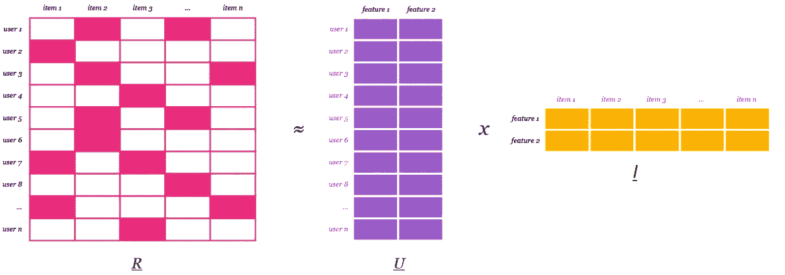
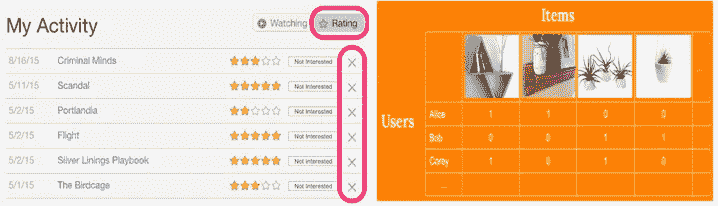
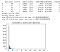
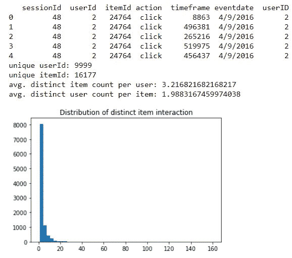
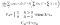
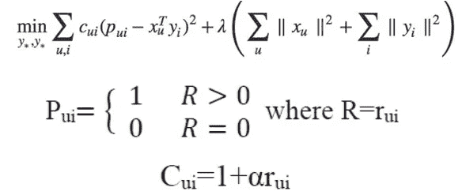
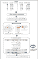
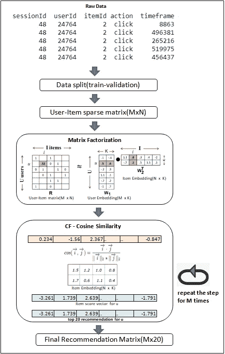
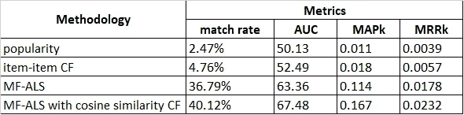

# 基于项目相似性和协同过滤的混合推荐系统

> 原文：<https://towardsdatascience.com/mixed-recommender-system-mf-matrix-factorization-with-item-similarity-based-cf-collaborative-544ddcedb330?source=collection_archive---------11----------------------->

推荐系统

在电子商务、零售、新闻组或音乐应用等行业中，推荐系统是客户生命周期五大支柱中最重要的方面之一——接触、获取、开发/培养、保留和保留。今天，从电子商务行业(电子邮件/现场产品推荐)到在线广告(在合适的时间提供合适内容的个性化建议，以匹配用户偏好)，推荐系统是影响用户在线旅程和获得增强的客户洞察力的最重要的组件之一。因此毫不奇怪，[亚马逊网站](http://rejoiner.com/resources/amazon-recommendations-secret-selling-online/)收入的 35%来自其推荐引擎。在本文中，我们将讨论使用混合方法来提高电子商务平台的推荐系统质量——结合两个构件。

# 推荐引擎算法

推荐引擎的基本原理是使用过去的用户行为和产品/项目特征过滤数据，或者使用合适的算法捕捉两者之间的交互，并向用户推荐最相关的项目。根据特定的业务需求和策略，有许多方法，因此也有许多算法。在不深入细节的情况下，以下是几个选项，虽然没有按照复杂程度的顺序(从最原始到最高级)列出所有选项。

**a)** **基于人气:**非个性化，向每一个用户推荐最受欢迎的产品。冷启动阶段(当有足够的数据可用时)的良好解决方案

**b)** **基于内容:**基于内容特征的用户好恶分类器。

**c)** **协同过滤:**

I)用户-用户协同过滤:基于用户对之间的相似性得分，使用合适的距离度量(余弦相似性、欧几里德距离、皮尔逊相关等)挑选最相似的用户，并推荐这些相似用户以前喜欢或购买过的产品。

ii)项目-项目协同过滤:这里计算每对项目之间的相似性得分。使用这个基于特定用户/用户群过去偏好的评分矩阵，推荐类似的产品。

**d)** **矩阵分解(MF):** MF 是第一代基于机器学习/模型的方法。基本思想是通过分解用户-项目矩阵(过去的用户-项目交互)来找到用户和项目的嵌入(潜在因素表示)。虽然详细的讨论超出了本文的范围，但是矩阵分解是一种基于线性代数技术将一个巨大的矩阵分解成其组成部分的方法。这是一种可以简化更复杂的矩阵运算的方法，这些运算可以在分解的矩阵上执行，而不是在原始矩阵本身上执行，并且与 PCA、SVD 等技术相似。

矩阵分解

在推荐系统环境中，分解发生在从大规模用户-项目矩阵(有时称为评级矩阵)到单个用户和项目矩阵。让我们假设我们必须用评级矩阵 R(MxN)、用户矩阵 U 和项目矩阵 I 找到 k 个潜在特征/因素，然后根据以下方式进行分解:

**R=U∑I** ，其中:

n 是电影的总数

k 是总的潜在特征/因素

r 是 MxN 用户-电影评级矩阵，其中 M 和 N 分别是用户和项目的总数。

u 是 Mxk 用户嵌入矩阵

I 是 Nxk 项嵌入矩阵

σ是 kxk 对角矩阵，它代表潜在特征的基本权重

这个分解任务可以使用不同的 ML 算法来实现，例如 ALS(交替最小二乘法)、BPR(贝叶斯个性化排序)、LMF(逻辑矩阵分解)等。

其他嵌入方法:基于 ML 的嵌入技术，如 [node2vec](https://github.com/aditya-grover/node2vec) 、prod2vec 等

**f)** **深度学习和强化学习(RL)技术:**这些技术是新的，仍处于实验阶段，如基于深度神经网络的推荐、自动编码器、马尔可夫决策过程(MDP)等。

# 业务问题和数据:

业务问题是为在线用户开发一个处理数千种产品(sku)的电子零售商推荐引擎，原始数据可以在这里找到。在对数据进行预处理、添加用户操作(此处为“点击”)并删除所有缺失的用户标识后，我们有以下字段。

a) sessionId:唯一索引

b)用户标识

c) itemId

d)行动

e)时间范围:对于每个会话 Id 是唯一的

> *精确地基于过去的用户行为(点击/浏览),我们需要从成千上万的可能选项中为每位顾客推荐个性化的 20 种产品，这些产品是他们在下一次在线会话中最有可能点击的。在大多数情况下，作为最终客户转化/销售之旅的重要指标，在线零售商确实关心点击、浏览、印象等，以更好地了解用户。*
> 
> *虽然基本解决方案是一种基于流行度的方法(非个性化和静态的最流行项目列表)，但目标是提高影响业务顶线的推荐质量。*

在这种情况下，有必要讨论推荐系统中的数据类型。

**a)** **显性反馈数据**:顾名思义就是用户给产品的一个确切数字。一些显式反馈的例子是网飞用户对电影的评分，亚马逊用户对产品的评分。显式反馈考虑了用户关于他们喜欢或不喜欢某个产品的意见。虽然显式反馈数据可以量化，但显式反馈很难收集，因为它们需要用户的额外输入——想想你上次在网飞上给电影评级是什么时候？此外，人们通常会根据极端的感受来评价一部电影或一件物品——要么是他们真的喜欢这个产品，要么是他们讨厌它。

显性与隐性反馈

**b)** **隐式反馈数据**:隐式反馈不直接反映用户的兴趣，但它充当用户兴趣的代理，推荐系统世界中可用的大多数数据都是隐式反馈数据。隐式反馈数据集的例子包括浏览历史、链接点击、歌曲播放次数计数、用户滚动网页的百分比。

如上所述，在我们的情况下，数据显然是用户行为的隐含反馈数据，作为用户偏好的代理。

**解决方法**:

在找到具体的解决方案之前，让我们先研究一下我们的数据。

因此，在大多数情况下，用户只与少数几个项目进行交互(< 5)，反之亦然。

为了在基于基础流行度的系统上开发更好的推荐引擎，我们探索了以下选项:

a)基于纯 CF:我们在用户-用户协同过滤上尝试了项目-项目相似性/项目-项目 CF 方法，用户喜好随时间变化，因此用户-用户相似性矩阵。随着时间的推移，项目间的相似性保持不变。然而，读者也可以尝试用户-用户 CF。

b)基于纯 MF:基于 ALS 算法的 MF 方法。

c)混合推荐:按顺序混合 MF 和项目-项目 CF。在 MF-ALS 之后，使用项目-项目余弦相似性进一步过滤中间结果。值得探索其他基于距离的方法，如欧几里德、皮尔逊相关等。

**列车验证设计:**

模拟 A/B 测试环境来测量性能生产。我们将数据分成基于每个用户时间戳的训练验证。采用除最后一个时间戳之外的所有时间戳来训练算法，并预测每个用户的前 20 个产品。然后，我们验证每个用户在各自的最后时间戳中的预测与实际用户动作。

# 评估指标:

当我们提到建议的质量时，我们主要关心以下几点:

c)k 处的平均倒数排名(MRR ):因为产品推荐算法根据用户偏好生成列表，所以项目排名很重要，并且是评估返回有序列表的系统的度量。在我们的例子中，MRR 20 岁。

d)标准化折扣累积收益(NDCG):除了地图/相关性测量，NDCG 进一步调整推荐列表评估。作为推荐系统/信息检索的上下文，NDCG 是一个重要的度量，因为它能够利用一些项目比其他项目“更”相关的事实。高度相关的项目应该在中等相关的项目之前，中等相关的项目应该在不相关的项目之前。

这些指标的详细概述可在[这里](https://medium.com/swlh/rank-aware-recsys-evaluation-metrics-5191bba16832)找到。

e) AUC:作为排名列表解决方案，我们测量两个列表之间的 AUC——预测列表和实际列表，每个用户有 20 个项目，然后取所有用户的平均值。

# 方法:

带有代码和数据的详细解决方案框架可以在这个 [github 库](https://github.com/nitsourish/hybrid_recommendation_engine)中找到。

**A)** 在根据时间戳将数据分成训练-验证之后，我们只包括那些用户 Id，它们同时出现在训练和验证数据集中以获得公平的评估。

**B)数据转换**:我们需要将类似数据的顺序事务转换为合适的用户-项目矩阵，其中包含每个用户的每个项目交互的计数。这与单词袋(BoW)方法中的术语频率矩阵相同。此外，在数据探索过程中，我们注意到有很高的稀疏性，这在推荐系统中是很常见的。在实际商业场景中，存储和处理如此庞大的矩阵是不可能的。所以我们需要将大的用户项矩阵转换成稀疏格式。

**C)** **算法选择**:在基于流行度的解决方案之上，我们探索了三个选项:

**基于纯余弦相似性的项目-项目 CF** :基于用户与产品领域的交互，我们计算项目 par 的相似性(项目向量对之间的距离)分数，并最终计算余弦相似性矩阵。然后，相似性矩阵(12620×12620)和用户项目矩阵(5352×12620)之间的矩阵点积生成所有用户的项目分数(每个用户的 12620 个分数的列表),并且为每个用户挑选前 20 个产品解决了该问题。

**纯 MF** :首先，我们使用 ALS 算法将用户-项目矩阵(5352 X 12620)分解为 32 个潜在维度嵌入矩阵，用于用户(5352 X 32)和项目空间(12620 X 32)。然后，与项目-项目 CF 相同的方法生成用户-项目得分矩阵(5352 X 12620 ),然后为每个用户挑选 20 个项目。

该过程的核心是 ALS，它是 OLS(普通最小二乘法)损耗最小化的修改版本，根据以下等式:

在哪里

***x 和 y:*** 随机初始化潜在因素维度的用户和项目矩阵。这些将交替更新以最小化平方误差，因此该算法被称为 ALS。

***rui:*** 评分，在我们的例子中统计用户 u 和物品 I 之间的交互

***α和 Cui:*** *Cui 或置信度值——可以定义为价值或我们赋予交互(用户 u 和项目 I)的值。随着用户 u 点击(一个事件)项目 I 的计数增加，交互权重增加，因此算法对特定交互的置信度增加，并且该置信度以乘数* ***α的线性比例增加。***

***λ:*** *正则化减少过拟合(我们用 0.1)。*

***pui:*** *一个用户对一个项目 I 的二进制偏好 u .如果我们知道偏好就 1，如果我们不知道偏好就 0。*

c)**MF 和 item-item CF 的混合**:这种混合方法进一步提升了整体性能。直观地，它不仅学习用户-项目的潜在特征，而且还为每个用户加入项目相似性组件，以进一步细化推荐。

详细方法

在从 ALS-MF 算法获得分解的用户嵌入(5352 X 32)和项目嵌入(12620 X 32)之后，我们在个体用户嵌入向量(1 X 32)和项目嵌入之间应用余弦相似性技术，以获得最终得分列表(1 X 12620)。在对最终得分列表进行排序之后，挑选出前 k 个项目为每个用户创建最终推荐列表(1×20 ),并且在所有用户中重复产生最终推荐矩阵(5352×20)。这个解决方案的神奇之处在于

虽然该解决方案比独立的 MF-ALS 产生更好的质量推荐，但是它没有显著的额外计算成本，因为繁重的计算部分-ALS-MF 训练仅被执行一次来创建嵌入。这里 CF 过程-余弦相似度计算不涉及大量计算，因为它是针对每个用户级别完成的，不像通常的余弦相似度(项目-项目 CF)跨越整个用户-项目宇宙。

# 性能赋值

在最终的混合解决方案中，我们实现了 40.12%的用户平均匹配率，比纯 MF 推荐提高了近 9%。尽管大部分智能在于在 MF 过程中创建嵌入，CF(针对每个用户的产品对的进一步基于余弦相似性的过滤)为推荐引擎增加了显著的额外提升。如果我们看 AUC 数字 67.5%(从纯 MF 方法改进 6.5%)，与二元分类(只有 2 个选项)相反，这里有 12620 个选项的巨大产品空间，这对企业来说是相当不错和乐观的结果。

性能比较

# 要点和未来之路:

为了进一步提高质量，以下几个策略值得探讨:

a)不同的 MF/嵌入生成算法:使用贝叶斯个性化排序优化(BPR)标准的嵌入生成涉及成对的项目(两个项目的用户特定顺序)来为每个用户提出更个性化的排序，因此可能产生比 ALS 更好的推荐。还有其他算法，例如 LMF、基于网络的嵌入(例如 node2vec)等。都值得探索。

b)超参数调整:除了算法之外，嵌入生成中的另一个关键因素是要计算的潜在因子 k 的数量，它是一个超参数。使用适当的搜索可以找到 k 的最佳值。另外**正则化**因子要避免过拟合要谨慎选择。另一个对照肝脏是乘数α的线性标度。

c)其他深度学习和基于 RL 的算法:虽然处于萌芽阶段，但仍然值得探索。

推荐引擎是一个多方面的问题，根据业务和组织数据科学成熟度和定位的复杂性，有许多不同的方法来解决同一问题。并不总是设计一个非常复杂的推荐系统和维护开销会为企业带来相应的投资回报。