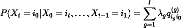
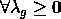
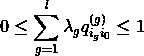
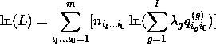
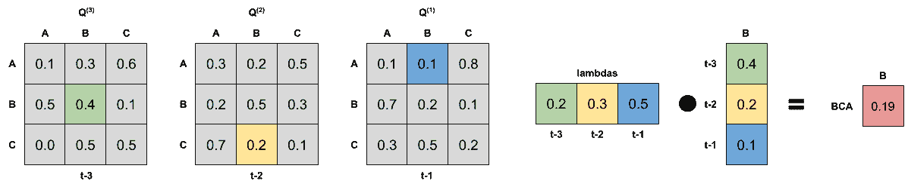
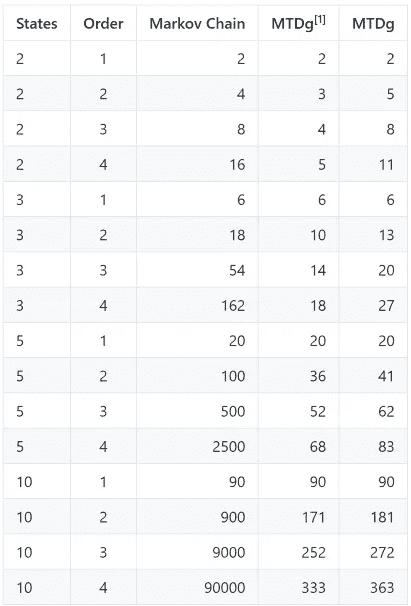

# 广义混合转移分布模型

> 原文：<https://towardsdatascience.com/mixture-transition-distribution-model-e48b106e9560?source=collection_archive---------52----------------------->

## 介绍 MTDg 模型和用于训练它们的 Python 包

本文旨在概述广义混合转移分布(MTDg)模型的概念，并介绍我开发的`mtd-learn` Python 包。你可以在这里找到对模型[的更广泛的介绍(在这篇文章中没有完整介绍，因为 Medium 不支持数学符号)，在这里](https://github.com/PiotrekGa/mtd-learn/blob/master/post/2020-07-06-Mixture-Transition-Distribution.md)找到包存储库[。](https://github.com/PiotrekGa/mtd-learn)

# 广义混合转移分布模型

广义混合转移分布(MTDg)模型是由 Raftery 于 1985 年提出的[1]。它最初的目的是近似高阶马尔可夫链(MC)，但它也可以作为一个独立的模型。MTDg 模型的主要优点是，与马尔可夫链模型的指数增长相比，其独立参数的数量随阶数线性增长。

## 定义

MTDg 模型是一系列随机变量 *(Xn)* ，使得:



其中 *it…i0 ∈ N* ，*λ*是权重向量， *Q(g)* 是表示第 g 个滞后和当前状态之间的关联的 *m ⨯ m* 矩阵。

模型要产生概率，必须满足以下条件:



MTDg 模型的对数似然函数由下式给出:



其中 *n* 表示数据集中的转换数量。

## MTDg 模型直觉

您可以将 MTDg 模型视为后续滞后的转移概率的加权平均值。以下示例显示了如何根据订单 3 MTDg 模型计算转移 B->C->A->B 的概率:



*作者图片*

## 独立参数的数量

根据[1]，MTDg 模型的独立参数个数等于 *lm(m-1) + l — 1* 。在[2]中，Lebre 和 Bourguignon 证明了独立参数的真实个数等于 *(ml — m + 1)(l — 1)* 。由于`mtd-learn`包使用了在【2】中提出的估算方法，参数的数量是用最新的公式计算的。

对于马尔可夫链，参数个数等于 *mˡ(m-1)* 。您可以在下面找到参数数量的比较:



*作者图片*

# 用法示例

让我们分析 1999 年 1 月 5 日至 2020 年 4 月 10 日期间美元和欧元汇率的变化模式。你可以在这里找到数据集[。由于 MTDg 模型在离散状态下工作，因此变化分为四组:](https://github.com/PiotrekGa/mtd-learn/blob/master/examples/euro_usd.csv)

1.  0 _ BIG _ DROP 超过 0.5%的下降
2.  1 _ 下降—低于 0.5%的下降
3.  2 _ 上升—不到 0.5%的上升
4.  3 _ 大幅上涨—涨幅超过 0.5%

先说进口:

```
import pandas as pd
import numpy as npfrom mtdlearn.mtd import MTD
from mtdlearn.preprocessing import PathEncoder, SequenceCutter
```

然后是分组代码:

```
df = pd.read_csv('euro_usd.csv')
df['Change'] = df.Closing_rate.diff()
df['Change_enc'] = np.nan
df.loc[df.Change < 0.0, 'Change_enc'] = '1_DROP'
df.loc[df.Change < -0.005, 'Change_enc'] = '0_BIG_DROP'
df.loc[df.Change >= 0, 'Change_enc'] = '2_RISE'
df.loc[df.Change >= 0.005, 'Change_enc'] = '3_BIG_RISE'
df.dropna(inplace=True)df.Change_enc1       0_BIG_DROP
2       0_BIG_DROP
3       3_BIG_RISE
4       0_BIG_DROP
5       0_BIG_DROP
           ...    
5516        1_DROP
5517    3_BIG_RISE
5518        1_DROP
5519    3_BIG_RISE
5520        2_RISE
```

现在我们需要将`pd.Series`转换成一种更加`mtd-learn`友好的格式。你可以使用`SequenceCutter`类来做这件事。我们从`order=2`开始。

```
order = 2sc = SequenceCutter(order)
x, y = sc.transform(df.Change_enc.values)x
array([['0_BIG_DROP>0_BIG_DROP'],
       ['0_BIG_DROP>3_BIG_RISE'],
       ['3_BIG_RISE>0_BIG_DROP'],
       ...,
       ['1_DROP>3_BIG_RISE'],
       ['3_BIG_RISE>1_DROP'],
       ['1_DROP>3_BIG_RISE']], dtype='<U21')y
array(['3_BIG_RISE', '0_BIG_DROP', '0_BIG_DROP', ..., '1_DROP',
       '3_BIG_RISE', '2_RISE'], dtype=object)
```

我们可以看到每个状态(在向量`y`中)在`x`中都有一个两元素序列。例如，两个第一变化`0_BIG_DROP`和`0_BIG_DROP`之后是`3_BIG_RISE`状态。

这些值需要编码成整数。我们可以用`PathEncoder`类来实现:

```
pe = PathEncoder(order)
pe.fit(x, y)
x_tr, y_tr = pe.transform(x, y)x_tr
array([[0, 0],
       [0, 3],
       [3, 0],
       ...,
       [1, 3],
       [3, 1],
       [1, 3]])y_tr
array([3, 0, 0, ..., 1, 3, 2])
```

您可以访问编码字典:

```
pe.label_dict
{'0_BIG_DROP': 0, '1_DROP': 1, '2_RISE': 2, '3_BIG_RISE': 3, 'null': 4}
```

注意，有一个`null`标签专用于缺失值。

要适应模型，只需创建`MTD`类对象并适应它:

```
model = MTD(order=order)
model.fit(x_tr, y_tr)
log-likelihood value: -7547.882973125838
```

您可以检查信息标准的值:

```
print(f"AIC: {model.aic.round(1)}, BIC: {model.bic.round(1)}")
AIC: 15137.8, BIC: 15276.7
```

并做出预测:

```
model.predict(np.array([[0, 0], 
                        [1, 3]]))
array([2, 1])model.predict_proba(np.array([[0, 0], 
                              [1, 3]])).round(3)
array([[0.239, 0.239, 0.306, 0.215],
       [0.217, 0.315, 0.275, 0.192]])
```

让我们运行`order=3`的全部代码:

```
order = 3
​
sc = SequenceCutter(order)
x, y = sc.transform(df.Change_enc.values)pe = PathEncoder(order)
pe.fit(x, y)
x_tr, y_tr = pe.transform(x, y)model = MTD(order=order, n_jobs=-1, number_of_initiations=100)
model.fit(x_tr, y_tr)
print(f"AIC: {model.aic.round(1)}, BIC: {model.bic.round(1)}")log-likelihood value: -7535.536495080953
AIC: 15131.1, BIC: 15329.5
```

AIC 显示我们应该选择`order=3`，但是 BIC 却说`order=2`。正如西格尔定律所说:“一个有手表的人知道现在是什么时间。一个有两只表的人永远不确定。”，所以在检查其值之前选择您的标准:)

我们可以将其与马尔可夫链的性能进行比较:

```
order = 2
model = MTD(order=order)
model.fit(x_tr, y_tr)
log-likelihood value: -7528.058152541998
AIC: 15152.1, BIC: 15469.7order = 3
model = MarkovChain(order=order)
model.fit(x_tr, y_tr)log-likelihood value: -7421.656650869228
AIC: 15227.3, BIC: 16497.5
```

无论我们在这里选择哪个标准，MTDg 模型似乎比马尔可夫链更能概括。

# 摘要

广义混合转移分布模型是有限状态马尔可夫链的一种简洁的替代方法。现在`mtd-learn`包提供了在 Python 中使用它们的简单方法。该软件包正处于早期开发阶段。欢迎任何贡献或功能请求。您可以在下面的参考书目部分找到关于模型的更多资源。

使用[latex.codecogs.com](https://www.codecogs.com/latex/eqneditor.php)生成乳胶配方

# 文献学

1.  BERCHTOLD，RAFTERY，高阶马尔可夫链和非高斯时间序列的混合转移分布模型，2002 年。，统计科学第 17 卷，第 3328–356 页
2.  LEBRE，BOURGUIGNON，混合转移分布模型估计的 EM 算法，统计与基因组实验室，埃夫里大学，埃夫里，2009 年
3.  混合转移分布模型的估计。1999 年，华盛顿大学统计系第 352 号技术报告