# ML 101:线性回归

> 原文：<https://towardsdatascience.com/ml-101-linear-regression-bea0f489cf54?source=collection_archive---------25----------------------->

## 最简单，但是最有效的 ML 方法之一！

你有没有想过科学家如何预测天气之类的事情，经济学家如何预测未来经济的表现，或者机器人如何推断推文的情绪？*秘制酱*是一种叫做**机器学习**的技术。与统计学密切相关，机器学习是在给定数据的情况下寻找模式的*艺术和科学*。然后，这些模式被用于对重要结果进行预测，或者阐明观察到的数据背后的关系。

监督学习是机器学习的一个分支，它处理查看一些变量(x)来预测另一组变量(y)。这要求我们有一个既有 X 变量又有 Y 变量的数据集。这是世界上最常见的机器学习类型。

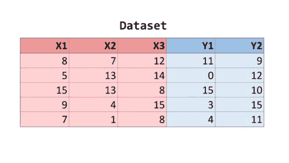

今天，我们将学习最基本也是最重要的一种监督学习模型:**线性回归**。 ***回归*** *的任务是预测一个变量将取的精确数值*。例如，预测一个地方的确切温度，预测将购买视频游戏的顾客数量等。

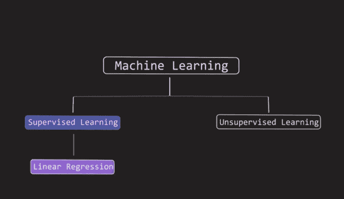

线性回归模型的一个有趣的应用是理解一种商品的价格如何随时间变化。让我们来看看自 1980 年以来美国每年的橙子价格。一磅脐橙的价格以美元显示。有两列:年份和价格。粗略地看一下，我们就知道价格每年都在上涨，但更难讲的是过去 40 年中年份和价格之间的精确关系。

虽然查看电子表格很有用，但是以图形方式可视化数据可以揭示更多的模式。让我们在 2D 图上画出这些点，X 轴是年份，Y 轴是价格。正如我们之前所说的，我们想通过只看 X 变量来预测 Y 变量。

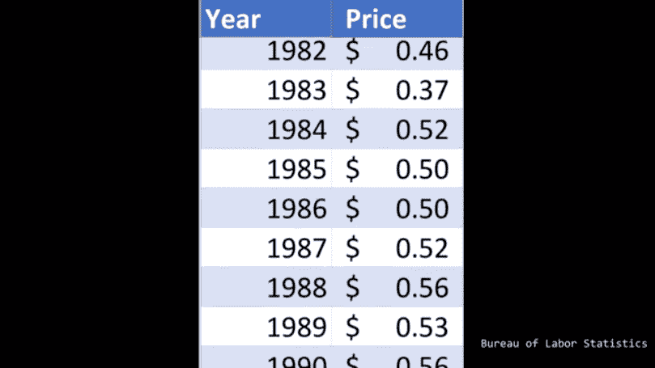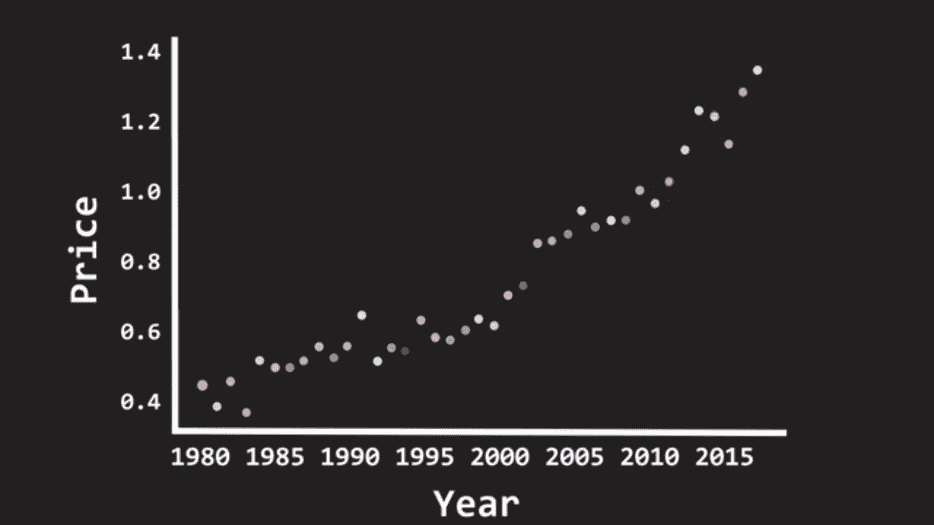

线性回归背后的假设是 X 变量(在这种情况下是年份)的影响在一段时间内是恒定的。也就是说，1990 年到 1991 年的物价涨幅和 2005 年到 2006 年的物价涨幅是一样的。这就是线性回归“**线性**”的原因。需要说明的是，在现实世界中，数据是杂乱的，永远不会如此清晰地符合一个模型。然而，线性回归在许多实际情况下工作得非常好。

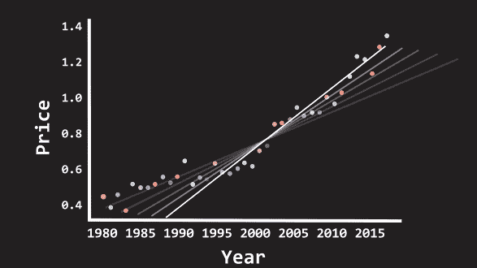

我们现在的任务是找到一条穿过我们观察到的数据中所有点的线。我们可以用许多不同的线来拟合这些数据。我们控制的两个参数是截距和斜率，截距是直线在 Y 轴上与 Y 轴相交的点，斜率是沿着 X 轴移动时直线上升的程度。

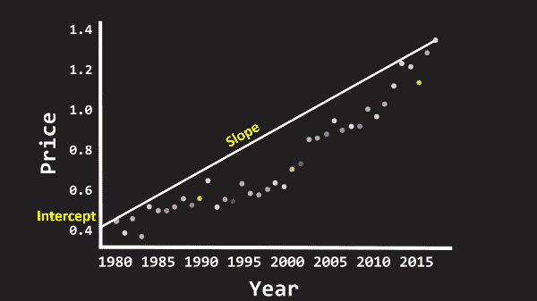

**我们如何选择合适的线来建模数据？**

如果我们的点沿着一条完美的线，那么你可以连接任何点，你会得到正确的线，但因为数据往往是“**噪音**”我们将不得不做一些别的事情。最佳线是由一个叫做“**普通最小二乘法**或 **OLS** 的过程给出的。这个方法告诉我们，你要选择一条线，使每一点和这条线之间的距离最小。点与线之间的距离称为“**误差**”因此，我们希望降低我们生产线的总误差。

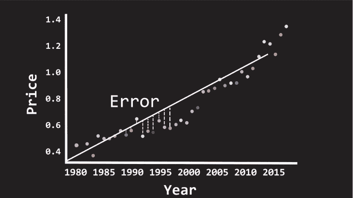

现在我们有了一条误差最小的线，我们可以预测 2020 年橙子的价格。我们要做的就是在 X 轴上找到 2020，然后从那里画一条直线到我们的线性回归线，然后从那里画一条直线到 Y 轴。Y 轴上的读数告诉我们预测价格是多少！

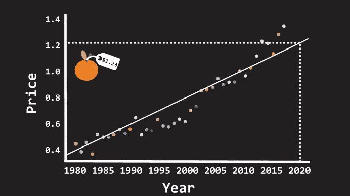

现在来点更酷的！我们可以用不止一个变量来预测价格。让我们尝试使用两个变量:年份和前一年的降雨量。现在我们在三维空间中，我们将把年份放在 x 轴上，前一年的降雨量放在 z 轴上，价格放在 y 轴上。

现在，我们将为数据拟合一个平面，而不是一条直线。逻辑还是一样的。我们需要一个平面，它本身和它需要建模的数据点之间的误差最小。

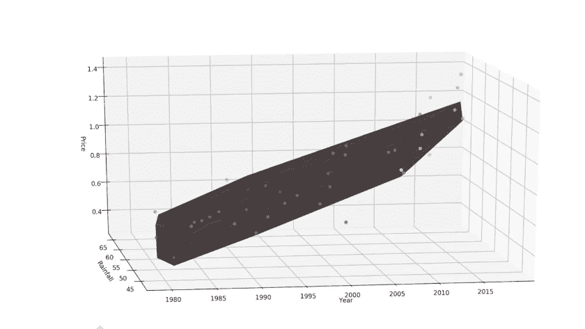

为了得到预测，我们需要做的就是在 X 轴上找到 2020 年，在 Z 轴上找到 2019 年的降雨量，然后找到 Y 轴读数！就是这样！你现在知道如何做线性回归了！

现在让我指出这种方法的一些缺点。线性回归对异常值非常敏感。假设你有一些错误的数据，其中有一点偏离很远，那么你会得到一条向该点倾斜的线，而不是真正捕捉到真实的模型。因此，在运行线性回归之前，确保数据是干净的，并且剔除异常值是很重要的。

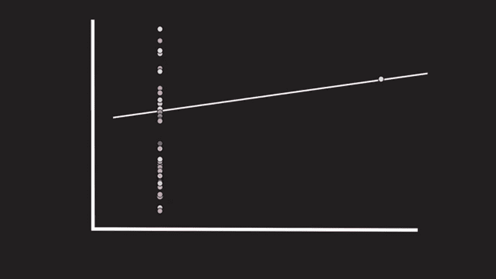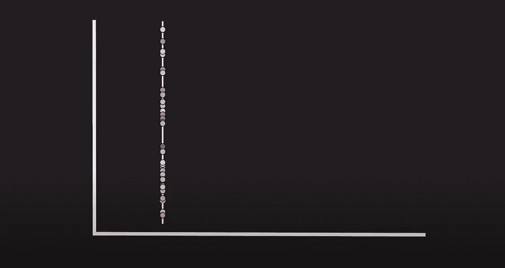

移除异常值之前和之后

# 线性回归非常强大。虽然很简单，但是很管用！

# 快乐学习！