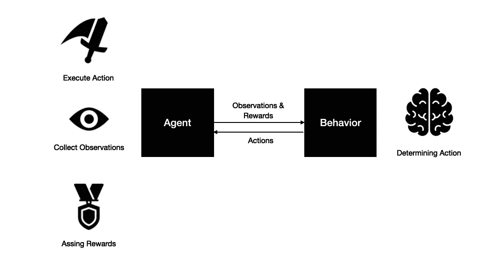

# ML-代理 1.0 /入门

> 原文：<https://towardsdatascience.com/ml-agents-1-0-getting-started-4864102ecf6e?source=collection_archive---------52----------------------->

来源:https://github.com/Unity-Technologies/ml-agents

## 为什么现在是 Unity 机器学习入门的最佳时机。

Unity 的机器学习框架 [ML-Agents](https://github.com/Unity-Technologies/ml-agents) 刚刚发布了 1.0 版本。作为一个已经关注这个框架进展一段时间的人，这是一个令人兴奋的消息，你也应该感到兴奋。

如果你想看视频，看看这个:

在 1.0 版本中，ML-Agents 在 Unity 的包管理器中可用，这意味着你可以直接从 Unity 编辑器中安装它。此外，您现在学习的语法在将来可能不会有很大的变化。对于不想在每次新版本发布时都重新学习所有内容的初学者来说，这是一个巨大的解脱。

# 入门指南

要开始使用，您只需下载 Unity 2018.4 或更高版本。就这样，暂时的。稍后，我们将安装 Python 来训练我们自己的网络，但是对于推理(运行模型), Unity 是我们所需要的。首先，让我们开始一个新项目并安装软件包。

确保“高级”选项卡下的“显示预览包”已启用

只需选择 ML-Agents 包并点击安装。相信我，这从来没有这么容易过，这很好。

为了更快地开始，我们还需要下载示例。遗憾的是，软件包管理器(Unity，请❤)中没有可选的示例下载，所以我们必须[下载资源库](https://github.com/Unity-Technologies/ml-agents/archive/release_1.zip)。解压缩并打开下载的 repo，打开项目下的 Assets 文件夹，并简单地将 ML-Agents 文件夹拖到编辑器中。现在，在“示例”下，您可以找到 3DBall 场景。如果我们打开它并按下 play，我们可以看到它已经与 Unity 预先训练的机器学习模型一起工作。这个框架的简单性是它最大的优势。

蓝色代理人试图在他们的头顶平衡球

如你所见，蓝色代理人非常完美地平衡了球。这个行为不是硬编码的，**是学来的**。我们将很快训练我们自己的版本。

# 基础知识

现在让我们深入一点，看看这个东西是如何工作的。在这个场景中有 12 个代理——他们都非常相似，只是用来加速和稳定训练。如果我们打开一个，我们可以看到它包含一个名为 Agent 的子游戏对象——这就是神奇的🧙‍♂️发生的地方。这个游戏对象上的两个重要脚本是“行为参数”脚本和“Ball3DAgent”脚本。

## 代理和行为

在 ML-Agents 框架中，代理是参与者，它们所链接的行为决定了它们如何行动。一个代理需要一个行为才能发挥作用，但是多个代理也可能链接到同一个行为，这在许多情况下非常方便，比如对抗性的自我游戏。

代理负责收集观察结果、执行行动和分配奖励。另一方面，行为接收收集的观察和奖励，并负责决定要执行的动作。

有三种类型的行为:

*   启发式，这是游戏中人工智能的经典工作方式。程序员想出人工智能应该表现的方式，然后把它们硬编码进去。它可以很好地工作，但它在适应不断变化和复杂的环境方面存在问题。当然，机器学习也更有趣😉。
*   学习行为是我们所追求的。这是人工智能目前使用机器学习进行训练的时候。在训练过程中，会生成一个神经网络模型。以便在训练结束后使用这个生成的模型。使用最后一种行为:
*   推理是学习模型被应用但不被改变的地方——所以人工智能不会学习。

有很多方法来设置你的代理人，也有更多的方法来训练他们，这极大地改变了结果，但我们只能介绍这么多。

现在我们已经有了一些基础知识，让我们开始训练我们自己的模型。我们将只使用默认设置，现在，调整以后。

# 训练模型

为了训练我们自己的模型，我们需要先安装一些先决条件。确保您安装了 Python 3.6.1+。如果没有，点击[这里](https://www.python.org/downloads/)。那么你所要做的就是简单的

> pip3 安装 ml 代理

你完了！不再安装。现在，将 cd 放入先前下载的 repo 中，执行以下命令:

> ml agents-learn config/trainer _ config . YAML—run-id = MyFirstAITraining

等待几秒钟。如果一切按预期进行，消息“通过按下 Unity 编辑器中的播放按钮开始训练。”这正是我们要做的。

**祝贺你，你现在正在训练人工智能🎉 🎉🎉**

# 简历

如您所见，ML-agent 的入门非常简单。要掌握这个框架，你需要掌握一些复杂的概念，但这是以后的事了。希望这对你有帮助！

查看我的 [Youtube 频道](http://youtube.com/c/SebastianSchuchmannAI)的人工智能相关内容。

和平✌️